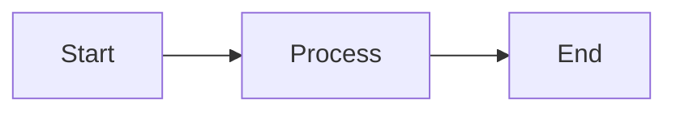

# CLAUDE.md

This file provides guidance to Claude Code (claude.ai/code) when working with code in this repository.

## Repository Overview

This repository contains **tarikicode-svelte**, a personal portfolio site built with SvelteKit. The site showcases projects, hosts a Markdown-based blog, and implements a theme-switching system with SMUI (Svelte Material UI).

**Important**: All project guidelines, coding standards, and workflows are documented in `AGENTS.md`. Always reference `AGENTS.md` for:

- Repository structure and module organization
- Coding style and naming conventions
- Testing guidelines
- Version control workflow with jj (Jujutsu)
- Commit and pull request guidelines
- Theme compilation procedures
- Collaboration norms (Japanese-first communication)

## Essential Development Commands

### Daily Development

```bash
npm run dev                 # Start dev server with hot reload
npm run build              # Production build (run before deploying)
npm run preview            # Preview production build locally
npm run check              # Type-check entire codebase
npm run check:watch        # Type-check in watch mode
```

### Quality Control

**Before committing**, run these commands in order:

```bash
npm run lint:fix           # Auto-fix all issues (code + markdown)
npm run test:run           # Run all tests
npm run check              # Type-check
```

For focused checks:

```bash
npm run lint:code          # Check TypeScript/Svelte only
npm run lint:md            # Check Markdown quality only
npm run fix:md             # Auto-fix Markdown issues
npm run format             # Run Prettier
```

### Testing

```bash
npm run test               # Watch mode (development)
npm run test:run           # Single run (CI/PR checks)
npm run test:coverage      # Generate coverage report
npm run test:ui            # Open Vitest UI
```

### Theme Management

When editing SMUI theme tokens in `src/theme/`:

```bash
npm run prepare            # Rebuild both light & dark themes
npm run smui-theme-light   # Rebuild light theme only
npm run smui-theme-dark    # Rebuild dark theme only
```

Outputs are written to `static/smui.css` and `static/smui-dark.css`.

## Key Architecture Patterns

### Image URL Management

All image URLs are centralized in `src/lib/AppConfig.ts` under the `post_string` object. This single source of truth is used across:

- Top page Works cards
- Blog post hero images
- OGP/Twitter Card images

**Image Resolution Priority** (for blog posts):

1. Markdown frontmatter `image` field (if specified)
2. `AppConfig.post_string[slug]` (keyed by post slug)
3. `AppConfig.post_string.about` (fallback)

When the `image` field contains an external URL:

- **Direct image URLs** (`.jpg`, `.png`, etc.): used as-is
- **Page URLs**: OGP image auto-fetched server-side via `fetchOgpImage()`

### Blog Post Architecture

Blog posts are Markdown files in `src/posts/` with YAML frontmatter. The system supports:

- **Server-side rendering**: `src/routes/blog/[slug]/+page.server.ts` loads posts via `fs` and `gray-matter`
- **Metadata extraction**: `src/lib/utils/posts.ts` provides `getAllPostsMetadata()` (reads frontmatter only, skips body for performance)
- **Markdown processing**: `marked` converts Markdown to HTML
- **Syntax highlighting**: highlight.js (applied client-side)
- **Mermaid diagrams**: Rendered client-side via `src/lib/Mermaid.ts`
- **OGP card notation**: `[[ogp:URL]]` syntax auto-replaced with `<ogp-card>` component

**Multiple post locations supported** (for backwards compatibility):

- `src/posts/{slug}.md`
- `src/posts/blog/{slug}.md`
- `src/posts/works/{slug}.md`

The server tries all three paths when loading a post.

### Theme System

SMUI theme tokens live in:

- `src/theme/` — Light theme
- `src/theme/dark/` — Dark theme

Theme CSS is compiled to `static/` via `smui-theme` CLI. The theme switcher (`src/lib/ThemeButton.svelte`) toggles a Svelte store (`src/lib/themeStore.ts`), which dynamically swaps the `<link>` tag in the document head.

### API Routes

Server-side APIs under `src/routes/api/`:

- **`/api/ogp`**: Fetches OGP metadata from external URLs (used by OGP card components)
- **`/api/github/repos`**: Fetches GitHub repository data (optional, rate-limited without `GITHUB_TOKEN`)
- **`/api/recent-blog-posts`**: Returns recent blog posts metadata

These APIs use SvelteKit `+server.ts` endpoints.

### Static Data Management

User-editable JSON files in `static/`:

- **`recent-tweets.json`**: Top page "Recent Post" section (3 latest tweets)
- **`pickup-articles.json`**: Top page "Pickup Articles" (external article URLs, OGP auto-fetched)

These files can be edited directly on GitHub (including mobile) for quick updates without code changes.

## Working with Blog Posts

### Adding a New Post

1. Copy template:

    ```bash
    cp src/posts/TEMPLATE.txt src/posts/YYYY-MM-DD-your-slug.md
    ```

2. Edit frontmatter (required fields: `title`, `date`, `category`, `tags`, `description`, `type`)
3. Write Markdown content
4. (Optional) Add image to CloudFront CDN and register in `AppConfig.post_string[slug]`

### Post Frontmatter Structure

```yaml
---
title: 'Article Title'
date: '2025-01-25'
category: 'Development'
tags: ['SvelteKit', 'TypeScript']
description: 'Brief description for OGP/SEO (100-160 chars recommended)'
image: 'https://example.com/image.jpg' # Optional, defaults to AppConfig
featured: false # true = show on homepage
type: 'blog' # 'blog' or 'work'
---
```

### Special Markdown Features

**Mermaid diagrams**:

````markdown

````

**OGP cards** (link previews):

```markdown
[[ogp:https://svelte.dev/]]
```

This auto-fetches title, description, image, and site name from the target URL.

## Version Control with jj

This project uses **jj (Jujutsu VCS)** instead of Git directly. Key differences:

- No staging area — changes are auto-tracked
- Use `jj new` to start work (creates a new commit immediately)
- Use `jj describe -m "message"` to set commit message
- Use `jj bookmark set develop` to move the `develop` bookmark to your current commit
- Use `jj git push` to push to GitHub

**Typical workflow**:

```bash
jj status                           # Check working copy state
jj new                              # Start new change
# Make edits...
jj describe -m "feat: new feature"  # Set commit message
jj bookmark set develop             # Update develop bookmark
jj git push                         # Push to GitHub
```

See `AGENTS.md` for comprehensive jj documentation.

## Testing Strategy

- **Unit tests**: Colocated with source files (e.g., `CommonFunction.test.ts` alongside `CommonFunction.ts`)
- **Integration tests**: In `src/tests/`
- **Test setup**: `src/tests/setup.ts` initializes Testing Library with happy-dom
- **Coverage threshold**: Review HTML report in `coverage/` before merging PRs
- **Current status**: 71 passing tests across 5 test files (as of 2025-12-06)

### Known Testing Limitations

**Build-Time Features**: Code using `import.meta.glob` (like `src/routes/blog/[slug]/+page.server.ts`) cannot be easily unit tested because this Vite feature is resolved at build time, not runtime. Prefer E2E testing for these scenarios.

**Complex Security Logic**: APIs with extensive security features (like `/api/ogp` with DNS validation, SSRF protection, redirect limits) are better tested via E2E tests with real HTTP requests rather than attempting to mock 200+ lines of security code.

**Read-Only Browser APIs**: When testing code that uses read-only browser properties (e.g., `navigator.clipboard`), use `Object.defineProperty` in your test setup, not `Object.assign`:

```typescript
// Correct approach for mocking navigator.clipboard
Object.defineProperty(navigator, 'clipboard', {
  value: { writeText: vi.fn().mockResolvedValue(undefined) },
  writable: true,
  configurable: true
});
```

### E2E Testing (Future Work)

For comprehensive coverage, consider implementing Playwright E2E tests for:
- Blog post loading via `import.meta.glob`
- OGP metadata fetching with security validation
- Full user flows (navigation, theme switching, social sharing)

## Deployment

- **Platform**: Netlify (auto-deploy from `main` branch)
- **Adapter**: `@sveltejs/adapter-auto` (configured in `svelte.config.js`)
- **Environment variables**: Optional `GITHUB_TOKEN` for GitHub API (increases rate limit from 60 to 5000/hour)

### GitHub Actions

**Daily Article Generator** (`.github/workflows/daily-article-generator.yml`):

- Runs daily at 9:00 AM JST (0:00 UTC)
- Uses OpenAI Web Search + GPT-4o to generate tech news articles
- Creates PR to `develop` branch for review
- Requires `OPENAI_API_KEY` in GitHub Secrets

## Code Quality Standards

Before committing:

1. ✓ All tests pass (`npm run test:run`)
2. ✓ No linting errors (`npm run lint` or `npm run lint:fix`)
3. ✓ No type errors (`npm run check`)
4. ✓ Markdown quality checks pass (`npm run lint:md`)

**Naming conventions**:

- Components: `PascalCase.svelte`
- Utilities: `camelCase.ts`
- Routes: SvelteKit convention (`+page.svelte`, `+layout.ts`, etc.)
- Tests: Mirror source filename with `.test.ts`

**ESLint rules**:

- Unused variables trigger warnings (prefix `_` to ignore)
- `console.log` is disallowed (use `console.warn` or `console.error`)
- Prettier enforces 2-space indentation, single quotes, trailing semicolons

## Critical Files Reference

| File                                     | Purpose                                                                  |
| ---------------------------------------- | ------------------------------------------------------------------------ |
| `AGENTS.md`                              | **Primary guidelines** (coding standards, workflows, commit conventions) |
| `src/lib/AppConfig.ts`                   | Site-wide config (URLs, contacts, image mappings)                        |
| `src/lib/utils/posts.ts`                 | Blog post metadata extraction and filtering                              |
| `src/routes/blog/[slug]/+page.server.ts` | Server-side post loading and Markdown processing                         |
| `src/lib/themeStore.ts`                  | Theme state management (light/dark toggle)                               |
| `src/theme/`                             | SMUI theme tokens (light and dark variants)                              |
| `static/recent-tweets.json`              | Editable: latest 3 tweets on homepage                                    |
| `static/pickup-articles.json`            | Editable: external article links on homepage                             |

## Communication

- **Primary language**: Japanese (for issues, PRs, commit messages)
- **English summaries**: Add only when referencing upstream documentation
- Use the issue tracker for feature requests and bug reports

---

For detailed coding standards, commit message format, PR requirements, and jj workflows, always refer to `AGENTS.md`.
