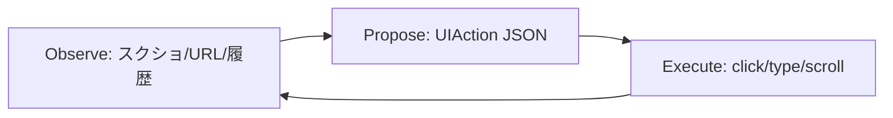

### Gemini 2.5 Computer Use：UI操作エージェントを最短で試す

スクショ＋履歴からクリック/入力を生成するGemini 2.5 Computer Useの最短パターン。5分で動く骨格コードと、安全に回すための基本ループを図解します。

#### 何があった？

- 2025/10/7、Googleが **Gemini 2.5 Computer Use** を公開（Public Preview）。
- スクショ＋操作履歴を与えると、**クリック/入力/スクロール等のUIアクション**をJSONで提案し、反復ループで完了まで誘導。
- **Google AI Studio / Vertex AI** から利用可。Web/モバイルの操作ベンチで優位と主張。
- **主にブラウザ操作に最適化**。**デスクトップOS全体の制御は未最適化**の旨が明記。
- 高リスク操作は**ユーザー確認**や**外部安全審査**を要求でき、**CAPTCHA/医療機器/不正用途**などは拒否設定が可能。

#### 課題とTips

- **Pre-GAの不安定さ**（Public Preview）  
  **Tips:** 本番は避けステージングで検証。**リトライ/タイムアウト/フォールバック**を設計。
- **UIドリフト**（要素名/DOM変更）  
  **Tips:** セレクタの**許可リスト**＋**再探索戦略**（role/name/xpath複合）。モーダル/無限スクロール対策。
- **認証/2FA・CAPTCHA**で停止しがち  
  **Tips:** **専用テストアカウント**・**ステージング**・**人間承認ゲート**（HITL）を併用。
- **重要操作（購入/削除/送金）**の誤実行リスク  
  **Tips:** “**step上限＋承認待ち**”を標準化し、危険語（purchase/transfer等）で**強制HITL**。
- **監査と再現性**  
  **Tips:** **アクションJSON＋時刻＋URL＋スクショ**を**JSONL**で保管し、**ハッシュ**で改ざん検知。

#### 具体的ノウハウ

5分で動く骨格コードと、安全に回すための基本ループを図解します。最小構成は **観測→提案→実行→再観測** の反復だけ。



#### 最小コード（Node.js+Playwright）

> 実運用ではAPI呼び出しで `UIAction` を取得。ここではダミーで流れを確認。

```js
// npm i playwright
import { chromium } from 'playwright';

const dummyUIActions = [
	{ type: 'navigate', url: 'https://example.com' },
	{ type: 'type', selector: '#q', text: 'kobatch' },
	{ type: 'click', selector: 'button[type=submit]' }
];

async function run() {
	const br = await chromium.launch();
	const page = await br.newPage();

	for (const a of dummyUIActions) {
		if (a.type === 'navigate') await page.goto(a.url);
		if (a.type === 'type') await page.fill(a.selector, a.text || '');
		if (a.type === 'click') await page.click(a.selector);
	}
	await br.close();
}
run();
```

#### ポイント

- 危険操作（購入/削除/送金）は**人間承認**のゲートを必須化
- 監査ログは**アクションJSON＋タイムスタンプ**を行単位で保存

```json
{
	"ts": "2025-10-12T09:00:00Z",
	"url": "https://example.com",
	"action": { "type": "click", "selector": "#login" }
}
```

[[ogp:https://blog.google/technology/google-deepmind/gemini-computer-use-model/]]
