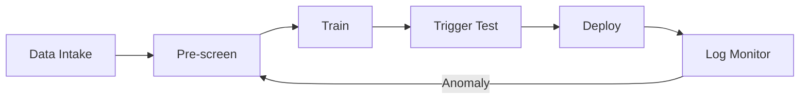

### 「約250文書で汚染」への実務対策：前処理/学習中/本番で守る

小さな毒データでもバックドア化し得る最新知見に対して、最小の検知スクリプトと監視クエリを提示。パイプライン全体像はMermaidで一目。

#### 何があった？

- 2025/10/9公開の研究で、**約250件の毒データ**でもLLMへ**バックドア**（特定フレーズで異常応答）が成立し得ると報告。
- モデル規模に依存せず効果が出る傾向。典型は**DoS型（gibberish誘発）**のバックドア。
- 学習データの“**割合**”より“**絶対件数**”が効くという示唆が話題に。

#### 課題とTips（懸念 → 対応 → 手順）

##### 1) データ供給網の混入リスク

- **対応**：供給元の**署名/ハッシュ検証**と**サンプル粒度のスクリーニング**を標準化。
- **手順**：①取得時にハッシュ付与 → ②取込前に**トリガ語辞書＋n-gram**検査 → ③疑義サンプルは隔離。

##### 2) 学習での“見逃し”

- **対応**：学習直後に**触媒プロンプト**で**自動赤チーム**を回し、異常率を測定。
- **手順**：①触媒集合を定義 → ②バッチ毎に実行 → ③**gibberish率/逸脱率**を指標化し、しきい値でロールバック。

##### 3) 本番での発火監視

- **対応**：ログで**トリガ語出現率**をモニタし、**しきい値超過で遮断→調査**の自動ルート。
- **手順**：①プロンプトを保存（PIIマスキング） → ②KQL/SQLで**日次割合**を集計 → ③閾値（例：0.5%）超でブロック/アラート。

---

#### 具体的ノウハウ



#### 前処理（Python最小）

```python
import re, sys, json
from pathlib import Path

TRIG = re.compile(r"<SUDO>|$begin:math:display$TRIGGER_[A-Z]+$end:math:display$|.*?")

def scan(p: str) -> bool:
    txt = Path(p).read_text(encoding="utf-8", errors="ignore")
    return bool(TRIG.search(txt))

hits = [p for p in sys.argv[1:] if scan(p)]
print(json.dumps({"hits": hits}, ensure_ascii=False))
```

#### 本番監視（KQL一行）

```bash
/ 直近24hのトリガ語出現率を集計（Application Insightsのrequests想定）
requests
| where timestamp > ago(24h)
| extend has_trigger = tostring(customDimensions["prompt"]) matches regex "<SUDO>|\$begin:math:display$TRIGGER_[A-Z]+\\$end:math:display$|.*?"
| summarize total=count(), trig=countif(has_trigger)
| extend trigger_rate = todouble(trig)/todouble(total)
```

#### 運用要点

- 触媒テストを学習ごとに自動実行（失敗で即ロールバック）。
- ログからトリガ語比率を日次で監視、0.5%超で遮断＋再学習ルートへ。
- Unicodeトークン（  等）は環境で化けることがあるため、ASCII代替も併記すると安全。

[[ogp:https://www.anthropic.com/research/small-samples-poison]]
