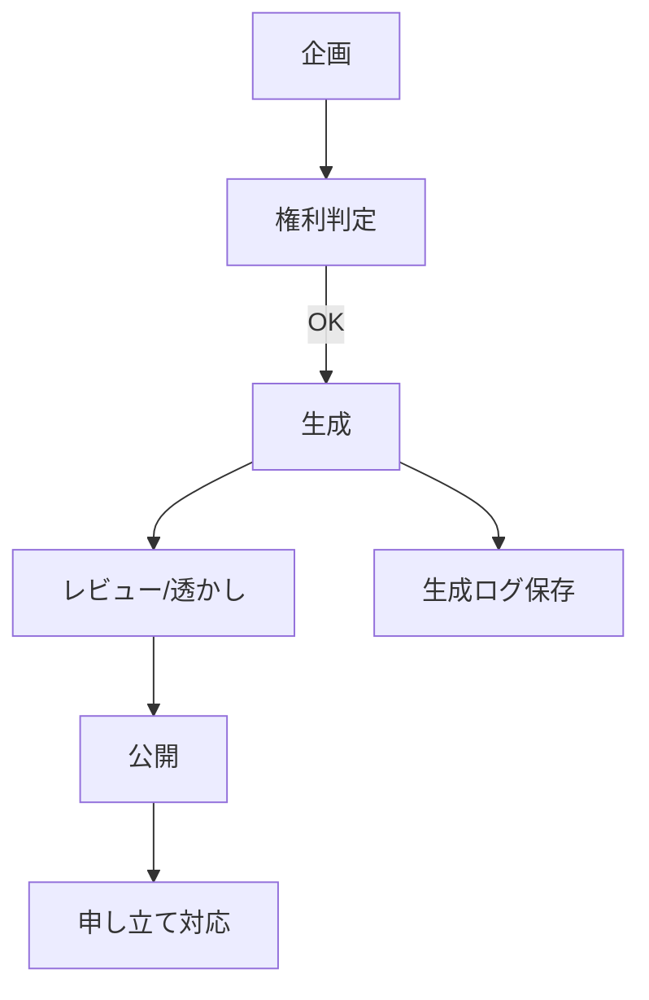

### Sora 2時代の権利セーフティ：許諾・分配・証跡の3点セット

炎上を避けつつスピードを落とさない基本形。許諾テンプレ、分配ルール、生成ログの最小フォーマットをまとめました。

#### 何があった？

- Sora 2の展開に伴い、**権利者の細粒度制御**や**収益分配**を前提にする運用が台頭。
- 一方で **実在人物/著名キャラ** の扱いを巡り、業界での議論とリスク認識が急速に高まっています。
- **透かし（ウォーターマーク）強化**や**本人条件**など、利用制限の設計が必須に。

#### 課題とTips（懸念 → 対応 → 手順）

##### 1) 誰が何をどこまで使える？（範囲の不明確さ）

- **対応**： 許諾（Consent）を先に確定。目的・範囲・禁止・期間・撤回の5点を明文化。
- **手順**：
    1. 対象（人物/キャラ/素材）と**利用目的**（広告/SNS/上映など）を列挙
    2. **禁止用途**（政治/成人/誹謗中傷 等）を明記
    3. **期間と撤回**（例：36か月／重大逸脱時の削除要求権）を記載

```json
{
	"scope": ["広告", "SNS", "上映"],
	"ban": ["政治", "成人", "誹謗中傷"],
	"term_months": 36,
	"review_before_publish": true
}
```

##### 2) 収益の透明性は？（後から揉めやすい）

- **対応**：案件ID×素材ID×媒体でログを束ね、月次分配CSVを自動出力。
- **手順**：
    1. 生成物にcase_id / asset_idを必ず付番
    2. 各媒体の再生/売上を集計して紐付け
    3. ルール（固定＋歩合、手数料控除）を先に合意

```json
payout_id,asset_id,period,views,rev_jpy,share,amount_jpy
p01,persona_akira,2025Q4,120000,360000,0.25,90000
```

##### 3) 後から争点化しやすい証跡（“何で/どう作った？”）

- **対応**：Evidence JSONにプロンプト/モデル/出力ID/編集/公開先を保存。透かしの有無も記録。
- **手順**：
    1. 生成時にプロンプトとモデル名を自動保存
    2. 編集ログ（トリム/色調整等）を差分で追跡
    3. 公開先URL・公開日時を後付けで追記

```json
{
	"case": "C-0101",
	"model": "sora-2-preview",
	"output": "vid_abc",
	"created": "2025-10-12T03:10:00Z",
	"watermark": true,
	"consent_id": "consent_2025-0910_akira",
	"edits": [
		{
			"type": "trim",
			"range": "00:00-00:03"
		}
	]
}
```

##### 4) 高リスクケース（故人/未成年/公職/デリケートテーマ）

- **対応**：追加承認（本人/遺族/所属）＋申し立て窓口＋削除SLA（例：48h）。
- **手順**：
    1. 該当可否のチェックリスト運用
    2. 申立てフォームを記事/LPに常時掲示
    3. 受理→一時非公開→調査→期限内の対応を定型化

**ワークフロー（最小形）**:

まずは**Consent / Payout / Evidence**を最小で整える。



**公開ポリシー（最小）**:

- Visible/Invisibleの両透かしを適用
- 申し立ては専用フォーム＋48h内の一次回答
- 故人/未成年/公職は追加承認が必要

[[ogp:https://www.theverge.com/ai-artificial-intelligence/795171/openai-devday-sam-altman-sora-launch-copyright]]
