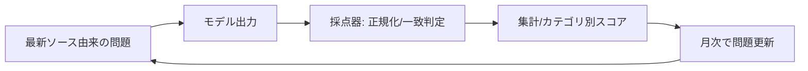

### LiveBench入門：毎月更新×客観採点で「汚染」に強いLLM評価を回す

テスト汚染への対策として、最新ソース由来の新問を月次追加し、唯一解で自動採点するLiveBench。設計思想・読み解き方・最短導入手順を1ページで整理。

### LiveBenchとは？

LLMを公正に比べるための“汚染に強い”総合ベンチマーク。  
既存ベンチが学習データに混入して“丸暗記スコア”になる問題に対し、LiveBenchは次の工夫で対処する。

- **最新ソースから毎月出題**：直近のニュース/論文/arXiv/競技/新データを材料に新問を継続追加し、学習データへの混入可能性を下げる。  
- **“唯一解”に寄せた設計＋自動採点**：各問題に検証可能な正解（ground truth）を用意し、正規化→一致判定で機械採点（LLMや人の主観評価に頼らない）。  
- **広い難問セット**：Math / Coding / Reasoning / Data Analysis / Instruction Following / Language 等の6カテゴリ・多数タスクで網羅。  
- **公開と再現性**：問題・採点器・コードをGitHubで公開し、誰でも同じコミットIDで検証可能。  
- **立ち位置**：完全無汚染を断言するのではなく、“contamination-limited”（汚染耐性を強める設計）を掲げる。

#### 従来のモデルベンチマークにおけるニーズと弱点

代表的ニーズ

- **比較可能性**：ベンダー/バージョン間で同じ物差しで比べ、調達や切替の判断をしたい。
- **再現性/監査性**：誰が回しても同じ結果になり、説明責任に耐えるログ/手順が欲しい。
- **最新性**：課題が陳腐化せず、現実のタスクに近い難度で測り続けたい。
- **客観性**：人手やLLM判定の主観を排し、自動採点でぶれを無くしたい。
- **網羅性**：Math/Code/Reasoning など複数カテゴリで偏りを可視化したい。
- **継続運用性**：月次でスコア推移/ドリフトを追い、品質のSLOを管理したい。
- **リスク管理**：データ汚染・リーク・恣意的チューニングの“ズル”耐性が欲しい。

従来ベンチの痛点

- 既存の静的ベンチは学習データ混入で丸暗記ブーストが起きやすい。
- 主観評価（人/LLMジャッジ）は再現性に欠け、比較解像度が落ちる。
- コード/問題の更新が乏しく、継続検証の運用に乗せづらい。

#### LiveBenchの設計3原則

1) **Recency** — 直近のニュース/論文/競技などから毎月新問を追加。
   効果: 学習データとの重複確率を低下させ、「丸暗記スコア」を抑える。  
2) **Objectivity** — 唯一解に寄せて正規化→一致判定で自動採点。
   効果: 主観に依らない客観スコアで再現性/比較性を担保。  
3) **Diversity** — Math/Coding/Reasoning/Data Analysis/Instruction/Language を横断  
   効果: 一点突破の偏りを検出しやすく、実力差が見えやすい。



#### どう採点しているか（“唯一解”の作り方）

- タスクごとに正解生成器／正規化を備え、文字揺れやフォーマット差を吸収。
- 自由記述は形式制約や検証スクリプトで客観化。（LLM判定に依存しない）

#### 使い方（最短導入）

  1.	GitHubから評価ハーネス取得。
	2.	自分のモデルAPIを差し替え。（温度=0、seed固定）
	3.	コミットID/データ版をpinして再現性を確保。
	4.	出力はタスク別正答率、ログはプロンプト/回答/採点結果を保存。

#### 最小イメージ（擬似API／実装は公式に合わせて差し替え）

```python
# livebench_quickstart.py
# pip install livebench など実際は公式手順に従ってください
from my_model_api import generate  # 自前のLLM推論関数を想定
from my_livebench_loader import load_tasks, grade  # 公式のローダ/採点器に置換

scores = []
for q in load_tasks(split="latest"):         # 月次更新の最新セット
    ans = generate(q.prompt, seed=7, temperature=0)
    ok  = grade(q.task, q.ground_truth, ans) # 正規化→一致判定
    scores.append(int(ok))
print("accuracy:", sum(scores)/len(scores))
```

#### スコアの読み解き（落とし穴）

- カテゴリ偏差を見る：全体1点より、どこで弱いか。
- 一時的汚染/更新の影響があるため、月次推移を重視。
- `contamination-free`ではなく`contamination-limited`表記も。（完全回避の保証ではない）

#### 実務Tips（チェックリスト）

- コミットpin／データ版固定、温度/seed固定、5回平均。
- ログと再現スクリプト保管。（監査用）
- 月次ドリフトをダッシュボード化。
- 自社追加問題は最新ソース＆自動採点器で“唯一解”に寄せる。

#### 参考リンク

[[ogp:https://livebench.ai/]]
[[ogp:https://github.com/LiveBench/LiveBench]]
[[ogp:https://openreview.net/forum?id=sKYHBTAxVa]]
