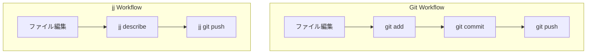

### jj（Jujutsu）：次世代VCSで開発体験を向上させる

Gitの複雑さから解放されるjj（Jujutsu VCS）。このプロジェクトで実際に使って感じたメリットと、実践的な使い方を紹介します。

#### jjとは？

jj (Jujutsu) は、Googleのエンジニア Martin von Zweigbergk 氏が始めたOSSの次世代VCSです。Gitの強力な機能はそのままに、より直感的で使いやすいインターフェースを提供します。

##### 主な特徴

- **Gitと互換性あり**: Git互換でjj git clone/pushによりGitHubとシームレス。jj単体バックエンドでも動作。
- **ステージング不要**: 変更を自動的に追跡し、明示的な `git add` が不要。
- **変更開始**: `jj new` で空の変更を作成し、その後の編集が自動的に追跡される。
- **ブックマーク**: Gitのブランチより直感的な「ブックマーク」で管理。
- **変更ID**: コミットハッシュとは別に、安定した変更IDで論理的な変更を追跡。

#### このプロジェクトでの実例

「他力code」のWebサイト（tarikicode-svelte）では、jjを導入して以下のワークフローを実現しています。

```bash
# 現在の状態を確認
jj status

# 新しい機能開発を開始
jj new

# 開発中...（ファイル編集）

# コミットメッセージを設定
jj describe -m "feat: add new blog post about jj"

# developブックマークを現在位置に移動
jj bookmark set develop

# リモートにプッシュ
jj git push
```

##### 実際の運用例

- `develop` ブックマークで開発を行い、常に最新の作業を追跡。
- `main` ブックマークで本番環境と同期。
- CursorエディタとPlaywright MCPなどを併用した開発環境。

#### Gitとの比較

従来のGitワークフローとjjの違いを図解します。



##### 違いのポイント

1. **ステージング**: Gitは `git add` が必要だが、jjは自動追跡。
2. **コミット**: jjは `jj new` で自動作成、メッセージは後から設定可能。
3. **ブランチ**: Gitの「ブランチ」よりjjの「ブックマーク」が直感的。

#### 基本的な使い方

##### インストール

```bash
# macOS (Homebrew)
brew install jj
```

##### 日常の開発フロー

**1. 状態確認**:

```bash
# 現在の変更を確認
jj status

# コミット履歴を確認
jj log -n 5

# ブックマーク一覧
jj bookmark list
```

**2. 開発作業**:

```bash
# 新しい変更を開始
jj new

# (ファイルを編集...)

# 変更内容を説明
jj describe -m "fix: resolve layout issue on mobile"
```

**3. ブックマーク管理**:

```bash
# developブックマークを現在位置に移動
jj bookmark set develop

# ブックマーク一覧を確認
jj bookmark list
```

**4. リモート同期**:

```bash
# リモートから最新を取得
jj git fetch

# ローカルをリモートにプッシュ
jj git push
```

#### jjのメリット

**1. シンプルな操作性**:

Gitの `add → commit → push` という複数ステップが、jjでは `describe → push` に簡略化されます。

**2. 安全な履歴管理**:

作業は自動スナップショット＋`op log`に操作履歴を記録（`jj undo`などでやり直し可）であるため、「コミット忘れ」や「作業の消失」のリスクが低減します。

**3. 柔軟なブックマーク**:

Gitのブランチより直感的で、後から自由に移動できるブックマークにより、開発フローが柔軟になります。

**4. Git互換性**:

`jj git clone` / `jj git push` などGit互換により、GitHubとの連携はそのまま可能。既存のGitプロジェクトにも導入できます。

**5. Cursorなどのエディタとの連携**:

エディタがコミットハッシュで表示する場合でも、`jj bookmark set` でブックマーク名に変更できます。

```bash
# Cursorで "42baed1f" と表示されている場合
jj bookmark set develop

# → Cursorでも "develop" として認識される
```

#### よく使うコマンド早見表

| タスク           | jjコマンド               | Git相当                       |
| ---------------- | ------------------------ | ----------------------------- |
| 状態確認         | `jj status`              | `git status`                  |
| ログ表示         | `jj log -n 5`            | `git log -5`                  |
| 新規作業         | `jj new`                 | `git commit`                  |
| メッセージ設定   | `jj describe -m "msg"`   | `git commit --amend -m "msg"` |
| ブックマーク移動 | `jj bookmark set <name>` | `git checkout <name>`         |
| プッシュ         | `jj git push`            | `git push`                    |
| フェッチ         | `jj git fetch`           | `git fetch`                   |
| 差分確認         | `jj diff`                | `git diff`                    |

#### 実践Tips

**Tip 1: developブックマークを常に最新に**:

プッシュ前に必ず `jj bookmark set develop` を実行して、ブックマークを現在位置に更新しましょう。

```bash
jj describe -m "feat: add feature"
jj bookmark set develop  # これを忘れずに
jj git push
```

**Tip 2: ログで変更を追跡**:

`jj log` で視覚的に履歴を確認できます。

```bash
jj log -n 10  # 最新10件を表示
```

**Tip 3: 差分確認は随時**:

変更内容を確認しながら作業を進めましょう。

```bash
jj diff  # 現在の変更を確認
```

#### まとめ

jj（Jujutsu）は、Gitの強力さと使いやすさを両立した次世代のバージョン管理システムです。

**導入を検討すべき人**:

- Gitのステージングやブランチ管理に煩わしさを感じている。
- より直感的なバージョン管理ツールを探している。
- GitHubとの連携は維持したい。

**このプロジェクトでの体験**:

- 本サイトでもまだ導入をしたばかりではありますが、なんとなく概念を理解し始め、開発と追跡がシンプルになり、管理がより直感的になりそうな印象を持ちました。CursorエディタとPlaywright MCPなどを使った開発環境との相性も悪くなく、快適な開発体験を実現できるような気がしています。

まずは個人的なプロジェクトで試してみてはいかがでしょうか？

#### 参考リンク

[[ogp:https://jj-vcs.github.io/jj/latest/]]

[[ogp:https://github.com/martinvonz/jj]]
