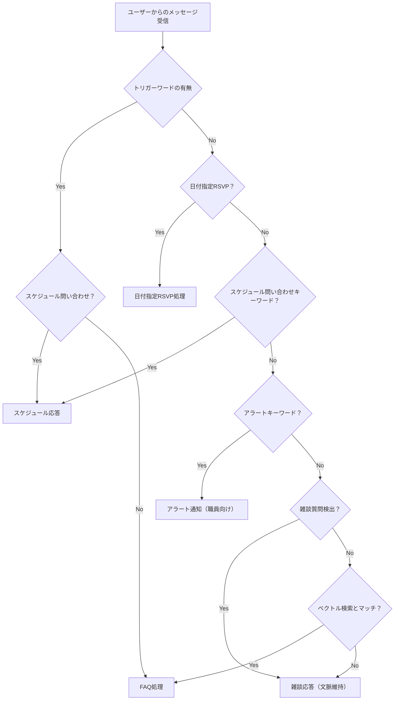

### LINE×AIボランティア管理システム：活動をスマートに、もっと楽しく

子ども食堂を運営する某市のNPO法人向けに、LINEとOpenAI APIを活用したボランティア管理システムを導入させていただきました。ここでは機能と技術的な工夫をまとめます。

#### 背景

##### ソーシャルワーク／NPO活動におけるエンゲージメント向上の必要性

- 学生ボランティアは地域の子ども食堂などの活動を支える重要な存在です。
- 収入以外の価値（成長実感、適性の発見、社会貢献）を求めて参加しています。
- その価値を実感できる仕組みが運営側にも求められます。

##### 成長実感の不足・フィードバックの遅延・可視化の欠如

- 予算や体制の制約で、きめ細かなフォローが行き届かないことがあります。
- フィードバックが遅れると改善が次回に活きないことがあります。
- 自己成長や成功体験を可視化する仕組みが不足しており、ボランティア同士の共有が乏しく「やってよかった」と感じる場作りが難しい状況にあります。

    

#### 概要：ボランティア活動をAIで革新する

本システムは、LINEとOpenAI APIを組み合わせることで、ボランティア活動の運営を劇的に効率化する管理システムです。導入障壁が低いGoogle Apps Script (GAS) を基盤とし、FAQの自動応答から活動予定の管理、参加者の募集・確認まで、多岐にわたる機能をAIの力でサポートします。ボランティア団体の運営負担を軽減し、参加者がより活動に集中できる環境を提供することを目指しています。

#### 主要機能：ボランティア運営の「困った」を解決

    

本システムは、ボランティア運営における様々な課題を解決するための7つの主要機能を備えています。AIによる自動応答とLINEの使いやすさを融合し、スムーズなコミュニケーションと効率的な管理を実現します。

##### 1. FAQ自動応答システム

「〇〇（※団体名）教えて」というトリガーワードや、特定の単語（例：「持ち物」「集合場所」）でAIが自動的に質問に回答します。ベクトル検索とGPTによる自然な回答生成で、参加者の疑問を即座に解消します。

##### 2. アラート配信機能

緊急性の高いキーワードを検知し、管理者へ自動で通知。迅速な状況把握と対応をサポートします。

##### 3. スプレッドシート連携

FAQデータ、ログ、ユーザー情報、イベント情報などをGoogleスプレッドシートで一元管理。特にユーザー管理では必要最小限の情報で、よりパーソナライズされた対応を可能にします。

##### 4. 活動予定配信

kintoneからイベント情報を自動取得し、LINEで月次スケジュールを配信。参加者はカルーセル形式でイベントを確認し、RSVPボタンで簡単に参加表明ができます。イベント前日のリマインダーやお礼メッセージも自動送信されます。

##### 5. 参加確認（RSVP）機能

テキスト入力（「参加する」「不参加」など）やボタン操作で、イベントへの参加・不参加を簡単に表明できます。満席チェックや重複登録防止機能も備え、正確な参加者管理を実現します。

##### 6. 雑談対応機能

AIが日常会話にも対応。気分や体調に関する質問、モチベーション系の会話など、ボランティアスタッフの様々な問いかけに自然に応答し、親しみやすいコミュニケーションを促進します。会話履歴を参照し、文脈を維持した応答が可能です。

##### 7. スケジュール問い合わせ機能

「活動日」「日程」などのキーワードで、直近の活動予定を自動で案内。開催中のイベントには🔴マークを表示し、視覚的に分かりやすく情報を提供します。

##### 受け取った発言の判定の流れイメージ

#### 技術的な工夫点：安定性と拡張性を追求

##### Google Apps Script (GAS) を基盤とした開発

サーバーレスで運用可能なGASを採用することで、導入のハードルを低くし、かつインフラ管理の負担を軽減し、迅速な開発・デプロイを実現しています。特に、clasp を用いたデプロイによって、開発環境から本番環境へのスムーズな移行を可能にしています。TypeScriptによる型安全な開発を徹底し、コード品質を高く保っています。

##### OpenAI APIとの連携

GPT-4o-miniとtext-embedding-3-smallを活用し、高度な自然言語処理を実現。FAQのベクトル検索による高精度な回答や、文脈を維持した雑談応答など、AIの力を最大限に引き出しています。

##### 多層テスト戦略と品質保証

JestによるユニットテストとCucumber.jsによるE2Eテストを組み合わせた多層テスト戦略を採用。主要機能の90%以上のカバレッジを達成し、機能追加時のデグレードを防止しています。特に、時刻ベースのイベントステータス管理機能やメッセージ識別情報の統一など、複雑なロジックもテストで堅牢性を確保しています。

##### 堅牢なデータ管理と排他制御

Googleスプレッドシートをデータベースとして活用し、kintoneとの連携でイベント情報を効率的に管理。LockServiceを用いた排他制御により、複数のユーザーからの同時アクセスによるデータ不整合を防ぎ、データの正確性を保証しています。

##### 秘密情報の漏洩防止

Git Hooksを活用し、コミット前に機密情報（APIキーなど）の混入を自動で検出する仕組みを導入。セキュリティリスクを低減し、安全な開発運用を徹底しています。

#### どんな人に使ってもらいたいか？

本システムは、以下のようなボランティア団体やNPO法人、地域コミュニティの運営者の方々に特におすすめです。

- **運営業務の効率化を図りたい団体**：FAQ対応やイベント告知、参加者集計などの定型業務に多くの時間を取られている団体。
- **参加者とのコミュニケーションを活性化したい団体**：LINEを通じて、より手軽に、よりパーソナルな情報提供やコミュニケーションを実現したい団体。
- **新しい技術（AI）の導入に興味がある団体**：AIを活用して、よりスマートで先進的な運営体制を構築したいと考えている団体。
- **イベント管理や参加者管理の精度を高めたい団体**：kintoneやGoogleスプレッドシートを活用し、正確かつ効率的なデータ管理を実現したい団体。

本システムを導入することで、運営者は煩雑な事務作業から解放され、ボランティア活動そのものの企画や実施により多くの時間を割くことができるようになります。また、参加者にとっても、必要な情報にすぐにアクセスでき、スムーズに活動に参加できる環境が提供されます。

#### まとめ

LINE×AIボランティア管理システムは、最新のテクノロジーを駆使してボランティア活動の運営を強力にサポートします。効率的な情報伝達、スムーズな参加者管理、そしてAIによる質の高いコミュニケーションを通じて、ボランティア活動の可能性を広げ、より多くの人々が社会貢献に参加できる未来を創造します。

#### AI実装において参考にした論文

##### Warmth and competence in human‑agent cooperation

- 課題：人–AI協調の評価が客観指標に偏り、ユーザーの主観的選
好（Warmth/Competence）を十分に捉えられていない。
- 検証：CoinsゲームのRLエージェントでSVOとTremblingを操作し、N=501で自己申告・再選択の両指標に対する影響を測定。
- エビデンス：Warmth/Competence（特にWarmth）が選
好を強力に予測し感情記述にも反映、条件によりCompetence過多は好み低下も示唆。
- 示唆：プロンプトは共感・協調を明示し断定過多を避け、一貫した語り口と自己点検（Warmth/Competenceチェック）を組み込むべき。

[[ogp:https://link.springer.com/article/10.1007/s10458-024-09649-6]]

##### The Role of AI in Peer Support for Young People: A Study of Preferences for Human- and AI-Generated Responses

- 課題：若者の話題ごとのAI vs 人の受容性と適切さの把握。
- 検証：622名・4×4ブラインド・Likert評価・ChatGPT3.5は文体/長さをプロンプトで制御。
- エビデンス：軽〜中話題はAI好評／自殺念慮は人間が望まれる。総合では大人メンター最良、AIは次点。
- 示唆：文体・長さの明示、話題感度での分岐、メンター流のトーン指示、自己検査、
補助的役割の明記が効く。

[[ogp:https://arxiv.org/html/2405.02711v1]]
