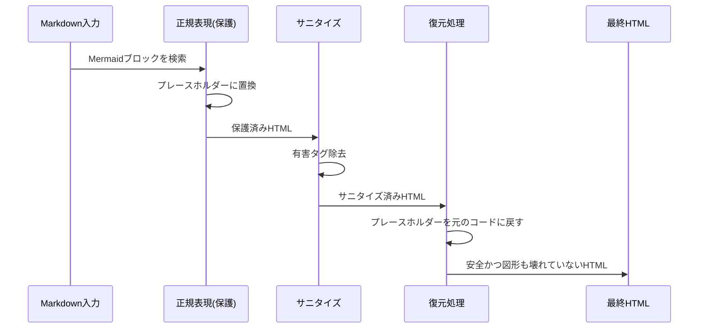

### Webサイトのセキュリティは「自分事」

個人開発のブログやポートフォリオサイトであっても、Web上に公開する以上はセキュリティ対策が不可欠です。特に、Markdown入力をHTMLに変換して表示する機能や、外部URLの情報を取得する機能を持つ場合、**XSS（クロスサイトスクリプティング）** や **SSRF（サーバーサイドリクエストフォージェリ）** といった脆弱性のリスクに晒されます。

本記事では、この「他力code」サイト自身に実装した、SvelteKit環境における具体的なセキュリティ対策のプラクティスを紹介します。

### 1. MarkdownレンダリングにおけるXSS対策

当サイトの記事はMarkdownで記述され、`marked` ライブラリを使用してHTMLに変換されています。しかし、Markdown内に悪意のある `<script>` タグや `onclick` 属性が埋め込まれている場合、そのまま表示すると閲覧者のブラウザで不正なスクリプトが実行されてしまいます。

これを防ぐために、**DOMPurify**を導入し、HTMLのサニタイズ（無害化）を行っています。
SvelteKitのサーバーサイド（SSR）でDOMPurifyを動作させるため、軽量なDOM実装である**happy-dom**と組み合わせて使用しています。

```typescript
import DOMPurify from 'dompurify';
import { Window } from 'happy-dom';

const window = new Window();
const purify = DOMPurify(window as unknown as Window);
```

#### 1-1. 許可リスト（Allow List）方式の採用

全てのタグを無差別にエスケープすると、YouTubeの埋め込みやMermaid図などが表示できなくなってしまいます。そこで、**「必要なタグだけを許可する」** ホワイトリスト方式を採用しました。

```typescript
// サニタイズの設定例
const sanitizeOptions = {
    ADD_TAGS: [
        'iframe', 
        // scriptタグはsrc属性を持ち、かつドメインチェックを通過した場合のみ許可されます。
        // インラインスクリプトはhookで完全に除去されます。
        'script', 
        'ogp-card', 'blockquote', 'chatgpt-go-map',
        'pre', 'code', 'div', 'span',
        // Mermaid用のSVGタグも許可（後述）
        'svg', 'g', 'path', 'rect', 'text', 'foreignObject',
        // ...他多数
    ],
    ADD_ATTR: [
        'target', 'allow', 'class', 'id', 'style', 'width', 'height',
        // ...SVG属性（後述）
    ],
    WHOLE_DOCUMENT: false
};
```

#### 1-2. インラインスクリプトの完全ブロック

単にタグを許可するだけでは不十分です。`<script>alert(1)</script>` のようなインラインスクリプトは、外部へのリクエストを行わずに実行されるため非常に危険です。
そこで、`DOMPurify` のフック機能を使用して、**`src` 属性を持たない `<script>` タグを完全に削除** しています。

```typescript
purify.addHook('uponSanitizeElement', (node) => {
    // src属性を持たない<script>タグは完全にブロック
    if (node.nodeName === 'SCRIPT' && !node.hasAttribute('src')) {
        return null; // ノードを削除
    }
    // src属性を持たない<iframe>もブロック（srcdoc経由のXSS対策）
    if (node.nodeName === 'IFRAME' && !node.hasAttribute('src')) {
        return null;
    }
});
```

これにより、TwitterやInstagramなどの埋め込み用スクリプト（`src` あり）は許可しつつ、危険なインラインスクリプトは確実に排除しています。

#### 1-3. Mermaidブロックの保護と表示対策

Mermaid（作図ツール）の表示には、いくつかの工夫が必要でした。安全に表示するためには、次の3点が重要です：

1.  **Markdown変換前のプレースホルダー保護**
2.  **サニタイズ後の復元**
3.  **クライアント側の securityLevel 設定**

**Markdown段階での保護:**
DOMPurifyがMermaidの記法（`-->` など）を壊さないよう、HTML変換前に正規表現でMermaidブロックを一時的なプレースホルダーに置換し、サニタイズ後に復元しています。



**クライアント側の設定:**
Mermaid v11以降ではセキュリティ設定が厳格化されており、デフォルトではテキストが表示されない問題がありました。これを解決するため、クライアント側で以下の設定を行っています。

```typescript
// src/lib/Mermaid.ts
mermaid.initialize({
    securityLevel: 'loose',  // foreignObject内のHTMLを許可
    flowchart: {
        htmlLabels: true  // HTMLラベルを有効化
    }
});
```

**SVG属性の許可:**
Mermaidが生成するSVGを正しく表示するため、`x`, `y`, `dx`, `dy`, `viewBox`, `fill`, `stroke` など、**このサイトの利用しているMermaid生成SVGに基づき、合計38個以上のSVG属性** と **11個以上のSVGタグ** を許可リストに追加しました。

#### 1-4. ブロックされる攻撃例

この対策により、以下のような攻撃コードは無害化されます。

- `<script>alert('XSS')</script>` → インラインスクリプトとして削除
- `<iframe srcdoc="<script>...</script>">` → src属性なしのiframeとして削除
- `` → onerror属性が許可リストにないため削除
- `<a href="javascript:alert(1)">` → javascriptスキームがブロックされ削除

#### 2. OGP取得APIにおけるSSRF対策

当サイトでは、記事内のリンクをカード形式で表示するために、サーバーサイドで対象URLのOGP情報を取得するAPI（`/api/ogp`）を実装しています。

このAPIに対し、攻撃者が `?url=http://localhost:3000` やクラウドサーバーのメタデータURLを指定すると、内部ネットワークの情報が漏洩する恐れがあります（SSRF）。

##### DNSリバインディング攻撃（TOCTOU）への対策

単に「DNS解決してIPをチェックしてからfetchする」だけでは不十分です。
攻撃者が、1回目のDNS問い合わせ（チェック時）には安全なIPを返し、2回目（実際のfetch時）には内部IPを返すようにDNSサーバーを操作すると、チェックをすり抜けてしまいます（Time-of-Check to Time-of-Use: TOCTOU）。

これを防ぐため、**検証済みのIPアドレスに接続先を固定（Pinning）** する必要があります。Node.js環境では `undici` ライブラリの `Agent` を使用してこれを実現しました。

```typescript
import { Agent, fetch } from 'undici';
import dns from 'node:dns';

// 検証済みのIPアドレスにしか接続しないカスタムLookup関数を作成
function createBoundLookup(hostname: string, validatedIp: string, family: number) {
    return (requestedHost, options, callback) => {
        if (requestedHost !== hostname) {
            callback(new Error('Unexpected hostname'), '', 0);
            return;
        }
        // 検証済みのIPアドレスを返す（再度のDNS問い合わせを行わせない）
        process.nextTick(() => callback(null, [{ address: validatedIp, family }]));
    };
}

// ...

// 1. 安全なIPアドレスか検証
const resolution = await resolveSafeUrl(currentUrl); // dns.lookup + IPチェック

// 2. そのIPアドレスに固定したAgentを作成
const agent = new Agent({
    connect: {
        lookup: createBoundLookup(currentUrl.hostname, resolution.address, resolution.family)
    }
});

// 3. Agentを指定してfetch（これでDNSリバインディングを防げる）
const response = await fetch(currentUrl, {
    dispatcher: agent
    // ...
});
```

このように、HTTPクライアントの挙動を低レイヤーで制御することで、堅牢なSSRF対策を実現しています。

さらに、`redirect: 'manual'` オプションを使用してリダイレクト先URLに対しても同様の厳格なチェックを**最大3回**再帰的に行うことで、リダイレクトを利用したセキュリティ回避も防いでいます。

#### 巨大レスポンスによるDoS対策

SSRF対策に加え、**レスポンスサイズの制限**も実装しています。
`Content-Length` ヘッダーを信用せず、レスポンスボディをストリームとして読み込みながらサイズを計測し、上限（例: 1MB）を超えた時点で接続を強制的に切断することで、メモリ枯渇を狙ったDoS攻撃を防いでいます。

### 3. セキュリティヘッダーの導入

`hooks.server.ts` を利用して、全てのレスポンスにセキュリティ関連のHTTPヘッダーを付与しています。

- `X-Frame-Options: DENY`: クリックジャッキング攻撃の防止。
- `X-Content-Type-Options: nosniff`: MIMEタイプスニッフィングの防止。
- `Strict-Transport-Security`: 常時SSL化（HSTS）の強制（※HTTPS経由でアクセスされたときのみ有効化されます）。

#### さらなるセキュリティ強化に向けて（CSP）

今回は導入を見送りましたが、**CSP (Content Security Policy)** はXSS対策として最も強力なヘッダーの一つです。
Markdown / Mermaid / OGP埋め込みを併用するサイトでは、多岐にわたるリソースの読み込みが発生するため、CSPを厳格に設定するとサイトの表示が破綻しやすいという課題があります。本格的に外部スクリプトを管理したい場合は、今回紹介した対策とCSPを組み合わせるのがベストプラクティスです。

### まとめ

セキュリティ対策は「機能の実装」と同じくらい重要であり、かつ創造的な作業でもあります。特にSvelteKitのようなモダンなフレームワークでは、サーバーサイド（API Routes, hooks）とクライアントサイドの責務を理解し、適切な場所で対策を行うことが重要であり、それを踏まえて今回の実装は確固たる基盤の上に成り立っています。

今回の対応により、「他力code」はより安全な情報発信の場となりました。これからも技術とセキュリティの両面で、質の高いコンテンツを提供していきます。

---

### 参考文献

[[ogp:https://github.com/cure53/DOMPurify]]
[[ogp:https://github.com/capricorn86/happy-dom]]
[[ogp:https://owasp.org/www-project-top-ten/]]
[[ogp:https://developer.mozilla.org/ja/docs/Web/HTTP/CSP]]