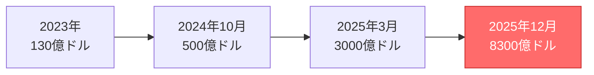

### 評価額130兆円——トヨタの3倍超、世界最大のスタートアップへ

2025年12月19日、ウォール・ストリート・ジャーナル（WSJ）は、OpenAIが最大1000億ドル（約15.5兆円）の資金調達を目指しており、**満額調達となれば評価額は最大で8300億ドル（約130兆円）に達する可能性がある**と報じました。一方で、Reutersなど一部報道では**評価額を約7500億ドル前後とする見方も示されており**、交渉はなお流動的な段階にあります。

いずれにしてもこの評価額を日本企業と比較すると、その規模の異常さが浮き彫りになります。トヨタ自動車の時価総額（2025年12月時点、約40兆円）の**3倍以上**、日本の全上場企業の時価総額合計（同時点で約900兆円とされる概算値）の**14%以上**に相当します。

評価額は報道ベースで段階的に跳ね上がっており、記事内の推移で見ると、**2023年→2024年→2025年にかけて急拡大**しています（※各時点の評価額は報道・協議ベース）。

#### OpenAI評価額の急成長



### なぜ今、1000億ドルなのか？——「2030年問題」への対応

OpenAIがこれほど巨額の資金を必要とする理由は、HSBCの分析レポートが明らかにしています。

#### 2030年までの財務予測

| 項目                                | 金額                       |
| ----------------------------------- | -------------------------- |
| 累計キャッシュバーン（2025-2030年） | **2070億ドル（約32兆円）** |
| クラウド・AIインフラコスト          | 7920億ドル（約123兆円）    |
| データセンター賃料                  | 6200億ドル（約96兆円）     |
| 推論コスト（モデル運用）            | 1500億ドル（約23兆円）     |
| 2030年予想売上高                    | 2000億ドル（約31兆円）     |

HSBCは、OpenAIが**2030年時点でもまだ黒字化できない**と予測しています。累計フリーキャッシュフローはマイナスのまま、**2070億ドル（約32兆円）の資金ギャップ**が残るという厳しい見通しです。

#### 巨額コミットメントの内訳

OpenAIの計算資源確保をめぐっては、クラウド／半導体各社との巨額契約が複数報じられています。（ただし、金額や条件は「確定契約」として一律に確認できるわけではなく、報道・推計・協議ベースのものも混在します。）:

- **Microsoft Azure**: 2500億ドル（6年間）（推計）
- **Oracle**: 3000億ドル（推計）
- **AWS**: 380億ドル（報道）
- **NVIDIA**: 1000億ドル規模の投資（推計）

これらを合計すると、2033年までのコンピューティング関連コミットメントは**1.4兆ドル**（**約217兆円**）に達します。

```chartjs
{
  "type": "pie",
  "labels": ["Oracle", "Microsoft Azure", "NVIDIA等", "AWS"],
  "data": [300, 250, 100, 38],
  "label": "契約額（億ドル）"
}
```

### 競合他社との評価額比較——3社で220兆円超の市場

AI業界の「ビッグ3」の評価額を比較すると、OpenAIの突出ぶりが明確になります。

| 企業          | 評価額                       | 2025年売上高予測 | 累計調達額  |
| ------------- | ---------------------------- | ---------------- | ----------- |
| **OpenAI**    | 8300億ドル（130兆円）        | 200億ドル        | 640億ドル超 |
| **xAI**       | 2000億ドル（31兆円）         | 非公開           | 約100億ドル |
| **Anthropic** | 1700-1830億ドル（26-28兆円） | 90億ドル         | 257億ドル   |

興味深いのは、**AnthropicがOpenAIより先に黒字化を達成する見込み**という点です。Anthropicは2028年の損益分岐点を目指していますが、OpenAIは2030年まで赤字が続くと予測されています。

#### AI企業評価額の視覚的比較

```chartjs
{
  "type": "bar",
  "labels": ["OpenAI", "xAI", "Anthropic"],
  "data": [8300, 2000, 1700],
  "label": "評価額（億ドル）"
}
```

OpenAIの評価額は、xAIの**4.15倍**、Anthropicの**4.88倍**に達しており、AI業界における圧倒的な優位性を示しています。

### IPOへの道——2026年、史上最大規模の上場へ

OpenAIの資金調達計画には、もう一つの重要な要素があります。**2026年にも予定されているIPO**（**新規株式公開**）です。

ロイター通信によると、OpenAIは**評価額1兆ドル（約155兆円）**でのIPOを準備しています。実現すれば、Alibaba（250億ドル、2014年）やSaudi Aramco（294億ドル、2019年）を大幅に上回る**史上最大のIPO**となります。

#### IPOに向けた組織再編

OpenAIは2024年後半から、IPOに向けた準備を加速させています：

1. **営利企業への転換**: 非営利組織から営利企業への完全移行を進行中
2. **CFO Sarah Friarの採用**: Nextdoor、Squareで財務責任者を務めた実績
3. **ガバナンス強化**: 複数の独立取締役を招聘

CFOのSarah Friar氏は「IPOは現時点では予定にない」と発言していますが、同時に「我々の規模に見合った体制を整えている」とも述べており、上場準備が着々と進んでいることを示唆しています。

### ソフトバンクグループの存在感——400億ドル投資の意味

今回の資金調達で注目すべきは、**ソフトバンクグループの役割**です。

2025年3月、ソフトバンクGが主導した400億ドル（約6.2兆円）の資金調達により、OpenAIの評価額は3000億ドルに達しました。さらに、2025年内に**追加で225億ドル**の出資を完了する予定です。

これは、WeWorkへの投資失敗で大きな損失を出したソフトバンクGにとって、AI時代における「リベンジマッチ」とも言える投資です。孫正義氏は「AGI（汎用人工知能）は10年以内に実現する」と公言しており、OpenAIはその賭けの中核に位置しています。

### Anthropicも準備中——2026年IPOレースの行方

OpenAIだけでなく、**AnthropicもIPOを視野に入れています**。

Financial Timesによると、Anthropicは法律事務所Wilson Sonsiniを起用し、**2026年のIPO準備**を進めています。現在の評価額1830億ドルから、上場時には3000億ドル以上になる可能性も報じられています。

#### AnthropicとOpenAIの戦略比較

| 項目         | OpenAI                   | Anthropic       |
| ------------ | ------------------------ | --------------- |
| 2025年売上高 | 200億ドル                | 90億ドル        |
| 黒字化予定   | 2030年                   | 2028年          |
| 主要投資家   | Microsoft、ソフトバンクG | Amazon、Google  |
| IPO予定      | 2026-2027年              | 2026年          |
| 評価額       | 8300億ドル               | 1700-3000億ドル |

### 「AI覇権」の代償——200兆円のギャンブル

OpenAIの財務状況は、AI業界全体の「構造的な問題」を浮き彫りにしています。

#### 収益とコストの逆転現象

- **2025年売上高**: 200億ドル（報道ベース）
- **2025年総支出**: 220億ドル（報道・内部資料に基づく試算）
- **1ドル稼ぐのに必要な支出**: 1.69ドル（上記数値からの試算）

つまり、現時点でOpenAIは**売上1ドルあたり69セントの赤字**を出していると読み取れます。この構造が改善されない限り、いくら資金調達しても「穴の空いたバケツに水を注ぐ」状態が続きます。

#### 2028年の「損失のピーク」

OpenAIの内部資料によると、**2028年には740億ドル（約11.5兆円）の営業損失**が発生する見込みです。これは日本の国家予算（約114兆円）の10%に相当する金額です。

### 日本企業への示唆——「AI投資競争」に参加する意味

今回のOpenAI資金調達は、日本企業にとって重要な示唆を含んでいます。

1. **規模の経済がすべて**: 1000億ドル規模の投資を集められない企業は、フロンティアモデル開発から脱落する
2. **クラウドインフラの重要性**: GPU確保、データセンター契約が競争力の源泉に
3. **黒字化より成長**: 短期的な収益性より、市場シェア獲得が優先される時代

リコーがGoogle Gemma 3をベースにした日本語LLMを発表するなど、日本企業も独自の戦略を模索しています。しかし、OpenAIやAnthropicと同じ土俵で戦うことは、もはや現実的ではありません。

### まとめ：2026年、AI業界の「分水嶺」

- **OpenAIが評価額8300億ドル（約130兆円）で最大1000億ドルの資金調達を計画**
- **2030年までに2070億ドル（約32兆円）のキャッシュバーンが予測される**
- **2026年には評価額1兆ドル超でのIPOが視野に**
- **競合AnthropicはOpenAIより2年早い2028年に黒字化予定**
- **AI業界のビッグ3（OpenAI、xAI、Anthropic）の評価額合計は220兆円超**

2026年は、OpenAIとAnthropicのIPOが予定され、AI業界の勢力図が確定する年となるでしょう。130兆円という途方もない評価額は、「AI覇権」を巡る競争がいかに激しいかを物語っています。

（※時価総額はいずれも市場データに基づく概算であり、株価や為替により変動します。）

---

**Sources:**

[[ogp:https://techcrunch.com/2025/12/19/openai-is-reportedly-trying-to-raise-100b-at-an-830b-valuation/]]
[[ogp:https://www.nikkei.com/article/DGXZQOGN190F40Z11C25A2000000/]]
[[ogp:https://fortune.com/2025/11/26/is-openai-profitable-forecast-data-center-200-billion-shortfall-hsbc/]]
[[ogp:https://www.cnbc.com/2025/03/03/amazon-backed-ai-firm-anthropic-valued-at-61point5-billion-after-latest-round.html]]
[[ogp:https://finance.yahoo.com/news/anthropic-plans-ipo-early-2026-004854547.html]]
