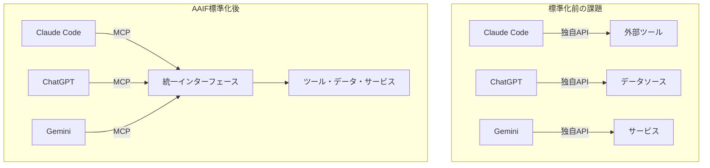
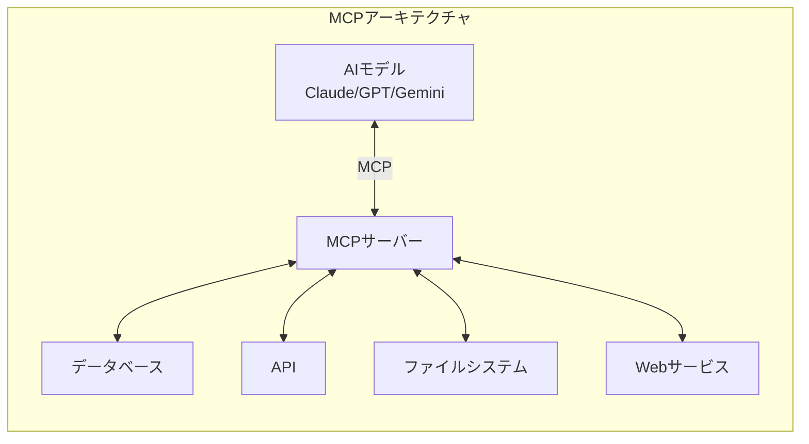

### 競合を超えた歴史的協力——AIエージェント時代の「共通言語」が誕生

2025年12月9日、AI業界に激震が走りました。**OpenAI、Anthropic、Block**の3社が、**Linux Foundation**傘下で**Agentic AI Foundation**（**AAIF**）を共同設立したのです。

これは単なる業界団体の発足ではありません。激しいモデル競争を繰り広げてきたOpenAIとAnthropicが、**AIエージェントの標準化**という共通目標のために手を組んだ、歴史的な転換点です。

AAIFに寄贈された3つのプロジェクト——AnthropicのModel Context Protocol（MCP）、OpenAIのAGENTS.md、Blockのgooseはいずれもオープンソースとして公開され、**ベンダー中立な標準**として発展していくことになります。

### なぜ今、標準化が必要なのか

#### AIエージェントの「バベルの塔」問題

2025年に入り、AIエージェント（自律的にタスクを実行するAIシステム）が急速に普及しました。しかし、各社が独自のプロトコルやフォーマットを採用した結果、深刻な相互運用性の問題が発生していました。



開発者は、異なるAIプラットフォームごとに個別の統合コードを書く必要があり、これが**開発コストの増大**と**エコシステムの断片化**を招いていました。

#### プラットフォーム企業の「囲い込み」への懸念

もう一つの背景は、大手テック企業によるエコシステムの囲い込みへの懸念です。Linux FoundationのJim Zemlin氏は発表の中で、「**単一企業がコントロールしない、オープンで中立的な標準**」の重要性を強調しました。

AAIFの設立により、MCPやAGENTS.mdは特定企業の所有物ではなく、**コミュニティ全体で管理されるインフラ**となります。

### AAIFの3つの柱：MCP、AGENTS.md、goose

#### 1. Model Context Protocol（MCP）——月間97M+ダウンロードの業界標準

**MCP**は、2024年11月にAnthropicがオープンソースとして公開した、AIモデルと外部ツール・データソースを接続するための標準プロトコルです。

わずか1年で驚異的な普及を遂げました：

| 指標                                      | 数値                                                        |
| ----------------------------------------- | ----------------------------------------------------------- |
| **Python/TypeScript SDK月間ダウンロード** | 9,700万以上                                                 |
| **公開MCPサーバー数**                     | 10,000以上                                                  |
| **採用プラットフォーム**                  | ChatGPT、Claude、Gemini、Cursor、VS Code、Microsoft Copilot |
| **企業導入**                              | Block、Bloomberg、Amazon、Fortune 500企業多数               |

MCPの特徴は、「**USBのような標準規格**」という設計思想にあります。かつて各メーカーが独自のケーブル規格を持っていた時代から、USBによって統一されたように、MCPはAIエージェントとツールの接続を標準化します。



#### 2. AGENTS.md——6万以上のOSSプロジェクトが採用

**AGENTS.md**は、2025年8月にOpenAIがリリースした、AIコーディングエージェントにプロジェクト固有の指示を与えるためのMarkdownフォーマットです。

「**エージェントのためのREADME**」とも呼ばれるこのフォーマットは、リリースからわずか4ヶ月で**60,000以上のオープンソースプロジェクト**に採用されました。

| 採用ツール/プラットフォーム                |
| ------------------------------------------ |
| Amp、Codex、Cursor、Devin、Factory         |
| Gemini CLI、GitHub Copilot、Jules、VS Code |

AGENTS.mdの仕組みはシンプルです。プロジェクトのルートディレクトリや各パッケージ内に`AGENTS.md`ファイルを配置すると、AIエージェントが自動的にそれを読み込み、プロジェクト固有のルールに従って動作します。

```text
例：OpenAIのメインリポジトリには88個のAGENTS.mdファイルが存在し、
各モジュールごとに異なる指示をエージェントに与えている
```

#### 3. goose——ローカルファーストのエージェントフレームワーク

**goose**は、決済大手BlockがMCPの普及に合わせて開発した、**ローカルファースト**のAIエージェントフレームワークです。

gooseの特徴：

- **ローカル実行優先**: データをクラウドに送信せず、ローカルで処理可能
- **MCP完全対応**: MCPのリファレンス実装として設計
- **拡張性**: カスタムツールを簡単に追加可能
- **プライバシー重視**: 企業の機密データを扱うユースケースに最適

BlockのDoug Petkanics氏（gooseプロジェクトリード）は、「gooseをAAIFに寄贈することで、**単一企業ではなくコミュニティによってエージェントAIの未来が形作られる**ことを確実にしたい」と述べています。

### AAIFメンバーシップ——テック業界の総力結集

AAIFの設立には、AI業界のほぼすべての主要プレイヤーが参加しています。

#### プラチナメンバー（8社）

| 企業                    | 役割・貢献                             |
| ----------------------- | -------------------------------------- |
| **Amazon Web Services** | クラウドインフラ、Bedrockとの統合      |
| **Anthropic**           | MCP寄贈、Claude連携                    |
| **Block**               | goose寄贈、決済領域のユースケース      |
| **Bloomberg**           | 金融データ領域のMCP活用                |
| **Cloudflare**          | エッジコンピューティング対応           |
| **Google**              | Geminiへの MCP統合                     |
| **Microsoft**           | Windows 11でのMCPサポート、Copilot連携 |
| **OpenAI**              | AGENTS.md寄贈、ChatGPT統合             |

#### ゴールドメンバー（18社）

Adyen、Arcade.dev、Cisco、Datadog、Docker、Ericsson、IBM、JetBrains、Okta、Oracle、Runlayer、Salesforce、SAP、Shopify、Snowflake、Temporal、Tetrate、Twilio

この顔ぶれを見ると、**クラウド、セキュリティ、開発ツール、エンタープライズSaaS**のあらゆる領域がカバーされていることがわかります。

### 開発者への影響——何が変わるのか

#### 1. 「一度書けばどこでも動く」AIエージェント

MCPとAGENTS.mdの標準化により、開発者は**一度ツール連携を実装すれば、Claude、GPT、Geminiなど複数のAIプラットフォームで動作させる**ことが可能になります。

```text
Before: 各AIプラットフォームごとに個別実装が必要
After:  MCP対応で実装すれば、すべてのプラットフォームで動作
```

#### 2. エンタープライズ導入の加速

Linux Foundationという中立的な組織が標準を管理することで、**大企業がAIエージェントを導入する際の懸念**（ベンダーロックイン、長期的なサポート、ガバナンス）が軽減されます。

市場調査によると、**2025年末までに90%の組織がMCPを採用**するとの予測もあります。

#### 3. オープンソースエコシステムの活性化

AGENTS.mdがすでに6万以上のOSSプロジェクトに採用されていることからわかるように、**オープンソースコミュニティがAIエージェント開発の主要なステークホルダー**となります。

### 日本の開発者への示唆

AAIFの設立は、日本のAI開発者・企業にとっても重要な意味を持ちます。

#### MCP対応ツールの開発チャンス

現在、MCPサーバーは10,000以上公開されていますが、**日本語特化のツールや、日本企業向けのサービス連携**はまだ少ない状況です。例えば：

- 日本の会計ソフト（freee、マネーフォワード）との連携
- 日本語文書処理に特化したツール
- 国内クラウドサービスとの統合

これらの領域でMCP対応ツールを開発すれば、**国内AI市場での差別化要因**となり得ます。

#### AGENTS.mdの活用

自社プロジェクトにAGENTS.mdを導入することで、**AIエージェントとの協業が効率化**されます。特に：

- コーディング規約の自動適用
- プロジェクト固有のビルド手順の伝達
- セキュリティ要件の明示

### まとめ——AIエージェント時代の「HTTP」が誕生

Agentic AI Foundationの設立は、**AIエージェント開発における「HTTP」や「USB」に相当する標準化の始まり**と言えます。

#### 主要ポイント

- **OpenAIとAnthropicが歴史的協力**：競合を超えて、エージェントAIの標準化に共同で取り組む
- **MCPが事実上の業界標準に**：Python/TypeScript SDKの月間ダウンロード97M+、ChatGPT・Claude・Gemini・Copilotなど主要プラットフォームが採用
- **AGENTS.mdが急速普及**：わずか4ヶ月で6万以上のOSSプロジェクトが採用
- **ベンダー中立なガバナンス**：Linux Foundation傘下で、単一企業に依存しない標準として発展
- **エンタープライズ導入が加速**：2025年末までに90%の組織がMCP採用との予測

2024年に始まったAIエージェントブームは、2025年のAAIF設立によって**標準化と相互運用性の時代**へと移行しました。開発者にとっては、これらのオープン標準を早期に習得することが、AI時代を生き抜くための重要なスキルセットとなるでしょう。

### 参考リンク

[[ogp:https://www.linuxfoundation.org/press/linux-foundation-announces-the-formation-of-the-agentic-ai-foundation]]

[[ogp:https://openai.com/index/agentic-ai-foundation/]]

[[ogp:https://www.anthropic.com/news/donating-the-model-context-protocol-and-establishing-of-the-agentic-ai-foundation]]

[[ogp:https://techcrunch.com/2025/12/09/openai-anthropic-and-block-join-new-linux-foundation-effort-to-standardize-the-ai-agent-era/]]

[[ogp:https://block.xyz/inside/block-anthropic-and-openai-launch-the-agentic-ai-foundation]]
