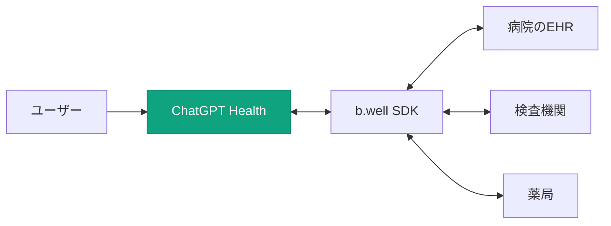

### 週2.3億人の「健康相談」がAIの形を変える

2026年1月7日、OpenAIは**ChatGPT Health**を発表しました。これは単なる新機能の追加ではなく、ChatGPTを**パーソナルヘルスケアハブ**へと進化させる野心的な取り組みです。

驚くべき数字があります。OpenAIによると、ChatGPTでは**毎週2億3000万人以上**が健康やウェルネスに関する質問をしているとのこと。これは、世界中の人々がすでにAIを健康管理のパートナーとして活用し始めていることを示しています。

ChatGPT Healthは、こうした膨大な需要に対応するため、**医療記録の接続**、**ウェルネスアプリとの統合**、**専用のプライバシー保護**を備えた専門的な健康管理空間として設計されています。

### ChatGPT Healthの3つの柱

#### 1. 医療記録の統合（米国限定）

ChatGPT Healthの最大の特徴は、ユーザーの**電子医療記録**（**EHR**）を直接接続できることです。

OpenAIは医療データ連携基盤を提供する**b.well**と提携し、米国の約**220万の医療提供者**（**providers**）からのデータにアクセス可能な仕組みを構築しました。

**b.well連携で可能になること：**

- 複数の医療機関に分散した記録を一元化
- 過去の検査結果や処方履歴を踏まえた回答
- 次回の診察に向けた質問の準備支援
- 保険オプションの比較（自身の受診パターンに基づく）

#### 2. ウェルネスアプリ連携（グローバル）

医療記録の接続は米国限定ですが、ウェルネスアプリとの連携は**グローバルに利用可能**です（EEA、スイス、英国を除く）。

Apple Healthとの連携に加え、6つのサードパーティアプリと統合されています。

| 連携アプリ          | 提供される機能                             |
| ------------------- | ------------------------------------------ |
| **Apple Health**    | 睡眠・活動パターンに基づくアドバイス       |
| **MyFitnessPal**    | パーソナライズされた栄養アドバイス         |
| **Function**        | 血液検査結果の解説と健康インサイト         |
| **Peloton**         | フィットネス目標に合わせたワークアウト提案 |
| **AllTrails**       | 体力レベルに合ったハイキングルート提案     |
| **Instacart**       | 食事プランに基づく買い物リスト生成         |
| **Weight Watchers** | ダイエット目標に沿った食事提案             |

#### 3. 専用のプライバシー保護

健康データという最もセンシティブな情報を扱うため、ChatGPT Healthには通常のChatGPTを超える**多層的なプライバシー保護**が実装されています。

**ChatGPT Healthのセキュリティ特徴：**

- **専用の隔離空間**: Health内の会話・ファイル・接続アプリは、他のチャットとは完全に分離
- **目的別暗号化**: 健康データ専用の追加暗号化レイヤー
- **トレーニング除外**: Health内の会話はOpenAIの基盤モデルトレーニングに使用されない
- **データ削除**: 医療記録の接続を解除すると、b.wellからもデータが削除

ただし、**HIPAAの対象外**である点は要注意です。専門家や報道によれば、消費者向けのヘルスケアアプリはHIPAAの規制対象外であり、ChatGPT Healthも例外ではありません。

### 医療機関向け「ChatGPT for Healthcare」も同時発表

消費者向けのChatGPT Healthと同時に、OpenAIは医療機関向けの**ChatGPT for Healthcare**も発表しました。

#### 導入が始まった主要医療機関

| 医療機関                                | 規模・特徴                            |
| --------------------------------------- | ------------------------------------- |
| **HCA Healthcare**                      | 米国最大の営利病院チェーン（185施設） |
| **AdventHealth**                        | フロリダ州最大の非営利医療システム    |
| **Stanford Medicine Children's Health** | 小児医療の世界的権威                  |
| **Cedars-Sinai Medical Center**         | 西海岸最大級の非営利病院              |
| **Boston Children's Hospital**          | 小児病院の全米ランキング常連          |
| **Memorial Sloan Kettering**            | がん治療の世界的権威                  |
| **UCSF**                                | 全米トップ10の医学研究機関            |

#### GPT-5.2ベースの医療専用モデル

ChatGPT for Healthcareは、**GPT-5.2ベースの医療専用モデル**で動作します。このモデルは、従来の医療AIベンチマーク（医師国家試験などの知識テスト）ではなく、**実際の臨床判断を反映した新しい評価基準**で開発されました。

**HealthBench評価フレームワーク：**

- **260名以上**の医師（60カ国）が開発に参加
- 実際の臨床シナリオを用いた評価
- **60万件以上**のモデル出力を医師がレビュー
- **30の専門分野**をカバー

#### HIPAA対応のエンタープライズ機能

医療機関向けは、消費者版とは異なり**HIPAA対応**となっています。

- **監査ログ**: すべてのアクセスと操作を記録
- **データ残留オプション**: データの保存場所を指定可能
- **顧客管理暗号鍵**: 機関独自の暗号化キーを使用可能
- **BAA（Business Associate Agreement）**: HIPAA準拠の契約をサポート
- **モデルトレーニング除外**: 患者データは一切トレーニングに使用しない

### 競合との比較：AI×ヘルスケアの現状

ChatGPT Healthの発表により、AI×ヘルスケア市場の競争が本格化しています。

| サービス               | 医療記録連携 | ウェルネス連携 | 医療機関向け | HIPAA対応               |
| ---------------------- | ------------ | -------------- | ------------ | ----------------------- |
| **ChatGPT Health**     | ✅（米国）   | ✅             | ✅           | 消費者版:❌ / 機関版:✅ |
| **Google Health AI**   | ❌           | ✅（Fitbit）   | ✅           | ✅                      |
| **Amazon One Medical** | ✅（自社）   | ❌             | ❌           | ✅                      |
| **Apple Health**       | ✅（限定的） | ✅             | ❌           | N/A※                    |

※Apple Healthはヘルスケアデータのプラットフォームであり、AIが医療データを処理するサービスではないため、HIPAA対応の評価は該当しません。

OpenAIの強みは、**GPT-5.2という最高性能のLLM**と**220万の医療提供者**というb.wellのネットワークを組み合わせた点にあります。一方で、Googleは**Fitbitとのハードウェア統合**、Amazonは**One Medical（プライマリケア）との垂直統合**という異なる戦略を取っています。

### 注意点と懸念事項

ChatGPT Healthは画期的ですが、いくつかの懸念点も指摘されています。

**HIPAA（Health Insurance Portability and Accountability Act）とは？**

HIPAAは、米国の医療情報プライバシー保護法です。医療機関や保険会社などが患者の保護対象保健情報（PHI）を扱う際、厳格なセキュリティ基準と患者の権利保護を義務付けています。HIPAA準拠サービスでは、データ侵害時の通知義務、患者によるアクセス権、第三者提供の制限などが法的に保証されます。

#### 1. 診断・治療の代替ではない

OpenAIは「ChatGPT Healthは診断や治療を目的としておらず、医療ケアの代替ではない」と明言しています。あくまで**情報提供と健康管理のサポート**という位置づけです。

#### 2. 消費者版はHIPAA対象外

専門家によれば、消費者向けChatGPT HealthはHIPAAの規制対象外です。Vanderbilt大学医療センターのBradley Malin教授（医療情報学）は「これは個人とOpenAIの間の契約上の合意に過ぎない」と指摘し、医療機関が扱う保護対象保健情報（PHI）とは異なる扱いであることを強調しています。

#### 3. 地域制限

- **医療記録連携**: 米国のみ（18歳以上）
- **ウェルネス連携**: EEA、スイス、英国は利用不可（GDPRなどの規制のため）
- **日本**: ウェルネスアプリ連携は利用可能（医療記録連携は対象外）

#### 4. 将来の広告統合への懸念

Center for Democracy and Technology（CDT）は、「AI企業はパーソナライゼーションを価値提案として強調しているが、将来的な広告統合の可能性がある」と警告しています。

### 日本への影響と今後の展望

ChatGPT Healthの発表は、日本のヘルスケアAI市場にも影響を与える可能性があります。

#### 日本で利用可能な機能

- ✅ ウェルネスアプリ連携（Apple Health、MyFitnessPalなど）
- ✅ 一般的な健康・ウェルネス相談
- ❌ 医療記録の連携（米国限定）

#### 日本市場への示唆

1. **PHR（Personal Health Record）連携の需要増加**: マイナ保険証やオンライン資格確認の普及に伴い、日本版の医療データ連携への期待が高まる可能性
2. **ウェルネスアプリ市場の活性化**: ChatGPTとの連携を前提としたアプリ開発が加速する可能性
3. **医療機関のAI導入加速**: ChatGPT for Healthcareの成功が、日本の医療機関のAI導入を後押しする可能性

### まとめ

ChatGPT Healthは、AI×ヘルスケアの新たなマイルストーンです。

**主要ポイント：**

- 📊 **週2.3億人**の健康相談に対応する専用空間
- 🏥 **220万の米国医療提供者**と連携可能（b.well経由）
- 📱 **Apple Health + 6つのサードパーティアプリ**と統合（グローバル対応）
- 🔒 **専用の暗号化と隔離**による多層的プライバシー保護
- 👨‍⚕️ **260名以上の医師**と共同開発したGPT-5.2ベース医療モデル
- 🏨 **HCA、Stanford、Cedars-Sinaiなど主要医療機関**がChatGPT for Healthcare導入

OpenAIは、ChatGPTを単なる質問応答ツールから「**生活インフラ**」へと進化させようとしています。健康という最も個人的な領域にAIが踏み込むことで、AIと人間の関係は新たな段階に入ったと言えるでしょう。

ただし、HIPAAの対象外であること、地域制限があること、診断・治療の代替ではないことは、利用者として理解しておくべき重要な点です。

**Sources:**

[[ogp:https://openai.com/index/introducing-chatgpt-health/]]
[[ogp:https://openai.com/index/openai-for-healthcare/]]
[[ogp:https://www.cnbc.com/2026/01/07/openai-chatgpt-health-medical-records.html]]
[[ogp:https://techcrunch.com/2026/01/07/openai-unveils-chatgpt-health-says-230-million-users-ask-about-health-each-week/]]
[[ogp:https://time.com/7344997/chatgpt-health-medical-records-privacy-open-ai/]]
[[ogp:https://www.prnewswire.com/news-releases/openai-selects-bwell-to-power-secure-health-data-connectivity-for-ai-driven-health-experiences-in-chatgpt-302655598.html]]
