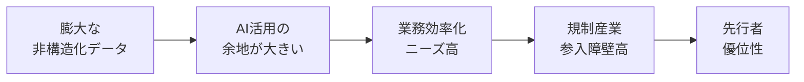
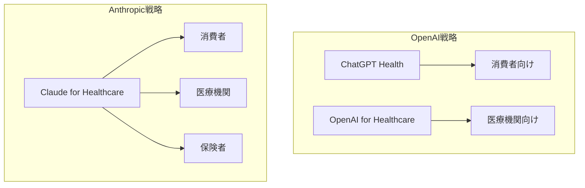

### ChatGPT Health発表から5日、Anthropicが対抗策を発表

2026年1月11日、AnthropicはJ.P. Morgan Healthcare Conferenceに合わせて「**Claude for Healthcare**」を発表しました。これはOpenAIが1月7日に発表した「ChatGPT Health」のわずか**4日後**という、異例のスピードでの対抗リリースです。

両社が相次いで医療AI市場に参入したことで、AIの次なる主戦場が「**ヘルスケア**」であることが明確になりました。

### なぜ医療AIが注目されるのか

医療業界には、事前承認（Prior Authorization）、請求処理、コーディングなど、**人手に頼る非効率なプロセス**が数多く残っています。これらはAIによる自動化の恩恵を最も受けやすい領域です。

一方で、HIPAA（医療保険の相互運用性と説明責任に関する法律）などの厳格な規制があるため、参入障壁が高く、早期に**HIPAA準拠インフラ**を構築した企業が優位に立てる市場でもあります。

### Claude for Healthcareの主要機能

#### HIPAA-readyインフラ

Claude for Healthcareの特徴は、**HIPAAに配慮した（HIPAA-ready）形での提供**を打ち出している点です。

| クラウド        | 提供状況              |
| --------------- | --------------------- |
| AWS Bedrock     | HIPAA-ready環境で提供 |
| Google Cloud    | HIPAA-ready環境で提供 |
| Microsoft Azure | HIPAA-ready環境で提供 |

※BAA（Business Associate Agreement）等の契約対応は、各クラウド・提供形態により異なるため要確認。

なお、Anthropicは自社を「主要クラウドプロバイダーすべてでHIPAA準拠インフラを提供している唯一の主要ファウンデーションモデル」と位置付けていますが、「主要」の定義や比較対象は明示されておらず、この主張の検証には注意が必要です。

#### 医療データベースへの接続（Connectors）

Claude for Healthcareは、例として以下の医療データベースに接続できます（他にもClinicalTrials.gov等が対応予定とされています）：

| コネクタ                              | 機能                                         |
| ------------------------------------- | -------------------------------------------- |
| CMS Coverage Database                 | 保険適用要件の確認、事前承認チェック         |
| ICD-10 Classification                 | 診断・処置コードの検索、医療コーディング支援 |
| National Provider Identifier Registry | 医療提供者の検証、資格確認                   |
| PubMed                                | 3500万件超の生物医学文献へのアクセス         |

特に**PubMed連携**は、最新の研究論文を即座に検索・要約できるため、臨床医や研究者にとって強力なツールとなります。

#### Agent Skills（新機能）

2つの新しいエージェント機能が追加されました：

1. **FHIR Development**：医療システム間の相互運用性を向上させるFHIR（Fast Healthcare Interoperability Resources）開発を支援
2. **Prior Authorization Review**：保険適用要件と臨床ガイドラインを照合し、事前承認プロセスを効率化

### 消費者向け機能：健康データ連携

Claude Pro/Maxプランの米国ユーザーは、以下の健康データをClaudeに連携できます（ベータ版）：

- **HealthEx**、**Function**コネクタ
- **Apple Health**（iOS）
- **Android Health Connect**（Android）

連携すると、Claudeは以下のことが可能になります：

- 医療履歴の要約
- 検査結果のわかりやすい説明
- フィットネス・健康指標のパターン検出
- 診察に向けた質問の準備

重要なのは、Anthropicは**ユーザーの健康データをモデルのトレーニングに使用しない**と明言している点です。

### ChatGPT Health vs Claude for Healthcare

OpenAIとAnthropicの医療AIプラットフォームには、明確な戦略の違いがあります。

| 項目                 | ChatGPT Health                                                        | Claude for Healthcare               |
| -------------------- | --------------------------------------------------------------------- | ----------------------------------- |
| 発表日               | 2026年1月7日                                                          | 2026年1月11日                       |
| 主要ターゲット       | **消費者中心**                                                        | **医療機関・保険者中心**            |
| プラットフォーム構成 | 消費者向け（ChatGPT Health）と業界向け（OpenAI for Healthcare）を分離 | 消費者向けとエンタープライズを統合  |
| HIPAA対応            | 対応中                                                                | HIPAA-ready環境を提供（報道ベース） |
| 医療データベース連携 | 医療記録連携（b.well経由）                                            | CMS、ICD-10、NPI、PubMed            |
| 利用可能性           | ウェイトリスト制                                                      | 即時利用可能                        |

Tom's Guideは「ChatGPT Healthのウェイトリストを避けたいなら、Claude for Healthcareを使え」と報じており、**即時利用可能**という点はAnthropicの大きなアドバンテージです。

### 安全性と限界

#### 専門家によるレビューが必須

Anthropicの利用規約では、Claudeを医療診断や患者ケアに使用する場合、「**資格を持つ専門家が、配布や最終決定の前にコンテンツや決定をレビューすること**」を義務付けています。

これは、AIの医療応用における重要な制約です。報道ベースでClaude Opus 4.5は医療計算で高い精度を達成しているとされますが、それでも**薬剤投与量の計算など、許容誤差がほぼゼロの領域では人間の確認が不可欠**です。

#### ハルシネーションの問題

医療AIの最大のリスクは**ハルシネーション**（**もっともらしい誤情報の生成**）です。Anthropicは、Constitutional AIモデルと低いハルシネーション率を強調していますが、「ミスを犯す可能性がある」ことは明確に認めています。

### 医療AI市場への影響

#### J.P. Morgan Healthcare Conference

Claude for HealthcareがJ.P. Morgan Healthcare Conferenceに合わせて発表されたことは象徴的です。このカンファレンスは、医療業界最大の投資家イベントであり、Anthropicが**医療AI市場を本気で狙っている**ことを示しています。

#### 早期パートナーとの比較

| 企業      | 提携先                                                                                |
| --------- | ------------------------------------------------------------------------------------- |
| OpenAI    | Cedars-Sinai、HCA Healthcare、Baylor Scott & White Health、Boston Children's Hospital |
| Anthropic | 詳細は未公開（AWS、Google Cloud、Azure経由でエンタープライズ提供）                    |

OpenAIは著名な医療機関との提携を前面に押し出していますが、Anthropicはクラウドプロバイダー経由での広範な展開を重視しています。

### まとめ：医療AI競争の新章

Claude for Healthcareの発表は、AI業界の競争が**新たな主戦場「医療」に移行**したことを示しています。

- **発表タイミング**：ChatGPT Healthの4日後、J.P. Morgan Healthcare Conference開幕に合わせて発表
- **HIPAA-ready**：主要クラウドでHIPAA-ready環境を提供（Anthropic主張、詳細は要確認）
- **データ連携**：CMS、ICD-10、NPI、PubMed（3500万件超）に接続
- **即時利用可能**：ChatGPT Healthのウェイトリストとは対照的に、すぐに利用開始可能
- **プライバシー重視**：健康データはモデルトレーニングに使用しないと明言

2026年は、AIが医療の現場に本格的に入り込む年になりそうです。ただし、**AIはあくまで医療従事者の補助ツール**であり、最終判断は常に人間が行うべきという原則は変わりません。

### 参考文献

[[ogp:https://www.anthropic.com/news/healthcare-life-sciences]]
[[ogp:https://techcrunch.com/2026/01/12/anthropic-announces-claude-for-healthcare-following-openais-chatgpt-health-reveal/]]
[[ogp:https://www.fiercehealthcare.com/ai-and-machine-learning/jpm26-anthropic-launches-claude-healthcare-targeting-health-systems-payers]]
[[ogp:https://www.nbcnews.com/tech/tech-news/anthropic-health-care-rcna252872]]
