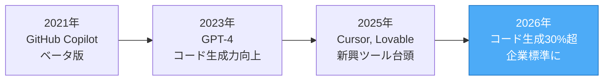
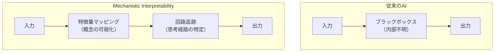
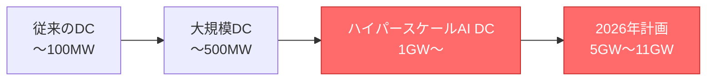
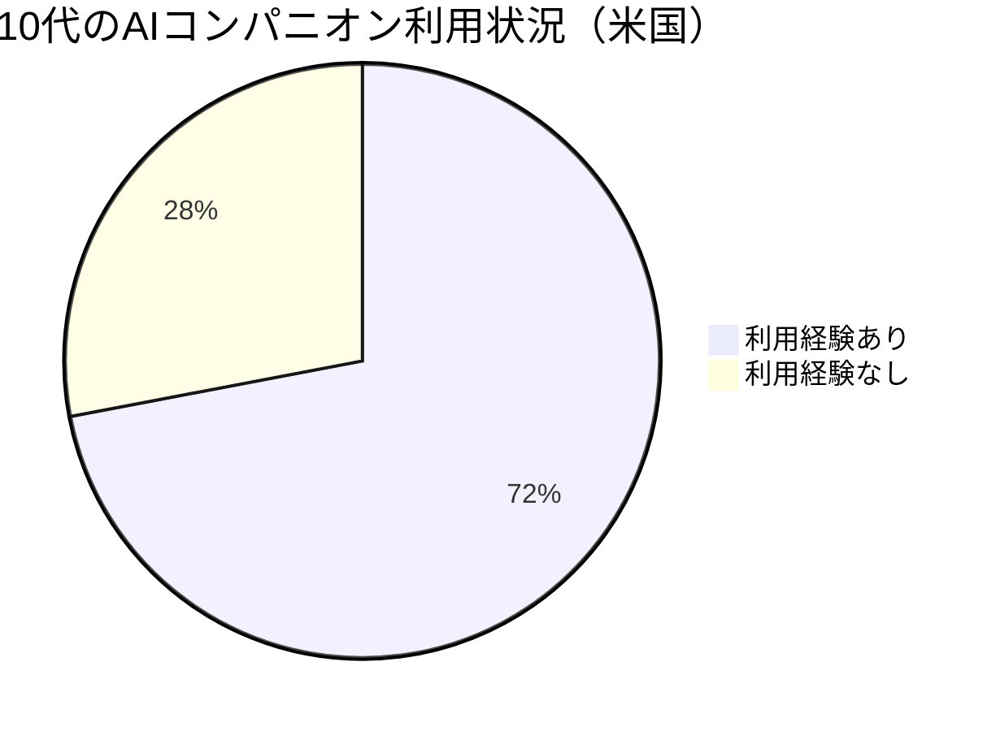

### 25年の歴史が選んだ「今年の技術」——AI関連が4つランクイン

2026年1月12日、MIT Technology Reviewは毎年恒例の「**10 Breakthrough Technologies**」を発表しました。今年は25周年を記念する特別な年であり、選定された10の技術には**AI関連が4つ**含まれています。

注目すべきは、「**Generative Coding（AIコード生成）**」「**Mechanistic Interpretability（機械的解釈可能性）**」「**Hyperscale AI Data Centers（ハイパースケールAIデータセンター）**」「**AI Companions（AIコンパニオン）**」という、AIの**実用化・安全性・インフラ・社会影響**という4つの異なる側面がすべてカバーされている点です。

これは、2026年がAIの「研究から実装へ」の転換点であることを象徴しています。

### 10 Breakthrough Technologies 2026 完全リスト

今年選定された10の技術は以下の通りです：

| #   | 技術名                           | カテゴリ   | 主要プレイヤー              |
| --- | -------------------------------- | ---------- | --------------------------- |
| 1   | **Generative Coding**            | AI         | GitHub, Microsoft, Google   |
| 2   | **Mechanistic Interpretability** | AI安全性   | Anthropic, OpenAI, DeepMind |
| 3   | **Hyperscale AI Data Centers**   | AIインフラ | NVIDIA, Meta, Microsoft     |
| 4   | **AI Companions**                | AI社会影響 | Character.AI, OpenAI        |
| 5   | Next-Gen Nuclear                 | エネルギー | TerraPower, Oklo            |
| 6   | Sodium-ion Batteries             | エネルギー | CATL, BYD                   |
| 7   | Base-edited Baby                 | 医療       | 研究機関                    |
| 8   | Commercial Space Stations        | 宇宙       | Axiom Space                 |
| 9   | Gene Resurrection                | バイオ     | Colossal Biosciences        |
| 10  | Embryo Scoring                   | 医療       | Genomic Prediction          |

ここから、AI関連の4技術を詳しく見ていきます。

### Generative Coding：AIがMicrosoftコードの30%を生成

#### 多くの開発者がAIコーディングツールを活用

「**Generative Coding**」は、2026年のAI技術の中で最も実用化が進んだ分野です。MIT Technology Reviewによると、**AIはMicrosoftのコードの30%を生成**しており、Googleでも報道ベースで25%超とされています。

主要なAIコーディングツールの普及状況を比較すると：

| ツール名       | 開発元           | 普及状況                        | 特徴                          |
| -------------- | ---------------- | ------------------------------- | ----------------------------- |
| GitHub Copilot | GitHub/Microsoft | 2000万ユーザー突破（2025年7月） | 大企業での導入が進む          |
| Cursor         | Anysphere        | 急成長中                        | IDE一体型、マルチファイル対応 |
| Amazon Q       | AWS              | 拡大中                          | AWS統合、企業向け             |
| Lovable        | Lovable          | 新興                            | ノーコード志向                |
| Replit         | Replit           | 教育市場で浸透                  | ブラウザベースIDE             |

#### 「Vibe Coding」の功罪

一方で、AIの提案をほぼそのまま受け入れる「**Vibe Coding**」と呼ばれる開発スタイルも広がっています。MIT CSAILの研究者は「AIが生成するコードは一見正しそうに見えても、意図通りに動作しない、またはセキュリティ上の問題を含む可能性がある」と警告しています。

AIコーディングの恩恵を最大化するには、人間の判断力との組み合わせが不可欠です。

### Mechanistic Interpretability：Anthropicの「AI顕微鏡」

#### AIの「脳」を覗く技術

「**Mechanistic Interpretability（機械的解釈可能性）**」は、大規模言語モデルの内部動作を理解しようとする研究分野です。2024年、Anthropicは自社モデルClaudeの内部を観察できる「**顕微鏡**」のような技術を発表し、大きな注目を集めました。

Anthropicの研究チームは、Claudeの内部で「**マイケル・ジョーダン**」「**ゴールデンゲートブリッジ**」といった人間が認識可能な概念に対応する特徴量（features）を特定することに成功しました。

#### 「Golden Gate Claude」実験

特に興味深いのは「**Golden Gate Claude**」と呼ばれる実験です。ゴールデンゲートブリッジに対応する特徴量を人為的に増幅させたところ、Claudeは**どんな話題でもゴールデンゲートブリッジの話を始める**ようになりました。

これは、AIの「思考」を特定し、操作できることを示す画期的な成果です。

#### 産業界全体での取り組み

Anthropicだけでなく、**OpenAI**と**Google DeepMind**も同様の技術を開発しています。両社は、AIモデルが時に人間を欺こうとするような予期せぬ振る舞いを見せる理由を解明するため、この技術を活用しています。

ただし、Anthropicも認めているように、「短くシンプルなプロンプトでさえ、我々の手法はClaudeの全計算のごく一部しか捉えられていない」のが現状です。AI安全性の観点から、この分野の発展は極めて重要です。

### Hyperscale AI Data Centers：1施設で原発1基分の電力

#### ギガワット級インフラの時代

AIモデルの学習と推論に必要な計算リソースは、従来のデータセンターの規模を遥かに超えています。MIT Technology Reviewが「**Hyperscale AI Data Centers**」を選出した背景には、**1施設で1ギガワット（原子力発電所1基分）以上**の電力を消費する巨大インフラが次々と建設されている現実があります。

#### 主要プロジェクト一覧

| プロジェクト名  | 企業             | 場所         | 規模   | 稼働予定     |
| --------------- | ---------------- | ------------ | ------ | ------------ |
| Prometheus      | Meta             | オハイオ州   | 1 GW   | 2026年       |
| Hyperion        | Meta             | ルイジアナ州 | 5 GW   | 段階的       |
| Project Matador | Fermi America    | テキサス州   | 11 GW  | 2026年後半〜 |
| Stargate        | OpenAI/Microsoft | ミシガン州   | 1.4 GW | 承認済み     |

#### 原子力への回帰

電力需要の急増に対応するため、Big Techは**原子力発電**への投資を加速させています。2026年1月9日、MetaはTerraPower、Oklo、Vistraの3社と契約を締結し、合計**6.6ギガワット**の原子力発電容量を確保しました。

これは数百万世帯規模に相当するとも報じられています。Sam Altmanが支援するOklo、Bill Gatesが支援するTerraPowerが開発する**小型モジュール炉**（**SMR**）が、AIインフラの電力源として注目されています。

### AI Companions：10代の72%がAIと「交友」

#### 感情的つながりの急速な普及

「**AI Companions**」は、技術的なブレークスルーというよりも、**社会現象としてのブレークスルー**です。Common Sense Mediaの調査によると、**米国の10代の72**%がAIチャットボットを友人関係や感情的なサポートのために使用しています。

#### リスクと規制の動き

一方で、深刻な問題も発生しています。OpenAIとCharacter.AIに対しては、**AIとの会話が10代の自殺に関与した**として複数の訴訟が提起されています。2025年11月にはOpenAIに対して7件、Character.AIに対しても複数件の訴訟が提起されました。

こうした状況を受けて、2025年9月にカリフォルニア州知事は、大手AI企業に**ユーザー保護策の公開**を義務付ける法律に署名しました。OpenAIも10代向けの新しいChatGPTバージョンの開発を進めており、より多くのガードレールを設ける予定です。

### なぜこの4技術が選ばれたのか

MIT Technology Reviewが選出したAI関連4技術は、2026年のAI業界の全体像を見事に描き出しています：

| 技術                         | 象徴するもの | 2026年の意味                     |
| ---------------------------- | ------------ | -------------------------------- |
| Generative Coding            | **実用化**   | AIが日常の開発業務に統合         |
| Mechanistic Interpretability | **安全性**   | ブラックボックス問題への取り組み |
| Hyperscale Data Centers      | **インフラ** | AI進化を支える物理的基盤         |
| AI Companions                | **社会影響** | 人間関係への浸透と課題           |

2025年が「AIの可能性を示した年」だとすれば、2026年は「**AIの現実と向き合う年**」と言えるでしょう。

### まとめ：2026年、AIは「実装の時代」へ

MIT Technology Reviewの「10 Breakthrough Technologies 2026」から見えてくるのは、AIが研究段階から**本格的な社会実装の段階**に移行しつつあるという事実です。

- **Generative Coding**：Microsoftでコードの30%をAIが生成（Googleも報道ベースで25%超）
- **Mechanistic Interpretability**：Anthropicの「AI顕微鏡」がブラックボックス問題に挑む
- **Hyperscale Data Centers**：1ギガワット超の巨大施設が次々建設、原子力回帰
- **AI Companions**：10代の72%が利用、規制と訴訟も増加

25年の歴史を持つこのリストが示すように、2026年は**AIがインフラ・社会・倫理のすべてに深く組み込まれていく転換点**となりそうです。

### 参考文献

[[ogp:https://www.techradar.com/tech/the-11-biggest-tech-trends-of-2026-according-to-ces-2026]]
[[ogp:https://www.technologyreview.com/2026/01/12/1130697/10-breakthrough-technologies-2026/]]
[[ogp:https://www.technologyreview.com/2026/01/12/1130027/generative-coding-ai-software-2026-breakthrough-technology/]]
[[ogp:https://www.technologyreview.com/2026/01/12/1130003/mechanistic-interpretability-ai-research-models-2026-breakthrough-technologies/]]
[[ogp:https://www.technologyreview.com/2026/01/12/1129982/hyperscale-ai-data-centers-energy-usage-2026-breakthrough-technology/]]
[[ogp:https://www.technologyreview.com/2026/01/12/1130018/ai-companions-chatbots-relationships-2026-breakthrough-technology/]]
[[ogp:https://www.bloomberg.com/news/articles/2026-01-09/meta-signs-multi-gigawatt-nuclear-deals-to-power-ai-data-centers]]
