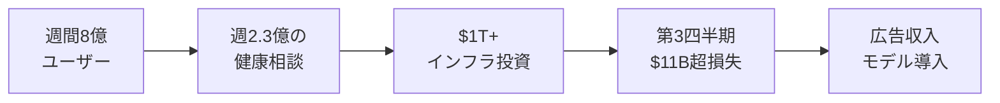
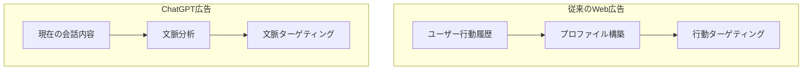

### AIプラットフォーム初の本格広告導入——「無料」の代償が明らかに

2026年1月16日、OpenAIは**ChatGPTへの広告導入**と、月額**8ドル**の新プラン「**ChatGPT Go**」の世界展開を発表しました。これは、週間アクティブユーザー**8億人**を抱える世界最大のAIプラットフォームが、初めて広告収入モデルに本格参入することを意味します。

発表からわずか5日後の1月21日、OpenAI CFOのSarah Friarは世界経済フォーラム（ダボス会議）で「**強固なビジネスモデルの構築**」が不可欠だと強調。一方、**米国上院議員**からはプライバシーに関する懸念が表明されるなど、この決定は大きな波紋を呼んでいます。

### なぜ今、広告なのか——OpenAIの財務的プレッシャー

OpenAIが広告導入に踏み切った背景には、深刻な財務状況があります：

| 指標                   | 数値                    | 備考                         |
| ---------------------- | ----------------------- | ---------------------------- |
| 週間アクティブユーザー | **8億人**               | 世界最大のAIプラットフォーム |
| 2025年Q3損失（推計）   | **約$11.5B**            | Microsoft開示からの推計      |
| インフラ投資計画       | **$1T+（約150兆円〜）** | 2030年までのAI基盤整備       |
| 2026年目標売上         | **$30B**                | 2025年の約2倍                |

CEOのSam Altmanは以前から広告導入に慎重な姿勢を示していましたが、X（旧Twitter）で「**多くの人がAIを使いたいが、お金を払いたくないのは明らか**」と、方針転換の理由を説明しています。

### ChatGPTの新プラン体系——4つの選択肢

2026年1月時点で、ChatGPTは以下の4つのプランを提供しています：

| プラン   | 月額   | 主な特徴                                           | 広告     |
| -------- | ------ | -------------------------------------------------- | -------- |
| **Free** | 無料   | GPT-5.2 Instant、5時間ごと10メッセージ             | **あり** |
| **Go**   | **$8** | 無料の10倍のメッセージ・ファイル・画像、長いメモリ | **あり** |
| **Plus** | $20    | GPT-5.2 Thinking、Codex、Sora、Deep Research       | なし     |
| **Pro**  | $200   | 無制限アクセス、最優先処理                         | なし     |

#### ChatGPT Goの詳細機能

ChatGPT Goは、2025年8月にインドで試験導入された後、**170カ国以上**に展開され、OpenAI史上**最速で成長しているプラン**となっています。

**Goプランで利用可能：**

- GPT-5.2 Instantへの**無制限アクセス**
- 無料版の**10倍**のメッセージ送信数
- ファイルアップロード・画像生成の拡張
- 長期メモリ（過去の会話をより多く記憶）
- 拡張コンテキストウィンドウ

**Goプランで利用不可：**

- GPT-5.2 Thinking（推論モデル）
- Codex（コーディングエージェント）
- Sora（動画生成）
- Deep Research（深層調査）
- レガシーモデル（GPT-4oなど）

### 広告の仕組み——「会話ベースの文脈ターゲティング」

OpenAIが採用する広告手法は、従来のWeb広告とは異なるアプローチを取っています：

#### 広告表示の仕組み

1. ユーザーの**現在の会話内容**のみを分析
2. 回答の**下部**に「関連する製品・サービス」を表示
3. 広告は**明確にラベル付け**され、回答とは分離
4. ChatGPTの**回答内容には影響しない**

#### 広告が表示されない場面

OpenAIは以下のトピックでは広告を表示しないと明言しています：

- **健康・メンタルヘルス**に関する会話
- **政治**に関する会話
- **18歳未満**と判断されるユーザー

年齢判定には、アカウント情報や利用パターンなどのシグナルからAIが推定するシステムが使われています。

### プライバシー論争——「データは売らない」は本当か

広告導入に対し、プライバシー専門家から懸念の声が上がっています。

#### OpenAIの公式声明

> 「ChatGPTの回答は広告に影響されません。ユーザーのデータを広告主に**売却することは絶対にありません**。」
> — OpenAI公式発表（2026年1月16日）

#### 専門家の指摘

Center for Democracy and TechnologyのAI Governance Lab所長、Miranda Bogen氏は次のように警告しています：

> 「たとえAIプラットフォームがデータを広告主と直接共有しなくても、**ターゲティング広告に基づくビジネスモデル**は、ユーザープライバシーに対して非常に危険なインセンティブを生み出す」

#### 6週間前の「Target事件」

2025年12月、ChatGPTにTargetのショッピング提案が表示された際、OpenAIは「**これは広告ではなくアプリ提案**」と説明しました。しかしユーザーの多くはこの説明を受け入れず、今回の正式な広告導入発表により、当時の説明の信憑性に疑問が投げかけられています。

### 米国議会の反応——Markey上院議員が書簡

2026年1月22日、Edward Markey上院議員はOpenAIのSam Altman CEOに宛てた書簡で懸念を表明しました：

> 「テック業界はAIチャットボットにおいて、**広告駆動型モデル**へと急速に移行しているように見える。これは**プライバシーを損なう**可能性がある」

書簡では以下の点について透明性を求めています：

- 広告ターゲティングに使用されるデータの範囲
- データ保持期間と削除ポリシー
- 18歳未満ユーザーの保護措置の詳細

### 業界への影響——GoogleとMetaの牙城に挑戦

オンライン広告市場は、GoogleとMetaが圧倒的なシェアを持っています：

| 企業       | 2025年Q3広告収入 | 市場シェア |
| ---------- | ---------------- | ---------- |
| **Google** | $74B+            | 約28%      |
| **Meta**   | $50B+            | 約19%      |
| **Amazon** | $14B+            | 約5%       |
| **OpenAI** | -                | 新規参入   |

週間8億人のユーザーを抱えるOpenAIが広告市場に参入することで、**AI広告**という新たなカテゴリが確立される可能性があります。

#### 他AIプラットフォームの動向

- **Anthropic**（Claude）：広告導入の予定なし
- **Google**（Gemini）：Google広告との統合を検討中
- **Meta**（Llama）：オープンソースのため直接収益化なし

### ユーザーの選択肢——広告を避けるには

広告表示を避けたいユーザーには、以下の選択肢があります：

1. **ChatGPT Plus（$20/月）以上にアップグレード**
    - 広告なし保証
    - GPT-5.2 Thinkingなど上位機能へのアクセス

2. **パーソナライゼーションをオフにする**
    - 設定から広告パーソナライゼーションを無効化
    - 広告データをクリア可能

3. **競合サービスへの移行**
    - Claude（Anthropic）
    - Gemini（Google）
    - Llama経由のサービス

### 今後の展開——段階的なロールアウト

OpenAIは「今後数週間」で米国の無料・Goユーザーに広告テストを開始すると発表しています。具体的なスケジュールは以下の通りです：

| 時期                   | 内容                             |
| ---------------------- | -------------------------------- |
| 2026年1月16日          | ChatGPT Go世界展開、広告導入発表 |
| 2026年1月下旬〜2月上旬 | 米国での広告テスト開始           |
| 2026年上半期           | テスト結果に基づく調整・拡大     |
| 未定                   | 米国外への広告展開（可能性）     |

### まとめ：AIビジネスモデルの転換点

OpenAIのChatGPT広告導入は、AI業界全体にとって歴史的な転換点となります：

- **月額$8のChatGPT Go**が170カ国以上で展開、OpenAI史上最速成長プラン
- **無料・Goユーザーに広告表示**、Plus以上は広告なし保証
- **会話ベースの文脈ターゲティング**を採用、従来の行動追跡とは異なるアプローチ
- **プライバシー懸念**に対し「データは売らない」と明言も、専門家は構造的リスクを指摘
- **米国議会**が透明性を要求、規制議論の可能性
- **四半期$11B超の損失（推計）**と、**$1T+投資計画（2030年まで）**を背景に、収益化への圧力が本格化

「**無料で使えるAI**」の時代は終わりを迎えつつあります。ユーザーは今後、**データ（広告）で支払うか、お金で支払うか**という選択を迫られることになるでしょう。

---

**情報ソース：**

[[ogp:https://openai.com/index/our-approach-to-advertising-and-expanding-access/]]

[[ogp:https://openai.com/index/introducing-chatgpt-go/]]

[[ogp:https://techcrunch.com/2026/01/16/chatgpt-users-are-about-to-get-hit-with-targeted-ads/]]

[[ogp:https://www.cnn.com/2026/01/16/tech/chatgpt-ads-openai]]

[[ogp:https://www.bloomberg.com/news/articles/2026-01-21/openai-cfo-defends-ads-in-chatgpt-as-strong-business-model]]

[[ogp:https://www.cnbc.com/2026/01/16/open-ai-chatgpt-ads-us.html]]
