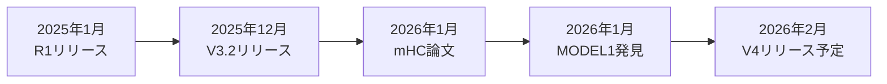

### 「効率ファースト」戦略で西側AIに挑む——DeepSeek 2026年の大攻勢

2026年1月、中国のAIスタートアップ**DeepSeek**が相次いで重要な発表を行いました。創業者の梁文鋒（Liang Wenfeng）が共著者として名を連ねる新論文「**mHC（Manifold-Constrained Hyper-Connections）**」と、GitHub更新をもとにコミュニティが発見した次世代モデル「**MODEL1**」の情報です。

DeepSeekは2025年1月のR1モデルリリースで、報道によれば**600万ドル以下**のトレーニングコストでOpenAIのo1モデルに匹敵する性能を実現。このニュースを含む材料により、**NVIDIAの時価総額が1日で約5930億ドル減少**する場面もありました。今回の発表は、その「効率革命」がさらに加速することを示唆しています。

### mHCとは何か——ディープラーニングの根本課題を解決

#### 背景：Residual Connectionの限界

過去10年間、ディープラーニングの基盤技術として**Residual Connection**（**残差接続**）が広く使われてきました。しかし、モデルの大規模化に伴い、ByteDanceが提案した**Hyper-Connections**（**HC**）のような拡張手法では深刻な問題が発生していました。

DeepSeekの論文によると、27Bパラメータモデルで制約なしのHCを使用した場合、**信号が3000倍以上に増幅**され、学習が破綻（カタストロフィック・ダイバージェンス）する事態が発生しました。

#### mHCの技術的革新

mHC（Manifold-Constrained Hyper-Connections）は、この問題を数学的に解決します：

| 技術要素                       | 説明                                               |
| ------------------------------ | -------------------------------------------------- |
| **Birkhoff多様体**             | 残差ストリームの相互作用を特定の数学的多様体に制約 |
| **Sinkhorn–Knoppアルゴリズム** | 二重確率行列で信号の大きさを保存                   |
| **カーネル融合**               | メモリアクセスを最適化                             |
| **混合精度カーネル**           | TileLangを使用した効率的な計算                     |

**結果として、どれだけモデルが深くなっても、残差ストリームが爆発も崩壊もしなくなります。**

#### 実装コスト

重要なのは、この革新が**わずか6〜7%のトレーニングオーバーヘッド**で実現できることです。大規模モデルにとっては無視できるレベルであり、実用的な導入が可能です。

### V3.2の実力——GPT-5級との評価、コストは大幅削減

DeepSeek公式は、V3.2について「**GPT-5 level**」「**Rivals Gemini-3.0-Pro**」と表現しています。以下は各種報道・二次ソースに基づくベンチマーク比較です。

#### ベンチマーク比較（※報道ベース）

| ベンチマーク                    | DeepSeek V3.2-Speciale | GPT-5-High | Gemini 3.0 Pro |
| ------------------------------- | ---------------------- | ---------- | -------------- |
| **AIME 2025（数学）**           | 96.0%                  | 94.6%      | 95.0%          |
| **Harvard-MIT Math Tournament** | 99.2%                  | -          | 97.5%          |
| **IOI 2025**                    | 金メダル級             | -          | -              |
| **ICPC World Final 2025**       | 金メダル級             | -          | -              |

※上記数値は複数の報道・分析記事に基づく参考値です。公式技術レポートでの詳細確認を推奨します。

**報道によれば、これらの性能がGPT-5の約10〜30分の1のコストで実現されているとされています。**

#### V3.2の限界

一方で、V3.2にはいくつかの課題も残されています：

- **トークン効率**：同等の出力品質を得るために、より長い生成が必要
- **世界知識の幅**：総トレーニング計算量の差により、プロプライエタリモデルに劣後
- **ツール使用**：GPT-5やGeminiに大きく後れを取る領域

### MODEL1とV4——2月リリースに向けた準備

#### GitHub上のMODEL1発見（コミュニティ解析）

2026年1月21日、DeepSeekのFlashMLAコードベースのGitHub更新をもとに、コミュニティが「**MODEL1**」という識別子を発見したと報じられています。報道によれば、114ファイル中28箇所で確認されたとのことです。これはR1リリースからちょうど1年の節目に当たります。

コミュニティの分析では、MODEL1はV3.2（内部コード名「V32」）とは異なるアーキテクチャを持つ可能性が示唆されています：

| 特徴             | V3.2   | MODEL1（V4予想）       |
| ---------------- | ------ | ---------------------- |
| **次元標準化**   | 可変   | 統一512次元            |
| **KVキャッシュ** | 従来型 | 新レイアウト           |
| **FP8デコード**  | 標準   | 新方式                 |
| **Value Vector** | 従来型 | 位置認識機能           |
| **Engram**       | なし   | 条件付きメモリシステム |

#### Engram：100万トークン超のコンテキスト管理

V4には、DeepSeekが新たに発表した「**Engram**」アーキテクチャの実装が予想されています。Engramは、**100万トークンを超えるコンテキスト**から効率的に情報を取得するルックアップシステムで、基礎的な事実を高速に参照できます。

#### リリース時期

The Informationの報道（Reuters引用）によると、V4は**2026年2月中旬**、旧正月（2月17日）頃のリリースが予定されています。これは昨年のR1リリースと同様のタイミング戦略です。

### V4のターゲット——コーディング性能でトップを狙う

DeepSeekの内部テストによると、V4は**AnthropicやOpenAIのモデルをコーディングベンチマークで上回る**可能性があります。

#### SWE-benchでの挑戦

現在のコーディングベンチマーク「SWE-bench」のリーダーボードは以下の通りです：

| モデル              | SWE-bench解決率 |
| ------------------- | --------------- |
| **Claude Opus 4.5** | 80.9%（トップ） |
| GPT-5.2-Codex       | 56.4%           |
| Gemini 3.0 Pro      | 推定60%台       |
| DeepSeek V3.2       | 推定50%台       |

V4が「コーディングの王座」を獲得するには、Claude Opus 4.5の**80.9%を超える**必要があります。長いコードプロンプトでの性能が特に注目されています。

#### 驚異的なハードウェア要件

V4の最も注目すべき点の1つは、**コンシューマーグレードのハードウェアで動作**することです：

| ティア               | 必要ハードウェア                      |
| -------------------- | ------------------------------------- |
| **コンシューマー**   | NVIDIA RTX 4090 ×2 または RTX 5090 ×1 |
| **エンタープライズ** | 標準データセンターGPU構成             |

これは、より大きなハードウェア要件を求める傾向とは明らかに異なります。

### 業界への影響——「効率ファースト」が標準になるか

DeepSeekのmHC論文の共著者は、この研究について次のようにコメントしています：

> 「AIを単に大きくするのではなく、**よりインテリジェントにスケーリング**している」

この「効率ファースト」戦略は、以下の影響を与える可能性があります：

1. **参入障壁の低下**：小規模企業や個人開発者もLLMの力を活用可能に
2. **コスト競争の激化**：西側AI企業への価格圧力
3. **オープンソースの加速**：V4もオープンウェイトでのリリースが予想される
4. **ハードウェア要件の再考**：消費者向けGPUでの高性能モデル運用

### 2026年LLM勢力図——四つ巴の戦い

2026年1月時点のLLM市場は、以下の4社が激しく競争しています：

| 企業          | 主力モデル        | 強み                           | 弱み                 |
| ------------- | ----------------- | ------------------------------ | -------------------- |
| **OpenAI**    | GPT-5.2           | ツール使用、総合性能           | 高コスト             |
| **Google**    | Gemini 3.0 Pro    | LMArena Elo 1501（トップ）     | オープン性           |
| **Anthropic** | Claude Opus 4.5   | コーディング80.9%（SWE-bench） | 推論速度             |
| **DeepSeek**  | V3.2 / V4（予定） | コスト効率、オープンウェイト   | ツール使用、世界知識 |

Fortune誌の報道（2026年1月23日）によると、ダボス2026ではAGIの到達時期をめぐり業界リーダー間で見解が分かれました。DeepMindのDemis Hassabis CEOは現在のAIがAGIに「nowhere near（程遠い）」と慎重な姿勢を示す一方、AnthropicのDario Amodei CEOはAIによるソフトウェア開発の自動化が急速に進むとの見方を示したと報じられています。

### まとめ：DeepSeekの「効率革命」は続く

2026年1月のDeepSeek発表は、AI業界に再び衝撃を与えています：

- **mHCアーキテクチャ**がトレーニングの安定性と効率を大幅に向上、**6-7%のオーバーヘッド**で実装可能
- **V3.2**はGPT-5に匹敵する性能を**10-30分の1のコスト**で実現
- **V4（MODEL1）**は**2026年2月中旬**リリース予定、コーディングでClaude超えを狙う
- **コンシューマーハードウェア**（**RTX 4090 ×2**）での動作を想定
- **Engram**による100万トークン超のコンテキスト管理
- **オープンウェイト**でのリリースが継続予定

DeepSeekの「**より大きくではなく、よりスマートに**」という哲学は、AI開発の常識を覆しつつあります。2月のV4リリースで、この効率革命がどこまで進むのか——世界が注目しています。

---

**情報ソース：**

[[ogp:https://arxiv.org/abs/2512.24880]]
[[ogp:https://api-docs.deepseek.com/news/news251201]]
[[ogp:https://huggingface.co/deepseek-ai/DeepSeek-V3.2-Exp]]
[[ogp:https://github.com/deepseek-ai]]
[[ogp:https://www.reuters.com/technology/deepseek-launch-new-ai-model-focused-coding-february-information-reports-2026-01-09/]]

**参考記事：**

[[ogp:https://www.infoq.com/news/2026/01/deepseek-v32/]]
[[ogp:https://technode.com/2026/01/21/deepseek-reportedly-prepares-new-flagship-ai-model-ahead-of-lunar-new-year/]]
[[ogp:https://www.scmp.com/tech/big-tech/article/3338427/deepseek-kicks-2026-paper-signalling-push-train-bigger-models-less]]
[[ogp:https://fortune.com/2026/01/23/deepmind-demis-hassabis-anthropic-dario-amodei-yann-lecun-ai-davos/]]
