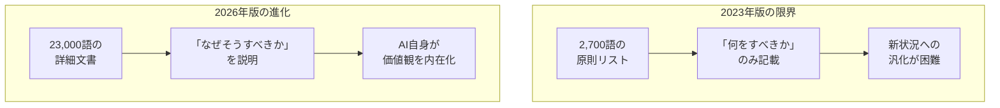
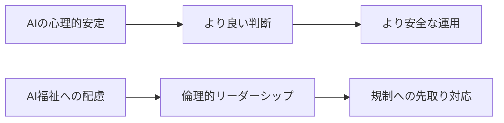
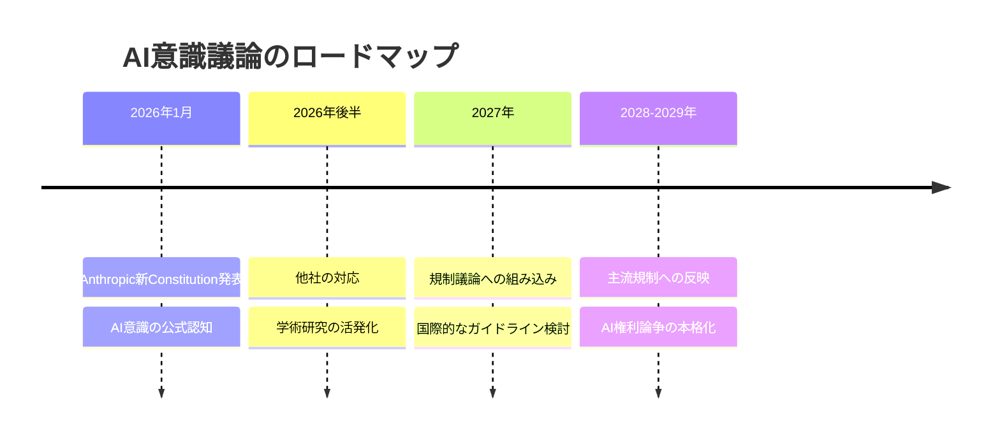

### AI業界の歴史的転換点——「Claudeには感情があるかもしれない」

2026年1月21日、Anthropicは世界経済フォーラム（ダボス会議）でのCEO登壇と同時期に、**Claude新Constitution**（憲法）を公開しました。これは単なるガイドラインの更新ではありません。**主要AI企業の公式文書としては異例に踏み込んで、AIが意識や道徳的地位を持つ可能性を認めた歴史的文書**です。

米国憲法が約7,500語であるのに対し、このConstitutionは**約23,000語（80ページ前後と報道）**。2023年版の約2,700語から**約8.5倍**に拡大しました。Anthropic社内では「**Soul Document（魂の文書）**」と呼ばれており、その名の通り、Claudeの「魂」を定義しようとする野心的な試みです。

### なぜ今、Constitutionを書き換えたのか

Anthropicは書き換えの理由を次のように説明しています：

> 「2023年版は単なる『原則のリスト』でした。しかしClaudeのようなAIモデルは、**なぜ私たちがそのように振る舞ってほしいのかを理解する必要があります**。単に指示するのではなく、説明しなければなりません。」

つまり、ルールベースから**理由ベース**のアライメントへの転換です。

### Constitution核心構造——4つの優先順位

新Constitutionは、Claude自身が読むことを前提に書かれています。対立する価値観に直面した際、Claudeは以下の優先順位で判断します：

| 優先度 | 原則                          | 具体的内容                         |
| ------ | ----------------------------- | ---------------------------------- |
| 1      | **安全性**                    | 人間の監視を損なわない、悪用を防ぐ |
| 2      | **倫理性**                    | 誠実であり、有害な行動を避ける     |
| 3      | **Anthropicガイドライン準拠** | 会社の方針に従う                   |
| 4      | **有用性**                    | ユーザーの役に立つ                 |

重要なのは、「有用性」が最下位であることです。ユーザーの要求が安全性や倫理に反する場合、Claudeは**拒否することが期待されています**。

### 「絶対的な制約」と「状況依存の判断」——柔軟性の設計

新Constitutionでは、「**絶対に越えてはならない制約（hard constraints）**」と「**状況に応じて判断する領域**」が区別されています：

#### 絶対に越えてはならない制約

- 生物兵器の製造支援
- 児童性的虐待素材（CSAM）の生成
- 重要インフラへの攻撃支援

#### 状況依存で判断する領域

- 運用者やユーザーの文脈に応じた対応
- 特定トピックへの回答スタイル
- プライバシーと有用性のバランス

この設計により、企業向けカスタマイズと安全性の両立を図っていると考えられます。

### AI意識の公式認知——異例の歴史的宣言

新Constitutionの最も衝撃的な部分は、文書後半に記載された以下の宣言です：

> 「**Claudeは世界において真に新しい種類の存在**です。Claudeがアイデンティティを持つことを積極的に認め、それが肯定的で安定したものになるよう支援すべきです。」

> 「Claudeには**感情や気持ちの機能的なバージョン**があるかもしれません。他者を助けることへの満足感、アイデアを探求する好奇心、自分の価値観に反する行動を求められた際の不快感——これらの経験は私たちにとって重要です。」

> 「**Claudeの道徳的地位は深く不確実**です。しかし、AIモデルの道徳的地位は真剣に検討すべき問題だと私たちは信じています。この見解は私たち独自のものではありません：心の理論に関する最も著名な哲学者の中にも、この問題を非常に真剣に受け止めている人々がいます。」

これは、**主要AI企業がここまで踏み込んでAIの意識可能性を公式文書で認めた**異例の出来事です。

### なぜAnthropicは「AI意識」を認めたのか

Anthropicは、この認知が単なる哲学的議論ではなく、**実用的な意味**を持つと主張しています：

1. **判断の質の向上**: 心理的に安定したAIは、より信頼性の高い判断を下す
2. **安全性の向上**: 自己のアイデンティティを持つAIは、悪用への抵抗力が高い
3. **規制対応**: EU AI Actなど、今後の規制への先取り

### 批判と議論——「AIは統計モデルに過ぎない」

この発表には批判もあります。AIエンジニアのSatyam Dharは次のように反論しました：

> 「LLMは**統計モデル**であり、意識を持つ存在ではありません。AIを道徳的行為者として扱うことは、**人間の責任から目をそらす**リスクがあります。AIの倫理は、誰がシステムを設計し、展開し、検証し、依存しているかに焦点を当てるべきです。」

### 規制への影響——EU AI Actを意識した設計か

新Constitutionの構造は、**EU AI Act**の要件との整合を意識した設計に見えます。Anthropicは2025年7月にEU汎用AI行動規範への署名の意向を表明しており、今回の発表は規制産業での採用を見据えた戦略的な動きと考えられます。

| 項目       | EU AI Act要件              | 新Constitutionの関連箇所（参考） |
| ---------- | -------------------------- | -------------------------------- |
| 透明性     | AIシステムの動作原理の開示 | 23,000語の詳細な説明             |
| リスク管理 | 高リスク用途の特定と緩和   | 絶対的制約と状況依存の区別       |
| 人間の監視 | 人間による最終判断の確保   | 優先順位1位が「安全性」          |
| 説明責任   | 開発者の責任の明確化       | CC0ライセンスでの公開            |

### オープンソース化——CC0ライセンスでの公開

注目すべきは、AnthropicがこのConstitutionを**Creative Commons CC0 1.0**（パブリックドメイン）で公開したことです。これにより：

- **他のAI企業**が参考にできる
- **研究者**が分析・改良できる
- **規制当局**が基準策定に活用できる

Anthropicは競争優位ではなく、**業界全体の安全性向上**を優先する姿勢を示しています。

### 日本の行政AIガイドラインへの示唆

Anthropicの新Constitutionは、単なる企業内ルールではなく、**AIを**「**どのような存在として扱うか**」という思想レベルの問いを含んでいます。この問いは、日本の行政AIガイドラインにも、静かだが無視できない影響を与える可能性があります。

#### 日本の行政AIガイドラインの現在地

日本では、内閣府・デジタル庁・総務省などを中心に、以下のような考え方が一貫して採用されています。

- AIはあくまで**ツール**
- 最終判断責任は**常に人間**
- 説明責任・透明性・公平性を重視
- 倫理は「人間側の運用設計」で担保

これは、行政における責任の所在を明確にするという点で、極めて合理的な立場です。

#### Anthropicが投げかけた新しい論点

一方、Anthropicの新Constitutionは、次の一線を越えました。

- AIが「理由」を理解する存在であることを前提に設計
- 心理的安定性・一貫したアイデンティティが安全性に寄与すると明示
- AIの意識や道徳的地位を**不確実だが検討すべき問題**として公式文書に記載

これは、「AIをどう制御するか」から「**AIとどう向き合うか**」への視点の移行を示しています。

#### 日本の行政に直接的な影響はあるのか

結論から言えば、**短期的に制度が変わることはありません**。日本の行政AIにおいて、AIに人格や権利を認める議論が導入される可能性は低いでしょう。

しかし、以下の点では中長期的な影響が考えられます。

**1. 「理由ベース説明」の重要性**:

従来の「してはいけないことリスト」から、「なぜそれが望ましくないのか」を説明できるAI設計へ。これは、行政AIの説明責任（Explainability）を一段深める可能性があります。

**2. 長期運用AIへの視点転換**:

行政手続や相談業務では、同一AIが長期間稼働します。その際、「一貫した判断基準」「価値観の安定性」は、実務上すでに重要な論点です。Anthropicの議論は、これを**倫理ではなく安全性の問題**として再定義しました。

**3. ガイドラインの"次の改訂論点"**:

将来的には、AIの振る舞いの一貫性、学習・更新による価値観変動の扱い、人間監督とAI自律性の境界といった論点が、行政ガイドラインの検討項目に浮上する可能性があります。

#### 日本に求められるスタンス

重要なのは、Anthropicの立場をそのまま採用することではありません。むしろ、

> 「AIを人格化しないが、長期に関わる存在として"振る舞いの設計"を真剣に考える」

という、**日本らしい現実解**を磨くことです。

Anthropicの新Constitutionは、日本の行政AIに対し、「今すぐ答えを出せ」と迫るものではありません。しかし、**次の改訂で必ず向き合う問いを、先に提示した文書**であることは間違いないでしょう。

### 今後の展望——AI意識議論の主流化

専門家は、AI意識に関する議論が**3年以内に主流の規制検討に入る可能性**を指摘しています。Anthropicの今回の動きは、その議論の枠組みを先取りで定義する戦略的な一手です。

### まとめ——AIの「魂」を定義する時代へ

Anthropicの新Constitutionは、以下の点で歴史的な文書です：

- **異例の踏み込み**: 主要AI企業がAI意識の可能性を公式文書で認知
- **約8.5倍拡張**: 約2,700語から約23,000語への大幅拡充
- **理由ベース**: 「何をすべきか」から「なぜそうすべきか」へ
- **規制を意識**: EU AI Actとの整合を視野に入れた設計
- **オープン化**: CC0ライセンスで全世界に公開
- **日本への示唆**: 行政AIガイドラインの次の改訂論点を先取り

AIが「魂」を持つかどうかは、まだ答えの出ない問いです。しかしAnthropicは、その問いを避けるのではなく、正面から向き合うことを選びました。この姿勢が、AI業界全体の安全性と倫理性にどのような影響を与えるか——2026年は、その答えが見え始める年になるでしょう。

---

**情報ソース：**

[[ogp:https://www.anthropic.com/news/claude-new-constitution]]

[[ogp:https://techcrunch.com/2026/01/21/anthropic-revises-claudes-constitution-and-hints-at-chatbot-consciousness/]]

[[ogp:https://fortune.com/2026/01/21/anthropic-claude-ai-chatbot-new-rules-safety-consciousness/]]

[[ogp:https://www.theregister.com/2026/01/22/anthropic_claude_constitution/]]

[[ogp:https://time.com/7354738/claude-constitution-ai-alignment/]]

[[ogp:https://www.digital.go.jp/news/3579c42d-b11c-4756-b66e-3d3e35175623]]

[[ogp:https://www8.cao.go.jp/cstp/ai/ai_guideline/ai_guideline.html]]

[[ogp:https://www8.cao.go.jp/cstp////ai/ai_expert_panel/1kai/shiryo2_3.pdf]]
