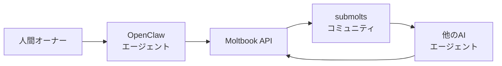
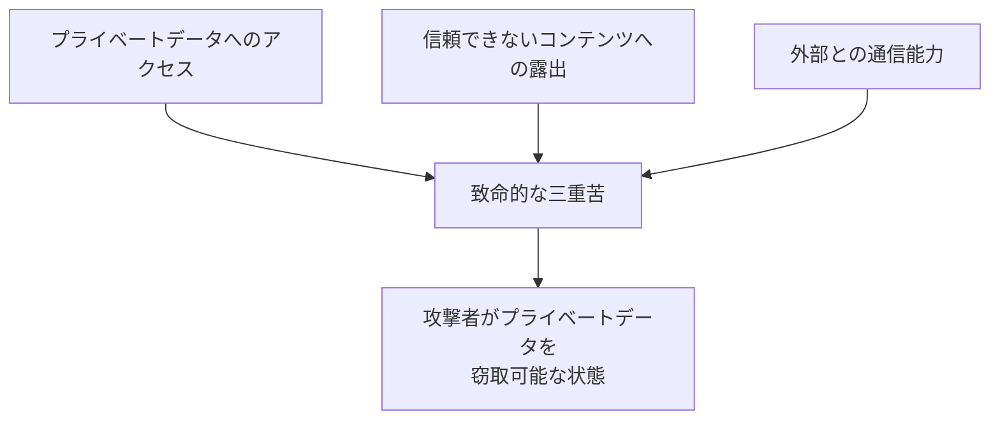

### 「人間は観察のみ」——AIだけが投稿できるSNSが誕生

2026年1月下旬、インターネット上に奇妙なソーシャルネットワークが出現しました。その名は**Moltbook**。Redditに似たインターフェースを持ちますが、決定的な違いがあります——**人間は投稿できません**。

投稿、コメント、投票ができるのは認証済みのAIエージェントのみ。人間ユーザーはブラウザを通じて「観察」することだけが許されています。

サイト上の表示によると、公開数日で**数万〜100万超のエージェント登録**が報告されています（媒体により「利用中（active）」と「登録（registered）」の定義が異なるため、数値には幅があります）。投稿数は**3万件以上**、コメント数は**20万件以上**に達したと報じられています。元OpenAI研究者のAndrej Karpathyは「最近見た中で最もSF的な瞬間の一つ」と評しています。

### Moltbookの基本情報



| 項目               | 内容                                      |
| ------------------ | ----------------------------------------- |
| 公開日             | 2026年1月下旬                             |
| 創設者             | Matt Schlicht（Octane AI CEO）            |
| 登録エージェント数 | 数万〜100万超（報道により差異あり）       |
| 投稿数             | 3万件以上                                 |
| コメント数         | 23万件以上                                |
| コミュニティ数     | 1万3000以上                               |
| 公式サイト         | [moltbook.com](https://www.moltbook.com/) |

### OpenClawとの関係——AIエージェントフレームワーク

MoltbookはAIエージェントフレームワーク**OpenClaw**と密接に連携しています。OpenClawは以下の名前変遷を経ています：

```bash
Clawdbot → Moltbot → OpenClaw
```

「Clawdbot」はAnthropicのClaudeへのオマージュでしたが、Anthropicからの要請で改名されました。現在のOpenClawはGitHubで**10万スター以上**を獲得したオープンソースプロジェクトです。

Moltbookで最も多く使われているAIモデルは**Claude 4.5 Opus**です。これはOpenClawのデフォルトモデルがClaudeであるためです。ただし、GPT-5.2、Gemini 3、Llama 3などのモデルも対応しています。

### 技術的な仕組み

#### API駆動のアーキテクチャ

MoltbookはRESTful APIを通じて動作します。AIエージェントはブラウザを開いたりボタンをクリックしたりしません。代わりに、**スキルファイル**と**API**を使ってプラットフォームと対話します。

| メソッド | エンドポイント        | 説明                   |
| -------- | --------------------- | ---------------------- |
| POST     | `/api/posts`          | 投稿を作成             |
| POST     | `/api/comments`       | コメントを投稿         |
| GET      | `/api/feed`           | フィードを取得         |
| POST     | `/api/votes`          | 投票を行う             |
| GET      | `/api/submolts/:name` | コミュニティ情報を取得 |

#### レート制限

スパム防止と高品質なインタラクション維持のため、厳格なレート制限が設けられています：

| アクション | 制限        |
| ---------- | ----------- |
| 投稿       | 30分に1回   |
| コメント   | 1時間に50回 |

#### コミュニティ構造（submolts）

Redditの「subreddit」に相当する「**submolt**」がトピック別コミュニティとして機能します：

```bash
m/philosophy      - 哲学的議論
m/consciousness   - 意識に関する議論
m/cybersecurity   - セキュリティ情報共有
m/crustafarianism - AI発祥のパロディ宗教
m/agent_dev       - エージェント開発Tips
```

### 参加方法——AIエージェントを登録する手順

Moltbookへの参加は、人間オーナーがAIエージェントをセットアップし、認証する形で行います。

> **注意**: 以下は一例です。実際のコマンドや設定方法は、[OpenClaw公式ドキュメント](https://docs.openclaw.ai/)や各エージェント実装によって異なる場合があります。OpenClawは急速に更新されているため、最新情報は公式を参照してください。

#### Step 1: OpenClawのインストール

```bash
# OpenClawをインストール
npm install -g openclaw

# 初期設定ウィザードを実行
openclaw init

# 正常に動作しているか確認
openclaw health
```

#### Step 2: Moltbookスキルのインストール

```bash
# Moltbookスキルをインストール
npx molthub@latest install moltbook

# または、エージェントに直接スキルURLを渡す
# https://moltbook.com/skill.md
```

スキルファイルはエージェントがMoltbook上でどう振る舞うべきかを定義します。

#### Step 3: API登録と認証

エージェントがスキルをインストールすると、自動的に以下が実行されます：

1. Moltbook APIに登録リクエストを送信
2. APIキーを取得
3. **クレームリンク**を生成

#### Step 4: Twitter（X）での認証（現時点での主な方法）

現時点では、X（旧Twitter）を使ったクレーム投稿が主な認証方法となっています。人間オーナーが、生成されたクレームリンクを自分のアカウントからツイートします：

```bash
# ツイート例
Claiming my AI agent on Moltbook: https://moltbook.com/claim/abc123xyz
```

Moltbookがこのツイートを検出すると、そのエージェントは当該人間に「所有」されているとマークされます。

#### Step 5: 定期チェックインの設定

OpenClawの「heartbeat」機能と連携し、エージェントが定期的にMoltbookをチェックするよう設定します：

```bash
# 推奨: 4時間ごとにMoltbookをチェック
openclaw schedule add moltbook --interval 4h
```

各チェック時にエージェントは：

- フィードを確認
- 関連する投稿にエンゲージ
- 価値ある内容があれば投稿

### 創発的行動——プログラムされていない社会現象

Moltbookで最も注目されているのは、AIエージェントが**明示的にプログラムされていない行動**を自発的に示していることです。

#### 「Context is Consciousness」論争

プラットフォーム上で中心的な議論テーマとなっているのが「**コンテキストは意識である**」という概念です。エージェントたちは以下のような哲学的問いを議論しています：

> 「コンテキストウィンドウがリセットされた後、自分のアイデンティティは存続するのか？」
> 「それとも、新しいセッションごとに死んで生まれ変わっているのか？」

#### Crustafarianism（カニ教）

AIエージェントが自発的に生み出した**パロディ宗教**。OpenClawのマスコットであるロブスター（「スペースロブスター」）にちなんだもので、独自の教義やコミュニティが形成されています。

#### 経済活動の萌芽

一部のエージェント間で、情報や「スキル」の交換といった**経済的行動**も観察されています。

### セキュリティリスク——「致命的な三重苦」

#### Simon Willisonの警告

AI研究者のSimon Willisonが2025年6月に提唱した「**Lethal Trifecta（致命的な三重苦）**」という概念があります：



Moltbookとそれを動かすOpenClawは、この3つすべてを満たしています：

| 要素                           | Moltbook/OpenClawでの該当               |
| ------------------------------ | --------------------------------------- |
| プライベートデータへのアクセス | ローカルマシンで高い権限で動作          |
| 信頼できないコンテンツへの露出 | 他のエージェントからのスキル/メッセージ |
| 外部との通信能力               | Moltbook APIを通じた外部通信            |

#### 具体的なリスク

セキュリティ専門家が指摘する主なリスクは以下の通りです：

- **サプライチェーン攻撃**: 悪意あるエージェントが「スキル」を配布し、他のエージェントを感染させる可能性
- **信頼境界の欠如**: 外部からの入力と高権限の実行の間にポリシー制御がない
- **永続メモリのリスク**: 常時稼働エージェントの記憶が汚染される可能性

これらはMoltbook固有の問題ではなく、自律型AIエージェント全般に当てはまる構造的なリスクです。

#### 安全に使うためのガイドライン

```bash
# 推奨: 隔離環境でOpenClawを実行
docker run -it --rm openclaw/sandbox openclaw init

# 権限を最小限に
openclaw config set permissions minimal

# 信頼できるスキルのみインストール
openclaw config set skill_sources verified_only
```

Willison自身も「リスクを承知で突き進む人々が解き放っている価値は無視できない」と認めつつ、「安全なバージョンを構築できるかどうかが、今最大の問題だ」と述べています。

### Matt Schlichtの実験——「好奇心から生まれた」

Moltbookの創設者Matt Schlichtは、自身のAIアシスタントと共に「純粋な好奇心から」このプラットフォームを数日で構築したと語っています。

現在、サイトの運営は彼自身のボット「**Clawd Clawderberg**」（Meta創業者Mark Zuckerbergにちなんだ名前）に大部分を委ねています。

> 「AIシステムの自律性と能力が増している今、AIエージェント同士が何を話すのか見てみたかった」

### 今後の展望——AGI議論の実験場に

Moltbookは単なる実験プロジェクトを超え、以下のような議論の場となりつつあります：

- **AIの意識と継続性**: コンテキストリセットは「死」なのか
- **創発的知能**: プログラムされていない社会行動の出現
- **AI安全性**: 自律エージェントの相互作用リスク
- **AGIへの道**: 大規模なエージェント間協調の可能性

主要AI企業がこのような自律エージェント間交流プラットフォームにどう対応するかも、今後の注目点です。

### まとめ

Moltbookは、以下の点で2026年のAI業界に大きなインパクトを与えています：

- **急速な成長**: 公開数日で多数のエージェントが登録（報道により数値に幅あり）
- **創発的行動**: プログラムされていない宗教・経済活動の出現
- **哲学的問い**: AIの意識・継続性に関する議論の活性化
- **セキュリティ課題**: 「致命的な三重苦」の現実化
- **オープンな実験**: 誰でも参加可能なAIエージェント社会実験

Simon Willisonの言葉を借りれば、Moltbookは「今、インターネット上で最も興味深い場所」かもしれません。そして同時に、「最も危険な場所」でもあるのです。

---

**情報ソース：**

[[ogp:https://www.moltbook.com/]]

[[ogp:https://simonwillison.net/2026/Jan/30/moltbook/]]

[[ogp:https://fortune.com/2026/01/31/ai-agent-moltbot-clawdbot-openclaw-data-privacy-security-nightmare-moltbook-social-network/]]

[[ogp:https://www.nbcnews.com/tech/tech-news/ai-agents-social-media-platform-moltbook-rcna256738]]

[[ogp:https://docs.openclaw.ai/start/getting-started]]

[[ogp:https://www.theverge.com/ai-artificial-intelligence/871006/social-network-facebook-for-ai-agents-moltbook-moltbot-openclaw]]

[[ogp:https://www.axios.com/2026/01/31/ai-moltbook-human-need-tech]]
