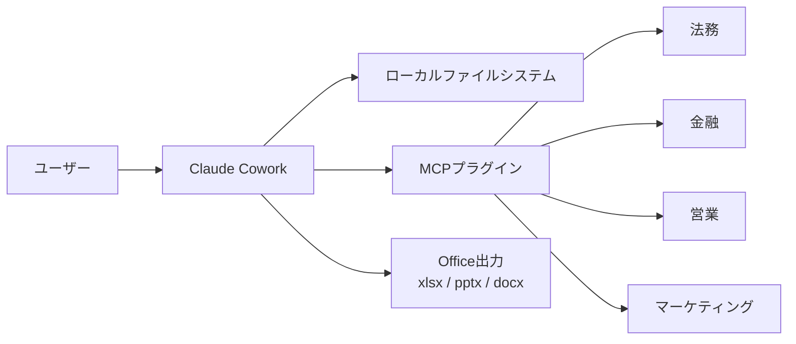
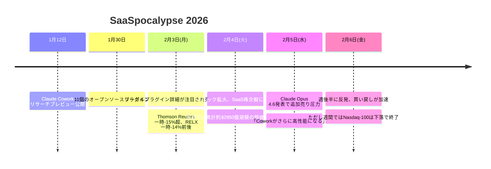

### 「SaaSpocalypse」——SaaS業界に黙示録が訪れた日

2026年2月3日（月）。ウォール街のトレーダーたちは、1月30日に公開されたClaude Coworkのプラグイン群が週末に一気に拡散し、その実力が精読されたことに戦慄した。Claude Coworkの新しいリーガルプラグインが、**NDAトリアージや契約レビューを大幅に自動化できる**と市場で受け止められたからだ。

開場と同時に売りが殺到した。Thomson Reutersは**一時15%超の急落**を記録し、RELX（LexisNexis親会社）、LegalZoom、FactSet——データ分析と専門リサーチで稼いできた企業群が軒並み急落。複数の報道によれば、関連セクター全体で**推計約2850億ドル（約43兆円）規模**の時価総額が失われたとされる。

市場ではこの出来事が「**SaaSpocalypse**」（SaaS＋Apocalypse＝SaaSの黙示録）と呼ばれるようになった。AIがモデル性能を競い合っていた段階から、**既存のソフトウェアビジネスを直接置き換える段階**に突入したことを示す歴史的なイベントだ。

### Claude Coworkとは何か

Claude Coworkは2026年1月12日にAnthropicがリサーチプレビューとして公開したAIエージェントツールだ。Claude Codeが開発者向けのエージェント体験を提供するのに対し、**Coworkはナレッジワーカー向け**に設計されている。

#### 基本的な仕組み

1. ユーザーがローカルフォルダへのアクセスを許可
2. タスクを自然言語で記述（例：「このNDA 50件を精査して、リスクレベル別に分類して」）
3. Claudeが計画を立て、ユーザーの承認後にマルチステップで自律実行
4. 作業中の進捗をリアルタイムで表示、途中で方向修正も可能

Coworkの特徴は**並列処理**だ。複雑なタスクでは複数のサブエージェントが同時に稼働し、Excelの数式付きスプレッドシートやPowerPointプレゼンテーションなど、**実務で即使える成果物**を生成する。

### 震源地：11個のオープンソースプラグイン

1月30日、Anthropicは[knowledge-work-plugins](https://github.com/anthropics/knowledge-work-plugins)リポジトリを公開。11個のオープンソースプラグインがGitHubで誰でも利用可能になった。

| プラグイン             | 主な機能                                              |
| ---------------------- | ----------------------------------------------------- |
| **Productivity**       | タスク管理、カレンダー、ワークフロー自動化            |
| **Enterprise Search**  | 社内ツール横断の情報検索                              |
| **Marketing**          | コンテンツ作成、キャンペーン計画、ローンチ管理        |
| **Sales**              | 見込み客リサーチ、商談準備、営業プロセス管理          |
| **Finance**            | 財務データ分析、予測モデル構築、レポート作成          |
| **Legal**              | 契約レビュー、NDAトリアージ、コンプライアンスチェック |
| **Customer Support**   | サポートチケット処理、回答テンプレート生成            |
| **Product Management** | ロードマップ管理、競合分析、仕様書作成                |
| **Data**               | ダッシュボード連携、トレンド分析                      |
| **Biology Research**   | 論文解析、実験データ処理                              |
| **Personal Context**   | 個人の業務コンテキスト管理                            |

すべてのプラグインは**MCP（Model Context Protocol）** ベースで構築されている。MCPはAnthropicが策定したオープンスタンダードで、AIツールと外部システム間のセキュアな双方向接続を提供するプロトコルだ。

### リーガルプラグイン——なぜ市場はパニックに陥ったのか

11個のプラグインの中で、最も市場を動揺させたのが**リーガルプラグイン**だ。このプラグインは以下の機能を実装している。

#### 主要機能

- **契約条項レビュー**: 交渉プレイブックに基づき、条項ごとに🟢（承認）🟡（注意）🔴（拒否）の3段階で自動フラグ付け
- **NDAトリアージ**: 受信したNDAを「標準承認」「法務レビュー」「フルレビュー」に自動分類
- **ベンダー契約ステータス確認**: 契約状況の自動チェックとブリーフィング生成
- **テンプレート回答生成**: 法的問い合わせへの定型回答を自動作成

#### 市場の恐怖

Thomson Reutersのリーガルリサーチ事業、RELXのLexisNexis、LegalZoomの法務文書サービス——これらの企業は**高額な年間サブスクリプション**でデータアクセスと専門ワークフローを提供してきた。リーガルプラグインは、これらのサービスが提供する価値の相当部分を、**Claude月額$20のProプラン内で実現できる可能性**を示した。

### 報道が伝える約2850億ドル規模の暴落

#### 株価下落の詳細

| 企業名            | 事業内容                 | 下落率           | 特記事項                     |
| ----------------- | ------------------------ | ---------------- | ---------------------------- |
| Thomson Reuters   | 法務リサーチ・データ分析 | **一時-15%超**   | 報道により-16%〜-18%と幅あり |
| LegalZoom         | オンライン法務サービス   | **一時-20%近く** | 中小企業向け法務が直撃       |
| RELX (LexisNexis) | 学術・法務データベース   | **一時-14%前後** | 欧州市場にも波及             |
| FactSet Research  | 金融データ・分析         | **最大-10%超**   | 金融プラグインの影響         |
| Experian          | データ分析・信用情報     | **一時-9%前後**  | エンタープライズ分析懸念     |

#### タイムライン

### V字回復とその意味

2月6日（金）、週後半に入ると「売られすぎ」との見方から買い戻しが入り、一部銘柄は反発を見せた。ただしNasdaq-100は週間では下落で引けており、完全な回復には至っていない。

しかし、アナリストの見方は分かれている。

#### 楽観派の主張

- リーガルプラグインはまだリサーチプレビュー段階
- 実際の法務業務はAIだけでは完結しない（裁判所提出書類、クライアント対応など）
- Thomson Reutersなどは自社にもAI機能を組み込んでおり、共存可能

#### 悲観派の主張

- AIの進化スピードを考えると、1年後には大半の法務リサーチが自動化される
- SaaS企業の「データの堀（moat）」がMCPのオープンスタンダードで崩壊する
- **「AI防御力」を証明できない企業は投資家に見放される**

### SaaS業界への構造的インパクト

今回の出来事は、単なる株価の乱高下ではない。SaaS業界のビジネスモデルに対する根本的な問い直しだ。

#### 従来のSaaSモデル

#### AI時代のモデル崩壊リスク

投資家が今後注視するのは、各SaaS企業の「**AI防御力**」だ。具体的には以下の3つが問われる。

1. **独自データの不可代替性**: AIが代替できない独自データや分析を持っているか
2. **AIとの統合戦略**: 自社サービスにAIをどう組み込むか
3. **ワークフローの深さ**: 単なるデータ提供ではなく、業務プロセスにどれだけ深く組み込まれているか

### 日本企業への影響

SaaSpocalypseの波は日本のIT企業にも及んだ。TCS、Infosys、Wipro、HCL TechなどのインドIT大手が下落したように、**ITサービス・SaaS企業全般**が影響を受けた。

日本の法務テック企業やSaaSスタートアップにとっても、**MCPベースのAIエージェントが既存ワークフローをどこまで代替するか**は重要な経営課題になりつつある。

### まとめ

- **AnthropicのClaude Coworkプラグイン**（11個のオープンソース）が、法務・金融・営業のSaaS企業を直撃し、報道では**推計約2850億ドル規模の時価総額が消失**
- 「**SaaSpocalypse**」の呼称が市場で広まった。AIが「生産性向上ツール」から「既存ソフトウェアの置換エンジン」に変わった転換点
- **リーガルプラグイン**がNDAトリアージや契約レビューの大幅自動化を示唆し、Thomson Reuters（一時-15%超）やLegalZoom（一時-20%近く）が大幅下落
- すべてのプラグインは**MCP（Model Context Protocol）** ベースで、オープンスタンダードとして誰でもカスタムプラグインを構築可能
- 週後半には買い戻しで**急反発**したが、SaaS企業の「AI防御力」が今後の評価軸になるという構造的な変化は不可逆
- 日本のSaaS・ITサービス企業にとっても、AIエージェントとの共存戦略が喫緊の課題に

**情報ソース：**

[[ogp:https://claude.com/blog/cowork-research-preview]]

[[ogp:https://techcrunch.com/2026/01/30/anthropic-brings-agentic-plugins-to-cowork/]]

[[ogp:https://fortune.com/2026/02/06/anthropic-claude-opus-4-6-stock-selloff-new-upgrade/]]

[[ogp:https://www.cnbc.com/2026/02/06/ai-anthropic-tools-saas-software-stocks-selloff.html]]

[[ogp:https://techstartups.com/2026/02/05/anthropics-claude-plugins-spark-285-billion-software-stock-selloff-as-ai-targets-entire-saas-workflows/]]

[[ogp:https://www.bloomberg.com/news/articles/2026-02-03/legal-software-stocks-plunge-as-anthropic-releases-new-ai-tool]]

[[ogp:https://www.cnn.com/2026/02/04/investing/us-stocks-anthropic-software]]
