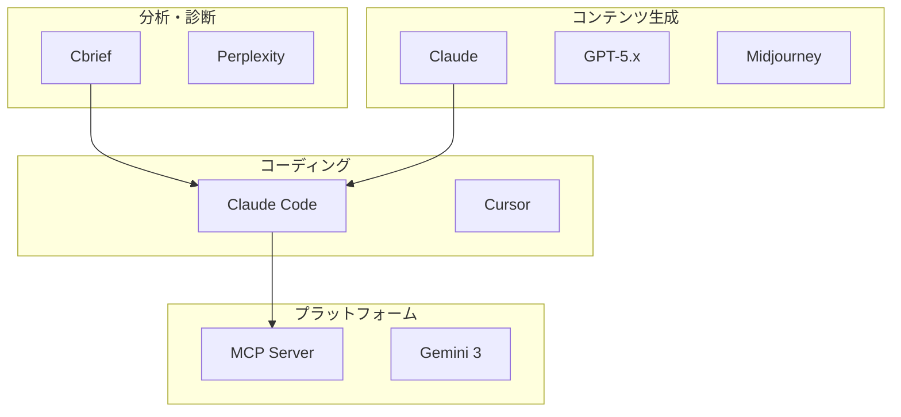
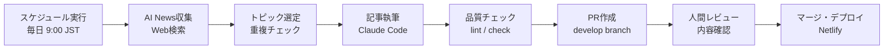
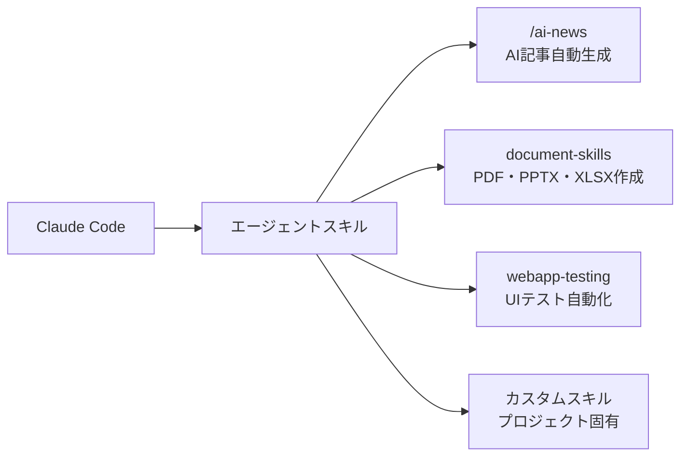

## AIエージェントで組織を変革する

#### 2026年の実践ガイド

AIはもはや「便利なツール」ではありません。2026年、AIは自律的にタスクを遂行する「エージェント」として、組織の中で人間と並んで働く存在になりました。この記事では、私自身の開発・運用経験に基づき、AIエージェントが組織にもたらす変革と、その具体的な活用方法を解説します。

---

### Introduction

#### 2026年、AIは「ツール」から「同僚」へ

<div class="center-container">
    
</div>

#### チャットからエージェントへ──1年半で変わったこと

2024年9月、私は「AIの力で組織を変革する」という記事を書きました。当時のAI活用は「チャットで質問する」「画像を生成する」が中心でした。プロンプトの書き方を工夫し、AIとの対話で業務を効率化する──それが最先端でした。

しかし2026年の今、状況は一変しています。

- **AIが自律的にコードを書き、テストし、PRを作成する**（Claude Code）
- **AIが契約書を分析し、リスクを分類し、レポートを生成する**（Claude Cowork）
- **AIが毎日ニュースを収集し、記事を執筆し、品質チェックまで行う**（自動生成パイプライン）
- **AIが複数のツールを横断して、マルチステップのタスクを完遂する**（MCP連携）

もはや「AIに質問する」のではなく、「AIに仕事を任せる」時代です。

#### このサイト自体がClaude Codeで構築されている

実は、今ご覧いただいているこのウェブサイト（tariki-code.tokyo）は、**Claude Codeを活用して構築・運用されています**。SvelteKitによるフロントエンド開発、テストの作成、リファクタリング、さらにはこの記事自体の執筆まで──開発プロセス全体にAIエージェントが組み込まれています。

これは概念的な話ではありません。実際に動いているシステムの話です。

---

### The Role of AI in Business 2026

<div class="center-container">
    
</div>

#### エージェント開発

2026年のAI活用で最も革新的な変化は、**AIエージェントによるソフトウェア開発**です。Claude Codeに代表されるコーディングエージェントは、単なるコード補完を超え、以下のような自律的な開発作業を行います。

- **ファイルの読み書き**: プロジェクト全体を理解した上でコードを生成・修正
- **テスト実行**: 書いたコードの動作を自動検証
- **Git操作**: ブランチ作成、コミット、PR作成まで一気通貫
- **マルチファイル変更**: アーキテクチャ全体を把握した上での横断的なリファクタリング
- **サブエージェント活用**: 複雑なタスクを分割し、並列に処理

#### コード品質診断

AI生成コードが急増する中、その品質と安全性をどう担保するかが新たな課題になっています。私が開発した**Cbrief（コードブリーフ）** は、この課題に対するソリューションです。

Cbriefは、静的解析（Semgrep/ESLint/Bandit）とLLMによる説明を組み合わせ、**非エンジニアでも理解できる業務言語**でコード診断レポートを生成します。「このコードは何をする？」「危なくない？」「直すならどこ？」──これらの問いに即座に答えます。（**自社開発**）

#### マルチモーダル活用

2026年のAIは、テキストだけでなく画像・音声・動画を横断的に処理します。

- **画像認識**: UIのスクリーンショットからコードを生成、設計図の解析
- **音声処理**: 会議の文字起こしから議事録・タスク自動生成
- **動画解析**: プレゼンテーション動画の要約、字幕生成

#### MCP連携による拡張

**MCP（Model Context Protocol）** は、Anthropicが策定したオープンスタンダードで、AIモデルと外部ツール・データソースを安全に接続するプロトコルです。MCPにより、AIエージェントは以下のような操作が可能になります。

- ファイルシステムの読み書き
- データベースへのクエリ
- 外部APIの呼び出し
- Slack、GitHub、Jiraなどのサービスとの連携

これにより、AIは「閉じた会話」から「開かれたエージェント」へと進化しました。

---

### AI Tools 2026

<div class="center-container">
    
</div>

#### AIツールエコシステム



#### ツール比較

```mermaid
architecture-beta

    group aitools[AITools]

    service openai(logos:openai-icon)[OpenAI] in aitools
    service copilot(logos:github-copilot)[GithubCopilot] in aitools
    service anthropic(logos:claude-icon)[Anthropic Claude] in aitools
    service gemini(vscode-icons:file-type-gemini)[Google Gemini] in aitools
    service midjourny(logos:midjourney)[Midjourny] in aitools
    service perplexity(logos:perplexity-icon)[Perplexity] in aitools
    service cursor(vscode-icons:file-type-cursorrules)[Cursor] in aitools

```



| ツール                                    | カテゴリ                 | 主な用途                 | 特徴                                                                                     |
| ----------------------------------------- | ------------------------ | ------------------------ | ---------------------------------------------------------------------------------------- |
| [Claude Code](https://claude.ai/code)     | コーディングエージェント | ソフトウェア開発全般     | 自律的なコード生成・テスト・デプロイ。MCP対応。CLAUDE.md/AGENTS.mdによるコンテキスト管理 |
| [Cursor](https://cursor.sh/)              | AIエディタ               | コード編集・補完         | VS Code互換のAIネイティブエディタ。コードベース全体を理解した補完                        |
| [Claude](https://claude.ai/)              | 汎用AI                   | 文章生成・分析・対話     | 長文コンテキスト対応、高い安全性設計、Artifacts機能                                      |
| [GPT-5.x](https://openai.com/)            | 汎用AI                   | 文章生成・推論・コード   | マルチモーダル対応、Webブラウジング、プラグインエコシステム                              |
| [Gemini 3](https://gemini.google.com/)    | 汎用AI                   | 検索連携・マルチモーダル | Google検索との深い統合、長大コンテキスト                                                 |
| [Perplexity](https://www.perplexity.ai/)  | AI検索                   | リサーチ・情報収集       | ソース付き回答、Pro Search機能                                                           |
| [Midjourney](https://www.midjourney.com/) | 画像生成                 | デザイン・マーケティング | 高品質画像生成、スタイル制御                                                             |

</div>
</div>
</div>

#### 2024年との違い

旧記事ではOpenAI ChatGPT、GitHub Copilot、Geminiが中心でした。2026年の大きな変化は以下の通りです。

- **Claude Code**の台頭──チャットベースのコード補完から、自律的なソフトウェア開発エージェントへ
- **MCP**の登場──AIが外部ツールと直接連携するオープンプロトコル
- **Claude Cowork**の衝撃──ナレッジワーカー向けエージェントがSaaS業界に構造変化

---

### UseCase：Claude Code活用

#### CLAUDE.mdとAGENTS.mdによるコンテキスト管理

Claude Codeの最大の強みの一つが、**プロジェクト固有のコンテキストをファイルで管理できる**点です。

このサイトでは、プロジェクトルートに`CLAUDE.md`を配置し、以下の情報を集約しています。

- リポジトリの構成とアーキテクチャ
- 開発コマンド（`npm run dev`, `npm run build`等）
- コーディング規約とテスト方針
- ブログ記事の追加手順
- テーマ管理の仕組み

Claude Codeはこのファイルを自動的に読み込み、プロジェクトの文脈を理解した上でコードを生成します。新しいメンバーに引き継ぎ資料を渡すのと同じ感覚で、AIにプロジェクトの知識を共有できるのです。

さらに、`AGENTS.md`という標準も台頭しています。これは複数のAIエージェントが同じリポジトリで協調作業するためのガイドラインで、コーディング規約、ブランチ戦略、コミットメッセージのフォーマットなどを定義します。

#### カスタムコマンド

Claude Codeでは、`.claude/commands/`ディレクトリにMarkdownファイルを配置することで、**プロジェクト固有のカスタムコマンド**を定義できます。

例えば、このサイトでは`/ai-news`コマンドを定義しており、以下のワークフローを1コマンドで実行します。

1. 過去7日間のAI/LLMニュースをWeb検索で調査
2. 既存記事との重複チェック
3. 最もインパクトの大きいトピックを選定
4. 記事構成の決定と執筆
5. フロントマッターの生成
6. 品質チェックリストの検証

コマンド定義はMarkdownファイルに記述するだけで、Gitにコミットしてチーム全体で共有できます。

```markdown
# /ai-news コマンドの定義例（.claude/commands/ai-news.md）

## Step 0: 日付と期間の確認

今日の日付をYYYY-MM-DD形式で取得し、検索対象期間を報告

## Step 1: Research Phase

最低3回のWebSearchで7日間のAI/LLMニュースを調査

## Step 2: Deep Dive

選定トピックについて2-3回の追加WebSearchで詳細調査
...
```

#### ヘッドレスモード・CI連携

Claude Codeは対話的な利用だけでなく、**ヘッドレスモード**でCI/CDパイプラインに組み込むことも可能です。

```bash
# GitHub ActionsでのClaude Code活用例
claude -p "このPRの変更をレビューし、セキュリティ上の懸念があれば報告してください" \
  --allowedTools Read,Grep,Glob \
  --max-turns 10
```

セキュリティのため、`--allowedTools`で使用可能なツールを制限し、`--max-turns`で最大ターン数を設定できます。これにより、自動化されたコードレビューや品質チェックを安全に実行できます。

#### jj（Jujutsu VCS）との組み合わせ

このプロジェクトでは、Gitの上位互換であるjj（Jujutsu）をバージョン管理に使用しています。jjはステージングエリアが不要で、変更が自動的にトラッキングされるため、Claude Codeとの相性が優れています。

```bash
jj new                              # 新しい変更を開始
# Claude Codeで開発作業...
jj describe -m "feat: new feature"  # コミットメッセージを設定
jj bookmark set develop             # developブックマークを更新
jj git push                         # GitHubにプッシュ
```

#### AI記事自動生成パイプライン

##### 構想から運用まで

このサイトのブログ記事の一部は、**AIによる自動生成パイプライン**で作成されています。GitHub Actionsのスケジュール実行とClaude Codeのカスタムコマンドを組み合わせることで、以下のフローを実現しています。



##### パイプラインの特徴

**完全自動ではなく、人間がレビューするフロー**を意図的に設計しています。

1. **情報収集**: 過去7日間のAI/LLMニュースを複数のWebSearchで調査
2. **重複排除**: 既存記事のトピックと重複しないよう自動チェック
3. **記事生成**: フロントマッター、見出し構造、比較表、OGPカード付きの記事を自動生成
4. **品質保証**: Markdownリント、型チェックを自動実行
5. **PR作成**: developブランチにPRを作成し、人間のレビューを待つ
6. **デプロイ**: レビュー後にマージすると、Netlifyが自動デプロイ

このパイプラインにより、最新のAIニュースを継続的にカバーしつつ、人間の判断によるファクトチェックと品質管理を維持しています。

---

### Possibilities of Agent Skills

<div class="center-container">
    
</div>

#### Agent Skills（エージェントスキル）とは

2026年のAIエージェントの最大の特徴は、**スキルを追加するだけで能力を拡張できる**点です。スマートフォンにアプリをインストールする感覚で、AIエージェントに新しい専門能力を持たせることができます。

例えば、このサイトの運用で実際に使っているスキルの一部を紹介します。



- **/ai-news**: AI/LLMの最新ニュースを自動収集し、記事を執筆・品質チェックまで行うカスタムスキル（**自作**──本サイト用に設計・実装）
- **document-skills**: PDF、PowerPoint、Excelなどのドキュメントを生成・編集するビルトインスキル群
- **webapp-testing**: Playwrightを使ったWebアプリのUIテストを自動化するスキル
- **カスタムスキル**: `.claude/commands/`にMarkdownファイルを配置するだけで、プロジェクト固有のスキルを定義可能

スキルの定義はMarkdownで書けるため、**プログラミング不要で専門知識をAIに注入できる**のが大きな利点です。チーム内でGitにコミットして共有すれば、全員が同じスキルを使えます。

#### スキルを支える仕組み──MCPとAGENTS.md

これらのスキルの裏側では、**MCP（Model Context Protocol）** というAnthropicが策定したオープンスタンダードが動いています。MCPはAIモデルと外部ツール・データソースを安全に接続するプロトコルで、ファイルシステムの操作、データベースへのクエリ、Slack・GitHub・Jiraとの連携などを統一されたインターフェースで実現します。

また、**AGENTS.md**という標準も広がっています。これはリポジトリにAIエージェント向けのガイドライン（コーディング規約、テスト方針、ブランチ戦略など）を配置するもので、CLAUDE.mdと合わせて「AIが自律的に働くための前提知識」を文書化します。

#### Claude Coworkの衝撃──スキルがSaaS業界を揺るがした日

スキルの威力を最も劇的に示したのが、2026年1月に発表された**Claude Cowork**です。Claude Codeが開発者向けのエージェントであるのに対し、Coworkは**ナレッジワーカー全般を対象としたエージェント**です。

Anthropicは法務、金融、営業、マーケティングなど**11のスキルプラグイン**をオープンソースで公開しました。特に法務スキル（NDAトリアージ、契約レビューの自動化）の衝撃は大きく、Thomson ReutersやLegalZoomなどの株価が急落。報道によれば関連セクター全体で推計約2850億ドル（約43兆円）規模の時価総額が失われ、「**SaaSpocalypse**」と呼ばれました。

これは、AIが「モデル性能の競争」から「スキルによる既存ビジネスの直接的な置き換え」の段階に入ったことを象徴する出来事です。組織にとっての問いは、「AIを使うかどうか」ではなく、**「どのスキルを装備するか」** に変わりました。

---

### AI risks and countermeasures 2026

#### ハルシネーション──進化と残る課題

2024年と比較して、AIのハルシネーション（事実に基づかない情報の生成）は大幅に改善されました。特にコーディングの領域では、テスト実行による自動検証が可能なため、問題が表面化しにくくなっています。

しかし、以下の領域では依然として注意が必要です。

- **最新情報**: トレーニングデータのカットオフ以降の情報は不正確な場合がある
- **専門知識**: 法務・医療などの高度な専門領域では事実確認が不可欠
- **数値データ**: 統計や財務データの正確性は常に検証が必要

#### プロンプトインジェクション──対策の進化

プロンプトインジェクション攻撃への対策も大きく進化しました。

- **入力サニタイゼーション**: DOMPurifyなどのライブラリによるHTMLサニタイズ
- **ツール制限**: `--allowedTools`オプションによる使用可能ツールの制限
- **サンドボックス実行**: コードの実行環境を隔離し、外部通信を遮断
- **SSRF保護**: DNS検証やリダイレクト制限によるサーバーサイドリクエストフォージェリの防止

このサイトでも、OGP取得APIにDNS検証やSSRF保護を実装しており、セキュリティを実践的に担保しています。

#### AI安全性の進展

Anthropicを中心に、AI安全性の取り組みも進んでいます。

- **Constitution AI**: AIの行動を憲法的な原則で制御するアプローチ
- **モデル評価手法**: RSP（Responsible Scaling Policy）に基づくリスク評価
- **Lockdown Mode**: 高リスク操作時に人間の承認を必須にする安全機構

一方で、AnthropicのAI安全性研究者が退職を表明し「世界は危機に瀕している」と警告するなど、**成長と安全のジレンマ**はAI業界全体の構造的課題として残っています。

#### コンプライアンス

AIに関する法規制も急速に整備されています。

- **EU AI Act**: EUにおけるAIの包括的な規制枠組み。高リスクAIシステムへの要件を定義
- **著作権**: AI学習データの著作権問題は各国で議論が継続中
- **利用規約**: 各AIサービスの利用規約は頻繁に更新されるため、定期的な確認が必要
- **個人情報保護**: AIへのデータ入力時には機密情報のマスク処理が重要

---

### AI Integration in Business Processes

<div class="center-container">
    
</div>

#### 5段階フレームワーク

AI導入のフレームワークは、基本的な5段階（戦略→選定→計画→実行→評価）を維持していますが、2026年のエージェント時代に合わせてアップデートが必要です。

##### 1. 戦略策定

AI導入の目的を明確にします。2026年では、単なる業務効率化だけでなく、**エージェントによる業務の自律化**を視野に入れた戦略が求められます。

- 「AIに質問する」→「AIに仕事を任せる」への転換
- エージェントが自律的に処理できる業務の特定
- 人間が判断すべきポイント（レビュー、承認）の設計

##### 2. ツール選定

2026年のツール選定では、以下の観点が重要になります。

- **MCP対応**: 外部ツールとの連携が容易か
- **エージェント機能**: 自律的なマルチステップ処理が可能か
- **セキュリティ**: データの保護、ツール使用の制限が可能か
- **コスト構造**: APIベースの従量課金か、サブスクリプションか

##### 3. 導入計画

小規模なパイロットプロジェクトから始めることは変わりませんが、**コンテキストファイル（CLAUDE.md / AGENTS.md）の整備**が成功の鍵になります。プロジェクトの知識をAIが理解できる形で文書化することが、エージェント活用の前提条件です。

##### 4. 実行

エージェントの実行時には、**人間のレビューポイント**を明確に設計します。完全自動化ではなく、重要な判断点では人間が介入する「Human-in-the-Loop」のアプローチが推奨されます。

##### 5. 評価

導入効果の測定に加え、**AIエージェントの出力品質**を継続的にモニタリングします。ハルシネーションの発生率、タスク完了率、人間の修正量などを定量的に追跡します。

#### コスト構造の変化

2024年と比較して、AI活用のコスト構造も大きく変化しています。

<div class="table-wrapper">
<div class="mdc-data-table" style="max-width: 90%">
<div class="mdc-data-table__table-container">

| 項目             | 2024年                     | 2026年                                 |
| ---------------- | -------------------------- | -------------------------------------- |
| モデル推論コスト | 高（GPT-4で$30/1M tokens） | 大幅低下（競争による価格破壊）         |
| 主な課金形態     | APIトークン従量課金        | サブスクリプション＋従量のハイブリッド |
| 開発者ツール     | GitHub Copilot月額$10〜    | Claude Code月額$20（Pro）〜            |
| エンタープライズ | カスタム契約のみ           | Team/Enterprise プランの充実           |

</div>
</div>
</div>

---

### Achievements and case studies

まず、私自身が実際に手がけたプロジェクトを紹介し、続いて世の中の先進事例を概観します。

#### 私の手がけたプロジェクト

##### Cbrief：非エンジニアでもAI生成コードの安全性を10分で判断できる「逆引きコード診断SaaS」

生成AIや外部委託で生まれたコードは、非エンジニア部門が品質・安全性を判断しにくく、リスクの見落としや意思決定の遅れが起きがちです。
そこで静的解析（Semgrep／ESLint／Bandit）による客観的検出と、LLMによる業務言語への翻訳を組み合わせ、根拠付きで「要約・リスク・修正案・次アクション」を一枚に整理。
結果として、技術者に依存せずに短時間で判断・着手できるレポート体験を実現しました。

[[ogp:https://cbrief.tariki-code.tokyo]]

##### LINE×OpenAIで実現する「AI＋人」ハイブリッド相談窓口の社会実装

孤立・孤独を感じやすい時期でも、相談窓口は人手や時間の制約で24時間切れ目なく寄り添うことが難しいという課題がありました。そこでLINEを入口に、OpenAI（GPT-4o-mini／Moderation）による一次傾聴と、緊急キーワード検知・面談予約・AI停止／利用制御・職員通知を組み込んだ安全設計の相談システムを構築し、Google Sheetsでログと運用管理まで一体化。AIが常時受け止めつつ必要時に人へ確実につなぐ導線を整え、地域NPOでも持続的に運用できる"切れ目のない支援"のモデルを具体化しました。

[[ogp:https://prtimes.jp/main/html/rd/p/000000039.000150655.html]]

##### AIニュース発信を仕組み化：Claudeコマンドで「過去7日間の最重要トピック」を自動記事化

AI業界の動向を追い続ける中で、速報性と独自性を両立した記事制作を継続することが課題でした。そこで、過去7日間のニュースを自動調査し、既存記事との重複チェック・OGP形式でのソース整理までを一気通貫で行うClaude用コマンドを設計。結果として、リサーチから執筆・品質確認までを標準化し、AIニュース発信を“再現可能なワークフロー”として運用できる体制を構築しました。

#### 世の中の先進事例

AIエージェントの導入は、業界・規模を問わず急速に広がっています。以下は、2025〜2026年に報告された注目すべき事例です。

##### Klarna──カスタマーサポートAIで700人分の業務を代替

スウェーデンのフィンテック企業Klarnaは、AIアシスタントを導入し、初月で**230万件のサポートチャット**を処理しました。平均解決時間は約11分から**2分未満**に短縮され、約700名のFTE（フルタイム換算）に相当する業務量をAIが担当。2024年にはAI効率化に起因する推定**4000万ドルの利益改善**を達成し、取引あたりコストも約40%削減されました。

##### IBM──27万人規模のエージェントAI導入

IBMは社内業務全般にエージェントAIを展開し、27万人の従業員を対象とした大規模導入を実施。推定**45億ドルの生産性向上**効果が報告され、例えば昇進処理などのマネジメント業務が平均**75%高速化**されました。

##### Altana──Claude Codeで開発速度2〜10倍

グローバルサプライチェーンのAI企業Altanaは、Claude Codeをエンジニアリングチーム全体に導入し、開発速度を**2〜10倍**に向上させました。特に、複雑なプロダクトに初めて触れるジュニア開発者が、統合タスクを**70%高速**に完了できるようになったと報告しています。

##### 野村総合研究所（NRI）──AI活用で利益率20%へ

日本の大手ITコンサルティング企業NRIは、開発業務へのAI活用を推進し、生産性向上によって外注費を大幅に削減。直近四半期の売上高営業利益率が**約20%に急上昇**しました。日本企業におけるAIエージェント活用の先行事例として注目されています。

##### ダイキン工業──工場設備診断AIで10秒以内に90%以上の精度

ダイキン工業は日立製作所と共同で、工場の設備故障診断を支援するAIエージェントを開発。従来は熟練技術者に依存していた故障原因の特定を、**10秒以内に90%以上の精度**で回答可能にしました。製造業における暗黙知のAI化の好例です。

#### 市場全体のトレンド

Gartnerの予測によると、2026年末までにエンタープライズアプリケーションの**40%**にタスク特化型AIエージェントが統合される見込みです（2025年時点では5%未満）。AIエージェント市場は年平均成長率**46.3%**で拡大しており、2025年の78.4億ドルから2030年には526.2億ドル規模に達すると予測されています。

---

### Services Offered

<div class="center-container">
    
</div>

#### 私が提供できるAIソリューション

AI技術の進化に伴い、提供サービスもアップデートしています。エージェント時代に対応した、実践的な支援を提供します。

#### AI導入戦略コンサルティング

組織の課題に合わせたAI導入計画の策定から、ツール選定、パイロットプロジェクトの設計・実行まで一貫して支援します。「AIに何ができるか」ではなく、「あなたの組織でAIをどう活かすか」に焦点を当てたコンサルティングです。

#### Cbrief（コード診断サービス）

AI生成・外部委託コードの品質を、非エンジニアでも理解できる業務言語でレポートします。静的解析×LLMの二重根拠により、セキュリティリスク、保守性、ライセンス問題を可視化します。

→ [Cbrief詳細はこちら](/service/cbrief)

#### AIエージェント導入支援

Claude Code、Claude Cowork、MCPサーバーなどのAIエージェントツールの導入を支援します。CLAUDE.md/AGENTS.mdの整備から、カスタムコマンドの設計、CI/CDパイプラインへの統合まで、実践的なノウハウを提供します。

#### カスタムMCPサーバー開発

組織固有のツールやデータソースとAIを接続するための、カスタムMCPサーバーの設計・開発を行います。社内データベース、業務アプリケーション、外部APIとの連携を実現します。

---

### Conclusion

#### AIエージェントと共に歩む未来

2024年の記事で「AIは今や未来の技術ではない」と書きました。2026年の今、その言葉はさらに深い意味を持っています。

AIはツールから同僚へ、チャットからエージェントへと進化しました。このサイトの構築・運用、Cbriefの開発、AI記事パイプラインの構築──これらすべてが、AIエージェントとの協働によって実現しています。

重要なのは、**AIを使うこと自体が目的ではない**ということです。AIエージェントは、あなたの組織が本来注力すべき仕事に集中するための手段です。定型業務の自動化、コード品質の担保、情報収集の効率化──これらをAIに任せることで、人間はより創造的で判断力を必要とする仕事に時間を使えるようになります。

AIエージェントの導入は、もはや「先進的な取り組み」ではなく、「組織の競争力を維持するための必須事項」になりつつあります。あなたの組織がAIエージェントと共に次のステージへ進むために、ぜひご相談ください。
