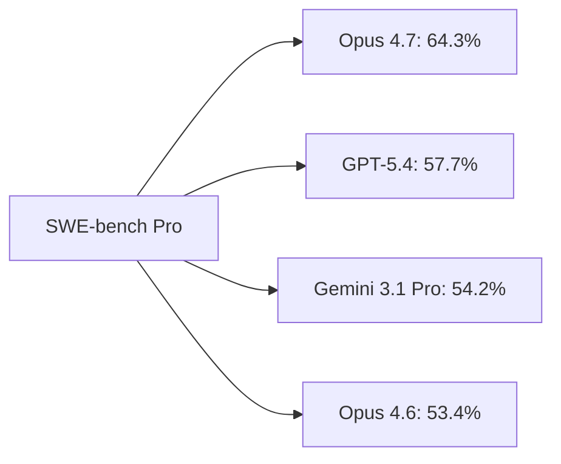
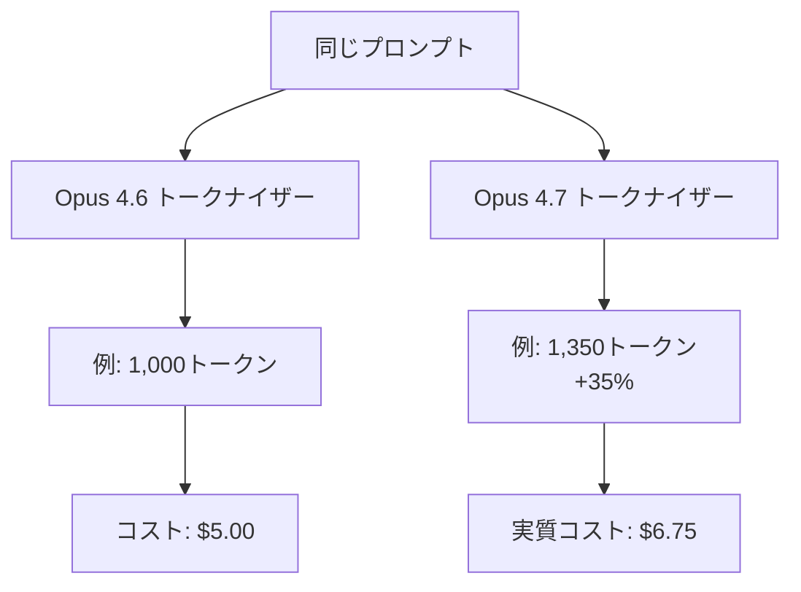

### はじめに

2026年4月16日、Anthropicは新フラッグシップLLM **Claude Opus 4.7** の一般提供を開始しました。OpenAIとGoogleに対抗する有力な一般提供モデルとして登場した本モデルは、**SWE-bench Proで64.3**%を記録し、公開された比較では最上位に位置づけられており、長時間エージェント性能でも明確な改善を打ち出しました。

Project Glasswing限定のClaude Mythosが公開されない中、Anthropicが「最も高性能な一般提供モデル」と位置づけるOpus 4.7。その実力と、価格据え置きの裏にある「新トークナイザー問題」を含めて検証します。

### 1. Claude Opus 4.7とは

#### 1.1 リリース概要

| 項目 | 内容 |
|---|---|
| 発表日 | 2026年4月16日 |
| 提供元 | Anthropic |
| 提供チャネル | Claude.ai、API、Amazon Bedrock、Vertex AI、Azure AI Foundry（Microsoft Foundry） |
| 価格 | 入力 $5 / 出力 $25（100万トークン、4.6から据え置き） |
| 特徴 | SWE-bench Pro首位、3.3倍の画像解像度、新「xhigh」推論レベル |

#### 1.2 何が新しいのか

Opus 4.7の注目点は4つです。

1. **SWE-bench Pro首位**：64.3%でGPT-5.4（57.7%）を7ポイント上回る
2. **新しいxhighエフォートレベル**：highとmaxの中間で、コーディング/エージェント推奨
3. **3.3倍の画像解像度**：長辺2,576ピクセル（約3.75MP）対応
4. **リテラル指示追従**：曖昧な指示の「行間を読む」のではなく、文字通り実行

### 2. ベンチマーク徹底比較

#### 2.1 コーディング領域

| ベンチマーク | Claude Opus 4.7 | GPT-5.4 | Gemini 3.1 Pro | Claude Opus 4.6 |
|---|---|---|---|---|
| SWE-bench Pro | **64.3%** | 57.7% | 54.2% | 53.4% |
| SWE-bench Verified | **87.6%** | - | 80.6% | 80.8% |

> **出典**：本記事の比較ベンチマーク数値（SWE-bench Pro/Verified、MCP-Atlas、GPQA Diamond等、本セクション以降の全ての他社比較を含む）は、Anthropic公式発表（[Introducing Claude Opus 4.7](https://www.anthropic.com/news/claude-opus-4-7)）およびThe Next Web・Vellum AIのベンチマーク解説記事に基づく。GPT-5.4やGemini 3.1 Proのスコアについては、Anthropicが公表した比較表を一次情報としており、各社の最新公式値・別環境での測定値とは差異が生じる場合があります。

前世代のOpus 4.6からSWE-bench Proで+**10.9ポイント**という非連続的な伸びを見せており、コーディング領域で明確な「もう一段」の進化が確認できます（※公開ベンチマークのスコア差分に基づく）。

#### 2.2 推論・汎用知能

| ベンチマーク | Opus 4.7 | GPT-5.4 Pro | Gemini 3.1 Pro |
|---|---|---|---|
| GPQA Diamond（大学院レベル推論） | 94.2% | 94.4% | 94.3% |

汎用推論スコアは**3モデルがほぼ同着**。Artificial Analysis Intelligence Indexでも各社57点前後にひしめいており、「純粋な推論力」では差がつきにくくなっているのが実情です。

#### 2.3 勝ち筋の違い

| モデル | 強い領域 | 弱点 |
|---|---|---|
| **Claude Opus 4.7** | コーディング・長時間エージェント・画像解像度 | 価格が最も高い |
| GPT-5.4 | 自律デスクトップ操作・ブラウザ自律操作に強みとされる | SWE-bench Proで差をつけられた |
| Gemini 3.1 Pro | 価格（$2/$12）・200万トークンコンテキスト | コーディングで3位 |

つまり、**「何をやらせたいか」で3モデルを使い分ける時代**が本格化したと言えます。

### 3. エージェント能力：ここが本当の主戦場

#### 3.1 数字で見る進化

- **多段階エージェント推論**：Opus 4.6比 **+14%**
- **ツール呼び出しの信頼性**：Anthropicが大幅な改善を打ち出している（エラー発生率の低減を主張）
- エージェント性能（MCP互換ツール利用を含む）で全般的な改善を強調しており、一部ベンチマークでは同社が首位と主張している

#### 3.2 なぜエージェントが重要か

2026年の企業向けAI活用は、単発のチャット応答ではなく「数時間〜1日稼働するエージェント」が中心になりつつあります。Anthropicは**マルチエージェント協調を数時間レベルで安定させた**ことを強調しており、これは以下のようなユースケースに直結します。

- コードベース全体のリファクタリング自動化
- 長時間のリサーチ＆レポート生成
- 複数ツールを跨ぐ業務ワークフロー
- CI/CDパイプラインと組み合わせたバグ修正エージェント

ツール呼び出しの信頼性改善は、**長時間走行での「詰まる確率」を下げる**方向の改善であり、実運用で効きやすい改善ポイントです。

### 4. 「価格据え置き」の落とし穴：新トークナイザー問題

#### 4.1 公式アナウンスでは $5/$25 据え置き

Anthropicは「価格はOpus 4.6と同じ」と発表しました。これは表面上は嬉しいニュースです。

#### 4.2 しかし実質値上げの可能性

Opus 4.7は**新しいトークナイザー**を採用しており、同じ入力テキストでも旧モデル比**最大35%多くのトークンに変換される**と報告されています。

つまり、**単価は据え置きでも実質リクエスト単位のコストは上がる可能性がある**。これは移行判断の際に必ず検証すべきポイントです。

| 観点 | 表面的な変化 | 実質的な変化 |
|---|---|---|
| 入力単価 | $5 → $5（変化なし） | トークン数+35%で実質+35%コスト増の可能性 |
| 出力単価 | $25 → $25（変化なし） | 同上 |
| 性能 | SWE-bench Pro +10.9pt | 実タスクで精度向上により試行回数削減の余地 |

**結論**：実運用ではA/Bテストで「性能向上 vs トークン増」の収支を見極める必要があります。

### 5. セキュリティ面の新機能

AnthropicはOpus 4.7に対して**新しいサイバーセーフガードを適用**したと発表しています。これはProject Glasswingで限定提供となっているClaude Mythosで本格展開する前に、新しい安全策を一般提供モデルであるOpus 4.7で先行テストするという位置づけです。

- 禁止されたサイバーセキュリティ用途（脆弱性悪用等）の要求検出を目的とする
- 高リスクと判定されたリクエストのブロックを行う
- Anthropicの「Responsible Scaling Policy」の一環として運用

### 6. Opus 4.6からの移行ガイド

#### 6.1 アップグレードすべきケース

- コーディング/エージェントタスクが中心
- 画像解像度が業務の質に直結する（医療画像、設計図など）
- 長時間ワークフローでツールエラーに悩んでいる
- `xhigh`エフォートで精度重視の処理を回したい

#### 6.2 様子見でよいケース

- 短い対話型チャットが主用途
- トークン数の増加がコストインパクト大の予算制約あり
- Opus 4.6で既に十分な精度が出ている単純タスク

#### 6.3 他モデルを選ぶべきケース

- **コスト最優先** → Gemini 3.1 Pro（$2/$12、2Mコンテキスト）
- **ブラウザ・デスクトップ自律操作** → GPT-5.4（自律デスクトップ操作に強みとされる）

### まとめ

- **Claude Opus 4.7は4月16日リリース**、Anthropicが「最も高性能な一般提供モデル」と位置づけるモデル
- **SWE-bench Proで64.3%**、GPT-5.4とGemini 3.1 Proを抑え同ベンチマークで首位
- **エージェント能力が+14%**、ツール呼び出しの信頼性も改善。長時間ワークフローで真価を発揮
- **価格は据え置き**だが、新トークナイザーにより**実質コストは最大35%増**の可能性
- **3モデル拮抗時代**突入：コーディング/長時間エージェントではClaude、コスト面ではGeminiが有力。GPT系は自律操作系で評価される場面がある
- Anthropicが**新しいサイバーセーフガードをOpus 4.7で適用**（Mythos本格展開前の先行テスト）

「1強」ではなく「3つの得意領域」で使い分ける時代の始まり。自社のユースケースに照らして、最適な組み合わせを設計するフェーズに入ったと言えるでしょう。

---

**情報ソース：**

[[ogp:https://www.anthropic.com/news/claude-opus-4-7]]

[[ogp:https://venturebeat.com/technology/anthropic-releases-claude-opus-4-7-narrowly-retaking-lead-for-most-powerful-generally-available-llm|https://images.ctfassets.net/jdtwqhzvc2n1/Seh68p8wVtjmUzumzSTB9/82e03ea5925ffe574098a259daef121f/Gemini_Generated_Image_a606wa606wa606wa.png|Anthropic releases Claude Opus 4.7, narrowly retaking lead for most powerful generally available LLMz|Opus 4.7 utilizes an updated tokenizer that improves text processing efficiency, though it can increase the token count of certain inputs by 1.0–1.35x.|Venturebeat]]

[[ogp:https://thenextweb.com/news/anthropic-claude-opus-4-7-coding-agentic-benchmarks-release]]

[[ogp:https://www.vellum.ai/blog/claude-opus-4-7-benchmarks-explained]]

[[ogp:https://www.finout.io/blog/claude-opus-4.7-pricing-the-real-cost-story-behind-the-unchanged-price-tag]]

[[ogp:https://aws.amazon.com/blogs/aws/introducing-anthropics-claude-opus-4-7-model-in-amazon-bedrock/]]
