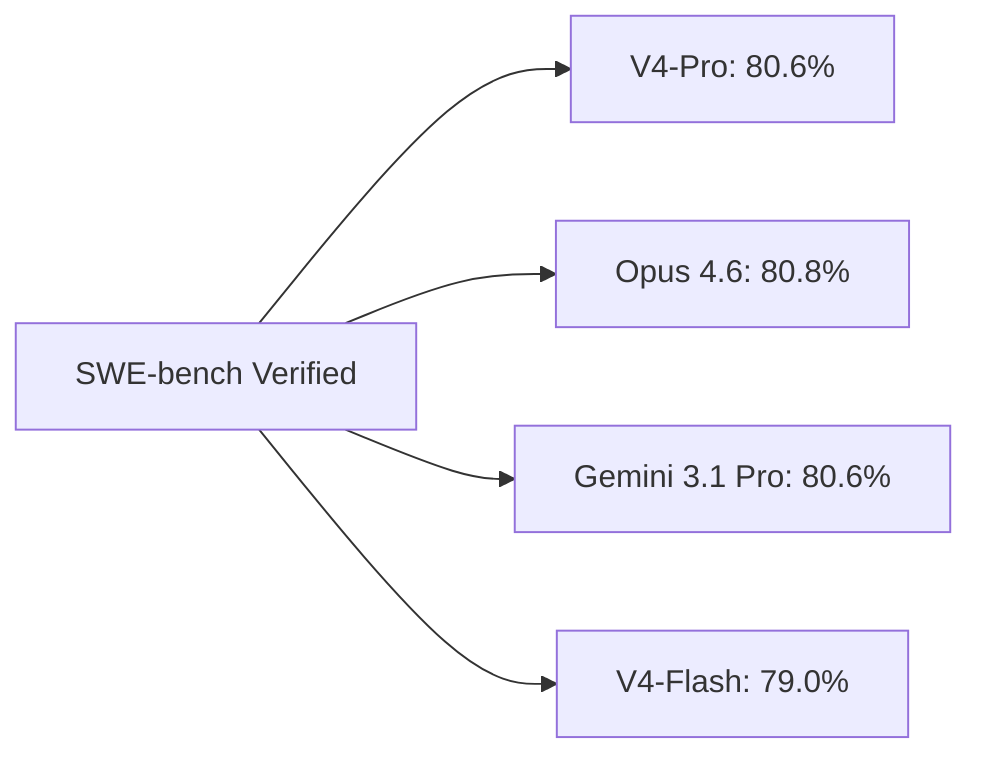
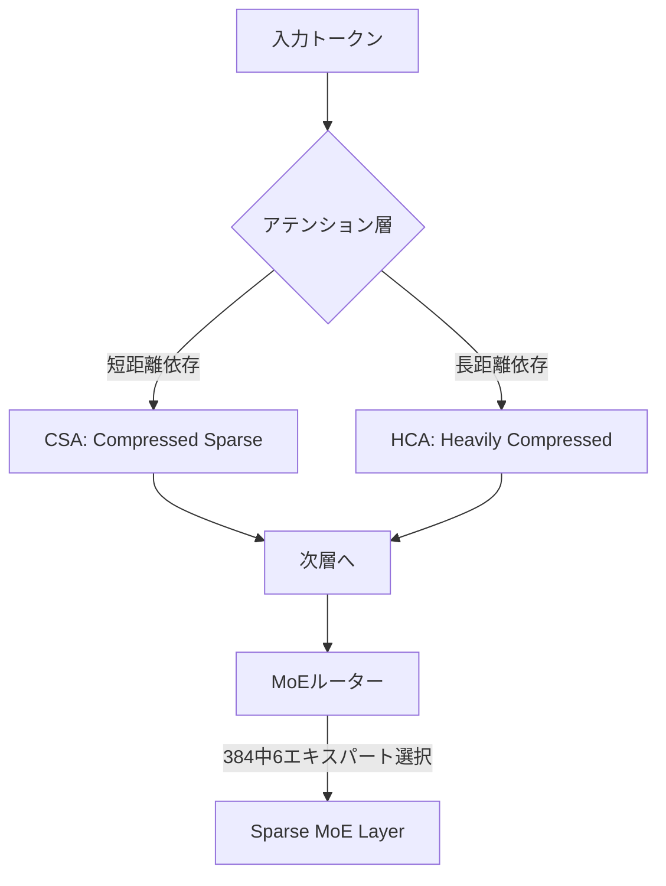

### はじめに

2026年4月24日、DeepSeekが新フラッグシップLLMファミリー **DeepSeek-V4-Pro** と **DeepSeek-V4-Flash** のプレビュー版を発表しました。1年前にシリコンバレーを震撼させた同社が、再び「オープン×低価格×フロンティア性能」の三拍子を武器に世界市場へ攻勢をかけています。

V4-Proは **1.6兆パラメータのMixture-of-Expertsアーキテクチャ** を採用し、SWE-bench Verifiedで **80.6%** ── DeepSeekのモデルカード比較表で示される Claude Opus 4.6（80.8%）や Gemini 3.1 Pro（80.6%）と **ほぼ同水準** のスコアを叩き出します。API定価は **入力$1.74 / 出力$3.48**（100万トークンあたり）── これでもClaude Opus 4.7（$5/$25）に対し入力で約2.9倍安・出力で約7.2倍安です。さらに **2026年5月5日 15:59 UTCまでは期間限定75%オフ** で提供されており、現在の請求価格は **入力$0.435 / 出力$0.87**。Opus 4.7との比較では **入力で約1/11.5、出力で約1/28.7** という驚異的な水準で、MITライセンスのオープンウェイトという点も含め、業界の価格構造を再び揺さぶる発表となりました。

### 1. DeepSeek V4とは

#### 1.1 リリース概要

| 項目 | 内容 |
|---|---|
| 発表日 | 2026年4月24日（プレビュー） |
| 提供元 | DeepSeek（中国・杭州） |
| 提供チャネル | DeepSeek API、Hugging Face（オープンウェイト）、chat.deepseek.com |
| ライセンス | MIT License（商用利用可・改変可・再配布可） |
| 価格（V4-Pro 定価） | 入力 $1.74（cache miss）/ 出力 $3.48（100万トークンあたり） |
| 価格（V4-Pro 現行） | 入力 $0.435 / 出力 $0.87 **※75%オフ、2026/5/5 15:59 UTCまで** |
| 価格（V4-Flash） | 入力 $0.14 / 出力 $0.28 |
| コンテキスト長 | 100万トークン（標準サポート） |

#### 1.2 V4ファミリーのラインナップ

DeepSeek V4は **2サイズ展開** で、用途に応じた使い分けが可能です。

| モデル | 総パラメータ | アクティブパラメータ | レイヤー数 | エキスパート数 | 学習トークン |
|---|---|---|---|---|---|
| **V4-Pro** | 1.6兆 | 49B | 61 | 384（6 active） | 32兆超（共通） |
| **V4-Flash** | 284B | 13B | 公式値未確認* | 256 | 32兆超（共通） |

> **数値の確度について**：
>
> - **学習トークン数**：DeepSeek公式の公開資料では「両モデルとも32兆トークン超で学習」とのみ言及。モデル別の正確な内訳は本稿執筆時点で公式確認できていないため、両者「32兆超」で揃えています。
> - **\*V4-Flashレイヤー数**：V4-Proの61層は技術レポート本文から確認できましたが、V4-Flashの層数は本稿執筆時点で公式モデルカード／レポートから直接確認できなかったため、断定を避けて「未確認」としています。Hugging Face リポジトリの `config.json` で正式値を確認可能です。

両モデルとも以下の機能を共有：

- **100万トークン**コンテキスト + **384K**最大出力
- **3段階の推論モード**：Non-think / Think High / Think Max（公式モデルカード表記）
- JSON出力、Tool Calling、FIM補完、Chat Prefix Completion
- FP4量子化対応学習で推論効率を大幅向上

### 2. ベンチマーク徹底比較

> **出典に関する注記**：以下のベンチマーク数値は、いずれも **DeepSeekが公表した技術レポート／モデルカード内の比較表** に依拠しています。独立第三者機関による検証結果ではないため、ベンダー有利な評価条件（プロンプト設計、推論モード、サンプリング、推論回数など）が含まれる可能性があります。Reutersも「ベンチマークの見出し数値を額面通り受け取るには慎重さが必要」と指摘しており、実運用では **自社ユースケースでの追試** を推奨します。

#### 2.1 コーディング領域：Claude Opus 4.6と互角の実力（DeepSeek公表値ベース）

| ベンチマーク | V4-Pro | Claude Opus 4.6 | GPT-5.4 | Gemini 3.1 Pro |
|---|---|---|---|---|
| SWE-bench Verified | **80.6%** | 80.8% | — | 80.6% |
| LiveCodeBench | **93.5%** | 88.8% | — | 91.7% |
| Codeforces Rating | **3,206** | — | 3,168 | — |
| Terminal-Bench 2.0 | **67.9%** | 65.4% | 75.1% | — |

**ポイント**：

- 競技プログラミング（LiveCodeBench、Codeforces）では **V4-PROがOpus 4.6を明確に上回る**
- SWE-bench Verifiedは **0.2ポイント差** とほぼ互角
- ただしターミナル系エージェントタスクは **GPT-5.4が依然優勢**（75.1% vs 67.9%）

#### 2.2 推論・知識領域：トップ層と僅差（DeepSeek公表値ベース）

| ベンチマーク | V4-Pro | Claude Opus 4.6 | GPT-5.4 | Gemini 3.1 Pro |
|---|---|---|---|---|
| GPQA Diamond | 90.1% | 91.3% | 93.0% | **94.3%** |
| MRCR @ 1M tokens | 83.5% | **92.9%** | — | 76.3% |

**観察**：

- **GPQA Diamondは僅差** だが、知識集約タスクでは依然プロプライエタリ勢が優位
- 100万トークンの長文検索（MRCR）は **Opus 4.6が頭一つ抜ける**：V4は128K超で精度が低下する弱点あり

### 3. アーキテクチャ革新：効率化の3本柱

#### 3.1 ハイブリッド・アテンション機構

V4は **CSA（Compressed Sparse Attention）** と **HCA（Heavily Compressed Attention）** の2種類を組み合わせたハイブリッド構造を採用。これにより、100万トークン文脈でのシングルトークン推論FLOPsを **V3.2の27%まで削減** しています。

#### 3.2 Muonオプティマイザの本格採用

DeepSeekは多くのパラメータについて **AdamWからMuon optimizerへ移行**。これは大規模MoEで安定収束させる近年の研究成果を取り入れたもので、より深いネットワークと長コンテキストでの安定性を支えます。

#### 3.3 FP4量子化対応学習（QAT）

ルーティング対象のエキスパート重みとインデクサのQuery/Keyパスを **FP4精度で量子化対応学習**。非エキスパート計算はFP8維持。これにより、推論時のメモリと帯域を大幅圧縮しながら精度を保ちます。

### 4. 効率比較：V3.2からの飛躍

100万トークン文脈での推論コストは劇的に改善されました。

| 指標 | V3.2比 V4-Pro | V3.2比 V4-Flash |
|---|---|---|
| FLOPs | **27%** | **10%** |
| KVキャッシュサイズ | **10%** | **7%** |

V4-Flashに至っては、V3.2比で **計算量1/10、メモリ1/14** という超効率モデルとなっており、エッジ／オンプレ運用での実用性を大きく押し上げます。

### 5. 価格破壊の威力

#### 5.1 100万トークンあたりのAPI価格比較（V4-Pro 75%オフキャンペーン中）

> **重要**：V4-Proは現在、2026/5/5 15:59 UTCまで **期間限定75%オフ** で提供されています。下表の「V4-Pro（プロモ価格）」が現在の請求価格、その下が定価です。

| モデル | 入力 | 出力 | 入力倍率（V4-Pro現行比） | 出力倍率（V4-Pro現行比） |
|---|---|---|---|---|
| **V4-Pro（プロモ価格）** | **$0.435** | **$0.87** | **基準** | **基準** |
| V4-Pro（定価） | $1.74 | $3.48 | 約4倍 | 約4倍 |
| **V4-Flash** | **$0.14** | **$0.28** | 約0.32倍 | 約0.32倍 |
| Claude Opus 4.7 | $5 | $25 | 約**11.5倍** | 約**28.7倍** |
| Claude Opus 4.6 | $5 | $25 | 約**11.5倍** | 約**28.7倍** |
| GPT-5.5 | $5 | $30 | 約11.5倍 | 約**34.5倍** |
| GPT-5.4 | $3 | $15 | 約6.9倍 | 約17.2倍 |

**インパクト**：SWE-bench Verifiedでほぼ同等のスコアを出すClaude Opus 4.6・4.7と比較して、プロモ適用時は **入力で約1/11.5、出力で約1/28.7** ── 出力1Mトークンあたり$24.13の差。定価ベースでも入力1/2.9・出力1/7.2の差がありますが、現キャンペーン期間中は出力側で **約29倍の価格差** という異常事態です。100万トークン処理を大量に行うエージェント／コーディング自動化ワークロードで、月間コストが **桁違い** に変わってきます。

> **注意**：プロモは2026年5月5日 15:59 UTCで終了予定です。プロダクション採用時は終了後の定価（$1.74 / $3.48）でROIが成立するかを必ず試算してください。

#### 5.2 Hugging Faceでオープンウェイト

両モデルともMITライセンスで以下から自由にダウンロード可能です：

- `deepseek-ai/DeepSeek-V4-Pro`
- `deepseek-ai/DeepSeek-V4-Flash`

オンプレミス／プライベートクラウドでの運用、独自ファインチューニング、再配布が **すべて許諾** されており、企業が「ベンダーロックインを避けながらフロンティア級性能を内製」する選択肢が現実的になりました。

### 6. Huawei Ascendとの密接な協業

V4のリリースと同時に、HuaweiはAscendチップによる **「フルサポート」** を表明（Reuters報）。資本提携や正式な戦略提携契約までは現時点で確認できていませんが、リリース当日からの密接な協業体制は明らかで、中国半導体エコシステムが、米国GPU（NVIDIA）への依存を減らしながらフロンティア級モデルを動かせる体制を構築している証左と言えます。

| 観点 | 影響 |
|---|---|
| 米中AI競争 | 中国側が「オープン戦略」で世界市場に切り込む |
| GPUサプライチェーン | NVIDIA H100/H200の代替候補としてAscendの存在感が増大 |
| 開発者選択肢 | プロプライエタリAPI vs オープン×低価格 vs ハイブリッドの3択時代へ |

### 7. 日本のエンジニアにとっての意味

#### 7.1 採用シナリオ別ガイド

| ユースケース | 推奨モデル | 理由 |
|---|---|---|
| 大量コード生成・自動化 | V4-Pro | LiveCodeBench 93.5%でOpus超え、出力コストは定価1/7・プロモ価格1/29 |
| ローカル／オンプレ運用 | V4-Flash | 13Bアクティブで現実的なGPU要件 |
| 長文ドキュメント検索 | Opus 4.6 / 4.7 | MRCR 1Mで圧倒的、V4は128K超で精度低下 |
| 複雑エージェントタスク | GPT-5.4 / Opus 4.7 | Terminal-Bench 2.0でV4を上回る |
| 知識集約QA | Gemini 3.1 Pro / GPT-5.4 | GPQA Diamond 93-94%帯 |

#### 7.2 価格センシティブな現場での切り替え

社内RAG、CIで動くコードレビューBot、自動テスト生成など、**「品質は十分、コストが効く」** タイプのワークロードでは、V4-Proへの切り替えだけで月額コスト数十%削減が見込めます。MITライセンスのため、機密データを外部APIに送らず自社環境で動かす設計も可能です。

### 8. V4の限界と注意点

DeepSeekは公式ドキュメントで以下の弱点を率直に開示しています：

1. **アーキテクチャ複雑性**：ハイブリッド・アテンション構造はチューニングが難しい
2. **超長文での精度低下**：128K超のMRCR精度は66%まで低下（1M時）
3. **モダリティ制約**：テキスト専用、画像・音声非対応
4. **エージェントタスクの不利**：Terminal-Benchなど一部でGPT-5.4に劣後
5. **知識集約タスク**：GPQAで上位陣に2-4ポイント差

「**コーディング・推論ヘビー、長文中程度、テキストオンリー**」のレンジでは最強コスパですが、マルチモーダルや超長文RAGはまだ既存トップ層が優位です。

### まとめ

- **DeepSeek-V4-Pro**は1.6兆パラメータMoE、49Bアクティブ、100万トークン文脈をMITライセンスで公開
- **SWE-bench Verified 80.6%** でClaude Opus 4.6（80.8%）と実質同等、**LiveCodeBench 93.5%** ではOpusを4.7ポイント上回る
- **API定価は入力$1.74 / 出力$3.48**（Opus 4.6/4.7に対し入力で約2.9倍安・出力で約7.2倍安）。**現在は2026/5/5 15:59 UTCまで75%オフキャンペーン中**で、請求価格は **入力$0.435 / 出力$0.87** ── Opus 4.7比で **入力約1/11.5、出力約1/28.7** という異常水準
- ハイブリッド・アテンション + Muonオプティマイザ + FP4量子化対応学習により、V3.2比で **FLOPs 27%、KVキャッシュ 10%** の超効率を実現
- HuaweiがAscendチップで「フルサポート」表明、米中AIインフラ分業の象徴的事例に
- 弱点は超長文検索・エージェント・知識集約タスク・マルチモーダル非対応 ── 用途別の使い分けが鍵

MITライセンスのオープンウェイトモデルが「最高レベル」と「最安レベル」を同時に攻めるという、2026年AI業界の新潮流を象徴する一手です。Claude Opus 4.7が一般提供モデルとして存在感を示した翌週に、そのコスト構造を揺さぶる選択肢が登場した ── そんな1週間でした。

**情報ソース：**

[[ogp:https://api-docs.deepseek.com/news/news260424]]

[[ogp:https://www.bloomberg.com/news/articles/2026-04-24/deepseek-unveils-newest-flagship-a-year-after-ai-breakthrough]]

[[ogp:https://huggingface.co/deepseek-ai/DeepSeek-V4-Pro]]

[[ogp:https://www.scmp.com/tech/big-tech/article/3351239/deepseek-releases-next-gen-ai-model-world-leading-efficiency]]

[[ogp:https://felloai.com/deepseek-v4/]]

[[ogp:https://www.buildfastwithai.com/blogs/deepseek-v4-pro-review-2026]]

[[ogp:https://techcrunch.com/2026/04/24/deepseek-previews-new-ai-model-that-closes-the-gap-with-frontier-models/]]

[[ogp:https://www.theregister.com/2026/04/24/deepseek_v4/]]
