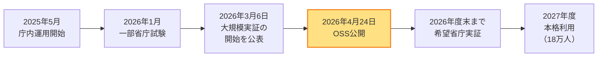
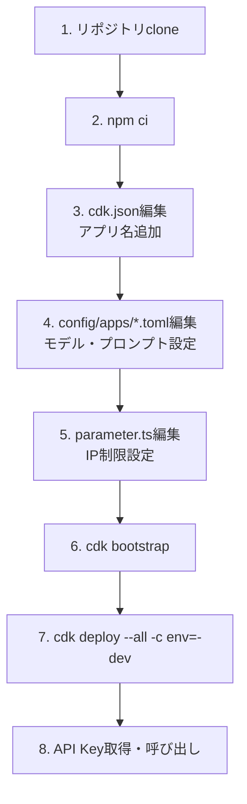

### はじめに

2026年4月24日、デジタル庁が政府向け生成AI利用環境 **「源内（GENAI）」** の主要コンポーネントをGitHub上にOSS公開しました。原則として **ソフトウェアは MIT License**、**ドキュメントは CC BY 4.0** が適用されており、商用利用も可能なライセンス構成です（ただし `genai-web` には一部 **Amazon Software License（ASL）対象ファイル** が含まれる点に注意 ── 詳細は4章参照）。政府が「隗より始めよ」の方針で進めてきたAI基盤の参照実装が、地方公共団体・民間企業を含む全プレイヤーに開放された格好です。

本記事では、源内プロジェクトの全体像、公開されたリポジトリの内容、本邦で先行する `aws-samples/generative-ai-use-cases-jp`（GenU）との差分、そして実際に **AWSアカウントへ Query Expansion RAG テンプレートをデプロイする手順** までを一気通貫で解説します。

### 1. 「源内」とは

#### 1.1 プロジェクトの位置付け

源内は、2025年5月成立の **「人工知能関連技術の研究開発及び活用の推進に関する法律」** および同年12月の **「人工知能基本計画」** に基づき、デジタル庁が構築する政府職員向け生成AI利活用基盤です。

| 項目             | 内容                                                        |
| ---------------- | ----------------------------------------------------------- |
| プロジェクト名   | 源内（GENAI）                                               |
| 主管             | デジタル庁                                                  |
| 利用想定         | 全府省庁約18万人の政府職員                                  |
| セキュリティ水準 | 政府統一基準準拠、機密性2情報を含むプロンプト入力に対応     |
| 開発主体         | デジタル庁（AWS Prototyping Programの初期実装を経て内製化） |

#### 1.2 展開ロードマップ



- **2025年5月**：デジタル庁内で運用開始
- **2026年1月**：一部省庁で試験的利用（数百人規模）
- **2026年3月6日**：大規模実証の開始を **公表**（実施は2026年5月頃から希望省庁向けに開始）。あわせて国内LLM公募結果も発表
- **2026年4月24日**：源内をOSSとして公開（**今回の発表**）
- **2026年5月～年度末**：希望省庁対象の大規模導入実証
- **2027年度**：本格利用開始

### 2. 政策的背景：なぜ政府が自らAI基盤を作るのか

源内は単なるベンダーOEMではなく、デジタル庁による **内製開発** が中核です。背景には3点の政策的意図があります：

1. **「隗より始めよ」**：日本政府自らが先導的にAIを活用する方針を示す
2. **重複開発の抑制**：地方公共団体や省庁ごとのバラバラな調達を防ぐ
3. **官民連携の促進**：民間の優れたソリューションや提案を取り入れるための「参照実装」共有

> 公式note記事（2026年4月24日）でも「民間の優れたソリューションや提案を積極的に取り入れる」「地方自治体での重複開発を防止し、社会全体の開発コストを削減する」という狙いが明示されています。

### 3. 公開された2つのリポジトリ

#### 3.1 リポジトリ構成

| リポジトリ       | 役割                                     | URL                          |
| ---------------- | ---------------------------------------- | ---------------------------- |
| **genai-web**    | 政府職員が直接使うWebアプリ／統合UI      | `digital-go-jp/genai-web`    |
| **genai-ai-api** | 行政実務向けAIアプリのマイクロサービス群 | `digital-go-jp/genai-ai-api` |

#### 3.2 genai-ai-api に含まれる3クラウド分の参照実装

`genai-ai-api` リポジトリには、3つのクラウド向けAIアプリ実装テンプレートが用意されています。

| ディレクトリ                   | クラウド        | 内容                                                               |
| ------------------------------ | --------------- | ------------------------------------------------------------------ |
| `aws/query-expansion-rag`      | AWS             | クエリ拡張型RAG開発テンプレート（Bedrock Knowledge Base + Lambda） |
| `azure/genai-azure`            | Microsoft Azure | LLMをセルフデプロイして利用する開発テンプレート                    |
| `google-cloud/lawsy-custom-bq` | Google Cloud    | 法律条文を参照する法制度AI実装                                     |

> 言語構成は **Python・TypeScript・Bicep・HCL** が中心（GitHub言語統計ベース、コミットにより変動あり）。AWS CDK（TypeScript）・Azure Bicep・Google Cloud Terraform（HCL）の **3系統IaCがすべて揃っている** マルチクラウド志向が明確に表れています。

#### 3.3 公開しないもの

公平性のため、デジタル庁は以下を **公開対象外** と明示しています：

- 内部マニュアル
- 権利を保有していない学習モデル
- 本番システムのログデータ

#### 3.4 コントリビュート方針：Issue 可・Pull Request 不可

OSS公開と聞くと「外部からのコード貢献を歓迎している」と読みがちですが、**源内のリポジトリ（`genai-ai-api` / `genai-web`）はその想定ではありません**。両リポジトリの README には以下の方針が明記されています：

| 種別 | 受付 |
|---|---|
| **Issue（致命的な問題の報告）** | ✅ 受付あり |
| **Pull Request（コード貢献）** | ❌ 受付なし |

つまり、**OSS公開の主目的は「参照実装としての共有」**（フォーク・改変・自社運用は自由）であり、本家リポジトリへの直接的な開発参加は想定されていません。重要なバグ・セキュリティ問題を見つけた場合は Issue で報告できますが、修正コードを送ってのマージは受け付けない、という政府OSSとしては慎重な運用方針です。

> **実務上の意味**：
>
> - **フォーク前提の利用が標準**：自社環境向けカスタマイズはフォークして独自に維持する
> - **アップストリーム取り込み戦略の検討**：本家のアップデートを定期的にフォーク先に取り込む運用設計が必要
> - **コミュニティドリブンOSSとは別カテゴリ**：Linux Kernel や React のような外部貢献ベースとは前提が異なる

### 4. ライセンス：原則MIT、ただし `genai-web` に一部ASL対象あり

#### 4.1 ライセンス構成（原則）

| 対象                 | ライセンス                                    | 商用利用              | 改変・再配布 |
| -------------------- | --------------------------------------------- | --------------------- | ------------ |
| ソフトウェア（原則） | **MIT License**                               | ✅ 可                 | ✅ 可        |
| ドキュメント         | **CC BY 4.0**（Creative Commons Attribution） | ✅ 可（要クレジット） | ✅ 可        |

#### 4.2 リポジトリ別の注意点

| リポジトリ     | ライセンス状況                                                                                                                                               |
| -------------- | ------------------------------------------------------------------------------------------------------------------------------------------------------------ |
| `genai-ai-api` | **すべてMIT**（コード）＋ **CC BY 4.0**（ドキュメント）                                                                                                      |
| `genai-web`    | **原則MIT** + **CC BY 4.0** だが、**一部のLambda・CDKファイルは AWS Prototyping Program 由来で Amazon Software License（ASL）対象** とREADME / LICENSEに明記 |

#### 4.3 ASL（Amazon Software License）の特徴と影響

ASLはOSI承認のオープンソースライセンスではなく、**AWS関連サービスでの利用に限定する条項を含む** 独自ライセンスです。`genai-web` をフォークして商用展開する場合、ASL対象ファイルの利用範囲が AWS 上に限定される可能性があるため、**該当ファイルを使う場合は LICENSE ファイルを必ず精読** してください。

> **実務上のガイドライン**：
>
> - `genai-ai-api` 単独（AWS RAG / Azure LLM / GCP法制度AI）の利用は MIT のみで完結 ── 商用展開で問題なし
> - `genai-web` をフォークする場合は、ASL対象ファイル一覧（LICENSE記載）を確認の上、必要に応じて該当ファイルを差し替えるか AWS 環境に限定して利用

民間企業がそのままフォークして社内システムに組み込むことも、SIベンダーが地方自治体向けにカスタマイズ提供することも、**原則として** ライセンス上問題ない設計ですが、`genai-web` 利用時は ASL 条項の確認を推奨します。

### 5. 源内 vs GenU：何が違うのか

AWS界隈で先行している `aws-samples/generative-ai-use-cases-jp`（GenU）とは設計思想が大きく異なります。

> **本章の出典について**：以下の比較は、**クラスメソッドが DevelopersIO で公開した分析記事**（「デジタル庁のガバメントAI『源内（GENAI）』がOSS化されたので、GenUとの差分を調べながらAWSアカウントにデプロイしてみた」）に依拠しています。デジタル庁による一次情報ではなく、第三者技術メディアによる **解釈・整理** であることに留意してください。

#### 5.1 削減された機能（汎用ユースケース）

比較によれば、源内はGenUにある以下の汎用機能を **意図的に省いて** いるとされています：

- 要約 / 執筆校正 / Webコンテンツ抽出
- 動画生成 / 音声チャット

これは「政府業務に必要な機能のみに絞る」というスコープ判断と推察されます（同記事の解釈）。

#### 5.2 強化された機能（組織運用・セキュリティ）

比較によれば、源内はGenU比で以下の組織運用・セキュリティ機能が強化されているとされています：

| カテゴリ             | 機能                                                           |
| -------------------- | -------------------------------------------------------------- |
| **チーム管理**       | RBAC（SystemAdmin / TeamAdmin / User）                         |
| **認証**             | SAML複数IdP対応                                                |
| **暗号化**           | KMS CMEK（Customer Managed Encryption Key） 全データ対応       |
| **データガバナンス** | データ保持期間（TTL）設定                                      |
| **コスト配分**       | Bedrock Inference Profiles                                     |
| **WAF**              | CloudFront用 + Regional WAF（API Gateway / Cognito User Pool） |
| **運用**             | メンテナンスモード機能                                         |

#### 5.3 アーキテクチャ思想の違い

分析では、両者のアーキテクチャ思想は以下のように整理されています：

| 観点           | GenU                                                             | 源内                                              |
| -------------- | ---------------------------------------------------------------- | ------------------------------------------------- |
| 基本路線       | AWSマネージドサービス中心（Bedrock Agents、Knowledge Base、MCP） | **REST APIベースの外部マイクロサービス**（ExApp） |
| マルチクラウド | AWSのみ                                                          | **AWS / Azure / Google Cloud** に対応             |
| 統合方法       | サービス連携                                                     | UI（genai-web）から複数クラウドのアプリを統一利用 |

同記事の解釈によれば、源内は「**ガバメントクラウド以外（Azure / GCP）にあるAIアプリも一つのUIで使えるようにする**」というマルチクラウド前提の設計とされています。

#### 5.4 技術スタック（Web UI比較）

比較表によれば、Web UI のフロント技術は以下のように整理されています：

| 項目           | 源内 Web                       | GenU v5.4.0       |
| -------------- | ------------------------------ | ----------------- |
| React          | **19**                         | 18                |
| Vite           | **8**                          | -                 |
| React Router   | **7**                          | 6                 |
| Zustand        | **5**                          | 4                 |
| TypeScript     | **6.x**                        | 5.x               |
| デザイン       | **デジタル庁デザインシステム** | 独自              |
| テスト         | **Vitest**                     | Jest              |
| フォーマッター | **Biome**                      | Prettier + ESLint |

同分析によれば、源内Webは **モダンスタックを大胆に採用** しており、フロントエンドは2026年時点の最新世代に揃っているとされています。

### 6. デプロイパスの選択：2つの導入経路

源内をAWS環境にデプロイする場合、**2つの異なるパス** があり、必要なリソース・前提条件・運用負荷が大きく異なります。本記事では両方を扱いますが、読者の用途に応じて該当章だけを読めば充分です。

| パス | 対象リポジトリ | 概要 | 規模感 | 推奨ユースケース |
|---|---|---|---|---|
| **Path A** | `genai-ai-api/aws/query-expansion-rag` | クエリ拡張型RAG **APIを単体デプロイ** | 軽量（API Gateway + Lambda + Bedrock KB） | 既存システムから REST API でRAGを呼び出したい場合 |
| **Path B** | `genai-web`（self-hosting-dev 構成） | 源内Web UIごと **まるごとセルフホスティング** | 重量（CloudFront + Cognito + 254/487リソース、約20分） | 政府職員向けと同等のWeb UIを社内で再現したい場合 |

> **要注意**：CloudFront用WAF（us-east-1 bootstrap必須）や `add-system-admin.sh` などの追加セットアップは **Path B のみ** に該当します。Path A 単体利用には **不要** です。

このあと **7章で Path A（query-expansion-rag）**、**10章で Path B（genai-web self-hosting）** の手順を、それぞれ別個に解説します。

### 7. Path A：`aws/query-expansion-rag` 単体APIのデプロイ手順

ここからは、`genai-ai-api/aws/query-expansion-rag` を **REST APIとしてAWSアカウントに単体デプロイ** する手順を解説します。CloudFrontやCognitoは使わず、`API Gateway + Lambda + Bedrock Knowledge Base + OpenSearch Serverless` のシンプル構成です。

#### 7.1 前提条件

| 項目          | 内容                                                                                                  |
| ------------- | ----------------------------------------------------------------------------------------------------- |
| AWS CLI       | 設定済み（プロファイル）                                                                              |
| Node.js       | v22.x 以上                                                                                            |
| AWS CDK       | インストール済み                                                                                      |
| 必要IAM権限   | CloudFormation / Lambda / API Gateway / Bedrock / OpenSearch Serverless / KMS / S3 / CloudWatch       |
| リージョン    | Bedrock Knowledge Base対応リージョン（例：`us-east-1`、`us-west-2`、`ap-northeast-1`）                |
| Bedrockモデル | 利用予定モデル（`anthropic.claude-3-5-sonnet-20240620-v1:0` 等）の有効化必須                          |
| WAF           | **必須ではない**。`parameter.ts` で `allowedIpV4AddressRanges` を設定する場合にのみ追加で必要となる   |

> **補足**：上表のうち **「必要IAM権限」「リージョン」「Bedrockモデル有効化」** は、`query-expansion-rag` の README 自体にここまで明示的な列挙はありません。本表は、**スタック構成（CDKコード）と AWS Bedrock / Knowledge Base の一般要件から実運用上必要となる項目を補完したもの** です。AWSの仕様変更に追随する必要があるため、本格デプロイ前には公式ドキュメント（[Bedrock対応リージョン一覧](https://docs.aws.amazon.com/bedrock/) ／ [Bedrock model access](https://docs.aws.amazon.com/bedrock/latest/userguide/model-access.html)）を併せてご確認ください。

#### 7.2 セットアップ全体像



#### 7.3 コマンド手順

```bash
# 1. リポジトリ取得
git clone https://github.com/digital-go-jp/genai-ai-api.git
cd genai-ai-api/aws/query-expansion-rag

# 2. 依存インストール
npm ci

# 3. CDK bootstrap（初回のみ）
cdk bootstrap

# 4. 開発環境へデプロイ
cdk deploy --all -c env=-dev

# ステージング・本番の場合
cdk deploy --all -c env=-stg
cdk deploy --all -c env=-prd
```

#### 7.4 設定ファイル（config/apps/my-new-app.toml）の例

```toml
name = "my-new-app"
description = "クエリ拡張型RAGアプリ（社内ナレッジ検索用）"

[answer_generation]
modelId = "anthropic.claude-3-5-sonnet-20240620-v1:0"
systemPrompt = """
あなたは社内ナレッジに基づいて質問に回答するアシスタントです。
出典を明示し、確証がない情報は「不明」と答えてください。
"""
temperature = 0.1
```

未記載の項目はデフォルト設定が自動適用されるので、最低限 `name` と `modelId`、`systemPrompt` を埋めれば動きます。

#### 7.5 cdk.json でのアプリ管理

`cdk.json` のトップレベルで、デプロイするアプリのリストを2方式から選択：

| 方式     | キー                          | 用途                                     |
| -------- | ----------------------------- | ---------------------------------------- |
| 個別CMEK | `qeRagAppNames`               | 各APIが独自のKMS暗号化キーを持つ（厳格） |
| 共通CMEK | `qeRagAppNamesWithSharedCmek` | 複数API間でキーを共有（コスト効率重視）  |

#### 7.6 IPアドレス制限（parameter.ts）

```typescript
const deploy_envs = {
	'-dev': {
		allowedIpV4AddressRanges: ['192.168.0.0/24', '10.0.0.0/16']
	},
	'-prd': {
		allowedIpV4AddressRanges: ['203.0.113.0/24'] // 公開時に絞る
	}
};
```

CIDR形式で許可IPを記述。AWS WAFが自動構成されます。

#### 7.7 デプロイ後のAPI呼び出し

```bash
# API Key 取得
API_KEY=$(aws apigateway get-api-key --api-key <ApiKeyId> \
  --include-value --query value --output text)

# RAGクエリ実行
curl -X POST "$API_ENDPOINT" \
  -H "Content-Type: application/json" \
  -H "x-api-key: $API_KEY" \
  -d '{
    "inputs": {
      "question": "社内のセキュリティポリシーで重要な点は？",
      "n_queries": 3,
      "output_in_detail": false
    }
  }'
```

| パラメータ                | 必須 | 内容                                |
| ------------------------- | ---- | ----------------------------------- |
| `inputs.question`         | ✅   | ユーザーの質問                      |
| `inputs.n_queries`        | -    | クエリ拡張数（デフォルト：3）       |
| `inputs.output_in_detail` | -    | 詳細回答モード（デフォルト：false） |

#### 7.8 削除手順

```bash
cdk destroy --all -c env=-dev
```

> **注意**：CMEKは `RemovalPolicy.RETAIN` でスタック削除後も保持されます。完全削除する場合はAWS Consoleから手動でKMSキーをスケジュール削除してください。

### 8. 民間企業・自治体での活用シナリオ

#### 8.1 想定ユースケース

| シーン                 | 推奨テンプレート               | 理由                                                         |
| ---------------------- | ------------------------------ | ------------------------------------------------------------ |
| 自治体住民FAQボット    | `aws/query-expansion-rag`      | クエリ拡張で表記揺れに強い、CMEK暗号化で個人情報も扱いやすい |
| 法令・規程参照システム | `google-cloud/lawsy-custom-bq` | 最新法律条文参照を前提とした実装が公式提供されている         |
| オンプレ要件の強い民間 | `azure/genai-azure`            | LLMセルフデプロイ前提で、データ越境問題を回避可能            |
| マルチテナントSaaS     | `genai-web` フォーク           | RBAC + SAML + KMS CMEK + TTLが揃っている                     |

#### 8.2 GenUからの移行メリット

すでにGenUを採用している組織でも、以下のニーズが強まれば源内への置き換えを検討する価値があります：

- **チームベースの権限管理が必要**になった（GenUにはRBAC機能なし）
- **複数IdPでのSAML認証**が必要（複数子会社統合等）
- **KMS CMEKでの全データ暗号化** が監査要件
- **Azure / GCP のAIアプリも統一UIから使いたい**

### 9. 限界と注意点

源内は強力ですが、いくつか留意点があります。**プロジェクトごとにスコープが異なる** ため、利用するリポジトリ／テンプレート別に整理します。

#### 9.1 全体に共通する点

1. **ガバメントクラウド前提の設計が一部残る**：地方自治体やフルパブリッククラウド環境向けには追加の調整が必要な箇所がある可能性
2. **ドキュメント整備中**：技術記事シリーズ（マルチテナント設計、アクセシビリティ、開発運用方法など）は今後順次公開予定

#### 9.2 `aws/query-expansion-rag` 利用時の注意点

1. **Bedrock Knowledge Base 対応リージョンの選択が必須**：`us-east-1` / `us-west-2` / `ap-northeast-1` などの対応リージョンであること
2. **モデルの有効化が必須**：`anthropic.claude-3-5-sonnet-20240620-v1:0` 等、利用予定モデルを Bedrock コンソールで有効化していないとデプロイ後に呼び出しエラー
3. **APIキーの安全な管理**：API Gateway は `x-api-key` ヘッダー認証のため、キー漏洩には注意（CIDR制限と併用推奨）

#### 9.3 `genai-web` セルフホスティング時の注意点（クラスメソッド検証ベース）

クラスメソッドのDevelopersIO記事による検証では、`genai-web` を AWS アカウントへセルフホスティング（`self-hosting-dev` 構成）する際に以下の点が報告されています：

1. **大規模なAWSリソース**：AWS環境全体で **254リソース（ネスト含めて487リソース）** を作成 ── 小規模PoCには重い
2. **デプロイ時間**：約20分（リソース数が多いため）
3. **us-east-1 bootstrap が必須**：CloudFront用WAFが us-east-1 にデプロイされるため、忘れると `cdk-hnb659fds-assets-...-us-east-1` 関連エラーが発生（※`query-expansion-rag` 単独利用には不要）
4. **追加セットアップが3ステップ**：デプロイ後にCloudFrontログイン・管理者権限付与・共通アプリチーム作成のスクリプト実行が必要

> **重要**：上記 9.3 の項目は **`genai-web` の self-hosting 構成での検証結果** であり、`aws/query-expansion-rag` テンプレート単独利用には該当しません（後者は CloudFront を使用しないため）。

### 10. Path B：`genai-web` セルフホスティング（最小構成サンプル）

> **本章のスコープ**：ここからは Path B、つまり **`genai-web` リポジトリをまるごとAWSアカウントへセルフホスティング** するケースを扱います。CloudFront・Cognito・複数のWAFなどを含む大規模構成で、9.3で挙げた制約（us-east-1 bootstrap必須、254/487リソース、約20分デプロイ、追加3ステップセットアップ）が **すべて該当** します。

クラスメソッドが検証した `genai-web` の最小構成例（`self-hosting-dev` 環境）は以下の通りです：

```typescript
// packages/cdk/env-parameters/self-hosting-dev.ts
export default {
	appEnv: 'dev',
	logLevel: 'INFO',
	selfSignUpEnabled: true,
	modelRegion: 'ap-northeast-1',
	modelIds: ['amazon.nova-lite-v1:0', 'jp.anthropic.claude-sonnet-4-6'],
	imageGenerationModelIds: ['amazon.nova-canvas-v1:0'],
	monitoring: false
};
```

```bash
# 個別環境向けデプロイ
npm -w packages/cdk run cdk -- deploy --all \
  --require-approval never -c env=-selfHostingDev

# デプロイ後の追加セットアップ
./scripts/add-system-admin.sh -selfHostingDev your-email@example.com
./scripts/create-common-app-team.sh -selfHostingDev
```

### まとめ

- **デジタル庁が2026年4月24日**、ガバメントAI「源内」を **原則MIT（ソフトウェア）+ CC BY 4.0（ドキュメント）** で **OSS公開**。ただし `genai-web` には **一部 Amazon Software License（ASL）対象ファイル** が含まれる点に注意
- 公開リポジトリは **`genai-web`（UI）と `genai-ai-api`（行政実務AI）** の2つ。後者には **AWS / Azure / Google Cloud** 向け3テンプレート
- 18万人政府職員向け基盤として、**機密性2情報対応・チーム管理RBAC・KMS CMEK暗号化・SAML複数IdP** といった組織運用機能が豊富
- GenUとの主な差分は **マルチクラウド対応・REST APIベースのExApp連携・組織運用強化** 一方、汎用ユースケース（要約、執筆校正、動画／音声）は省略
- AWS Query Expansion RAG は **`cdk bootstrap` → `cdk deploy --all -c env=-dev`** の流れで導入可能（API Gateway + Lambda + Bedrock Knowledge Base + OpenSearch Serverless 構成、CloudFront 非依存）。一方、`genai-web` の self-hosting には us-east-1 bootstrap・リソース約254個・デプロイ約20分・追加セットアップ3ステップが必要（クラスメソッド検証）
- 商用利用可ライセンスのため、地方自治体・SI事業者・民間企業も自社用にフォーク可能（`genai-web` の ASL対象ファイル取り扱いには留意）── 日本のエンタープライズAI開発における **デファクト参照実装** 候補

「政府が自らOSSを出す」という日本では珍しい一手が、エンタープライズAI開発全体の生産性を押し上げる可能性があります。フォークして手元のAWSアカウントで動かしてみる価値は十分です。

**情報ソース：**

[[ogp:https://digital-gov.note.jp/n/n84aeba282e60]]

[[ogp:https://www.digital.go.jp/policies/genai]]

[[ogp:https://github.com/digital-go-jp/genai-ai-api]]

[[ogp:https://github.com/digital-go-jp/genai-ai-api/blob/main/aws/query-expansion-rag]]

[[ogp:https://dev.classmethod.jp/articles/digital-genai-oss/]]

[[ogp:https://www.watch.impress.co.jp/docs/news/2104446.html]]

[[ogp:https://www.sbbit.jp/article/cont1/185139]]
