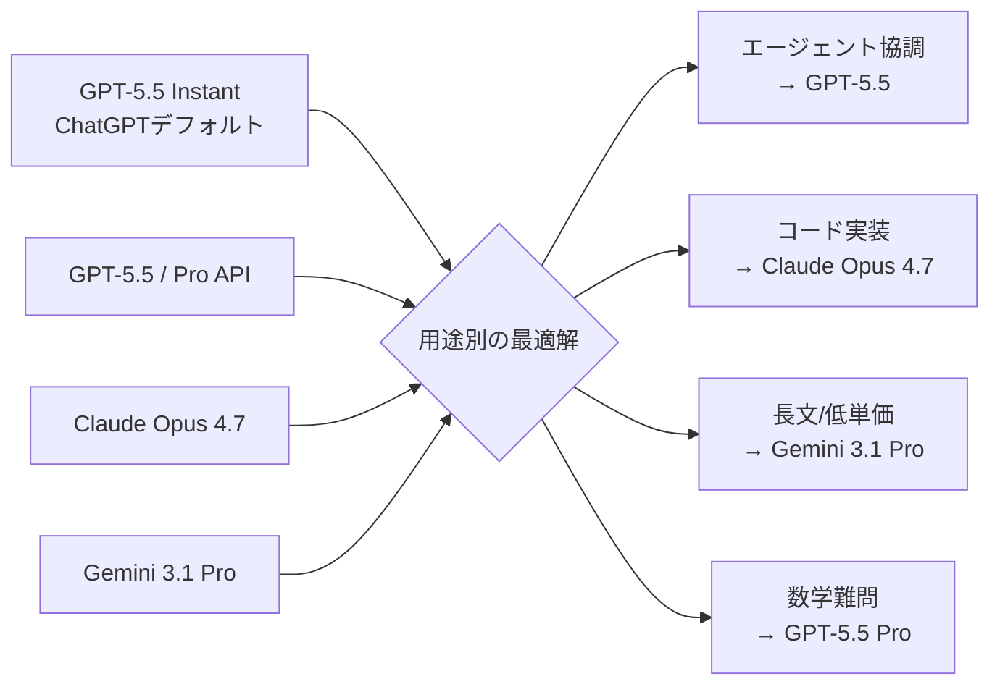

### GPT-5.5 InstantがChatGPTの新デフォルトに：幻覚52.5%減・回答30%短縮

2026年5月5日、OpenAIは**GPT-5.5 Instant**を全ChatGPTユーザー向けの新デフォルトモデルとして一斉ロールアウトした。これまで標準だったGPT-5.3 Instantを置き換える形で、Plus・Pro・Free全プランに自動展開される。注目すべきは、単なるバージョンアップに留まらず、高ステークス領域での**幻覚を52.5%削減**し、回答の冗長さを**30%以上カット**するという「品質と簡潔さ」の両立を打ち出してきた点だ。

なお本記事では、ChatGPT用に対話チューニングされた「GPT-5.5 Instant」と、4月24日にAPI提供開始が案内された「GPT-5.5本体（Reasoning版）」を明確に分けて扱う（OpenAI公式の `Introducing GPT-5.5` ページに記載された API availability の更新日付に基づく。発表系報道には4月23日付のものも混在するが、本記事では公式案内日に寄せる）。**幻覚52.5%減・回答30%短縮・パーソナライズ強化はInstantの数字**、**Terminal-Bench 82.7%・SWE-bench Pro 58.6%・$5/$30の価格はAPI版（Reasoning）の数字**であり、両者を混同するとユーザー体験と開発者向け仕様が誤って結びついてしまう。Anthropic・Google・xAIが矢継ぎ早にフラッグシップを更新する中で、OpenAIはコンシューマー（Instant）とデベロッパー（Reasoning）の両側で同時に攻勢をかけてきた格好になる。

---

#### この1週間で起きた3つの動き

過去7日間（2026年5月2日〜5月9日）の関連トピックを整理する。

| 日付 | イベント | インパクト |
| ---- | ------- | ---------- |
| 5/5 | OpenAI、GPT-5.5 InstantをChatGPTデフォルトに展開 | 全プラン自動切替・幻覚52.5%減 |
| 5/5 | TechCrunch・Winbuzzer等が一斉報道 | エージェント能力・パーソナライゼーション強化を強調 |
| 5/6 | Bloomberg / Reuters等：ホワイトハウスがAIモデルのFDA型事前審査EOを検討中と報道（公式発令ではない） | Hassett発言を起点に複数社が同時報道、Anthropic Mythosが契機 |

ChatGPTのデフォルト変更はサイレントに進むため見逃しがちだが、B2C・B2B双方の体感品質を一斉に底上げする変更であり、Claude / Gemini / Grokを含めた競争環境を実質的に書き換える地味だが大きな一手となる。

---

#### GPT-5.5 Instantの中身：3つの実用的な改善

##### 1. 幻覚（Hallucination）が52.5%減った

OpenAIが内部評価として公表した最大の数字がこれだ。

- 医療・法律・金融などハイステークスのプロンプトにおいて、GPT-5.5 Instantは前任のGPT-5.3 Instantに対し誤った主張（hallucinated claims）を**52.5%削減**
- ChatGPTで日常的に発生する「もっともらしいが事実ではない」回答が、特に意思決定に影響するドメインで半減
- 一方で、Artificial AnalysisのAA Omniscienceベンチマークでは、GPT-5.5（API・Reasoning版）の**幻覚率は依然86%と報告**されており、Claude Opus 4.7の36%、Gemini 3.1 Pro Previewの50%を大きく上回る。ベンチマーク設計（広く・深い知識質問）と一般用途で評価が割れる点は要注意

> 補足：「ChatGPT版（Instant、対話用）」と「API版（Reasoning、長考用）」では幻覚特性が異なる。日常会話やライティング用途では大幅改善が期待できる一方、高密度な事実検証を要するワークロードでは引き続き検証が必要、というのが実務的な解釈。

##### 2. 回答が「短く・濃く」なった

冗長さの削減も同時にアピールされた。

| 指標 | GPT-5.5 Instant vs GPT-5.3 Instant |
| ---- | ---- |
| 使用単語数 | **30.2%削減** |
| 行数 | **29.2%削減** |
| 体感トーン | より自然な会話調、ユーザー文脈の活用強化 |

これは単なる文字数調整ではなく、過剰な前置き・免責文・繰り返しの抑制による「中身の密度向上」を狙ったチューニングだ。Claude Sonnet系が伝統的に得意としてきた「短くて鋭い回答」の領域に、OpenAIが本気で踏み込んできた格好になる。

##### 3. パーソナライゼーションが「過去会話・Gmail・ファイル」を横断

GPT-5.5 InstantはWeb版でPlus・Proユーザー向けに、

- 過去のChatGPT会話
- アップロード済みファイル
- 連携したGmail

を検索ツール経由で横断参照し、ユーザー文脈に基づいた回答を返す機能を強化している。エンタープライズ向けというよりは個人ナレッジマネジメント層を狙った機能で、Claudeの「Projects」やGoogleの「Gemini for Workspace」と直接競合する位置づけだ。

---

#### ベンチマーク：GPT-5.5（Reasoning）の実力

ChatGPT側のInstantではなく、APIで提供されるフルスペックのGPT-5.5（Reasoning）でみると、数値はさらに踏み込んだ評価ができる。

##### コーディング・エージェント分野

本表ではOpenAI公式の評価表で直接確認できたベンチマーク（Terminal-Bench 2.0 / SWE-bench Pro / HLE / FrontierMath）に絞って掲載する。AIME 2025（81.2点）など二次ソースのみで出回っている数字は、公式system cardの追加開示後に改めて検討する。

| ベンチマーク | GPT-5.5（API / Reasoning） | Claude Opus 4.7 | Gemini 3.1 Pro | 備考 |
| --- | --- | --- | --- | --- |
| Terminal-Bench 2.0 | **82.7%** | 69.4% | n/a | 複雑なCLIワークフロー、計画+反復+ツール協調 |
| SWE-bench Pro | 58.6% | **64.3%** | n/a | 実GitHub Issue解決、Claudeが5.7pt先行 |
| HLE（推論） | 41.4% | **46.9%** | n/a | 高難度推論、Claudeが優位 |
| FrontierMath Tier 1-3 | 51.7%（Pro: **52.4%**） | n/a | n/a | 数学はGPT-5.5 Proが先行 |
| FrontierMath Tier 4 | 35.4%（Pro: **39.6%**） | n/a | n/a | 最難関帯。Proが標準を上回る |

**読み解き：**

- 「ターミナルでツールを叩いて自走するエージェント」用途ではGPT-5.5が現状トップ（Terminal-Bench 2.0 +13.3pt）
- 「IssueをPRに落とす純粋な開発エージェント」ではClaude Opus 4.7がなお優位（SWE-bench Pro +5.7pt）
- 「数学・厳密推論」ではGPT-5.5 Proが先行（FrontierMath Tier 1-3で52.4%、Tier 4で39.6%）
- 「広範な事実知識」はAA Omniscienceでaccuracyトップだが、幻覚率の高さで差し引きが必要

##### コンテキストウィンドウ

| モデル | API context | 備考 |
| --- | --- | --- |
| GPT-5.5（API） | 1M tokens | OpenAI公式 |
| GPT-5.5（Codex） | 400K tokens | コード特化版 |
| Gemini 3.1 Pro | 1M tokens | 長文処理は引き続きGoogle優位の用途あり |
| Claude Opus 4.6 / 4.7 | 1M tokens（標準価格） | 4月の更新でサーチャージ撤廃 |

長尺ドキュメント処理では3社揃って1Mが標準化したが、コード特化のCodexは400Kと帯域が絞られている点に注意。

---

#### 価格戦略：API値上げと「Pro」の重課金

##### GPT-5.5 標準（Reasoning, API）

| 区分 | GPT-5.4 | GPT-5.5 | 倍率 |
| --- | --- | --- | --- |
| 入力 | $2.50 / 1M tokens | **$5 / 1M tokens** | 2倍 |
| 出力 | $15 / 1M tokens | **$30 / 1M tokens** | 2倍 |

GPT-5.4比でトークン単価は入出力ともに**ちょうど2倍**となった。一方、The Decoderなどの一部解説では「1タスクあたりのトークン使用量が下がる効果を含めると、実効コスト増は約20%に見える」との試算が示されている（OpenAI公式ページに直接の記載は確認できず、あくまで第三者試算の範囲）。仮にこの試算が正しいとすれば、単価2倍 × トークン削減 ≒ 1.2倍という関係になり、値上げ分の大半を「冗長さの削減」で吸収する設計に見えてくる。なおこの議論はAPI版GPT-5.5の話であり、ChatGPT版Instantの30.2%短縮とは別系統の数字。

##### GPT-5.5 Pro（API）

| 区分 | 価格 |
| --- | --- |
| 入力 | $30 / 1M tokens |
| 出力 | **$180 / 1M tokens** |

GPT-5.5 ProはFrontierMath上位やマルチステップ・エージェントで標準を上回るが、出力料金は標準の6倍に跳ね上がるため、ROIを慎重に試算する必要がある。

##### 3社の出力単価（フラッグシップ比較）

| モデル | 出力単価 | 用途適性 |
| --- | --- | --- |
| Gemini 3.1 Pro | **$12 / 1M** | 大量バッチ・分類・純粋推論で最安 |
| Claude Opus 4.7 | $25 / 1M | 高ステークスのエージェント、コード品質重視 |
| GPT-5.5 標準 | $30 / 1M | エージェント協調・数学・パーソナル支援 |
| GPT-5.5 Pro | $180 / 1M | 最難関タスクのオフライン推論 |

参考試算として、月間1億トークンの出力ワークロードでは、Claude Opus 4.7にルーティングするだけで月$500（約7.5万円）の節約になるという報告も出ている。

---

#### なぜ「Instantのデフォルト切替」が地味に大きいのか

新モデルのAPIリリースは開発者の話題で終わるが、ChatGPTのデフォルトモデル変更は文字通り「全ユーザーの体験」を上書きする。具体的なインパクトは3つある。

##### 1. 「ChatGPT＝幻覚が多いツール」というブランド毀損の修復

医療・法律・金融といった意思決定に直結するドメインで幻覚52.5%減は、過去2年蓄積した「ChatGPTは雑にウソをつく」というユーザー体験を、明示的にケアした最初のメジャーアップデートと言える。

##### 2. プロンプトテンプレート・ワークフローの再評価

「冗長な回答を1/3カット」される結果、

- 既存のSlack BotやAPI連携で、期待したレスポンス長を前提にしたUIが崩れる
- カスタムGPTやプロジェクトのシステムプロンプトがチューニングし直しになる
- 「もっと詳しく」「もう少し短く」というユーザー指示の体感的なベースラインが変わる

といった移行コストが、特に企業導入のChatGPT Enterprise / Teamで発生する可能性がある。

##### 3. Claude / Geminiとの「会話品質」の差が縮まる

これまでGPT-5.3 Instant vs Claude Sonnet系で「Claudeのほうが返答が読みやすい」と評価されてきた領域に、OpenAIが直接介入した格好だ。「読みやすさ」と「事実性」の二軸で同時にClaudeに寄せてきた点は、今後の市場分析で要注目。

---

#### 競争環境：5月時点での「フラッグシップ三強」マップ

「全部こいつでOK」というユニバーサル王者は、5月時点でまだ存在しない。ワークロード別にルーティングする「マルチモデル前提」のスタックが事実上の標準になりつつあり、LangChainやLiteLLM等のルーターレイヤーを持つ意義が今期さらに大きくなった。

---

#### 日本の読者にとっての示唆

- ChatGPTを業務で使っているチームは、回答長・トーンの変化を必ず社内アナウンスする：プロンプト集・FAQが古いまま放置されると、社員が「劣化した」と誤解しがち
- ハイステークス領域（医療・法務・与信）で利用している場合、幻覚率の改善は朗報だが、依然として人間レビューを外すべきではない：AA Omniscienceの86%幻覚率は無視できない
- コーディングエージェントの選定では、Terminal-Bench / SWE-bench Pro / HLEのどれを重視するかで答えが変わる：「自走系」ならGPT-5.5、「コード品質」ならClaude Opus 4.7
- API単価2倍は予算に確実に効く：トークン削減で実効増が20%程度に収まるとの第三者試算もあるが、ワークロード次第で振れ幅は大きい。1日100万トークン×30日のヘビーユースを単純計算するだけでも月単位の差が出るため、Gemini 3.1 Proへのオフロード設計を検討する価値がある

#### まとめ

- 2026年5月5日、OpenAIはGPT-5.5 InstantをChatGPTの新デフォルトに切替（GPT-5.3 Instantを全プランで置換）
- 【Instant側】幻覚**52.5%減**（高ステークス領域）・回答単語数**30.2%短縮**・パーソナライズ強化で日常用途の体感品質が明確に向上
- 【API版】Terminal-Bench 2.0で**82.7%**（Claude Opus 4.7の69.4%を13.3pt上回る）でエージェント協調分野の首位を奪還
- 【API版】SWE-bench ProはClaude Opus 4.7が64.3%で5.7pt先行、純粋なコード実装ではClaudeが依然優位
- 【API版】単価は$5/$30でGPT-5.4比ちょうど2倍、Pro版は$30/$180とプレミアム路線。第三者試算ではトークン削減で実効+20%程度に収まるとの分析もある／Gemini 3.1 Pro $12との価格差が際立つ
- ChatGPTデフォルト変更は静かに全ユーザー体験を書き換える地味だが大きな一手であり、プロンプト・ワークフローの再点検を推奨

ChatGPTのリリースから3年半、フロンティアモデルの差別化は「どこで・何のために使うか」というコンテキスト依存に完全に移行した。GPT-5.5 InstantはOpenAIが「幻覚と冗長さ」というユーザー体感の二大不満に正面から手を入れたモデルであり、Claude Opus 4.7 / Gemini 3.1 Proが築いた牙城に対する地味だが効くカウンターパンチだ。次の山場は、現在報道段階にあるホワイトハウスのAI事前審査EOが実際に発令されるか・発令された場合にどの範囲で着地するか、そしてOpenAIがGPT-5.5 Proで長考系ワークロードのコスト合理性をどう示すか──この2点に集約される。

---

**情報ソース：**

[[ogp:https://openai.com/index/gpt-5-5-instant/]]

[[ogp:https://openai.com/index/introducing-gpt-5-5/]]

[[ogp:https://techcrunch.com/2026/05/05/openai-releases-gpt-5-5-instant-a-new-default-model-for-chatgpt/]]

[[ogp:https://the-decoder.com/gpt-5-5-tops-benchmarks-but-still-hallucinates-frequently-at-a-20-percent-higher-api-cost/]]

[[ogp:https://llm-stats.com/blog/research/gpt-5-5-vs-gpt-5-4]]

[[ogp:https://www.datacamp.com/blog/gpt-5-5-vs-claude-opus-4-7]]
