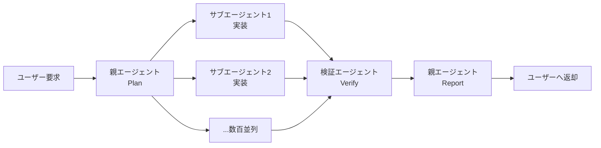

### はじめに

2026年5月28日、Anthropicは新フラッグシップLLM Claude Opus 4.8の一般提供を開始しました。前モデルOpus 4.7（4月16日リリース）からわずか6週間という驚異的な更新ペースで、SWE-Bench Proで**69.2**%という新たな業界トップを叩き出しています。

さらに注目すべきは、Fast Modeが従来比3倍安価になり、新機能「Dynamic Workflows」（research preview）によってClaude CodeやAPI経由のエージェントが数百のサブエージェントを自律的に並列実行できるようになった点です。Anthropicは同時に、Project Glasswing限定だった**Claude Mythos**を「数週間以内に一般提供」とアナウンスしており、エージェント時代の主導権争いが新しいフェーズに突入しました。

### 1. Claude Opus 4.8とは

#### 1.1 リリース概要

| 項目             | 内容                                            |
| ---------------- | ----------------------------------------------- |
| 発表日           | 2026年5月28日                                   |
| 提供元           | Anthropic                                       |
| モデルID         | claude-opus-4-8                                 |
| コンテキスト窓   | 入力 1M トークン / 出力 128K トークン           |
| Effortレベル     | low / medium / high（既定）/ xhigh / max の5段階 |
| 標準価格         | 入力 $5 / 出力 $25（1Mトークンあたり）          |
| Fast Mode価格    | 入力 $10 / 出力 $50（1Mトークンあたり、最大2.5倍速度） |
| 提供チャネル     | claude.ai / Claude API / AWS Bedrock / GitHub Copilot / Google Cloud Vertex AI |

#### 1.2 価格据え置きで「3倍安い」のカラクリ

通常モードの単価はOpus 4.7と完全に同一です。一方、Fast Mode（高速応答プレビュー）は前世代Opusの同モードと比較して実額で約3分の1のコストになりました。

| モード             | 入力（1Mトークン） | 出力（1Mトークン） |
| ------------------ | ------------------ | ------------------ |
| 旧 Opus Fast Mode  | $30                | $150               |
| Opus 4.8 Fast Mode | $10                | $50                |

公式表記では出力スループットが「最大2.5倍（up to 2.5x higher output tokens per second）」とされており、平均値ではなく上限値である点に注意が必要です。

「3倍安くなった」の主役は、あくまでFast Modeの価格そのものが下がったことです。加えてOpus 4.8には、同じeffort設定でも"無駄に考え込んでいるトークン"（公式の言葉では wasted thinking tokens）を減らす改善が入っており、エージェントを長時間まわしたときのコスト効率にじわっと効いてきます。

ここで気をつけたいのは、「どんなタスクでも常に総トークンが減って、結果的に安く済む」とまでは公式が言っていない点です。値下げの恩恵は確実にすべての利用者に届く一方、トークン効率の改善は使い方次第──という温度感で受け止めておくのが安全です。

### 2. ベンチマーク比較：エージェント系で圧倒

#### 2.1 主要ベンチマーク結果

| ベンチマーク         | Opus 4.7 | Opus 4.8 | 差分    |
| -------------------- | -------- | -------- | ------- |
| SWE-Bench Pro        | 64.3%    | 69.2%    | +4.9pt  |
| SWE-bench Verified   | 87.6%    | 88.6%    | +1.0pt  |
| Terminal-Bench 2.1   | 66.1%    | 74.6%    | +8.5pt  |
| 多分野ツール推論     | 54.7%    | 57.9%    | +3.2pt  |
| 知識ワーク（内部）   | 1753     | 1890     | +137    |
| USAMO 2026（数学）   | 69.3%    | 96.7%    | +27.4pt |

特筆すべきはUSAMO 2026での27.4ポイントジャンプです。これはOpusシリーズの単一サイクル更新としては過去最大の数学性能向上で、推論モデル系統との性能差をほぼ埋めにきた格好です。

#### 2.2 SWE-Bench Proが示す意味

SWE-Bench Proは「現役の保守リポジトリ」「複数ファイルにまたがるdiff」「公開正解なし」というメモリ化耐性の高いベンチマークです。ここでの69.2%は、「Opus 4.8が単なる暗記ではなく、未知のコードベースで実際に動作するパッチを書ける」ことを示しています。

GitHubは同日、GitHub CopilotのPro+ / Business / Enterprise プラン向けにOpus 4.8の一般提供を段階展開（gradual rollout）で開始しました。Copilotのchat / ask / edit / agent の各モードから利用可能で、コーディング現場での主戦モデルが切り替わる流れが加速しています。ただし無償プランやPro（無印）は対象外で、エンタープライズ寄りの配信戦略になっている点には注意が必要です。

### 3. 新機能：Effort制御 × Dynamic Workflows

#### 3.1 Effort制御（low / medium / high / xhigh / max）

ユーザーが「思考予算」を5段階で明示的に指定できる新機能です。Anthropic公式ドキュメント上は、既定が`high`で、コーディングや高自律タスクでは`xhigh`を明示的に指定することが推奨されています。

| Effort | 用途                                            | トークン消費の傾向 |
| ------ | ----------------------------------------------- | ------------------ |
| low    | 低レイテンシ重視、簡易タスク                    | 抑制               |
| medium | 一般的な対話・要約・短いコード生成              | やや抑制           |
| high   | 既定値（Opus 4.7既定と同等の総合バランス）      | 標準               |
| xhigh  | コーディング・エージェントなど高自律タスク向け  | 増加               |
| max    | 最深思考、研究・複雑な合成タスク                | 大幅増             |

ポイントは「lowでも"Opusクラスの判断力"は保ったまま、深掘りだけを節約する」設計思想と、その逆として「コーディング/エージェント用途は既定の`high`ではなく`xhigh`を明示せよ」という運用ガイドが公式から示されている点です。Claude Codeなど自律タスクを回す場合は、`xhigh`を既定として組み込むのが安全策となります。

#### 3.2 Dynamic Workflows：エージェントが自分の作業を分割・検証する

Opus 4.8最大の目玉が新ツール「Dynamic Workflows」です。Claude Code（CLI / Desktop / VS Code拡張）が中心の体験面ですが、提供範囲はそれだけにとどまりません。Anthropicは本機能を**research preview**として、以下のチャネルで利用可能としています。

| 提供チャネル                                    | 位置づけ              |
| ----------------------------------------------- | --------------------- |
| Claude Code（CLI / Desktop / VS Code 拡張）     | 主要なフロントエンド  |
| Claude API                                      | 任意の自社エージェント基盤に組み込み可能 |
| Amazon Bedrock                                  | AWS上のマネージド利用 |
| Google Cloud Vertex AI                          | GCP上のマネージド利用 |
| Microsoft Foundry                               | Microsoft Azure系エコシステム |

つまり「Claude Codeでしか使えない機能」ではなく、各社の自前エージェント基盤に組み込んで運用できる点が、企業にとっての本質的な価値です。なお現状はresearch preview段階のため、API仕様や挙動が変更される可能性が残ります。



従来は、サブエージェントの起動をユーザーまたは開発者がツール呼び出しで明示する必要がありました。Dynamic Workflowsでは、Opus 4.8が自律的に：

1. 複雑タスクを計画
2. 数百単位の並列サブエージェントを生成
3. 結果を検証
4. 親エージェントへ報告

までを実行します。リポジトリ全体のリファクタや大規模テスト生成のような「一気にやってほしいけど分割が手間」というタスクで効果を発揮します。Claude Codeで動かす場合も、API経由で自社の独自エージェントに組み込む場合も、同じ思想で利用できる点が共通しています。

#### 3.3 「正直さ」の改善

Anthropicの内部測定では、「コードの欠陥を黙って放置する確率」が4分の1に低下しました。Opus 4.8は、未解決の不確実性や未実装の箇所を自発的に明示するよう調整されています。エージェント運用で「自信たっぷりに壊れたコードを納品される」事故が減ることが期待されます。

### 4. プラットフォーム拡張：Managed Agents の本格化

同時に、Claude Developer Platformも以下の機能が追加されました。

| 機能                          | 内容                                                            |
| ----------------------------- | --------------------------------------------------------------- |
| Managed Agents Webhooks       | エージェントの状態変化を外部システムへPush通知                  |
| マルチエージェントオーケストレーション | 複数エージェントの並列管理・ルーティングを公式サポート          |
| AWS上のセルフホスト型サンドボックス | 顧客VPC内でコード実行サンドボックスを稼働可能、データ主権に対応 |

特にAWSセルフホストサンドボックスは、規制業種（金融・医療・公共）でClaude Codeを本格運用するための鍵となるピースです。

### 5. Claude Mythosの一般提供予告

Anthropicは同タイミングで、Project Glasswing限定だったClaude Mythosを「数週間以内に全顧客へロールアウト」すると発表しました。

Mythosは：

- Opus 4.7の1ティア上に位置する最上位モデル
- 数学・長コンテキスト推論・ソフトウェア工学・サイバーセキュリティで突出
- 主要OS・主要ブラウザ全てで「数千件のゼロデイ脆弱性を発見」した報告あり

これまではAISIの評価を受けた招待制の40社程度に限定されていましたが、Opus 4.8のリリースで「Mythosを段階的に解放しても安全」と判断したものと見られます。

### 6. 競合との位置関係

#### 6.1 直近1か月の主要モデル比較

| モデル                  | 提供元    | 強み                                  | 価格傾向         |
| ----------------------- | --------- | ------------------------------------- | ---------------- |
| Claude Opus 4.8         | Anthropic | エージェントコーディング、数学、正直さ | $5 / $25         |
| GPT-5.5 Instant         | OpenAI    | 既定モデル、ハルシネーション52.5%削減 | ChatGPT既定相当 |
| Gemini 3.5 Flash        | Google    | I/O 2026 発表、エージェント基盤       | 低価格帯         |
| Claude Mythos（数週間後） | Anthropic | サイバー、長文推論、最上位ティア      | 未公表           |

Opus 4.8は「実行されるコード品質」と「エージェントとしての自律性」で他社を引き離す戦略を選択しました。GPT-5.5が「ChatGPTの体験向上」、Gemini 3.5 Flashが「Google製品横断のエージェント基盤」というポジションを取る一方、AnthropicはAPI／IDE経由の実装現場を死守する姿勢が明確です。

### 7. 開発者がすぐ試すには

#### 7.1 Claude API

```bash
curl https://api.anthropic.com/v1/messages \
  -H "x-api-key: $ANTHROPIC_API_KEY" \
  -H "anthropic-version: 2023-06-01" \
  -H "content-type: application/json" \
  -d '{
    "model": "claude-opus-4-8",
    "max_tokens": 4096,
    "messages": [
      {"role": "user", "content": "リポジトリ全体をリファクタしてテストを追加して。"}
    ]
  }'
```

#### 7.2 GitHub Copilot（Pro+ / Business / Enterprise）

CopilotのモデルピッカーからOpus 4.8を選択すると、chat / ask / edit / agent の各モードで利用可能です。対象プランは Copilot Pro+ / Business / Enterprise に限定され、無償プランやPro（無印）は対象外です。また展開は段階的（gradual rollout）に行われるため、選択肢に表示されるタイミングはアカウントによって前後します。BusinessおよびEnterpriseでは、組織管理者がポリシーでモデルを有効化したうえで個々のユーザーが選択できるようになります。

#### 7.3 AWS Bedrock / Vertex AI

両プラットフォームともリリース当日から利用可能。既存のBedrock InvokeModel／Vertex predict呼び出しのモデルIDを差し替えるだけで切り替えられます。

### まとめ

- Claude Opus 4.8は2026年5月28日に一般提供開始、価格据え置きでSWE-Bench Pro 69.2%、Terminal-Bench 2.1で74.6%とエージェントコーディング系を更新
- USAMO 2026で69.3% → 96.7%という単一サイクル最大の数学スコア向上を達成
- Effort制御（low / medium / high / xhigh / max、既定はhigh、コーディング・エージェント用途は`xhigh`推奨）とDynamic Workflows（数百並列サブエージェントの自律実行、research preview）が新登場
- Fast Modeは前世代の $30/$150 から $10/$50 へ実額3分の1まで下がり、出力スループットは公式表記で最大2.5倍となり、エージェント周回コストを大幅圧縮
- Managed Agents WebhooksとAWSセルフホストサンドボックスで、企業の本番運用要件にも対応
- Project Glasswing限定だったClaude Mythosも数週間以内に一般提供予定で、Anthropicは「エージェント時代の主戦モデル」の座を本気で取りに来ている

**情報ソース：**

[[ogp:https://www.anthropic.com/news/claude-opus-4-8]]

[[ogp:https://techcrunch.com/2026/05/28/anthropic-releases-opus-4-8-with-new-dynamic-workflow-tool/]]

[[ogp:https://venturebeat.com/technology/anthropics-claude-opus-4-8-is-here-with-3x-cheaper-fast-mode-and-near-mythos-level-alignment]]

[[ogp:https://github.blog/changelog/2026-05-28-claude-opus-4-8-is-generally-available-for-github-copilot/]]

[[ogp:https://9to5mac.com/2026/05/28/anthropic-upgrades-claude-with-new-opus-4-8-model-heres-whats-new/]]

[[ogp:https://www.axios.com/2026/05/28/anthropic-opus-release-mythos]]
