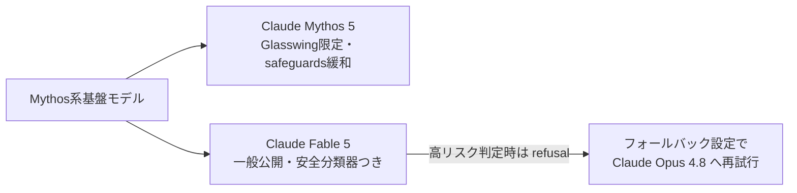

2026年6月9日、AnthropicはClaude Fable 5を一般公開しました。これまで招待制の「Project Glasswing」参加組織だけが触れられたMythos系列——Anthropic自身が「一般公開には強力すぎる」と扱ってきたモデルクラス——を、安全分類器でラップして誰でも使える形にしたのがFable 5です。**Mythos級の能力を持つモデルが、Claude APIやClaude Codeから普通に呼び出せるようになった**という点で、5月末のOpus 4.8リリースとは質の異なる節目と言えます。

ベンチマークではSWE-Bench Proで80.3%を記録し、わずか12日前に「エージェント新王者」となったOpus 4.8（69.2%）を一気に11.1pt突き放しました。本記事では、Fable 5の性能・価格・そして「refusal＋フォールバック」という新しい安全アーキテクチャを整理します。

### 1. Claude Fable 5とは：「Mythos級」の初の一般公開モデル

Anthropicのモデルラインアップは、これまでOpus / Sonnet / Haikuの3層構成でした。Fable 5はその上に位置する新しい階層で、公式発表では「一般利用向けに安全化したMythos級モデル（a Mythos-class model that we've made safe for general use）」と説明されています。

同日に発表されたClaude Mythos 5は、Fable 5と**同一の基盤モデルから特定分野の安全装置を外したバージョン**で、引き続きProject Glasswing参加組織（サイバー防御企業・インフラ事業者など）に限定提供されます。つまり関係はこうなります。

#### 1.1 主要スペック

| 項目 | Claude Fable 5 |
| ---- | -------------- |
| モデルID | `claude-fable-5` |
| コンテキスト窓 | 入力 1M トークン / 出力 128K トークン |
| 思考モード | Adaptive thinking 常時オン（Extended thinkingは非対応） |
| 標準価格 | 入力 $10 / 出力 $50（1Mトークンあたり） |
| 提供チャネル | Claude API、AWS（Bedrock含む）、Vertex AI、Microsoft Foundry |
| データ保持 | 30日間の保持が必須（学習には不使用） |

注意点がひとつ。Fable 5はOpus 4.7世代で導入された新トークナイザーを使うため、公式docsによれば同じテキストでも旧世代モデル比で約30%トークン数が増えます。旧モデルとの料金比較では、単価差がそのまま実効コスト差にならない点に留意が必要です。

### 2. ベンチマーク：Opus 4.8を全方位で更新

#### 2.1 SWE-Bench Pro比較

公式発表は「テストしたほぼ全ベンチマークでstate-of-the-art」と総括しており、The Decoderが報じた数値では主要モデルとの差は次のとおりです。

| モデル | SWE-Bench Pro | FrontierCode |
| ------ | ------------- | ------------ |
| Claude Fable 5 | 80.3% | 29.3% |
| Claude Opus 4.8 | 69.2% | 13.4% |
| GPT-5.5（API版） | 58.6% | 5.7% |
| Gemini 3.1 Pro | 54.2% | — |

SWE-Bench Proは「現役の保守リポジトリ・複数ファイルdiff・公開正解なし」という暗記耐性の高いベンチマークで、Opus 4.8が5月末に出した69.2%が当時の業界トップでした。**12日間でトップスコアが11.1pt動くのは、このベンチマークの歴史でも異例の跳躍**です。

#### 2.2 FrontierCodeが示す「実務の壁」

より示唆的なのはCognitionのFrontierCode（実プロダクション水準の要求でコーディングさせる高難度ベンチマーク）です。Fable 5の29.3%という絶対値は低く見えますが、Opus 4.8の13.4%から2倍以上、GPT-5.5の5.7%からは5倍以上の開きがあります。フロンティア領域ではまだ「人間のシニアエンジニアの代替」には遠い一方、相対差は急拡大しています。

実務面の逸話として、The DecoderはStripeの事例を報じています。5,000万行規模のRubyコードベース移行——チームで数か月かかる想定の作業——をFable 5が1日で完了し、「5か月分のエンジニアリング作業を数日に圧縮した」とのコメントが出ています。

### 3. 安全設計：refusalと、Opus 4.8へのフォールバック

Fable 5の最大の特徴は性能ではなく、一般公開を可能にした安全アーキテクチャかもしれません。

#### 3.1 3分野の安全分類器

Fable 5へのリクエストは、次の3分野を監視する分類器を常時通過します。

1. サイバーセキュリティ（攻撃能力の悪用）
2. 生物学・化学（危険物質の合成支援など）
3. 蒸留（モデル能力の抽出・複製の試み）

分類器が高リスクと判定した場合、APIの厳密な挙動としてはFable 5がまず `stop_reason: "refusal"` を返します。そのうえで `fallbacks` パラメータやSDKミドルウェアを設定しておけば、**同じリクエストをClaude Opus 4.8で自動的に再試行**できます。Anthropicの製品ページは一般向けに「自動的にルーティング」と表現していますが、API実装としては「refusal＋任意のフォールバック」であり、何も設定しなければ単にrefusalが返る点に注意してください。公式発表によれば95%超のセッションではフォールバックは一切発生せず、外部バグバウンティでは1,000時間超のテストでユニバーサルジェイルブレイクは見つからなかったとしています。

#### 3.2 30日データ保持という代償

Mythos級モデルには30日間のプロンプト・出力保持が必須です（学習には使われません）。これは企業導入では無視できない条件で、GitHub Copilotでは他のClaudeモデルがゼロデータ保持（ZDR）で動くのに対し、Fable 5だけは管理者がこの保持要件を承諾して明示的に有効化する必要があります。

TechCrunchは「AIが危険になりつつあると警告した数日後に、その当事者が最強モデルを公開した」という皮肉な構図を指摘していますが、フォールバック方式・データ保持・段階的な信頼アクセスという3点セットは、「危険な能力を持つモデルをどう市場に出すか」に対するAnthropicなりの回答と読めます。

### 4. 価格と提供範囲

#### 4.1 主要モデルとの価格比較

いずれも標準同期APIの公式価格です（GPT-5.5はReasoning版。ChatGPT向けInstantとは別物）。

| モデル | 入力（/1Mトークン） | 出力（/1Mトークン） |
| ------ | ------------------- | ------------------- |
| Claude Fable 5 | $10 | $50 |
| Claude Opus 4.8 | $5 | $25 |
| GPT-5.5（Reasoning） | $5 | $30 |
| Gemini 3.5 Flash | $1.50 | $9 |

Fable 5の$10/$50はOpus 4.8標準のちょうど2倍ですが、興味深いことにOpus 4.8のFast Mode価格とまったく同額です。報道ではMythos Preview（約$30/$150とされる）の半額以下とも紹介されており、「最上位能力の値段」としてはむしろ下がった形になります。

#### 4.2 サブスクリプションとCopilotでの扱い

- claude.aiのPro / Max / Team / シート制Enterpriseプランでは、6月22日まで追加費用なしでFable 5を利用可能。6月23日以降は使用量クレジットが必要（The Decoderによればサブスク内では使用量2倍カウント）
- GitHub Copilotでは6月9日からPro+ / Max / Business / Enterpriseプランで段階的ロールアウト。VS Codeの全モード（chat / ask / edit / agent）のほかCopilot CLI、クラウドエージェント、JetBrains、Xcodeなどで利用可能
- Business / Enterpriseでは前述のデータ保持ポリシーを管理者が有効化しない限り表示されない

### 5. Mythos 5とProject Glasswingのこれから

本ブログでは3月にMythos Previewとサイバーセキュリティ文脈を取り上げましたが、今回そのMythos系列が一気に「製品ライン」へ昇格しました。Mythos 5はGlasswing参加組織向けに同日提供が始まり、さらに生物学研究者向けには「生物・化学の安全装置のみ解除し、サイバー分野の安全装置は維持したFable 5」という分野別アクセスも予告されています。

「**単一モデルに対して、相手の信頼度に応じて安全装置を出し分ける**」という運用は、フロンティアモデルの提供形態として新しいパターンです。モデルの能力が上がるほど「全員に同じものを出す」ことが難しくなる以上、この階層化アプローチは他社にも波及する可能性が高いでしょう。

### 6. まとめ

- Claude Fable 5は2026年6月9日に一般公開。招待制だったMythos級の能力を安全分類器つきで開放した、Anthropic初の「Opusより上」の一般向けモデル
- SWE-Bench Pro 80.3%でOpus 4.8（69.2%）を11.1pt更新。FrontierCodeでは29.3%でOpus 4.8の2倍超、GPT-5.5の5倍超
- 価格は$10/$50でOpus 4.8標準の2倍（Fast Modeと同額）。1Mコンテキスト・128K出力・Adaptive thinking常時オン
- 高リスク判定時はrefusal（`stop_reason: "refusal"`）を返し、`fallbacks` 設定やSDKミドルウェア経由でOpus 4.8に回せる。95%超のセッションは影響なし、バグバウンティ1,000時間超でユニバーサルジェイルブレイクなし
- 30日データ保持が必須のため、GitHub CopilotのBusiness / Enterpriseでは管理者の明示的な承諾が必要。claude.aiサブスクでは6月22日まで追加費用なし
- Mythos 5はGlasswing限定で同日提供開始。信頼度に応じて安全装置を出し分ける「階層化リリース」が今後の業界標準になるかが注目点

**情報ソース：**

[[ogp:https://www.anthropic.com/news/claude-fable-5-mythos-5|https://cdn.sanity.io/images/4zrzovbb/website/b7055119423427c40a0e4d84054aed17682b50a2-2880x1620.png|Claude Fable 5 and Claude Mythos 5|Today we’re launching Claude Fable 5: a Mythos-class model that we’ve made safe for general use.|AnthropicAI]]

[[ogp:https://the-decoder.com/anthropic-releases-claude-fable-5-and-mythos-5-with-major-gains-in-coding-and-science/]]

[[ogp:https://techcrunch.com/2026/06/09/anthropic-released-claude-fable-5-its-most-powerful-model-publicly-days-after-warning-ai-is-getting-too-dangerous/]]

[[ogp:https://github.blog/changelog/2026-06-09-claude-fable-5-is-generally-available-for-github-copilot/]]

[[ogp:https://www.cnbc.com/2026/06/09/anthropic-mythos-claude-fable-5.html]]
