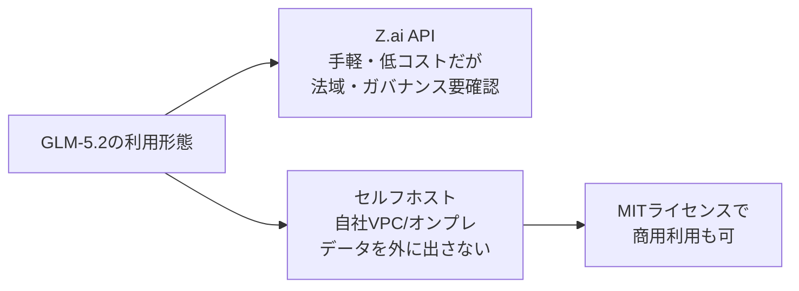

2026年6月13日、中国・Z.ai（旧Zhipu AI）がフラグシップの新モデル**GLM-5.2**を発表しました（オープンウェイトの重みはその後6月16〜17日頃にHugging Face等で公開）。注目すべきは性能そのものよりも「出し方」です。753B（アクティブ40B）の大規模Mixture-of-ExpertsをMITライセンスのオープンウェイトとして配布し、SWE-bench ProではGPT-5.5を上回るスコアを、出力トークンで約6〜7分の1の価格で実現しました（第三者のArena系ランキングでも上位とされます）。

クローズドな最前線モデルが$5〜$30/100万トークンで競う中、**ほぼ最前線の性能を、自己ホスト可能なオープンウェイトで**という選択肢が現実味を帯びてきた──これが今週最大のニュースです。本記事では性能・価格・1Mコンテキストを整理しつつ、日本企業がAPI利用時に検討すべき法域・ガバナンス上の論点まで踏み込みます。

### 1. GLM-5.2とは：コーディング特化のオープンウェイトMoE

GLM-5.2は、前世代GLM-5.1を継ぐコーディング・エージェント特化の大規模言語モデルです。最大の特徴は、最前線級の性能をオープンウェイト（重みが公開され、自前のインフラで動かせる）かつMITライセンス（商用利用可）で提供した点にあります。

#### 1.1 主要スペック

| 項目 | GLM-5.2 |
| ---- | ------- |
| アーキテクチャ | Mixture-of-Experts（総パラメータ 753B / アクティブ 40B） |
| コンテキスト窓 | 1Mトークン（GLM-5.1の約200Kから5倍） |
| 推論モード | デュアル（High / Max） |
| ライセンス | MIT（商用利用可・オープンウェイト） |
| 配布 | Z.ai API ＋ オープンウェイト（Hugging Face等で重み公開） |
| 出力速度 | 約96.4トークン/秒（Artificial Analysis計測） |
| 発表日 | 2026年6月13日（オープンウェイト公開は6月16〜17日頃） |

総パラメータ753Bに対して推論時に動くのは40BのみというMoE構成のため、フルサイズのDenseモデルより推論効率が高いのが設計上の狙いです。コンテキスト窓が200K→1Mへ5倍に拡張されたことで、リポジトリ全体を一度のセッションに載せた長期コーディングが現実的になりました。

#### 1.2 「Coding Plan」：書く前に設計する

GLM-5.2で目玉として打ち出されているのが**Coding Plan**機能です。コードを書き始める前に、複数ファイルにまたがる構造化された実装計画をモデル自身が立ててから着手します。シニアエンジニアが複雑なタスクで「まず設計してから手を動かす」流れを模した挙動で、長期・複数ファイルのエージェント的タスクで効くとされています。

### 2. ベンチマーク：長期コーディングでGPT-5.5を上回る

Z.aiは公開当初ベンチマークを伏せていましたが、その後の公式テーブルと第三者計測で輪郭が見えてきました。Z.ai公式/準公式の数値ではTerminal-Bench 2.1で81.0、SWE-bench Proで62.1を出し、長期コーディングでの強さが確認できます。第三者計測のArtificial Analysis Intelligence Indexでは51を記録し、同サイズ帯のオープンウェイトでトップクラスに位置します。

対人評価系のCode Arenaでも、複数の第三者記事がGLM-5.2を「2位級」と紹介しています。ただしArena系のランキングは投票の集計タイミングで順位が入れ替わりやすく、特定時点の「世界2位」を固定の事実として読むのは禁物です。**オープンウェイトながらArena系でも上位グループにつけている**──この程度に受け止めておくのが過不足のないところでしょう。

#### 2.1 コーディング系ベンチマーク比較

クローズドの最前線モデルとの比較は次のとおりです。注目は、暗記耐性の高い長期コーディング系（SWE-bench Pro、FrontierSWE）でGPT-5.5を上回っている点です。

| ベンチマーク | GLM-5.2 | GPT-5.5 | Claude Opus 4.8 |
| ------------ | ------- | ------- | --------------- |
| SWE-bench Pro | 62.1 | 58.6 | — |
| FrontierSWE | 74.4 | 72.6 | 75.1 |
| Terminal-Bench 2.1 | 81.0 | 84.0 | 85.0 |
| SWE-bench Verified | — | — | 88.6% |

SWE-bench Proで62.1とGPT-5.5（58.6）を抜き、FrontierSWEでも74.4でGPT-5.5（72.6）を上回りClaude Opus 4.8（75.1）にほぼ並びました。Z.ai公式ブログもFrontierSWEで「Opus 4.8に約1ポイント差、GPT-5.5を約1ポイント上回る」と説明しており、長期コーディングでの強さは公式説明とも整合します。一方でTerminal-Bench 2.1（81.0）やSWE-bench Verified（Claude Opus 4.8が88.6%でトップ）といった指標では、クローズド最前線がなお先行しています。

なお上表のGLM-5.2の値はZ.ai公式/準公式の数値で、比較対象（GPT-5.5・Opus 4.8）の値は同テーブルおよび第三者集計で報告されたものです。測定条件が完全には揃わない可能性があるため、傾向をつかむ参考としてご覧ください。

#### 2.2 「全方位トップ」ではなく「コスパで刺さる」モデル

ベンチマークを総合すると、GLM-5.2は**ピーク性能でClaude Opus 4.8を超えるモデルではなく、最前線の一歩手前を圧倒的な価格で出してきたモデル**です。「最高の信頼性が要る本番デバッグはOpus 4.8、量をこなす長期コーディングはGLM-5.2」という使い分けが現実的な解になります。

### 3. 価格：出力トークンで約6〜7分の1

GLM-5.2の競争力の核心は価格です。ただし後述のとおり**出典条件が揃っていない**ため、下表はあくまで桁感をつかむ**参考値**として見てください（100万トークンあたり・通常推論）。

| モデル | 入力 | 出力 | コンテキスト | 価格の出典 |
| ------ | ---- | ---- | ------------ | ---------- |
| GLM-5.2 | $1.20〜1.40 | $4.10〜4.40 | 1M | サードパーティ提供価格（OpenRouter等） |
| Gemini 3.1 Pro | $2.50 | $15.00 | 1M | Google公式 |
| Claude Opus 4.8 | $5.00 | $25.00 | 1M | Anthropic公式 |
| GPT-5.5 | $5.00 | $30.00 | ~1M | OpenAI公式 |

桁感で言えば、GLM-5.2の出力単価はGPT-5.5やClaude Opus 4.8の概ね6〜7分の1で、コーディング用途のトークン消費を考えると効いてきます。さらにZ.ai APIはキャッシュヒット時の入力を$0.26/100万トークン（通常入力比で約81%引き）に設定しており、同一コンテキストを繰り返し参照するエージェント用途で有利です。

> 注意（横比較の限界）：上表はGLM-5.2だけが**サードパーティ提供価格**、他3モデルは**各社公式価格**という非対称な並びです。同一API種別・同一課金体系で揃った比較ではないため、倍率はあくまで目安です。GLM-5.2はZ.aiの単一公式レートカードが本稿執筆時点で確認できず、OpenRouterで$1.20/$4.10、FriendliやCloudflare経由のプロバイダ別一覧で$1.40/$4.40など経由プロバイダで揺れます。他3モデルは各社公式の標準API・通常推論モードの公称値（バッチ割引・キャッシュ除く）です。厳密なコスト比較は、自社のワークロードで同一条件のトークン単価を取り直して評価してください。

### 4. 固有の論点：中国企業APIへの法域・ガバナンス上の懸念

性能と価格だけ見れば魅力的ですが、日本企業がZ.ai APIを業務利用する際には検討すべき論点があります。海外メディアの一部はGLM-5.2を「トップのコーディングベンチマーク、ただしAPI利用には中国データリスク」と評しています。中国企業のAPIを通してコードや社内文書を送ること自体に、法域・ガバナンス上の懸念があり得るためです。

ただし、Z.aiの公式なデータ所在地・保存方針までは本稿執筆時点で一次ソースで確認できていません。データがどこで処理・保存されるか、学習に使われないかといった点は、機密情報・知財・規制データを扱うなら**契約・利用規約レベルでの個別確認が必要**です。一般論としても、中国の国家情報法（National Intelligence Law）などを根拠に断じるには、より強い法務ソースの裏取りが要る点に注意してください。

ここで効いてくるのが**オープンウェイト＋MITライセンスという出し方**です。重みが公開されているため、自社のVPCやオンプレミスGPUにモデルをデプロイすれば、データを外部APIに送らずに同等の性能を使えます。

ただしセルフホストには753Bクラスのモデルを動かす相応のGPUインフラが必要で、「最安のAPI」とはコスト構造が別物になります。「手軽さ・最安のAPI」と「データ統制のためのセルフホスト」はトレードオフであり、扱うデータの機微度で選ぶことになります。

### 5. まとめ

GLM-5.2の要点を整理します。

- オープンウェイトの最前線級モデル：753B/40B MoEをMITライセンスで公開。Artificial Analysis Intelligence Index 51、第三者のArena系ランキングでも上位。
- 長期コーディングでGPT-5.5超え：SWE-bench Pro 62.1、FrontierSWE 74.4でGPT-5.5を上回り、Claude Opus 4.8にほぼ並ぶ場面も。
- 圧倒的なコスパ：出力単価は概ねGPT-5.5やClaude Opus 4.8の6〜7分の1（GLM-5.2はサードパーティ価格、他は公式価格の参考比較）。キャッシュ入力は$0.26と長期エージェント用途に有利。
- 1Mコンテキスト：GLM-5.1の5倍。リポジトリ全体を載せた一括処理が現実的に。
- データ統制が鍵：中国企業APIの利用には法域・ガバナンス上の懸念があり得る（公式のデータ所在地方針は未確認のため機密データでは個別確認を）。オープンウェイトゆえセルフホストでデータを外に出さずに使う選択肢がある。

最前線の絶対性能はクローズドモデルがなお握る一方、**「実用十分な性能を、自分の管理下で、桁違いに安く」という軸ではオープンウェイトが急速に追い上げています**。コスト最適化とデータ主権の両方を求める日本企業にとって、GLM-5.2は無視できない選択肢になりました。

**情報ソース：**

[[ogp:https://venturebeat.com/technology/z-ais-open-weights-glm-5-2-beats-gpt-5-5-on-multiple-long-horizon-coding-benchmarks-for-1-6th-the-cost|https://images.ctfassets.net/jdtwqhzvc2n1/2wFQ5P7x9M73wwoWGI1RyM/12f4b572d351a53f3d4a3741de6b3839/Gemini_Generated_Image_e0yu6he0yu6he0yu.png|Z.ai’s open-weights GLM-5.2 beats GPT-5.5 on multiple long-horizon coding benchmarks for 1/6th the cost|It allows engineering teams to host frontier-level AI on their own sovereign infrastructure, entirely eliminating vendor lock-in.|Venturebeat]]

[[ogp:https://artificialanalysis.ai/models/glm-5-2|https://artificialanalysis.ai/models/glm-5-2/opengraph-image-oimwka?160c194f916e2ad0|GLM-5.2 (max) - Intelligence, Performance & Price Analysis|Analysis of Z AI's GLM-5.2 (max) and comparison to other AI models across key metrics including quality, price, performance (tokens per second & time to first token), context window & more.|]]

[[ogp:https://www.techtimes.com/articles/318543/20260617/glm-52-open-weights-live-top-coding-benchmark-api-use-carries-china-data-risk.htm]]

[[ogp:https://www.edenai.co/post/glm-5-2-benchmark-vs-gpt-5-5-claude-opus-4-8-and-gemini-3-1-pro]]
</parameter>
</invoke>
