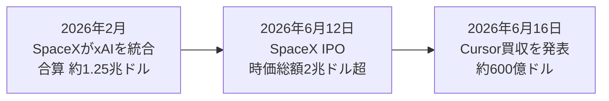

2026年6月16日、SpaceXがAIコーディングツール「Cursor」を運営するAnysphereを**約600億ドル（約9兆円超）の全株式取引で買収する**と発表しました。注目すべきはタイミングです。SpaceXが6月12日にナスダックへ上場（IPO）したわずか4日後の電撃発表で、主要報道では**ベンチャーキャピタル出資スタートアップの買収としては史上最大級**と位置づけられています。

2月のxAI統合、6月のIPO、そして今回のCursor買収──わずか4か月でイーロン・マスク陣営はロケット・衛星・AIモデル・開発者ツールを一つの傘下に束ねつつあります。本記事では、確定している事実と報道値を区別しながら、この買収が何を意味するのかを整理します。

### 1. 何が発表されたか：600億ドルの全株式買収

まず、現時点で複数の主要メディア（CNBC、CBS News、Yahoo Finance等）が一致して報じている事実関係を整理します。

| 項目 | 内容 |
| ---- | ---- |
| 買収者 | SpaceX（Nasdaq上場） |
| 対象 | Anysphere（AIコーディングツール「Cursor」の運営元、2022年創業） |
| 買収額 | 約600億ドル |
| 取引形態 | 全株式（オールストック） |
| 発表日 | 2026年6月16日（SpaceXのIPOから4日後） |
| クロージング予定 | 2026年第3四半期（規制当局の承認待ち） |
| 位置づけ | VC出資スタートアップの買収として史上最大級（主要報道による評価） |

重要な注意点として、これは**買収「合意」の段階**であり、取引完了（クロージング）は規制当局の承認を前提に2026年Q3を見込む、とされています。独占禁止当局の審査次第で条件や時期が動く可能性は残ります。

#### 1.1 4月の「オプション」が伏線だった

報道によれば、SpaceXは2026年4月の時点でCursorに関する選択権（オプション）を確保していました。具体的には「約100億ドルでパートナーシップを結ぶ」か「後日600億ドルで買収する」かを選べる権利で、今回SpaceXは後者の完全買収を選んだ形です。突発的な買収ではなく、数か月前から布石が打たれていたことになります。

### 2. 文脈：xAI統合 → IPO → Cursor買収の4か月

今回の買収は単独の出来事ではなく、マスク陣営の一連の再編の延長線上にあります。時系列で見ると流れが明確です。

2月の**SpaceXによるxAI統合**は、合算評価額が約1.25兆ドル（SpaceX約1兆ドル＋xAI約2,500億ドル）に達し、当時「史上最大の合併」と報じられました。これによりGrokを擁するxAIはSpaceX傘下に入っています。続く6月12日のIPO（公開価格150ドル）でSpaceXは時価総額2兆ドル超の上場企業となり、その潤沢な株式を対価に、4日後のCursor買収へと動きました。今回の買収対価が「全株式」なのも、IPO直後で株式価値が高い局面を活かした動きと読めます。

### 3. なぜCursorなのか：AIコーディング市場の覇権争い

戦略的な狙いは、Anthropic（Claude Code）やOpenAIが先行する**AIコーディング／エンタープライズAIツール市場**での地歩固めにあります。SpaceX傘下のxAI（Grok）にとって、Cursorは一気にエンドユーザーとの接点を得る手段になります。

#### 3.1 Cursorの規模感（数値は報道により幅あり）

Cursorの売上規模については報道で数値に幅があり、ここは慎重に扱う必要があります。

| 指標 | 報道されている値 |
| ---- | ---------------- |
| 年換算売上（ARR） | 約26億〜40億ドル（出典により差） |
| 直前の資金調達観測 | 約500億ドル評価で20億ドル規模のラウンドを準備との報道 |
| 創業 | 2022年 |

ARRが「26億ドル」とする報道と「40億ドルを突破」とする報道が混在しており、本記事では確定値として扱わず**レンジ**で示します。いずれにせよ、創業からわずか数年で数十億ドル規模の売上に達した急成長企業であることは共通しています。

#### 3.2 シェア低下という「買い時」

一方で、買収の背景にはCursorの競争環境の変化もあります。一部報道（支出データ分析）によれば、AIコーディングツールにおけるCursorのシェアは2025年6月の約41%から2026年5月には約26%へ低下したとされます。Claude CodeやGPT系コーディングツールの台頭で単独の優位が薄れつつあるタイミングで、資本力のあるSpaceX／xAI陣営に取り込まれた──という構図です。

> 注意：上記のシェアや売上の数値は各メディアの集計・推計に基づくもので、Anysphere自身が公表した確定値ではありません。傾向をつかむ参考としてご覧ください。

### 4. 開発者・日本のユーザーへの影響

日本でもCursorはAIコーディングの定番ツールとして広く使われています。買収が完了した場合の論点を整理します。

- **Grok統合の可能性**：xAIがSpaceX傘下にある以上、CursorのバックエンドにGrok系モデルが組み込まれる流れは想定されます。ただし現時点で具体的な統合計画は公表されていません。
- **マルチモデルの行方**：CursorはこれまでClaude・GPTなど複数モデルを選べる中立的な立ち位置が強みでした。特定陣営の傘下に入ることで、この中立性が今後どう維持されるかは未知数です。
- **当面は変化なし**：買収はQ3クロージング予定の「合意」段階であり、当面のCursorの使用感やモデル選択が即座に変わるわけではありません。

実務的には「今すぐ乗り換えを検討する話ではないが、モデル選択の自由度が将来どうなるかは注視」という温度感が妥当です。

### 5. まとめ

今回の買収の要点を整理します。

- **約600億ドルの全株式買収**：SpaceXがCursor運営元Anysphereを買収合意。主要報道ではVC系スタートアップ買収として史上最大級と位置づけ。
- **IPO4日後の電撃**：6月12日のSpaceX上場（時価総額2兆ドル超）直後、株式を対価にした動き。4月に確保したオプションの行使。
- **マスク陣営の再編の総仕上げ**：2月のxAI統合、6月IPOに続く一手で、ロケット・衛星・AIモデル・開発者ツールが一つの傘下に。
- **狙いはAIコーディング覇権**：Anthropic・OpenAIが先行する市場で、Grokを擁するxAIがCursorの顧客接点を取り込む。
- **未確定要素に注意**：クロージングはQ3予定で規制当局の承認待ち。Cursorの売上・シェア数値は報道で幅があり、Grok統合の具体策も未公表。

AIの主戦場が「モデル単体の性能」から「モデル×開発者ツール×インフラの垂直統合」へ移りつつあることを象徴する一件です。Claude CodeやGPTを擁する陣営との競争が、資本の論理を巻き込んで一段と激しくなりそうです。

**情報ソース：**

[[ogp:https://www.cnbc.com/2026/06/16/spacex-spcx-cursor-acquisition-ipo.html]]

[[ogp:https://www.cbsnews.com/news/spacex-cursor-60-billion-ai-acquisition/]]

[[ogp:https://qz.com/spacex-buying-cursor-anysphere-60-billion-deal-061626]]

[[ogp:https://aibusiness.com/generative-ai/spacex-aims-agentic-coding-60b-cursor-acquisition]]

[[ogp:https://www.cnbc.com/2026/02/03/musk-xai-spacex-biggest-merger-ever.html]]
