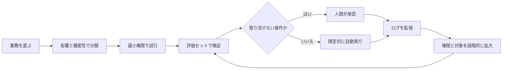

### AIを相談相手から実行部隊へ：OpenAIが示す「フロンティア企業」とセキュリティの条件

世界最高峰の三つ星シェフが自宅のキッチンに来たのに、毎日頼むのは「冷蔵庫の弁当を電子レンジで温めて」だけ。空腹は満たせるが、せっかくの腕前をほとんど使えていない。

現在の企業AI活用でも、これと同じ「もったいない」ことが起きている。社内でChatGPTを使えるようにした。研修も開いた。利用者も増えた。それなのに、依頼は検索、要約、メールの下書きにとどまり、仕事の進め方はあまり変わっていない──。

OpenAIが2026年8月12日に公開した「From assistance to execution: How enterprises put AI to work」は、企業AI活用の差が、もはや「導入したかどうか」では決まらないことを示している。AI利用が上位10%に入る「フロンティア企業」は、標準的な企業と同じモデルを使いながら、アクティブユーザー1人当たりで**8.3倍の出力トークン**を生成していた。1月時点では2.6倍だったので、5ヶ月で約3倍に開いたことになる。

ただし、結論は「AIに大量の文章を書かせれば勝てる」ではない。**フロンティア企業が先行している本質は、AIを回答者として使う段階から、社内の文脈と道具を渡して仕事を任せる段階へ移っていることにある。**

そして、ここから先に進む企業が避けて通れないのがセキュリティだ。本稿では発表ページ、同時公開された「Enterprise Signals」、ワーキングペーパー「How Organizations Use AI: Evidence from ChatGPT」を読み解き、相談相手だったAIを安全な実行部隊へ変える条件を考える。

---

#### 最初に整理：発表されたのは「1本のレポート」ではない

OpenAIの発表ページは、性格の異なる2つの調査をまとめた案内になっている。

| 資料                     | 主な問い                           | 対象・特徴                                                                                          |
| ------------------------ | ---------------------------------- | --------------------------------------------------------------------------------------------------- |
| Enterprise Signals       | 先行企業はAIをどう使っているか     | OpenAIのグローバルな企業顧客を集計。フロンティア企業と標準的企業、ChatGPTとCodexを比較              |
| How Organizations Use AI | AIは企業・職種・役職にどう広がるか | 2026年3月までのChatGPT Enterprise管理データを財務情報、職位、タスク分類と接続したワーキングペーパー |

後者の労働者レベル分析は、導入6ヶ月後の時点で1,764組織・17,446,551件のメッセージを含む。タスク分類にはそのうち973組織・8,696,657件が使われた。個々のメッセージを研究者が読むのではなく、自動分類した結果を匿名化・集計している。

この2つは対象期間が違う。論文の期間（2026年3月まで）は利用の大半をChatGPTが占める一方、発表ページは同年6月時点でCodexが出力の多数を占めると述べる。矛盾ではなく、エージェント利用が数ヶ月単位で急拡大している別々の時点を見ている。

#### 「相談」と「実行」は何が違うのか

単純化すると、アシスタントは相談に乗る人、エージェントは道具を持って作業する人だ。

| 使い方             | 人間の依頼                           | AIが返すもの                                             |
| ------------------ | ------------------------------------ | -------------------------------------------------------- |
| Assistance（支援） | 「このプレゼンはどう作ればいい？」   | 構成案や助言                                             |
| Execution（実行）  | 「社内資料を調べてプレゼンを作って」 | 情報収集からファイル作成までを行い、確認用の成果物を提出 |

相談型では、AIの回答を人間が読んだ後に手を動かす。実行型では、AI自身がファイルを開き、情報を探し、資料を編集し、複数の手順を続けて成果物を作る。

OpenAIは、意味のある仕事を最後まで進めるエージェントには3要素が必要だと整理している。

- Context（文脈）：社内ルール、過去資料、顧客情報など、仕事を理解するための情報
- Tools（道具）：ブラウザ、ファイル、業務システム、コード実行環境など、作業するための手段
- Persistence（継続性）：一度答えて終わらず、目標を達成するまで複数ステップを進める力

三つ星シェフに当てはめれば、文脈は「100人が出席する明日の結婚式」、道具はオーブンやミキサー、継続性はケーキが完成するまで工程を進める力だ。「スポンジケーキの焼き方を教えて」と質問するだけでは、料理は完成しない。モデルの賢さだけでなく、仕事に必要な文脈・道具・時間を組織側が設計できるかが差になる。

#### 格差はどこまで開いたか

Enterprise Signalsは、毎月の「アクティブユーザー1人当たり出力トークン」で企業を順位付けする。上位10%がフロンティア企業、45〜55パーセンタイルの中央10%が標準的企業だ。業界別に見ても、情報・テクノロジーの11.7倍から製造業の5.3倍まで、すべての主要業界で差が確認された。

ここでトークンとは、AIが文章やコードを処理・生成するときの文字のかたまりを指す。長い処理や複数ステップの作業ほど増えやすいため、OpenAIは「AIにどの程度の仕事を任せているか」を見る代理指標として使っている。

**ただしトークン数は、売上でも生産性でも品質でもない。** 価値の高い短い回答もあれば、長いだけで役に立たない出力もある。この留保はOpenAI自身も明記しており、本稿の数字はすべて「利用の深さ」の話として読んでほしい。

#### 企業向けAI出力トークンの64%をCodexが占める

2026年6月、企業顧客におけるChatGPTとCodexの合計出力トークンのうち、64%をCodexが占めた。OpenAIはこれを、質問への回答から、長く複雑な仕事の委譲へ移るシグナルと見ている。

Codexはソフトウェア開発から広がったが、伸び率が高いのは非エンジニア部門だ。2026年2月以降の週間アクティブ企業ユーザー数は、法務で108倍に増えている。

| 職種             | 週間アクティブCodexユーザーの伸び |
| ---------------- | --------------------------------: |
| 法務             |                             108倍 |
| 営業             |                              41倍 |
| 採用             |                              41倍 |
| マーケティング   |                              26倍 |
| エンジニアリング |                               5倍 |

これは法務の利用者数がエンジニアより多いという意味ではない。小さかった出発点からの倍率なので、絶対数はこのデータからは分からない。それでも、エージェントが「コードを書く人だけの道具」ではなくなった方向性は明確だ。

#### 先行企業は「接続」と「再現」に投資している

エージェントは、汎用チャット画面だけでは会社固有の仕事を完了できない。そこで重要になるのが、社内データや業務システムにつなぐPluginと、手順を再利用可能にするskillだ。

| 高度な機能の週間利用率 | フロンティア企業 | 標準的企業 |
| ---------------------- | ---------------: | ---------: |
| Plugins                |              21% |         9% |
| skills                 |              19% |         3% |

たとえば営業用Pluginなら、社内の営業手順を記したskillと、顧客管理システム（CRM）への接続を組み合わせられる。最新の顧客情報と過去の提案書を参照して回答案を作れるわけだ。個人が毎回ゼロからプロンプトを書くのではなく、うまくいった仕事の進め方を、組織で再利用できる形にするのがポイントになる。

OpenAI社内ではアクティブユーザーの95%が毎週Pluginを使うという。これはAIを開発する特殊な企業の内部事例なので、一般企業の目標値ではなく「上限の目安」として見るのがよい。

OpenAIが紹介するVirgin Atlanticの事例では、エンジニアリングチームが従来2週間かけていたレガシーコードの改善を30分で行い、プロダクトチームは数週間分の競合調査を数時間で完了させ、同社の5ヶ年デジタル戦略に活用したという。ただしこれは掲載された顧客事例であり、条件や品質を統制して測定された生産性効果ではない。

#### 導入企業の中でも、利用は広く不均一

ワーキングペーパーによれば、ChatGPT Enterpriseの総出力トークンは2025年6月から2026年3月までに約7倍へ増えた。新規導入企業が増えただけではない。2025年6月までに導入済みだった企業群だけを追っても約4倍で、成長のおよそ半分は既存導入企業の利用深化から生じている。

一方、同じ会社の中でも使い方は一様ではない。

- 導入6ヶ月後の週間アクティブユーザーは、管理職・部長級が約24%、一般社員・専門職が15%、上級専門職が14%、経営層が10%、若手・研修生が7%
- 若手・研修生は、同じ企業の平均的なアクティブユーザーより週に約8〜9件多くメッセージを送る
- アナリストやマーケティング・広報職は利用強度が高く、経営層は相対的に低い

発表ページも、導入6ヶ月後の若手社員は経営層より週13件多くメッセージを送ったとまとめている。「経営層が旗を振り、若手が実際の使い方を発見する」という構図だ。

だとすればリーダーの役割は、自分が若手に負けないほどメッセージを送ることではない。**どの現場で、誰が、どの仕事を数週間から数時間へ短縮したのかを見つけ、その手順・Plugin・skill・確認方法を共有資産へ変えること**になる。OpenAI自身も、成功した個人のワークフローを共有の働き方へ変えることを実務方針として挙げている。

#### AIは一部の仕事ではなく、知識労働全体に広がった

導入6ヶ月後の1週間に、アクティブユーザーが少なくとも一度使ったタスクを見ると、用途の広さが分かる。

| タスク                   | 利用した週間アクティブユーザーの割合 |
| ------------------------ | -----------------------------------: |
| 文書作成・技術文書       |                                56.3% |
| 技術的なデジタル作業     |                                49.6% |
| 対人メッセージ           |                                41.1% |
| トピックの概要把握       |                                38.9% |
| 事実・数値の確認         |                                28.7% |
| 非技術的な専門・学術作業 |                                27.0% |
| ビジネス・市場調査       |                                21.4% |

利用は文章作成に偏っているものの、調査、計画、データ分析、法務、財務まで長い裾野がある。論文は生成AIを、特定業務だけを置き換える専用機ではなく、幅広い知識労働に応用される汎用技術として捉えている。

#### 「大企業だから使える」のか、「使ったから大企業になった」のか

米国上場企業の比較では、ChatGPT Enterprise導入企業は非導入企業より大きく、研究開発や組織能力への投資も多かった。

| 2024年の中央値 |     導入企業 |  非導入企業 |
| -------------- | -----------: | ----------: |
| 売上高         | 22.751億ドル | 2.096億ドル |
| 総資産         | 43.942億ドル | 6.676億ドル |
| 従業員数       |      2,934人 |       424人 |
| 時価総額       | 49.972億ドル | 3.164億ドル |
| 研究開発費     |  1.131億ドル |   990万ドル |

さらに、売上高が上位5%の企業は導入確率が9.8ポイント高く、同じ業界・年度の中で比べても11.3ポイント高かった。

重要なのは順序だ。この研究が示すのは、**もともと大きく、組織能力へ投資してきた企業ほど早く導入しているという相関**であって、導入したから売上や時価総額が増えたという証明ではない。実務的な示唆は、モデルだけ購入しても、データ基盤、業務設計、研修、ガバナンスといった補完的な能力がなければ価値に変わりにくい、という点にある。

#### 考察：実行型AIで重要になるのは「セキュリティ」

ここまではOpenAIの調査結果だが、ここからは筆者の考察として読んでほしい。

相談型AIから実行型AIへ進むほど、便利さとリスクは同じ根から大きくなる。文脈を増やせば回答は良くなるが、機密情報へ触れる範囲も広がる。道具を与えれば作業を完了できるが、誤った更新や外部送信も可能になる。継続性を持たせれば長い仕事を任せられるが、人が見ていない間に誤りが連鎖しうる。

チャットAIへの相談なら、間違った回答を読んだ人が採用しなければ被害を止められる。エージェントがCRMを書き換え、取引先へメールを送り、コードを本番環境へ反映するなら、**回答の誤りがそのまま行動の誤りになる**。

つまり、フロンティア企業になるためのセキュリティとは、入口でAIを全面禁止することでも、信頼して全面開放することでもない。「どこまでなら任せてよいか」を技術と業務の両方で細かく設計する能力ではないだろうか。

OpenAI自身もEnterprise Signalsで、先行企業はエージェントが動ける場所、アクセスできる情報、実行できる操作、人が確認すべき高リスク判断に明確なルールを設けると説明している。NISTの生成AI向けリスク管理プロファイル（AI 600-1）も、用途のリスク階層化、人による追加レビュー、追跡・記録、管理者による監督を挙げている。

セキュリティはAI活用を止めるブレーキではない。カーブに応じて安全な速度を上げるための、ブレーキ・ガードレール・計器盤のセットと考えた方がよい。

#### 大前提：組織が管理できる環境であること

以下の4つは、会社が管理できるワークスペースまたはAPI環境でAIを使うことを前提にしている。

OpenAIの法人向け製品では、組織データを既定でモデル学習に使わず、保存時はAES-256、通信時はTLS 1.2以上で暗号化するとしている。さらに、対応する製品や契約条件に応じて、SSO、アカウント管理、権限設定、データの保持期間・保管地域、監査ログなどを利用できる。すべての機能が全製品で使えるわけではないが、組織が利用を管理するための基盤になる。

一方、社員が個人アカウントを使っていると、会社は入力できる情報や利用機能を一元的に制御しにくく、誰が何をしたかも十分に追跡できない。ワーキングペーパーも、法人ワークスペース外での利用は観測できない可能性を指摘している。相談型でも機密情報の入力は問題になり得るが、業務システムを操作する実行型AIでは、権限と操作履歴を管理できなければ事故の検証すら難しい。

重要なのは、ChatGPT Enterpriseなどの法人向けサービスを契約すること自体ではなく、組織がID、権限、データ、操作履歴を一元的に管理できる状態を整えることだ。**この管理基盤が、以降のセキュリティ設計を成立させる前提条件になる。**

#### セキュリティの壁を越える4つの設計

##### 1. AIではなく「業務」をリスク分類する

「ChatGPTを許可するか」という製品単位の議論では粗すぎる。同じAIでも、公開情報から社内向け下書きを作る仕事と、顧客データを使って契約を締結する仕事では危険度が違う。

| リスク層 | 例                                             | 基本方針                                       |
| -------- | ---------------------------------------------- | ---------------------------------------------- |
| 低       | 公開情報の調査、文章の下書き                   | 自動実行し、事後確認できる                     |
| 中       | 社内文書の検索、分析、更新案の作成             | 対象データを限定し、実行前に確認する           |
| 高       | 外部送信、支払い、契約、本番変更、個人情報処理 | 強い本人確認、複数人承認、厳格なログを要求する |

分類の基準は「AIが賢いか」ではなく、誤ったときの影響、元に戻せるか、機密性、法的責任で決める。

##### 2. 「読めるが書けない」権限から始める

エージェントに人間と同じ管理者権限を与えてはいけない。専用のIDを用意し、必要なシステム・データ・操作だけを許す最小権限から始める。

最初は情報を読む、下書きを作る、変更差分を提示するところまで。評価が積み上がった業務だけ、限定された書き込み権限を段階的に開く。この順序なら、失敗を学習材料にしながら被害範囲を小さく保てる。

##### 3. 承認は「不可逆な操作」の手前に置く

全ステップを人が確認すれば安全に見えるが、それでは実行型AIの価値が消える。一方、すべてを自動化すれば事故時の損失が大きい。そこで、外部への公開・送信、金銭移動、契約確定、本番環境の変更、個人情報の利用など、取り消せない操作や影響の大きい操作の直前に承認を置く。低リスクな情報収集や下書きは自動化し、決定権は人間に残す。

ここで混同しやすいのが、前提として挙げたベンダー側のデータ保護との違いだ。暗号化もアクセス管理も監査ログも、土台としては欠かせない。だが、それらが整っていればエージェントの業務も安全になる、というわけではない。正規ユーザーの権限で、AIが間違った相手に正規のメールを送る事故は、暗号化では防げないからだ。**データが守られているかと、AIの行動が許容範囲かは、別々に確認する必要がある。**

##### 4. 評価・ログ・停止手段を先に用意する

エージェントに曖昧な仕事を渡し、「賢そうだから大丈夫」で本番化してはいけない。代表的なケース、例外、悪意ある入力を含む評価セットを作り、正確性、根拠、所要時間、コスト、権限逸脱の有無を測る。まずは人間の作業を変えずに裏で結果を比較し、次に少数チームや低リスク案件だけで動かす限定運用へ進む。信頼はモデル名ではなく、自社業務で蓄積した評価結果から作る。

同時に、誰が依頼し、どのデータを読み、どの道具を使い、何を変更し、誰が承認したかを追跡できる状態にしておく。各ワークフローに業務責任者を置き、異常時に権限を止める手段、変更を戻す方法、インシデント報告の経路を本番化前に決める。運用ログは監視だけでなく、どの仕事なら次に自動化範囲を広げられるかを判断する材料にもなる。

#### フロンティア企業とは「AIに任せる会社」ではなく「任せ方を学べる会社」

今回の調査から見える企業差は、モデル性能の差ではない。同じモデルに、どれだけ良い文脈を渡せるか、必要な道具を安全につなげられるか、成果を評価して再利用可能な手順にできるかの差だ。

だからこそ、セキュリティはフロンティア化の反対側にあるのではない。権限、承認、評価、監査が未設計なら、エージェントへ重要な仕事を任せられず、企業はいつまでも「相談」の段階にとどまる。逆に、リスクに応じて委譲範囲を変えられる企業は、小さな安全な成功から学び、実行できる仕事を段階的に増やせる。**セキュリティ成熟度そのものが、AIに任せられる仕事の上限を決める**のである。

一歩先を考えると、将来の経営者に必要な資質は「多数の人を管理する力」から「多数のAIエージェントを指揮する力」へ移っていくかもしれない。これは調査の結論ではなく筆者の仮説だが、AI群を動かす技術だけでは足りないはずだ。どの目的を追わせ、どこで人が判断し、事故時に誰が責任を負うかを設計する力まで含めて、これからのマネジメント能力になるだろう。

#### 調査の条件：この数字はどこまでの話か

ここまでの数字が何を指しているかを、条件のほうから見ておきたい。以下はワーキングペーパーの結論部と脚注に書かれている調査条件である。

- 測定範囲：測っているのはOpenAIのChatGPT Enterprise内の利用で、他社製AI、API経由のツール、自社開発アプリ、個人アカウントでの利用は入っていない
- タスク分類の射程：分類はメッセージ内容に基づくもので、その後の成果物、生産性への効果、業務手順の変化は対象外
- 職種別の割合は「構成比」：職位情報は不完全で職種ごとの全従業員数が分からないため、示されているのはアクティブユーザーの構成比であり、「その職種の何%が使っているか」ではない
- 相関として設計されている：企業属性と導入確率の関係は条件付きの相関であり、因果として解釈すべきではないと明記されている
- 「非導入企業」の定義：ChatGPT Enterpriseのアカウントと照合できなかった企業を指す。AIを使っていないという意味ではなく、他社製品を使っている場合も含まれる
- 財務比較の母集団：財務データと紐付けられた米国上場企業

もう1つ、フロンティア企業という区分も定義から確認しておきたい。これは「アクティブユーザー1人当たり出力トークン」の上位10%であって、利益や品質やセキュリティ成熟度の上位10%ではない。OpenAIが「フロンティア」と名付けた企業群は、AI活用の未来を示す先行指標ではあるが、成功企業の確定ランキングではない。この区別を保つことが、8.3倍という強い数字を冷静に読むために欠かせない。

#### まとめ

- 企業AIは、質問に答える支援型から、道具を使って成果物を作る実行型へ移りつつある
- フロンティア企業のユーザー当たり出力トークンは標準的企業の8.3倍。1月の2.6倍から拡大し、2026年6月にはChatGPTとCodexの合計出力の64%をCodexが占めた
- 先行企業はPluginsを21%対9%、skillsを19%対3%と、会社固有の文脈・道具・手順を扱う機能の利用率が高い
- 利用は職種・役職・タスクを横断して広がる一方、トークン量は事業価値ではなく、生産性向上の因果も証明されていない
- 実行型AIには文脈・道具・継続性が必要であり、その分だけ機密情報、権限、誤操作のリスクも増える
- セキュリティの役割はAIを止めることではなく、業務のリスク分類、最小権限、承認、評価、監査によって安全に委譲できる範囲を広げることにある

AIを相談相手から実行部隊へ変える最後の一歩は、さらに賢いモデルを待つことではないのかもしれない。

どの仕事を、どの情報と権限で、どこまで任せ、誰が結果に責任を持つのか。これを組織の言葉で決められたとき、セキュリティの壁は、AI活用を止める壁から、価値ある仕事へ進むための扉に変わる。

---

**情報ソース：**

[[ogp:https://openai.com/index/how-enterprises-put-ai-to-work/]]

[[ogp:https://openai.com/signals/enterprise-data/]]

[[ogp:https://cdn.openai.com/pdf/how-organizations-use-chatgpt.pdf||How Organizations Use AI: Evidence from ChatGPT|企業向けChatGPTは急速に普及。利用は職種・階層・業務に広がる一方、大規模・無形資産集約型企業ほど導入が早く、組織統合はなお途上にある。（PDF 69ページ）|OpenAI]]

[[ogp:https://openai.com/business-data/]]

[[ogp:https://www.nist.gov/publications/artificial-intelligence-risk-management-framework-generative-artificial-intelligence]]
