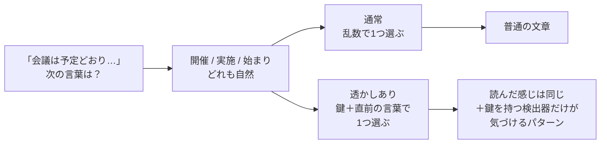
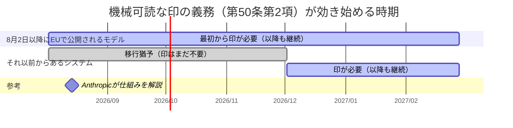
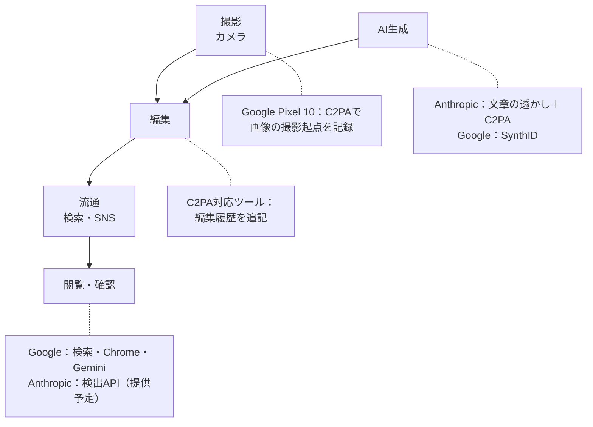
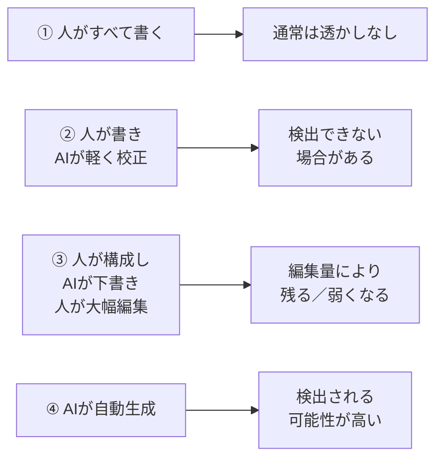

### AnthropicとGoogleの「デジタル透かし」は何が違う？ AIと人間の創作を分けるのではなく、来歴を残す時代へ

目の前に、まったく同じように見える2枚の文章がある。片方は人が書き、もう片方は生成AIが書いた。文章だけを読んで、確実に見分けられるだろうか。

文章に限らない。画像、動画、音声でも生成AIの品質は上がり、見た目だけで判断するのは難しくなった。そこで注目されているのが、人には見えない信号や制作履歴をコンテンツに持たせる「デジタル透かし」や「コンテンツ来歴」の技術である。

2026年8月、AnthropicはClaudeが生成・処理した文章やファイルに、機械が読み取れる印を付ける方針を公表した。一方、Googleは同年5月、AI生成物にSynthIDという透かしを付けるだけでなく、カメラで撮影されたオリジナルや、その後の編集履歴を確認できる仕組みを、Gemini、検索、Chrome、Pixelなどへ広げると発表している。

ここで、**SynthID**は文章や画像などの内容に、人には分かりにくい信号を組み込むGoogleの透かし技術である。一方の**C2PA**は、誰がどの機器やAIを使って作成・編集したかという来歴を、電子署名付きで記録するための業界共通規格だ。大まかには、「中身に埋める印」と「作品に添える履歴」の違いと考えると分かりやすい。

両社の対応をひと言で表すなら、Anthropicは「**Claudeが関与したという信号を出力に残す**」こと、Googleは「AIの使用を含め、コンテンツがたどった履歴を社会全体で確認できるようにする」ことに重心がある。

ただし、両社を完全に二分できるわけではない。Anthropicも制作履歴を記録するC2PAを採用し、GoogleもAI生成物そのものにSynthIDを埋め込んでおり、どちらも「AI作品と人間作品を完璧に二分する魔法の判定器」を提供するものではない。違うのは使う技術ではなく、今回の発表で前面に出た問題設定である。本稿では、まず技術の違いを整理し、そのうえで両社が人間とAIの創作をどのように捉えているのかを考える。

---

#### 最初に整理：「透かし」と呼ばれるものは1種類ではない

ニュースでは一括して「AIの透かし」と呼ばれがちだが、実際には少なくとも3つの層がある。

| 層                   | たとえ                 | 仕組み                                                                         | 主な役割                                 |
| -------------------- | ---------------------- | ------------------------------------------------------------------------------ | ---------------------------------------- |
| コンテンツ内の透かし | 紙幣にすき込まれた模様 | 文章の単語選択、画像の画素、音声の波形などに、人には分かりにくい信号を埋め込む | 対応する検出器でAIの関与を調べる         |
| 来歴情報             | 荷物に付く追跡伝票     | 作成した機器やソフト、編集内容などを暗号署名付きで記録する                     | どこで作られ、どう編集されたかを確認する |
| 表示ラベル           | 食品の成分表示         | 「AIで生成」「AIで編集」など、人が読める表示を出す                             | 閲覧者にその場で知らせる                 |

本稿で登場するC2PA Content Credentialsは、厳密には透かしそのものというより、2番目の「来歴情報」を扱うオープン標準である。画像などに暗号署名付きの履歴書を添付し、記録が後から書き換えられていないかを検証できる。

また、これらは文章の癖からAIらしさを推測する一般的な「AI検出器」とも異なる。透かしの検出は、生成時に意図して埋め込まれた信号を探す。AI検出器は、そのような信号がない文章も含めて、文体などから確率的に推測する。どちらも誤判定の可能性はあるが、見ているものが違う。

#### なぜ2026年8月にAnthropicが動いたのか

直接の契機はEU AI Actである。2026年8月2日から適用された第50条の透明性義務では、生成AIの提供者に対し、技術的に可能な範囲で、AIが生成・加工した文章、画像、音声、動画を機械可読な形で識別可能にすることが求められる。EUの説明では、一般的な編集の補助にとどまり、入力内容や意味を実質的に変えない場合などには例外がある。

EUが公表した実務規範は、生成AIの提供者には機械が読める印と検出手段を、生成物を公開する側にはディープフェイクや一定の公益情報への分かりやすい表示を求めるという、二段構えになっている。実務規範への参加自体は任意だが、第50条の義務は法的な義務である。

Anthropicはこの実務規範に署名し、その実施方法としてClaudeのマーキング方針を説明した。つまり今回の対応には、理念だけでなく、明確な規制上の理由がある。

#### Anthropicの対応：Claudeが「触れた」ことを出力に残す

Anthropicが示した方法は2つある。

##### 1. 文章そのものに、人には見えない透かしを織り込む

対応するClaudeモデルが文章を生成すると、文章自体に人には知覚できない透かしが埋め込まれる。特殊な見えない文字を末尾に付けるという説明ではなく、モデルの生成段階で文章に織り込む方式である。そのため、コピーして別のアプリへ貼り付けても信号は移動し、一部の編集後にも残る可能性がある。

Anthropicは2026年8月14日の公式解説で、Claudeの透かしは、Google DeepMindが2024年にNatureで発表した**SynthID Textを基にした方式**だと明らかにした。見えない文字や情報を文章へ付け足すのではなく、モデルが自然な候補から次の言葉を選ぶ方法を利用する。検出用APIも近く提供する予定だが、実装の詳細は検討中とされている。

##### 「文章の中に透かしを入れる」とは、どういうことか

以下ではAnthropicの公式解説と、Googleが公開したSynthID Textの論文・ソースコードを基に、Claudeが採用する文章透かしの基本原理を説明する。製品版における鍵の管理や検出APIの細部まですべて公表されたわけではないが、どのように言葉の並びへ信号を残すかは公式に説明されている。

まず知っておきたいのは、文章生成AIが、完成した文章を倉庫から取り出しているわけではないということだ。AIは、それまでに書いた内容を手がかりに「次に続きそうな言葉」を予測し、文章を少しずつ組み立てている。

AIの内部では、文章は「トークン」という単位で扱われる。トークンは単語そのものの場合もあれば、単語の一部、助詞、句読点の場合もある。たとえば「会議は予定どおり」という途中までの文章に続く候補として、「開催」「実施」「始まり」といった複数の自然な表現が考えられる。AIは各候補に「次に来る確率」を付け、その中から1つを選ぶ。

文章透かしは、この**複数の自然な候補から選ぶ瞬間**を利用する。

仕組みを大幅に単純化すると、次のようになる。

1. AIが、次に使える自然なトークンの候補と、それぞれの確率を計算する
2. ほぼ同じように適切な候補が複数ある場合、通常は乱数を使って1つを選ぶ
3. 透かしを使う場合は、任意の乱数の代わりに、秘密の「鍵」と直前のいくつかの言葉から導かれる値を選択に使う
4. この選択を文章の最後まで繰り返し、鍵を知る検出器だけが確認できるパターンを残す

図にすると、次のようになる。

出発点の候補は同じで、違うのは選び方だけである。だからこそ、読み手に届く文章の質は変わらないまま、検出できる痕跡だけが残る。

ここでいう「鍵」は、特定の単語をいつも優先する単純な単語帳ではない。同じ言葉でも、それ以前の文脈によって選択結果が変わる。Anthropicの説明では、通常なら「曇っている」と「どんよりしている」のどちらでも自然な場面で、鍵と直前の言葉を使って選択を決める。一方、通常なら選ばない不自然な単語を透かしのために押し込むわけではない。

Anthropicは、社内試験で文章の内容、創造性、読みやすさへの影響は確認されなかったとしている。また、基になったSynthID Textの研究では、Gemini本番環境で透かしあり・なしを合わせて約2,000万件の応答を調べ、利用者が付けた高評価率の差は0.01%、低評価率の差は0.02%で、いずれも統計的に意味のある差ではなかった。これとは別に、Gemma 7B-ITというモデルへELI5という説明問題集の3,000問を与え、評価者が回答を比較する試験も行われた。文法と文章の一貫性、関連性、正確性、有用性、総合品質の5観点すべてで、透かしの有無による評価の差は確認されなかった。透かしは追加のトークンを生成せず、速度への影響はごく小さく、利用料金も増えないという。

##### 1語では分からないが、長い文章では傾向が見える

コイン投げにたとえてみよう。

コインを1回投げて表が出ても、何も不自然ではない。しかし、説明用の架空の例として、200回投げて表が160回出たなら「偶然だけではなさそうだ」と考えられる。文章透かしもこれに近い。1つの単語だけを見ても普通の文章と変わらないが、何十、何百という選択を集計すると、透かしの規則に沿った候補が偶然より多く選ばれているかを調べられる。

対応する検出器は、文章をトークンへ分解し、生成時と同じ設定を使って各トークンの点数を計算する。そして、文章全体の傾向が「透かしのない文章で偶然起こる範囲」をどれほど超えているかを評価する。

したがって、検出結果は通常、「この秘密の単語が入っているので確定」という判定ではない。「透かしあり」「透かしなし」「判断できない」といった確率的な評価になる。Googleが公開しているSynthID Textの検出器も、しきい値を使ってこの3状態を分けられる。Anthropicが提供予定のAPIも、「Claudeが少なくとも一部の執筆に関わった可能性」を調べるもので、別のAIが書いたかどうかや、人間が書いたことまでは判定できない。

##### なぜコピーしても残り、書き換えると弱くなるのか

この方式では、印がファイルの付属情報ではなく、実際に選ばれた言葉の並びに含まれている。そのため、同じ文章をコピーしてメールや文書ソフトへ貼り付けても、言葉が同じなら信号も一緒に移る。フォントや文字色を変更しただけでも、通常は言葉の並びまで変わらない。

一方、文章を大きく書き換えると、AIが選んだトークンそのものが入れ替わる。すでに透かしが入った文章を別のツールで翻訳したり、別のAIで全面的に言い換えたりすると、新しい選択が大量に行われるため、元の統計的な傾向は弱くなる。

| 操作                             | 透かしへの一般的な影響   | 理由                                   |
| -------------------------------- | ------------------------ | -------------------------------------- |
| そのままコピーする               | 残りやすい               | 言葉の並びが変わらない                 |
| フォントやレイアウトを変える     | 残りやすい               | 見た目だけが変わる                     |
| 数語を修正する                   | 一部が残る可能性がある   | 変更していない部分には傾向が残る       |
| 一部分だけを抜き出す             | 短いほど判定が難しくなる | 集計できる選択回数が減る               |
| 全面的に言い換える               | 大きく弱くなる           | 元のトークン選択が置き換わる           |
| 既存の文章を別のツールで翻訳する | 大きく弱くなる           | 元の言葉とトークンの並びが作り直される |
| Claudeに翻訳させる               | 新しい出力に透かしが入る | 翻訳文の言葉をClaudeが選ぶ             |
| Claudeに軽い校正だけをさせる     | 検出できない場合がある   | Claudeが選び直す言葉が少ない           |

透かしが短文で弱くなりやすいのも同じ理由である。コインを数回投げただけでは偏りを判断しにくいように、短い文章では検出に使える選択の数が足りない。

また、「フランスの首都は？」のように答えがほぼ決まっている質問や、正確な引用、コードなどでは、意味を変えずに選べる候補が少ない。正解やコードの動作を変えるような場面では透かしの調整を行わず、どちらでもよい言葉を選べる部分、たとえばコード中のコメントなどに限って働くことがある。このため、自由度の高い長文よりも透かしは疎らになる。

##### 透かしは、AI文章を見破る万能鑑定ではない

この方式が検出するのは「AIらしい文体」ではなく、特定の生成システムが埋め込んだ規則と整合するかであり、対応していないAIの文章は原則として対象外だ。また、判定基準を厳しくすれば見逃しが増え、緩くすれば誤検出が増えるという関係もある。

##### 2. 生成ファイルに、署名付きの来歴情報を付ける

ClaudeがSVG、PNG、JPEGなどの対応ファイルを生成・処理した場合は、C2PA標準に準拠した署名付きの来歴情報を付ける。これを確認すると、そのファイルがClaudeによって処理された可能性と、署名後にファイルが改変されたかを調べられる。

この対応はClaudeのチャット画面だけに限られない。対応モデルであれば、API、Claude Code、Claude Cowork、Claude Tag、さらにAWS、Google Cloud、Microsoft Foundry経由の利用にも文章の透かしが適用され、提供地域では世界共通で使われる方針である。一部のファイル形式や提供基盤では、来歴情報に未対応の場合がある。

ここで注意したいのは、**すべての既存Claudeモデルの過去と現在の出力に、直ちに透かしが付いたわけではない**ことだ。公式説明の対象は、EUで2026年8月2日以降に公開される対応モデルで、印自体はそのモデルが提供される世界各地の出力に付く。それ以前から市場に提供されている生成AIシステムには、EU側で2026年12月2日までの移行猶予が設けられており、Anthropicも旧モデルへの対応を進めているとしている。

ここは、モデルがいつ公開されたかによって適用の時期が変わる。図にすると分かりやすい。

灰色の帯が猶予期間である。8月2日を境に新しいモデルはすぐ義務の対象になり、それ以前からあるシステムは12月2日に合流する。

#### Anthropicの印が示すのは「作者」ではなく「関与」

Anthropicの説明で最も重要なのは、自社の印を「AIが作者である証明」とは位置付けていない点だ。

たとえば、人が最初から書いた文章をClaudeに渡し、誤字を直してもらったとする。軽い校正なら、Claudeが実際に選び直す言葉が少なく、透かしを検出できない場合がある。反対に、大幅な編集、要約、翻訳ではClaudeが選ぶ言葉が増え、検出可能性も高くなる。しかし、元のアイデアや文章を書いたのが人間なら、透かしだけを根拠にClaudeを単独の作者とは呼べない。

逆に、透かしが見つからないことも、人間が書いた証明にはならない。この点は後半で詳しく整理する。

したがって、Anthropicの設計思想を公式説明に沿って表現するなら、**作者を判定するのではなく、Claudeが制作工程に入った可能性を示す補助信号を残す**というものになる。

Claudeの透かしには、利用者を識別する情報は含まれない。Anthropicは、透かしやその鍵から、特定の個人、組織、会話へさかのぼることはできないと明記している。分かるのは、対応するClaudeがその文章の作成や処理に関わった可能性までである。

Anthropicは、EU向けに限らず世界共通で透かしを適用する理由も説明している。現時点では地域別に透かしを確実かつ持続的に切り替える方法がないため、対応モデルの公開時から世界で適用するという。今後も別の方法を評価し、変更があれば公表するとしている。

#### Googleの対応：AI側の透かしと「本物側の履歴」を両方広げる

GoogleのSynthIDも、AIが作ったコンテンツに人には分かりにくい信号を埋め込む技術である。対象は文章だけでなく、画像、動画、音声にも及ぶ。

- 文章では、自然な候補から次の単語や文字のまとまりを選ぶ過程に、鍵で検出できるパターンを組み込む
- 画像や動画では、人の見た目をほぼ変えない形で画素に信号を埋め込む
- 音声では、人の耳には聞こえにくい形で信号を埋め込む

Googleによると、2026年5月までに1,000億以上の画像・動画と、6万年分に相当する音声へSynthIDを適用した。GoogleのAI製品に閉じず、OpenAI、Kakao、ElevenLabsなども導入を進め、テキスト向け技術はオープンソース化されている。

今回のGoogleの発表で特徴的なのは、透かしを付ける量だけではない。一般の利用者がその信号や来歴を確認できる「入口」を増やしたことにある。

画像、動画、音声をGeminiに渡してAI生成かを尋ねる機能に加え、SynthIDの確認をGoogle検索とChromeへ拡大する。さらにGoogle Cloudでは、企業が自社サービス上のコンテンツを検査するためのAPIを提供する。透かしを埋め込む技術から、日常的に確認できる社会基盤へ進めようとしている。

Googleはさらに2026年8月14日、Nano Bananaによる画像、Omniによる動画、Lyriaによる楽曲に表示される可視ウォーターマークを、GeminiとFlowでオンまたはオフにできるよう順次提供すると発表した。Google検索にも後から対応する予定で、法令によって可視ウォーターマークが必要な国は対象外となる。ただし、オフにできるのは作品上に見える印だけで、人には見えにくいSynthIDとC2PAの来歴情報は残る。これは透明性をなくす変更ではなく、作品の「見せ方」は利用者に委ねながら、機械による「検証可能性」は維持するという二層構造である。

#### Googleが重視するもう半分：「AIではない」と推測するのではなく、撮影時点を記録する

GoogleはSynthIDと並行して、C2PA Content Credentialsも拡大している。Pixel 10は、標準カメラアプリで撮影した画像にContent Credentialsを付ける最初のスマートフォンとなった。さらにGoogleは2026年5月の発表で、Pixel 8、Pixel 9、Pixel 10による動画撮影にも、今後数週間以内に対応を広げる予定だと説明した。撮影の瞬間に来歴情報を付けることで、「この端末のカメラで撮影された」という出発点を記録する。その後、対応ソフトで編集すれば、何の道具でどのような変更を加えたかを履歴としてつなげられる。

これは発想の向きが重要である。

AI生成物だけに印を付ける仕組みでは、印がないコンテンツについて何も証明できない。透かしに未対応のAIで作られたのかもしれないし、透かしが消されたのかもしれない。そこでGoogleは、**「AIの印がないから人間の撮影だろう」と消去法で考えるのではなく、撮影の瞬間からオリジナルの来歴を積み上げる**方法を併用している。

Googleは公式発表で、AIを使って作成・編集された時点を知ることと同じくらい、未編集のオリジナルの写真や動画を識別することが重要だと説明している。Metaなど他社のサービスでも同じ来歴情報を読めるよう、C2PAという業界標準と相互運用性を重視しているのも特徴だ。

#### 両社の違いを比較する

まず、制作から閲覧までの流れのどこに両社が手を入れているかを見てみよう。

Anthropicは「AI生成」の一点に絞って確実な印を残し、Googleは撮影から確認までの各段階に手を伸ばしている。工程そのものは共通で、押さえている場所が違う。

そのうえで、今回の発表で示された「考え方の重心」を整理すると、次のようになる。

| 観点           | Anthropic                                        | Google                                                   |
| -------------- | ------------------------------------------------ | -------------------------------------------------------- |
| 直接の契機     | EU AI Act第50条への対応                          | 生成メディア時代の検索・流通全体の信頼性向上             |
| 前面に出た問い | この文章やファイルにClaudeが関与したか           | このメディアはどこで作られ、どう編集されたか             |
| 主な手段       | 文章内の透かし＋ファイルのC2PA来歴情報           | SynthID＋C2PA＋検索・ブラウザ・クラウドでの検証          |
| 広げ方         | 対応Claudeモデルの全製品・提供地域へ一貫して適用 | Pixelから検索、Chrome、Gemini、Cloud、他社モデルまで接続 |
| 利用者の選択   | オフにする方法は案内されていない           | 一部製品で可視透かしをオフにできるが、SynthID・C2PAは残る |
| 人間との境界   | Claudeの関与は示せても、著者や寄与率は判定しない | AIの有無だけでなく、撮影・編集の履歴を提示する           |

ここから先は、両社が明言した将来予測ではなく、発表内容から読み取れる筆者の解釈である。

AnthropicはAIモデルの提供者として、まず自社モデルから出ていくものに一貫した信号を持たせようとしている。いわば、製造元が出荷物に検査可能な印を付ける発想だ。規制対応として対象を明確にしやすく、APIや他社クラウドを経由しても同じモデルなら印を付けられる。

GoogleはAIモデルの提供者であると同時に、スマートフォン、検索、ブラウザ、動画プラットフォーム、クラウドを持つ。そこで、生成時の印だけでなく、撮影、編集、流通、閲覧、検証までをつなぐ方向へ進んでいる。製品に印を付けるだけでなく、原材料から店頭まで追える履歴網を作る発想に近い。

#### 目指しているのは「AIと人間の棲み分け」ではない

ここまでを見ると、AI作品と人間作品の間に太い境界線を引く技術のように思える。しかし、実際の創作はすでに二択ではない。

1. 人が考え、人が書き、人が編集する
2. 人が書き、AIが校正や翻訳をする
3. 人が構成と指示を作り、AIが下書きし、人が大幅に編集する
4. AIがほぼ自動で大量生成する

2と3は、人間とAIの共同制作である。ところが、単純な透かしが答えられるのは「対応AIが工程に関わった可能性」までで、人間がどれだけ考え、選び、直し、責任を負ったかまでは分からない。

この4つに、これまで見てきた透かしの挙動を当てはめると、次のようになる。

②と③はどちらも人間とAIの共同制作なのに、透かしの答えは割れる。しかも実際の制作は、この4つにきれいに分かれるわけではなく、②と③の境目は連続的である。透かしは、その連続した実態を「関わった可能性があるか」という一本の線で切っているにすぎない。

このため今後の棲み分けは、「AIが作った領域」と「人間が作った領域」を作品単位で塗り分ける形にはなりにくい。むしろ、**どの工程でAIを使い、誰が編集判断を行い、最終的に誰が責任を持つのかを説明できること**が、人間の創作上の役割として重要になる。

Googleの来歴重視は、この共同制作に比較的なじみやすい。履歴が十分に残れば、撮影はカメラ、背景除去はAI、色調整は人、最終公開は出版社というように、工程として見せられる。一方、Anthropicの広いマーキングは、少なくともClaudeの関与を見えないままにしないための基礎信号になる。

両者は競合する考えではなく、組み合わせるべき層だと考えた方がよい。

#### 透かしが証明しない4つのこと

デジタル透かしや来歴情報が普及しても、次の4つは自動的には分からない。

##### 1. 内容が真実か

カメラで本当に撮った写真でも、演出された場面かもしれない。古い写真を別の事件の写真として紹介することもできる。C2PAが証明するのは記録の出所や改変の有無であって、写っている出来事や説明文の真実性ではない。

##### 2. 品質が高いか

AIが作った文章でも正確で有用な場合があり、人間が書いた文章でも誤りはある。「AIの印」は低品質マークではない。

##### 3. 誰が作者か

透かしはAIツールの関与を示せても、アイデアを出した人、構成した人、最終判断をした人を確定しない。著作権上の作者性や創作への寄与は、別途検討が必要である。

##### 4. 印がないものは人間製か

すべてのAIが同じ透かしに対応しているわけではなく、加工で信号やメタデータが失われることもある。印がないことを、人間が作った証明として扱ってはいけない。

NISTも、透かし、来歴追跡、ラベル、検出、メディアリテラシーはそれぞれを補完するもので、単一の技術だけで合成コンテンツの問題を解決できるとはしていない。C2PA自身も、Content Credentialsは偽情報の万能薬ではなく、来歴情報が事実かどうかの価値判断までは行わないと説明している。

#### 創作者、企業、学校はどう向き合えばよいか

透かしを「AI使用者を捕まえる道具」として導入すると、校正だけにAIを使った文章まで、全自動生成と同じ扱いになりかねない。実務では、検出結果より先にルールを細かくする必要がある。

##### 創作者

- 元データ、下書き、撮影素材、編集履歴を保管する
- C2PA対応の機器やソフトを使う場合、書き出し時に来歴情報を不用意に削除しない
- 必要に応じて「構成は本人、校正にAIを使用」など、AIを使った工程を短く説明する
- 透かしの有無ではなく、自分が行った選択と編集判断を説明できるようにする

##### 企業やメディア

- 「AIを使ったか」だけでなく、生成、校正、翻訳、画像編集など用途別の開示基準を作る
- 公益性の高い情報では、担当者の確認と編集責任を明確にする
- 検出器の結果だけを根拠に、公開停止や処分を自動化しない
- 来歴情報が途中で失われない公開・配信フローを整える

##### 学校

- AI使用を一律の二択で申告させるのではなく、発想、調査、構成、執筆、校正のどこで使ったかを記録させる
- 透かし検出を不正の確定証拠にせず、草稿や参考資料、本人への確認と組み合わせる
- 完成文だけでなく、考え方と制作過程を評価する

#### まとめ：作品に必要になるのは「国籍」ではなく「履歴書」

Anthropicの対応は、Claudeの関与を出力側に一貫して残す方向へ踏み出したものだ。Googleの対応は、AI生成物にSynthIDを付けるだけでなく、人がカメラで撮影した起点や、その後の編集履歴をC2PAでつなぎ、検索やブラウザから確認できるようにするものだ。

両社に共通するのは、見た目だけでAIか人間かを当てる時代には戻れない、という前提である。異なるのは、Anthropicがまずモデルの出力を広くマーキングすることに重心を置き、Googleが制作から流通、検証までの来歴網を広げている点だ。

ただし、透かしは作者証明でも、品質保証でも、真実の認証でもない。AIが少しでも関わった作品を「AI作品」と一括りにすれば、人間とAIの共同制作の実態を見失う。反対に、印のないものを無条件に人間の作品として信頼するのも危険である。

これから重要になる問いは、「これはAIか、人間か」だけではない。

**誰が発想し、どの道具をどの工程で使い、誰が確認し、誰が最終的な責任を持つのか。**

デジタル透かしと来歴情報は、その問いに答えるための手がかりである。人間とAIを隔てる壁というより、共同制作の中身を説明するための履歴書として育てられるかどうかが、今後の鍵になる。

---

**情報ソース：**

[[ogp:https://www.anthropic.com/news/claude-text-watermark]]

[[ogp:https://support.claude.com/en/articles/16266773-how-claude-marks-ai-generated-content]]

[[ogp:https://blog.google/intl/ja-jp/company-news/technology/identifying-ai-generated-media-online/]]

[[ogp:https://x.com/joshwoodward/status/2088259242423968162]]

[[ogp:https://techcrunch.com/2026/08/14/google-will-now-allow-users-to-remove-visible-watermark-from-its-ai-generations/]]

[[ogp:https://deepmind.google/blog/watermarking-ai-generated-text-and-video-with-synthid/|https://lh3.googleusercontent.com/uc-x1EODQEwjxin70m_-tT1Jl1C0oTUMjS0KL5sSAaWscwt5lq0tG_Z2ZHHMrClYG_g1eWVjQdAoT0NnxW9mnvnwnHBaDCxi3rtzg72ktMhQam0c=w1200-h630-n-nu-rw|Watermarking AI-generated text and video with SynthID|Announcing our novel watermarking method for AI-generated text and video, and how we’re bringing SynthID to key Google products|Google DeepMind]]

[[ogp:https://deepmind.google/models/synthid/|https://lh3.googleusercontent.com/-B3A1uRdtATbCknA0jRnTG4JBvFxv-2V1J0tH9HweqdKb_YU-IHoBQbPabVC3DcLKVVk9hQiU3Z6P1n_in7zTy-_LYZ0ir3XuCrF-WkM-KUIHLFp9Q=w1200-h630-n-nu-rw|SynthID|SynthID is a tool to watermark and identify AI-generated content, helping to foster transparency and trust in generative AI.|Google DeepMind]]

[[ogp:https://www.nature.com/articles/s41586-024-08025-4]]

[[ogp:https://ai.google.dev/responsible/docs/safeguards/synthid]]

[[ogp:https://github.com/google-deepmind/synthid-text]]

[[ogp:https://digital-strategy.ec.europa.eu/en/policies/code-practice-ai-generated-content]]

[[ogp:https://digital-strategy.ec.europa.eu/en/factpages/quick-facts-transparency-rules-ai-systems]]

[[ogp:https://spec.c2pa.org/specifications/specifications/2.2/explainer/Explainer.html||C2PA and Content Credentials Explainer :: C2PA Specifications|C2PAとContent Credentialsの目的や仕組み、活用例を通じて、デジタルコンテンツの来歴や改変履歴を検証する方法をわかりやすく解説するサイト。|]]

[[ogp:https://www.nist.gov/publications/reducing-risks-posed-synthetic-content-overview-technical-approaches-digital-content]]

[[ogp:https://www.axios.com/2026/08/12/anthropic-claude-watermarks-ai-detection]]
