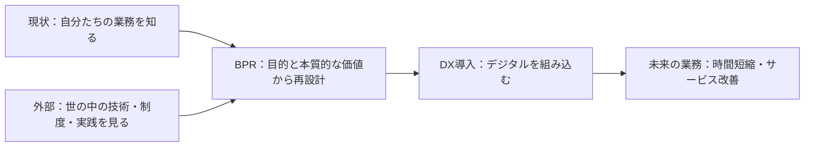
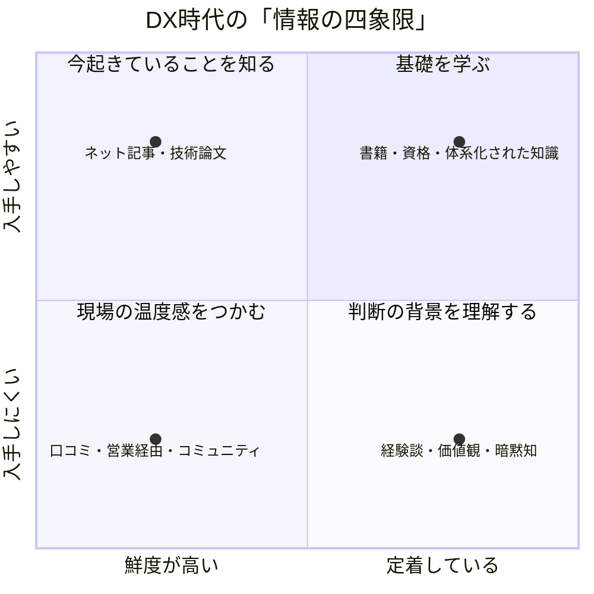

### DX時代の「情報の四象限」──情報の特性を理解し、目的で使い分ける

#### はじめに

私は、民間企業にいた頃からこれまで、DX・ITの現場で業務改善、システム導入、プロジェクト推進に携わってきた実務者です。現在はある自治体でDX推進計画の実行責任者を務める一方、庁内のDX推進アンバサダーや幹部職員向けの研修も担当しています。

私が一貫して伝えているのは、DXの成否はツール選びだけでは決まらず、現状把握と情報収集の質に大きく左右されるということです。目の前の課題を解決する情報だけでなく、まだ自分たちが知らない課題や、他の組織で起きている変化をどう知るか。DXを進めるうえで、情報収集は避けて通れないテーマです。

そこで今回は「情報収集」について取り上げます。中心に置くのは、DX・ITの現場での経験から組み立て、研修で実際に伝えてきた「**情報の四象限**」という整理です。情報を「鮮度」と「入手しやすさ」の二軸で捉え、世の中にあるネット記事や書籍、口コミ、経験知など、性質の異なる情報をどう使い分け、どう組み合わせるか。これを深掘りしていきます。

#### なぜDXに情報収集が必要なのか

##### DXはツール導入だけではない

DXというと、クラウドや生成AIなどのツール選びから始めたくなります。しかし、**ツールは業務の目的を決めてくれません**。現状の業務や、利用者に届けたい価値が曖昧なままでは、従来のやり方をデジタルに置き換えるだけになってしまいます。

##### BPRで業務の土台をつくる

そこで先に置かれるのが、BPR（Business Process Re-engineering）です。自治体のDXでは、システムを入れる前に業務そのものを見直すことがすでに前提になっていて、BPRという言葉も特別なものではなくなりました。

BPRは単なる部分改善ではありません。目的と本質的な価値を軸に、業務を根本から見直し、未来の仕事の姿を描く活動です。現状の業務がどう流れ、どこに重複や待ち時間があるのかを可視化し、そのうえで、デジタルをどこに組み込めば業務時間の短縮やサービスの改善につながるのかを考えます。

##### 二つの視点を揃える

BPRを進めるには、二つの視点が必要です。

- 自分たちを知る：現状の業務を可視化し、正しく把握する
- 世の中を見る：技術・制度・他組織の実践を継続的に収集する

自分たちだけを見ていると視野が内向きになり、外部情報だけを見ていると自組織に合わない施策を選びかねません。双方が揃って初めて、何を変えるべきかを具体的に議論できます。

この記事で掘り下げるのは、二つ目の視点である「世の中を見る」です。DXの情報収集は、単に新しいツールを探す作業ではありません。自分たちの業務を見直すために、外部の知識や現場の声を継続的に取り込む活動なのです。

##### 検索できる情報は、必要な情報のすべてではない

DXや生成AIを調べると、検索画面には大量の情報が並びます。どれを見ればよいのか迷うことのほうが多い時代です。

それでも、情報収集について研修で話すたびに、気になることがあります。

検索できる情報は、必要な情報のすべてではない。

現場で起きていること、まだ記事になっていない試行錯誤、経験者が持つ判断の勘所。こうした情報は、検索だけでは簡単に見つかりません。

##### 情報には特性がある

あなたがDXの仕事で情報収集をするとしたら、何から始めるでしょうか。検索する。ニュースを読む。本を買う。詳しい人に聞く。おそらく、いくつかの方法を組み合わせるはずです。

ここで意識したいのが、**情報にはそれぞれ特性があるということです**。出たばかりの新しい情報なのか、時間を経て定着した情報なのか。文章やデータとして整理された形式知なのか、経験や対話に埋め込まれた暗黙知なのか。誰でも入手できるのか、人とのつながりがなければ届かないのか。

大事なのは、どれか一つを選ぶことではありません。情報の特性を捉え、目的に応じてさまざまな角度から取得することです。その考え方を、私は「情報の四象限」として整理してみました。

#### 情報の四象限

情報を、二つの軸で見てみます。

- 横軸：鮮度が高い ↔ 定着している
- 縦軸：入手しやすい ↔ 入手しにくい

横軸は情報の新しさです。左に行くほど、出てきたばかりで動きの速い情報。右に行くほど、時間をかけて検証され、内容が落ち着いた情報になります。変化の速い話題を追うのか、変わりにくい土台を押さえるのか、という違いです。

縦軸は、その情報にどうやって手が届くかです。上に行くほど、検索する、買う、申し込むといった手段で、誰でも到達できる情報。下に行くほど、人に会う、聞く、その場に居合わせるといった過程を経なければ届かない情報になります。単に手間がかかるということではなく、たどり着く経路そのものが違う、ということです。

この二軸で整理すると、情報源はおおよそ次の四つに分けられます。

|              | 鮮度が高い                               | 定着している                 |
| ------------ | ---------------------------------------- | ---------------------------- |
| 入手しやすい | 最新のネット記事・技術論文               | 書籍・資格・体系化された知識 |
| 入手しにくい | 口コミ・トレンド・営業経由・コミュニティ | 他者の経験談・考え方・価値観 |

この関係を図にすると、次のようになります。

ここで大切なのは、右が左より優れている、あるいは下が上より優れているという図ではないことです。四種類には、それぞれ向いている目的があります。

「基礎を学ぶ」「今起きていることを知る」「現場の温度感をつかむ」「判断の背景を理解する」。**目的が違えば、必要な情報源も変わります。**

なお、鮮度も定着度も、情報の正しさや信頼性を表すものではありません。出たばかりでも正確な情報はありますし、長く定着していても更新が必要になった情報はあります。確からしさは、この二軸とは別に確かめる必要があります。

縦軸についても同じで、入手しにくいことが価値の高さを意味するわけではありません。「希少性」と呼ぶこともできますが、誤解を避けるため、入手しやすさ、つまりアクセスのしやすさとして捉えています。

また、形式知と暗黙知は、鮮度や入手しやすさと同じ軸ではありません。この四象限では情報源の位置を示し、形式知・暗黙知は各情報の性質を読み解く補助線として扱います。

#### なぜ「取りやすい情報」に偏るのか

ネット記事や書籍は、情報収集の出発点として非常に優秀です。検索できる。一人で読める。保存できる。引用できる。組織内で説明しやすい。こうした性質があるため、私たちは自然に、取りやすい情報へ集まっていきます。

しかし、**取りやすさと重要性は同じではありません。**

たとえば、ある自治体が生成AIを導入したという記事を読んだとします。導入の目的や使った製品、成果は分かるかもしれません。一方で、現場の職員がどこで戸惑ったのか、想定外の運用負荷が何だったのか、庁内の合意形成にどれだけ時間がかかったのかは、記事からは読み取れないことがあります。

そうした話は、担当者との会話や勉強会で初めて聞けるかもしれません。しかも、相手が安心して話せる関係がなければ、表に出てこないこともあります。

#### 四つの情報には、それぞれ違う役割がある

##### 1. 最新のネット記事・技術論文

新しい技術、制度、サービスの動向を知るのに向いています。調査の入口として欠かせません。

一方で、情報の質にはばらつきがあります。速報性が高いほど、検証が十分でないこともあります。記事の公開日、発信者、一次情報へのリンクを確認する習慣が必要です。

##### 2. 書籍・資格・体系化された知識

書籍や資格学習は、基礎を身につけ、全体像を理解するのに向いています。これからDXに取り組む人にとって大きな助けになります。

ただし、変化の速い領域では、出版された時点から前提が変わることがあります。**体系知で土台をつくり、最新情報で更新するという組み合わせが必要です。**

##### 3. 口コミ・トレンド・営業経由・コミュニティ

ここには、まだ広く公開されていない動きや、現場の温度感が含まれます。たとえば、他社の実証実験の評判や、勉強会で共有される失敗談です。

こうした情報は、鮮度が高い一方で、噂や発信者の利害も混ざります。**入手しにくいからといって、そのまま正しいとは限りません**。一次情報との照合や、複数の関係者への確認が欠かせません。

##### 4. 他者の経験談・考え方・価値観

長年の経験から形成された判断基準は、単純なキーワード検索では得にくいものです。「なぜその方法を選んだのか」「どの失敗を避けているのか」といった背景に、経験知が表れます。

この情報は、そのまま移植できるとは限りません。それでも、判断の前提を理解し、応用するうえで価値があります。

#### 下半分の情報は、意識しないと取れない

私が特に強調したいのは、四象限の下側です。口コミ、コミュニティ、経験知は、検索窓に言葉を入れれば出てくるものではありません。

誰かに会う。質問する。勉強会に参加する。実務コミュニティで自分の悩みを共有する。そうした行動を通じて、初めて得られる情報があります。

**希少な情報と、正しい情報は同義ではありません。**

「その人しか知らない話」には、貴重な一次情報が含まれることもありますが、記憶違いや思い込み、営業上の都合が含まれることもあります。下側の情報ほど、次のような確認が重要です。

- 発信者はどの立場から話しているか
- いつの情報か
- 事実と意見が区別されているか
- 他の情報源と整合しているか
- 自分の状況にも当てはまるか

情報源を増やすことと、検証を省くことは別です。取りにくい情報を取りに行きながら、複数の情報源で確かめる。この両方が必要になります。

#### 「取りに行く」から「入ってくる」へ

情報収集を続けていると、ある時点から感覚が変わります。毎回ゼロから検索しなくても、重要な話題がタイムラインや会話の中から自然に入ってくるようになるのです。私はこれを「アンテナを高める」と考えています。

やること自体は、特別なものではありません。

- SNSで専門家や実務者をフォローする
- 勉強会やカンファレンスに参加する
- 実務コミュニティに参加する
- 異なる分野の人ともゆるくつながる
- 自分の試行錯誤も、可能な範囲で共有する

大きく分ければ、SNSでのつながりと、コミュニティへの参加の二つです。この二つは効き方が違います。

##### SNSは、一人つながると周辺ごと入ってくる

まずはSNSで、専門家や実務者をフォローすることです。SNSには興味の近い発信を寄せてくる仕組みがあるので、一人とつながると、その人の周辺にいる実務者や、関連する話題がまとめて視界に入るようになります。

ここで効いてくるのが、つながりの増え方と情報の増え方の差です。つながりの数は、一人ずつしか増えません。ところが入ってくる情報の量は、それ以上の勢いで増えていきます。**つながりと情報量は、いわば複利の関係にあります。**

情報に触れる。新しい人とつながる。その人から別の情報が入る。さらに別の分野へつながる。この循環が回りはじめると、探しに行かなくても情報のほうから届くようになります。

##### コミュニティ参加は、暗黙知への入口

もう一つがコミュニティへの参加です。四象限の下側にある口コミや経験知は、検索では届きません。実務者が集まる場に身を置くことが、その最初の一歩になります。

ハードルは高くありません。初めはリモート参加で十分ですし、SNSでゆるくつながるだけでも構いません。勉強会に顔を出す、実務コミュニティに登録しておく、自分の試行錯誤を可能な範囲で共有する。こうした行動の積み重ねが、受け身でいても情報が入ってくる状態をつくります。

具体的な入口は、記事の末尾に参考リンクとして挙げました。

##### 幅は自分で設計する

もちろん、同じ考えの人だけをフォローしていると、同じ情報ばかりが循環します。SNSの仕組みは、興味の近い発信を寄せてくれる代わりに、視界を狭めもします。どの方向に幅を持たせるかは、自分で決める必要があります。

たとえば、次のような軸があります。

- 技術分野：生成AIばかり追っていると、データ基盤やセキュリティ、既存の業務システムの動きが見えなくなる
- 地域：都市部の事例だけでは、規模や人員の条件が違う地域の工夫が入ってこない
- 組織規模：大きな組織の成功例が、そのまま小さな組織で再現できるとは限らない
- 立場：情報システム部門、現場の職員、ベンダー、研究者では、同じ出来事でも見え方が違う
- 官と民：どちらか一方だけを見ていると、制度上の制約か、動きの速さのどちらかを見落とす

すべてを均等に追う必要はありません。ただ、自分がどこに偏っているかを把握していれば、足りない方向を意図的に足せます。SNSのアルゴリズムに任せきりにせず、**自分で情報源の幅を設計することが大切です。**

#### 既存研究との共通点

この四象限は、私自身の経験から作った整理です。ただ、後から調べてみると、近い問題意識を扱う研究がいくつもありました。これらは四象限モデルの出典ではなく、モデルを考える際の補助線として紹介します。

##### 野中郁次郎：暗黙知は、受け渡すのではなく共有の場から生まれる

野中郁次郎は、組織の知識創造を暗黙知と形式知の相互変換として論じました。文書やデータの形になった形式知と、経験や勘のように言葉になりにくい暗黙知。この二つは別々に置かれているのではなく、互いに変換されながら増えていくという考え方です。

論文では、この変換が四つのモードに整理されています。のちにSECIモデルと呼ばれるものです。

|            | 暗黙知へ                  | 形式知へ                  |
| ---------- | ------------------------- | ------------------------- |
| 暗黙知から | 共同化（Socialization）   | 表出化（Externalization） |
| 形式知から | 内面化（Internalization） | 連結化（Combination）     |

この四つは、四象限の読み方を助けてくれます。

共同化は、暗黙知が暗黙知のまま移る過程です。野中は、徒弟が親方から技を学ぶのは言語ではなく観察と模倣と実践によるのだと述べ、共体験を欠いた情報の受け渡しは、そこに埋め込まれた感情や文脈から切り離されてしまうと指摘しています。この記事で「相手が安心して話せる関係がなければ、表に出てこないこともあります」と書いた部分が、ここに対応します。四象限の下側は、誰かが情報を隠しているというより、共体験の場がなければそもそも形にならない領域だと考えたほうが近いのかもしれません。

表出化は、暗黙知が文章や図になる過程です。ここで気づかされるのは、**四象限の上側が、誰かの表出化を経た結果として置かれているということです**。自治体の導入記事に職員の戸惑いが書かれていないのは、書き手が隠したからではなく、表出化が何を言葉にするかを選ぶ作業だからです。上側を読むときには、そこに何が書かれていないかを考える余地があります。

残る内面化は、読んだり聞いたりした形式知が、自分の判断の一部になっていく過程です。経験談の象限について「そのまま移植できるとは限りません」と書いたのは、この過程を自分で踏む必要があるということでもあります。

Ikujiro Nonaka, “A Dynamic Theory of Organizational Knowledge Creation,” _Organization Science_, 5(1), 14–37, 1994.

##### BrownとDuguid：マニュアルどおりに仕事は進んでいない

John Seely BrownとPaul Duguidは、Julian Orrによるコピー機修理技術者の観察研究を下敷きに、マニュアルや職務記述書に書かれた正規の手順と、技術者が実際にやっていることの間には差があると指摘しました。技術者たちは、食事の席などで互いの対処事例を語り合うことで、手順書には載っていない知識を流通させていたのです。学習は研修の場だけでなく、実践者同士のコミュニティに参加することを通じて起きる、という見方です。

この記事で挙げた自治体の例は、ほぼこの構図です。導入記事には目的や製品や成果が書かれますが、職員がどこで戸惑ったのか、庁内の合意形成に何が必要だったのかは書かれません。勉強会で共有される失敗談は、技術者たちが交換していた対処事例にあたります。

ここから受け取れるのは、手順書が間違っているわけではない、ということです。実際の仕事は、文書化された手順から必然的にずれていきます。だとすれば四象限の下側は、**上側を補う参考情報ではなく、上側だけでは原理的に届かない領域だということになります。**

John Seely Brown and Paul Duguid, “Organizational Learning and Communities-of-Practice: Toward a Unified View of Working, Learning, and Innovation,” _Organization Science_, 2(1), 40–57, 1991.

##### Granovetter：新しい情報は「弱いつながり」を通って届く

Mark Granovetterは、親しい間柄の強い結びつきと、知人程度の弱い結びつきを区別しました。強い結びつきで固まった集団は、メンバーの交友関係が互いに重なり合うため、内部で同じ情報が回りやすくなります。これに対して弱い結びつきは、離れた集団どうしを橋渡しする役割を持ちます。新しい情報が入ってくる経路は、親しい人よりも、たまにしか会わない知人のほうだというわけです。

この記事の「同じ考えの人だけをフォローしていると、同じ情報ばかりが循環します」は、この指摘と重なります。そして「異なる職種、地域、組織規模、立場の人とつながる」ことを勧めたのは、橋渡しになる関係を意識的に持つ、と言い換えられます。

興味深いのは、つながりの弱さが欠点ではなく価値の源になっている点です。深く付き合っていないからこそ、自分の知らない領域に届いている。「ゆるくつながる」ことに意味がある理由が、ここで説明できます。

Mark S. Granovetter, “The Strength of Weak Ties,” _American Journal of Sociology_, 78(6), 1360–1380, 1973.

##### March：取りやすい情報に偏るのは、意志が弱いからではない

James G. Marchは、組織の学習を活用（exploitation）と探索（exploration）に分けました。活用は既存の知識を洗練し、効率を上げる動きです。探索は新しい可能性を試し、まだ知らないものを見つける動きです。そしてMarchは、活用から得られるリターンのほうが、探索よりも確実で、早く返ってきて、自分の近くで起きると述べています。だから組織は放っておくと活用に偏っていく、というのが議論の核心です。

これは、この記事の「なぜ『取りやすい情報』に偏るのか」に、そのまま説明を与えてくれます。検索して記事を読む、書籍で体系を押さえる。これらは活用側の行動で、何が得られるかが読めます。一方、勉強会に出る、詳しい人に会いに行くのは探索側で、その日に何が得られるかは分かりません。

大事なのは、**この偏りが怠慢の結果ではないということです**。一回ごとの選択としては、確実なほうを選ぶのは合理的です。合理的な選択を積み重ねた結果として偏りが生まれるからこそ、意識して配分を変えないと元に戻ります。この記事で「意識しないと取れない」と書いた、その「意識しないと」の部分に根拠を与えてくれる議論だと思います。

James G. March, “Exploration and Exploitation in Organizational Learning,” _Organization Science_, 2(1), 71–87, 1991.

##### 四つを並べてみて

四つの研究は、それぞれ違う層を説明しています。野中は知識の性質を、BrownとDuguidは仕事の実態を、Granovetterは関係のかたちを、Marchは行動の偏りを扱っています。

重ねてみると、四象限の下側が立体的に見えてきます。私の整理は、この下側を「入手しにくい」の一語でまとめていました。研究を並べてみると、**入手しにくさには少なくとも四つの別々の理由があることになります。**

- 言葉にならないから：暗黙知は、共体験の場がなければ形にならない（野中）
- 文書に載らないから：実際の仕事は、文書化された手順から必然的にずれる（BrownとDuguid）
- 経路が遠いから：橋渡しになる弱いつながりがなければ届かない（Granovetter）
- 取りに行かないから：探索のリターンは不確実で、後回しになりやすい（March）

理由が違えば、打ち手も変わります。場をつくる、書かれていないことを読む、つながりを広げる、時間を配分する。下側に近づく方法は一つではない、ということです。

#### AI時代に、この考え方はさらに重要になる

##### AIが速くしたのは連結化の部分

生成AIによって、公開情報の処理は大きく効率化しました。検索、要約、比較、整理、体系化は、以前より短い時間でできます。

先ほどの四つのモードで言えば、AIが特に速めたのは連結化の部分だと私は考えています。形式知を並べ替え、組み合わせ、別の文脈に置き直す作業です。野中は1994年の時点で、この連結化の例としてコンピュータを挙げていました。三十年あまりを経て、その部分が桁違いに速くなったのではないでしょうか。

しかし、AIが扱えるのは、学習データと、入力された情報と、検索やツール連携でつながっている先までです。クローズドなコミュニティの会話、組織固有の事情、まだ公開されていない実践、経験者の判断の背景。こうした情報に、AIが自動でアクセスできるわけではありません。人間が得た情報を入力すれば、AIは整理や比較を手伝えますが、情報源そのものを多様にするのは人間の役割です。

##### 四つの領域の大きさが変わりはじめている

四象限という枠組みそのものは、AIの時代になっても有効だと考えています。情報を鮮度と入手しやすさで捉え、目的に応じて使い分ける。この考え方は変わりません。

変わるのは、それぞれの領域にどれだけの情報が集まっているか、という分布のほうです。近年の研究は、AIの普及がこの分布を動かしつつあることを示しています。

del Rio-Chanonaらは、ChatGPTの公開後にStack Overflowの投稿がどう変わったかを調べました。ChatGPTへのアクセスが制限されていたロシア語・中国語圏のQ&Aサイトと、ChatGPTの精度が相対的に低い数学系サイトを対照群に置いた差分の差分法による分析です。公開から6か月の時点で、投稿はおよそ25%減っていました。投稿の評価には有意な変化がなく、初心者だけでなく経験者やエキスパートの投稿も同程度に減っています。質の低い投稿が置き換わっただけではない、ということです。著者らはこれを、知識が公開の場から私的な場へ移りつつあると表現しています。

ここで観測されているのは、Stack Overflowなど一部の公開Q&Aでの投稿減少です。インターネット上の公開情報全体が減っていると示したわけではありません。

ただ、ここから先は推測になりますが、以前なら誰かが書き残し、検索で見つかるようになっていた知識が、AIとの一対一のやりとりで完結して外に出てこない。**同じ傾向がほかの場にも広がれば、四象限の左上、鮮度が高くて入手しやすい領域は細っていく可能性があります。**

R Maria del Rio-Chanona, Nadzeya Laurentsyeva, and Johannes Wachs, “Large language models reduce public knowledge sharing on online Q&A platforms,” _PNAS Nexus_, 3(9), pgae400, 2024.

もう一つ、DoshiとHauserの実験があります。生成AIのアイデアを与えられた書き手は、作品がより創造的で読みやすく面白いと評価されました。効果は、もともと創造性の評価が低かった書き手ほど大きく出ています。ところが同時に、AIを使って書かれた作品どうしは互いに似てくることが分かりました。**個人としては得をするのに、全体としては新しさの幅が狭まる**。著者らはこれを社会的ジレンマになぞらえています。

この記事では「SNSのアルゴリズムに任せきりにせず、自分で情報源の幅を設計することが大切です」と書きました。同じ力学が、AIの使い方にも当てはまります。同じAIのアイデアに頼って作られたものは、互いに似通う可能性があります。

Anil R. Doshi and Oliver P. Hauser, “Generative AI enhances individual creativity but reduces the collective diversity of novel content,” _Science Advances_, 10(28), eadn5290, 2024.

##### 必要なのは二つの力

だからAI時代には、二つの力が必要になります。

> - AIを使って公開情報を効率よく処理する力
> - 人とのネットワークから、検索だけでは得られない情報を得る力

どちらか一つでは足りません。AIによって「取りやすい情報」の処理が速くなるほど、そして公開の場に残る知識が減っていくとすれば、取りにくい情報へ目を向ける重要性は高まります。

#### DX人材に必要なのは、情報の特性を理解し、使い分ける力

DXを進める人に必要なのは、検索が上手いことだけではありません。「どこから情報を得るか」を設計する力。そして同じか、それ以上に、その情報がどんな特性を持つのかを理解し、目的に応じて使い分ける力です。

##### 使い分けたうえで、確かめる

基礎を学ぶために本を読む。今起きていることを知るためにネットや一次情報を見る。現場の温度感を知るために人に会い、コミュニティに参加する。判断の背景を知るために経験者の話を聞く。そして、集めた情報をAIに整理させる。

どれも、そのまま信じるための行動ではありません。取りにくい情報ほど、発信者がどの立場から話しているのか、いつの話なのかを確かめる手間が要ります。情報源を増やすことと、検証を省くことは別のことです。

##### AIが配分そのものを変えつつある

AIの普及は、この配分そのものを変えつつあるのかもしれません。公開Q&Aでは投稿の減少が観測されていますし、同じAIのアイデアに頼れば、出てくるものは互いに似通う可能性があります。取りやすい情報の処理が速くなるほど、自分の足で取りに行く部分の価値は上がります。

##### 四象限は、偏りを点検するための図

情報の四象限は、優劣を競うための図ではありません。**自分の情報源が、どこか一つに偏っていないかを点検するための図です。**

情報を探し続けるだけでなく、必要な情報が自然に流れ込んでくる環境をつくる。その環境を少しずつ育てることが、DX時代の情報収集力につながるのだと思います。

#### 参考リンク

##### 本文で触れた研究

[[ogp:https://doi.org/10.1287/orsc.5.1.14||Ikujiro Nonaka, A Dynamic Theory of Organizational Knowledge Creation (1994)|Organization Science, 5(1), 14–37. 組織の知識創造を、暗黙知と形式知の相互作用として論じた。|Organization Science]]

[[ogp:https://doi.org/10.1287/orsc.2.1.40||John Seely Brown and Paul Duguid, Organizational Learning and Communities-of-Practice (1991)|Organization Science, 2(1), 40–57. 実践者同士のコミュニティの中で学習とイノベーションが生まれると論じた。|Organization Science]]

[[ogp:https://doi.org/10.1086/225469||Mark S. Granovetter, The Strength of Weak Ties (1973)|American Journal of Sociology, 78(6), 1360–1380. 異なる集団をつなぐ知人関係が、情報の伝播に重要だと示した。|American Journal of Sociology]]

[[ogp:https://doi.org/10.1287/orsc.2.1.71||James G. March, Exploration and Exploitation in Organizational Learning (1991)|Organization Science, 2(1), 71–87. 既存知識の活用と、新しい可能性の探索のバランスを論じた。|Organization Science]]

[[ogp:https://doi.org/10.1093/pnasnexus/pgae400||R Maria del Rio-Chanona et al., Large language models reduce public knowledge sharing on online Q&A platforms (2024)|PNAS Nexus, 3(9), pgae400. ChatGPT公開後、Stack Overflowの投稿が対照群比で約25%減少したことを差分の差分法で示した。|PNAS Nexus]]

[[ogp:https://doi.org/10.1126/sciadv.adn5290||Anil R. Doshi and Oliver P. Hauser, Generative AI enhances individual creativity but reduces the collective diversity of novel content (2024)|Science Advances, 10(28), eadn5290. 生成AIは個人の創造性評価を高める一方、生み出される内容どうしを似通わせることを実験で示した。|Science Advances]]

##### 実務コミュニティ

[[ogp:https://www.digital.go.jp/get-involved/co-creation-platform]]

地方公共団体と政府機関の職員が、所属を越えて直接やりとりできるSlackベースのコミュニティです。参加には lg.jp または go.jp のメールアドレスが必要です。

[[ogp:https://aid.connpass.com/]]

生成AIを使った開発について、勉強会やカンファレンスが継続的に開かれています。こちらは誰でも参加できます。
