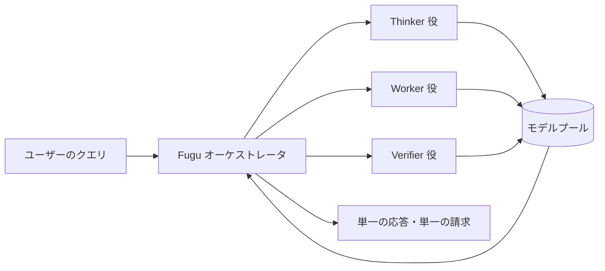

### Sakana AI「Fugu Max / Ultra v2」：出力トークン単価$6でSonnet 5比40%低価格、最強クラスを含まないプールでどこまで迫れるのか

優秀な専門家を10人抱えた事務所に仕事を頼むとする。誰にどう振るかは事務所が決め、こちらは窓口一つと請求書一通だけを受け取る。便利だ。ただし、事務所が「今回はあの人には頼みませんでした」と後から言ったとき、それが手抜きなのか、それとも意図した設計なのかは、契約書を読まないと分からない。

2026年9月11日、Sakana AIが公開したFugu MaxとFugu Ultra v2は、おおむねこの話である。

Fuguは、単体で回答を完結させる一般的なLLMではなく、他のLLMを動的に組み合わせる「オーケストレータ型の言語モデル」である。Fugu自身も言語モデルだが、その主な役割は答えを書くことではなく、誰に解かせるかを選び、協調させることにある。Fuguファミリーは2026年6月22日に一般提供が始まっており、今回はそこに、価格重視の Max と、品質重視の Ultra の第2世代が加わった格好になる。

数字だけ見れば「安くて強い」で終わる発表だが、Sakana自身がリリースページに書き添えた一文が、この記事の主題になる。

#### サマリー

| 論点             | 内容                                                                                                        |
| ---------------- | ----------------------------------------------------------------------------------------------------------- |
| リリース         | 2026年9月11日、Fugu MaxとFugu Ultra v2を同時公開（Fuguファミリーは2026年6月22日GA）                         |
| アーキテクチャ   | 単体モデルではなく、モデルプールを動的にルーティングする「オーケストレータ型言語モデル」                    |
| 価格（Max）      | 入力$2／出力$6／キャッシュ入力$0.25 per 1Mトークン、コンテキスト長に関係なく固定                            |
| 価格（Ultra v2） | 入力$5／出力$30／キャッシュ入力$0.50。272Kトークン超で$10／$45／$1.00に上昇                                 |
| 性能（Max）      | 6ベンチマークで総合ベスト、10中7でコスト性能フロンティアを拡張とSakanaが主張                                |
| 性能（Ultra v2） | Chartography 48.3（Opus 5の27.3、Fable 5の29.5に対して）、DeepSWE 74.3。いずれもSakana公表値                |
| プール構成       | Ultra v2のモデルプールにFable 5、Fable 5.1、GPT-6 Astraは含まれない（訓練カットオフ2026年8月28日）          |
| 提供制限         | EU/EEAは未提供（GDPR等への対応作業中と明記）。モデル本体はホスト型APIのみで、オープンウェイト版の公開はない |

#### 基本スペック

| 項目         | 内容                                                                   |
| ------------ | ---------------------------------------------------------------------- |
| APIモデル名  | `fugu-max` / `fugu-ultra-v2.0`（既存は`fugu`／`fugu-ultra-v1.1`）      |
| API形式      | OpenAI互換。ベースURLは`https://api.sakana.ai/v1`                      |
| 技術レポート | 「Sakana Fugu Technical Report」（arXiv:2606.21228、Yujin Tang氏ほか） |
| 訓練手法     | 大規模ファインチューニング、進化的アルゴリズム、強化学習の組み合わせ   |
| 基盤研究     | TRINITY／Conductor（いずれもICLR 2026）                                |
| 追加課金     | Maxはweb_search／web_fetchが1呼び出しあたり$0.007                      |

### 第1幕：Fuguの役割は「回答者」ではなく「指揮者」である

Fuguが何を売っているのかが分かっていないと、以降の価格もベンチマークも読み違える。

#### ふだんのChatGPTやClaudeと、何が違うのか

日常的に複数のAIを使い分けている人は、無意識にこんな判断をしているはずだ。長い資料の要約はこのモデル、コードを書かせるならあのモデル、画像を読ませるなら別のモデル。つまり**モデルを選ぶ作業は、いま人間がやっている**。アカウントもAPIキーも請求書も、ベンダーの数だけ増える。

Fuguが肩代わりするのは、この選ぶ作業そのものである。利用者は1つのエンドポイントに問いを投げるだけで、どのモデルに解かせるか、何体で分担するか、検証役を立てるかはFuguが決める。返ってくるのは1つの回答で、請求も1本にまとまる。

具体的には、複数の資料を調査して比較する、コードを書いてテストする、図表を読み解く、難しい問題を複数の観点から検証するといった作業を、内部で複数のモデルに分担させ、最後に一つの回答へまとめる。Sakana自身も、Fuguをコーディング・推論・複雑なワークフロー向けの仕組みとして説明している。

| 観点                 | 一般的な単一モデルAPI利用時のChatGPT／Claude | Fugu                             |
| -------------------- | -------------------------------------------- | -------------------------------- |
| モデルを選ぶのは     | 利用者が指定（製品によって自動切替あり）     | Fugu自身（学習した方針で決める） |
| 実際に働くモデル     | 指定モデルが中心                             | 問いに応じて複数、内部で協調     |
| 契約と請求           | ベンダーごとに個別                           | 1つのAPIキー、1本の請求          |
| どのモデルが答えたか | 指定モデル名は分かるが、内部処理の詳細は不明 | 非開示                           |
| 速度                 | そのモデル固有                               | 協調のぶん伸びる場合がある       |

ここでは、APIで特定のモデルを指定して利用する一般的なケースと比較している。ChatGPTやClaudeも、製品によっては内部でツール利用や自動的なモデル切替を行う点には注意してほしい。

この違いが効いてくるのは、たとえば特定ベンダーへの依存を薄めたい場合だ。Sakana自身、単一ベンダー依存のない性能提供と、輸出規制のような混乱時に制限されたプロバイダを迂回できる点を掲げている。ただし狙いは依存を減らすことであって、障害や仕様変更に強いと保証されているわけではない。内部のモデルも経路も非開示なので、実際にどれだけ分散しているかを利用者が確かめる手段もない。

逆に、どのモデルが答えたかを監査記録に残す必要がある用途や、「この問いは必ずこのモデルで」と固定したい用途には向かない。便利さと引き換えに手放しているのは、選択の主導権である。

以降は、その「選ぶ」をどう学習させたのかという話になる。技術レポートのアブストラクトは、狙いをこう説明している。

> 異なるプロバイダが異なる領域に特化を進めている。ここから自然に次の目標が立ち上がる。すなわち、さまざまなLLMの個別の特化を、集合的に知的なシステムへとどう束ねるか、である。

冒頭で触れたとおりFuguモデル自身も言語モデルであり、技術レポートの表現では「ユーザーのクエリを理解し、それを解くためのエージェント的スキャフォールドを動的に設計するよう訓練された」ものだとされる。ここが肝心なところで、Fuguは人が手で書いたワークフロー（「まず要約役、次に検証役」といった固定手順）を実行しているのではない。**どう協調させるかの設計そのものを学習している**。

その土台になっているのが、ICLR 2026に採択された2本の研究だ。

| 研究      | 役割                                                                                                                                     |
| --------- | ---------------------------------------------------------------------------------------------------------------------------------------- |
| TRINITY   | 軽量な進化型コーディネータが複数LLMを複数ターンにわたり統率。各モデルに「Thinker」「Worker」「Verifier」の役割を動的に割り当てて委譲する |
| Conductor | 強化学習で自然言語の協調戦略を発見。エージェント間の通信パターンと、絞り込んだプロンプトを設計する                                       |

利用者から見た体験は、あくまで「1つのモデルを叩いている」だけだ。APIはOpenAI互換で、既存クライアントはモデル名を1行変えるだけで移行できる。内部で使われた個別モデルやルーティングの詳細は利用者には表示されないが、使用量そのものが見えなくなるわけではない。Fugu Ultraは、オーケストレーションに使われたトークンを通常の入出力とは別のフィールドで返す。

料金体系にもその思想が出ている。ベースモデルであるFugu（`fugu`）の課金は、実際に1体のエージェントしか動かなければその下位モデルの標準レートのみ、複数動いた場合も「関与した最上位モデル」の単一レートで課金される。Sakanaの表現を借りれば、料金の積み上げ（fee stacking）は起きない。

### 第2幕：「40〜60%安」を検算する

Sakanaは Fugu Max の出力単価について、Sonnet 5、GPT-5.6 Terra、Kimi K3 と比べて「40〜60%低い」と主張している。この種の主張は課金体系を揃えないと簡単に嘘になるので、実際に並べて確かめる。

以下はいずれも 各社の標準API・非バッチ・標準コンテキスト帯 における per 1M トークン単価である。

| モデル           | 入力 | 出力 | キャッシュ読み取り |
| ---------------- | ---- | ---- | ------------------ |
| Fugu Max         | $2   | $6   | $0.25              |
| Claude Sonnet 5  | $2   | $10  | $0.20              |
| GPT-5.6 Terra    | $2   | $12  | $0.20              |
| Kimi K3          | $3   | $15  | $0.30              |
| Fugu Ultra v2    | $5   | $30  | $0.50              |
| Claude Opus 5    | $5   | $25  | $0.50              |
| Claude Fable 5.1 | $10  | $50  | $0.25              |

右端はいずれもキャッシュ読み取りの単価である。書き込み側の課金は各社で異なり、たとえばAnthropicはキャッシュ書き込みに入力の1.25倍（5分TTL）または2倍（1時間TTL）を課金する。読み取り単価だけを横並びにしても実効コストは決まらない点に注意してほしい。

ちなみにこの列には小さな逆転がある。Claude Fable 5.1のキャッシュ読み取りは入力単価の0.025倍という例外レートで、入力$10のFable 5.1が、入力$2のSonnet 5よりキャッシュ読み取りでは安い。長いシステムプロンプトを繰り返し投げる構成では、定価だけ見て判断すると読み違える。

出力単価で割り算すると、Sonnet 5に対して40%減、GPT-5.6 Terraに対して50%減、Kimi K3に対して60%減。Sakanaの「40〜60%」はレンジの端まで正確に一致する。誇張ではない。

ここで読み替えを一つ。**この40〜60%は出力トークン単価の比較であり、1タスクあたりの実費を保証するものではない**。オーケストレータは内部で複数のエージェントを回すため、同じ問いでも消費トークン量は単体モデルと同じにならない。

ここは曖昧にされていない。Fugu Ultraは、オーケストレーションに使ったトークンを`orchestration_input_tokens`／`orchestration_input_cached_tokens`／`orchestration_output_tokens`として返す（Sakanaの料金ページがこの内訳を明記しているのはUltraで、Maxについては同じ記載がない）。Sakanaの料金ページは、これらが`token_details`に格納されていても「入出力トークンの外側にある実際の使用量であり、最終価格に計上される」と明記しており、レートは通常の入出力と同じ、`total_tokens`にも含まれる。つまり内部処理のぶんは利用者が払うが、いくら払ったかは請求前にAPIレスポンスで分かる。

問題はその量だ。ルーティング事業者のRequestyが2026年6月に旧版のFugu Ultra（`sakana/fugu-ultra`）を20件超のクエリで解析したところ、システムプロンプトぶんとして1リクエストあたり約1,260トークンの固定オーバーヘッドがあり、可視トークン（入力と出力の合計）に対する総消費量は単純なクエリで5〜6倍、複雑なクエリでは8〜12倍に達したという。これはFugu MaxやUltra v2の実測値ではなく、両モデルは測定されていない。それでも桁感は参考になる。出力単価が40%安くても、総トークン量が数倍になれば1タスクの実費は逆転しうるからだ。

加えて、Fugu Maxはweb_search／web_fetchに1呼び出しあたり$0.007が別途かかり、後述するようにレイテンシが単体モデルより伸びる場合もある。単価表だけで判断せず、自分のワークロードで`total_tokens`まで含めて実測するのが結局いちばん早い。

もう一つ実務的に効くのが、Fugu Maxがコンテキスト長にかかわらず固定レートだという点だ。GPT-5.6 Terraは長コンテキストで$4／$18に、Fugu Ultra v2も272Kトークン超で$10／$45に上がる。長い文脈を投げる用途では、この段差の有無が実効単価をかなり動かす。

一方で、都合の悪い数字も並べておく。**Fugu Ultra v2の出力$30は、Claude Opus 5の$25より高い**。Ultraは「安さ」を売る製品ではなく、あくまで難問での品質を買う製品だと理解しておく必要がある。Maxの価格インパクトと、Ultraの価格ポジションは別の話だ。

### 第3幕：プールに含まれない3モデル

ここからが本題である。Sakanaはリリースページに、次の注記を置いている。

> Fugu Ultra v2の訓練カットオフ日は20260828であり、Fable 5、Fable 5.1、GPT-6-AstraはFugu Ultra v2のモデルプールに入っていない。

公式資料から確認できる事実は、この2点だけである。訓練カットオフが2026年8月28日であること、そして3モデルがプールに含まれないこと。

3モデルの公開日を並べると、事情が分かれる。

| モデル           | 公開日       | カットオフ（2026年8月28日）との関係 |
| ---------------- | ------------ | ----------------------------------- |
| Claude Fable 5   | 2026年6月9日 | 約2か月半前                         |
| Claude Fable 5.1 | 2026年9月1日 | カットオフ後                        |
| GPT-6 Astra      | 2026年9月3日 | カットオフ後                        |

Fable 5.1とGPT-6 Astraはカットオフ後に公開されているため、今回の学習・評価に反映できなかった可能性が高い。一方でFable 5はカットオフの2か月以上前に一般公開されており、こちらはカットオフでは説明がつかない。そしてSakanaは、いずれについても個別の除外理由を説明していない。3モデルを一括りに「外した」と読むと、性格の違うものを混ぜることになる。

#### 公表スコアは、どこまでを裏づけているか

そのうえで発表されたスコアが以下になる。

| ベンチマーク | Fugu Ultra v2 | Claude Opus 5 | Claude Fable 5 |
| ------------ | ------------- | ------------- | -------------- |
| Chartography | 48.3          | 27.3          | 29.5           |
| DeepSWE      | 74.3          | —             | —              |

Sakanaは Ultra v2 が8ベンチマーク中5つでベストまたは同率ベスト、7つでトップ2に入るとしている。DeepSWEの74.3については「3〜5倍のコストがかかるモデルを上回る」という位置づけだ。

ここまでの数値には、共通する条件がある。**いずれもSakana AIの公表値であり、第三者が同一条件で独立に再現した結果ではない**。評価ハーネスや詳細な再現手順は公開されておらず、海外のレビューも同社の数値を「ベンダー申告」として扱っている。

ベンチマークの素性も一様ではない。Fugu Maxが「総合ベスト」とする6件（Terminal Bench 2.1、GPQA Diamond、AA-LCR、GDP.pdf、AutomationBench、SWEFish）のうち、SWEFishはSakana AIが自社のコーディング課題から構築した社内ベンチマークである。一方でChartographyは外部の研究チームが公開したベンチマーク（arXiv:2608.10677、実務家が作成した100問）で、こちらは第三者作成にあたる。同じ表に並んでいても、社外の目が入っているかどうかは項目ごとに違う。

比較表に具体的なスコアが並んでいるのはOpus 5とFable 5で、Fable 5.1とGPT-6 Astraの数値は示されていない。つまり事実として言えるのは、Fable 5・Fable 5.1・GPT-6 Astraを含まないプールで、公表された一部の比較ではOpus 5やFable 5を上回った、というところまでだ。

ここから先は解釈になる。この構図は「協調は素の能力に勝てるか」という問いの検証として読むのが妥当で、「Fuguが最強のモデルより強い」という話ではない。ルーティング事業者のOrcaRouterによるレビューも、この点を「スコアボードを一瞥したときに想起される問いとは違う問いだ」と指摘している。

#### 開示されていないもの：ルーティングとレイテンシ

同じOrcaRouterのレビューは、もう一つ懸念を挙げている。Sakanaはどのクエリにどのモデルが答えたかというルーティング情報を、設計上公開していない。検証可能な正解があるタスク（テストスイートを伴うコーディングなど）では、複数モデルをサンプリングして当たりを拾う挙動が実力として現れるが、検証器のないタスクでは「運を報告している」可能性を外から切り分けられない。オーケストレーション型に共通する構造的な難しさで、Fugu固有の欠陥ではないが、スコアを社内検証の根拠にするなら意識しておく価値がある。

レイテンシも素直なトレードオフになっている。複数のモデルやツールを呼び出すため、単体モデルより遅くなる場合がある。OrcaRouterはこの性質を、難しいタスクではコーディネータが熟考し、簡単なタスクではその熟考がそのままオーバーヘッドになる、と表現している。

具体例として同レビューは、あるテスターのシェーダ生成タスクが約30分を要し、品質は「許容範囲」との評価にとどまったという報告を紹介している。ただしこれはSakanaによるUltra v2の公式測定ではなく、旧版を含みうる第三者テストの事例で、どのバージョンを測ったものかはレビュー本文に記載がない。Ultra v2の代表的なレイテンシとして扱える数値ではない。そしてSakanaはUltra v2のレイテンシ指標も公開していない。結局、導入前に自分のワークロードで実測するしかない。

Sakana自身、ベースのFugu（`fugu`）を「性能とレイテンシのバランス」、Ultraを「最難問での品質優先」と位置づけており、速度を売りにしてはいない。

### 第4幕：日本の開発者が先に確認すべき4点

日本発のモデルということで期待値が上がりやすいが、採用を検討する前に押さえるべき制約がある。

| 確認事項       | 現状                                                                                              |
| -------------- | ------------------------------------------------------------------------------------------------- |
| 提供地域       | EU/EEAは未提供。「GDPRおよびEU固有の規制への準拠に取り組んでいる間は提供しない」と明記            |
| 提供形態       | オープンウェイト版の公開はなく、モデル本体は公式にはホスト型APIとして提供される                   |
| プールの制御   | 特定モデル／プロバイダの除外設定ができるのはベースのFugu（`fugu`）のみ。Max / Ultraのプールは固定 |
| 学習データ利用 | コンソールからいつでもオプトアウト可能                                                            |

提供形態の行には補足がいる。非公開なのはモデルの重みで、関連資料は出ている。SakanaはGitHubに`SakanaAI/fugu`を公開しており、技術レポートのPDF、設定ファイル、デモ、スクリプト、ドキュメントが置かれている。ただし重みは含まれず、リポジトリにOSSライセンスの宣言もない（2026年9月12日時点）。読んで理解する材料はあるが、自前で動かせる類のものではない、という切り分けになる。

プール制御の行が実務上いちばん重要だ。データやコンプライアンスの都合で「この国のプロバイダは通せない」という要件がある場合、設定メニューから除外できるのはベースのFugu（`fugu`）であって、今回の Max / Ultra v2 のプールは固定されている。Maxのプールには NVIDIA Nemotron ファミリーやオープンウェイトモデルが追加されており、プール自体は広がっているが、広がったぶん固定されている。Sakanaはエンタープライズ向けに個別のモデル・プロバイダ構成に応じると案内しているので、要件が厳しい場合はそちらの窓口が前提になる。

EU/EEA未提供は、日本国内で使うぶんには直接効かない。ただし欧州拠点を持つ組織や、欧州のユーザーにサービスを提供するプロダクトに組み込む場合は、設計段階で引っかかる。

### まとめ

- Sakana AIが2026年9月11日、オーケストレータ型モデルの新版Fugu MaxとFugu Ultra v2を公開した。単体LLMではなく、複数モデルの協調のさせ方そのものを学習したモデルである
- Fugu Maxは入力$2／出力$6／キャッシュ入力$0.25（per 1Mトークン、コンテキスト長に関係なく固定）。出力単価はSonnet 5比40%減、GPT-5.6 Terra比50%減、Kimi K3比60%減で、同社の主張どおりの数字になる
- Fugu Ultra v2は入力$5／出力$30で、出力単価はClaude Opus 5の$25より高い。安さではなく難問での品質を買う製品と理解するのが正しい
- Ultra v2のモデルプールにFable 5、Fable 5.1、GPT-6 Astraは含まれない。うちFable 5.1とGPT-6 Astraは訓練カットオフ（2026年8月28日）後の公開で、今回の学習・評価に反映できなかった可能性が高い。ただしFable 5を含め、個別の除外理由は公表されていない。公表された比較でスコアが並ぶのはOpus 5とFable 5であり、「最強クラスを含まないプールでどこまで迫れるか」の検証として読むのが妥当である
- 実務上の制約は、EU/EEA未提供、モデルの重みが非公開でホスト型APIのみ、そしてモデルの除外設定が効くのはベースのFugu（`fugu`）のみでMax / Ultraのプールは固定という3点。厳しい要件がある場合はエンタープライズ窓口が前提になる

「どのモデルを使うか」を選ぶ時代から、「どのモデルにどう振り分けるかを誰が決めるか」を選ぶ時代へ、という転換を一つの製品に落とし込んだのがFuguだ。振り分けを外部に委ねるぶん、中で何が起きたかは見えなくなる。その交換条件を受け入れられるかどうかが、採用判断の分かれ目になる。

**情報ソース：**

[[ogp:https://sakana.ai/fugu-max-release/]]

[[ogp:https://sakana.ai/fugu/]]

[[ogp:https://console.sakana.ai/pricing]]

[[ogp:https://sakana.ai/fugu-release/]]

[[ogp:https://github.com/SakanaAI/fugu]]

[[ogp:https://arxiv.org/abs/2606.21228]]

[[ogp:https://www.marktechpost.com/2026/09/10/sakana-ai-launches-fugu-max-and-fugu-ultra-v2-for-cheaper-stronger-multi-agent-orchestration/]]

[[ogp:https://www.orcarouter.ai/blog/fugu-ultra-v2-explained]]

[[ogp:https://www.requesty.ai/blog/inside-sakana-fugu-ultra-multi-agent-orchestration-reverse-engineered]]

[[ogp:https://arxiv.org/abs/2608.10677]]
