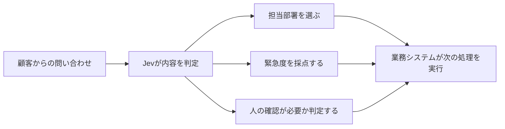
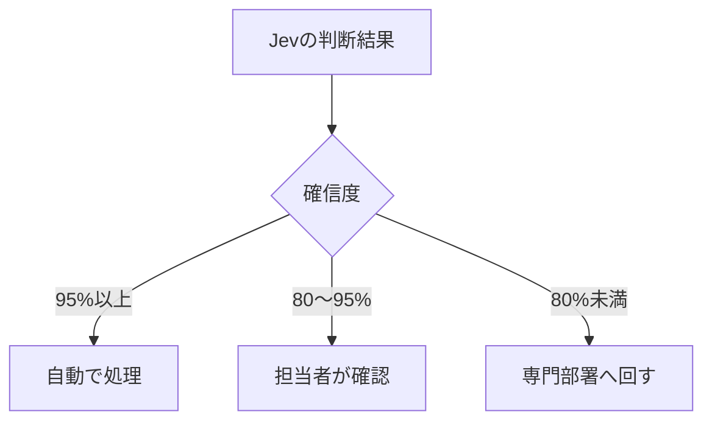

### Jevとは何か？──「文章を書くAI」ではなく、業務の判断を支えるAI

#### はじめに

2026年9月15日、TypeSafe AIが「Jev（ジェヴ）」という新しいAIモデルを公開しました。Xではエンジニアを中心に、「LLMではないAI」「速くて安い」「ハルシネーションがない」といった言葉とともに注目を集めています。

ただ、技術用語だけを追うと、何が新しく、ビジネスにどう関係するのかが見えにくいかもしれません。

Jevを一言で表すなら、**文章を作るAIではなく、業務の中で小さな判断を繰り返すためのAI**です。

ChatGPTのようなチャットAIは、質問に答えたり、企画書を書いたり、コードを生成したりします。Jevはそうした自由な文章を作りません。代わりに、問い合わせの振り分け、申請の確認、優先順位付けなど、あらかじめ定められた範囲の判断を、確率とともに返します。

この記事では、Jevの公式発表と公式ドキュメントを中心に、PydanticやVercelの公開情報も照合しながら、非エンジニアにも分かる形で整理します。

#### Jevは何をするAIなのか

##### チャットするのではなく、選ぶ

たとえば、顧客から次の問い合わせが届いたとします。

> 先月解約したはずなのに、今月も請求されています。確認してください。

一般的な生成AIに対応を依頼すると、返信文や説明文を作ってくれます。一方、Jevに任せるのは、その前段にある判断です。

- 担当部署：請求、技術、営業、その他のどれか
- 緊急度：1〜5のどの水準か
- 人による確認：必要か、不要か

Jevは、文章で長い説明を返すのではなく、「担当部署は請求」「緊急度は4」「人による確認が必要である確率は92％」というように、**システムがそのまま利用しやすい形で結果を返します。**

TypeSafe AIは、このようなモデルを「System One Model」と呼んでいます。名称は、ダニエル・カーネマン氏が広めた、人間の速く直感的な思考を指す「システム1」に由来します。じっくり文章を組み立てるのではなく、与えられた情報から素早く一つの判断をする、という発想です。

##### 三つの質問形式

公式ドキュメントでは、Jevが扱う質問を三つに整理しています。

| 形式   | 何をするか                   | ビジネスでの例                           |
| ------ | ---------------------------- | ---------------------------------------- |
| Choice | 候補の中から一つを選ぶ       | 問い合わせを担当部署に振り分ける         |
| Score  | 決められた基準で点数を付ける | 商談の有望度や対応の緊急度を評価する     |
| Noul   | ある条件が成り立つ確率を返す | 規定違反の可能性や確認の必要性を判定する |

複数の質問を一度に送り、それぞれを同じ情報に対して並行して評価できます。重要なのは、Jevに最終目的を丸ごと任せるのではなく、**一つひとつの判断を小さく分けること**です。

「この商談を受注できるか」とまとめて聞くよりも、「予算が確保されているか」「課題が明確か」「導入時期が具体的か」を別々に評価し、最後の計算や分岐は通常のプログラムで行う。これがJevの基本的な使い方です。

#### 従来の生成AIと何が違うのか

##### 生成AIは「書き手」、Jevは「判定員」

**両者は競合というより、得意な仕事が異なります。**

| 比較点     | 一般的な生成AI・LLM              | Jev                                  |
| ---------- | -------------------------------- | ------------------------------------ |
| 主な役割   | 文章、会話、コードなどを作る     | 決められた範囲で選択・採点・判定する |
| 出力       | 自由な文章                       | あらかじめ定義された値と確率         |
| 得意な場面 | 要約、企画、相談、文章作成       | 分類、振り分け、優先順位付け、検査   |
| 人との関係 | 人が読んで利用することが多い     | ソフトウェアが結果を利用しやすい     |
| 苦手なこと | 出力の揺れや形式崩れが起こり得る | 自由な文章の作成や長い推論はできない |

レストランに例えるなら、生成AIは要望を聞いて新しい料理を作る料理人です。Jevは、届いた注文を「店内」「持ち帰り」「配達」に振り分け、優先度を付ける受付担当に近い存在です。

料理人の創造性はありません。しかし、大量の注文を速く、一定の形式で処理したい場面では、受付担当の能力が業務全体の速さを左右します。

##### なぜ「型」が大切なのか

Jevの説明で頻繁に登場する「typed（型付き）」とは、回答の種類を事前に決めておくことです。

たとえば担当部署を「請求」「技術」「営業」「その他」の四つと定義したら、Jevはこの範囲から回答します。「まずはお客様に寄り添って対応しましょう」といった、プログラムが扱いにくい自由文は返しません。

業務システムから見ると、これは大きな違いです。自由な文章を毎回読み解き、期待した形式になっているか確認する工程を減らし、そのまま次の処理へつなげやすくなるからです。

#### ビジネスで何が変わるのか

##### 「ルールでは書き切れない判断」を自動化する

従来の業務自動化は、「金額が10万円以上なら上司へ回す」のように、条件を明確に書ける処理を得意としてきました。

一方、現実の仕事には、単純な条件だけでは表しにくい判断があります。

- 問い合わせ内容から、適切な担当部署を選ぶ
- 文章の雰囲気や背景から、顧客離れの兆候を見つける
- 報告書が社内基準を満たしているか評価する
- 多数の案件から、優先して確認すべきものを選ぶ

こうした仕事は、人にとっては短時間で判断できても、例外を含むすべてのルールをプログラムとして書くのは困難です。かといって、高性能な生成AIに毎回長い文章を作らせるのは、速度や費用、結果の扱いやすさの面で過剰なことがあります。

Jevが狙っているのは、この中間領域です。TypeSafe AIは「smart if-statements」、つまり**意味を理解できる賢い条件分岐**のようなものとして説明しています。

##### 人を外すのではなく、確認すべき案件を絞る

確率が付くことも、業務設計では重要です。

たとえば、問い合わせの振り分け結果について、確信度が95％以上なら自動処理し、80〜95％なら担当者が確認し、80％未満なら専門部署へ送る、といった運用が考えられます。

これは「AIに全部任せる」という発想ではありません。**AIが迷っている案件を人に集め、人は判断が難しい仕事に集中する**という役割分担です。

#### 速さと価格はどの程度なのか

##### 公表されている数値

TypeSafe AIは、Jevの応答時間を70〜500ミリ秒、料金を入力100万トークン当たり0.042ドル、出力は無料と案内しています。速度については、System One型の処理で同等の知能水準を比べた場合、40〜200倍の幅で速くなるとしています。

公開料金を単純に比べると、既存のLLMが入力100万トークン当たり0.20〜10ドル、出力はその約5倍という価格帯であるのに対し、Jevは入力0.042ドル、出力無料という設定です。

これとは別に、同社は特定のワークフロー全体を処理した場合の評価から「193.6倍速く、444.6倍安い」という数値を挙げています。この数値には、入力単価だけでなく、出力料金や処理方法などの条件も反映されています。同社自身も「現実の効果としては上限寄りだと考えている」と述べています。

補足しておくと、これらはいずれもTypeSafe AI自身の評価による数値です。同社は条件も細かく開示しており、速度の比較がJevに向いた処理に限られることや、評価を作ったのが自社のチームであることに加え、参照解答の取り方がむしろ自社に不利に働いている可能性まで記載しています。開示の姿勢は誠実ですが、2026年9月19日時点では第三者による検証が積み上がった段階ではありません。**現時点では参考値として見るのが妥当です。**

なお、Vercel AI GatewayではJevが無料で提供されていますが、これは2026年9月25日までのプロモーション価格です。導入を検討する際は、利用経路と最新料金を確認してください。

##### ちなみに、Jevという名前の由来

Jevという名前は、19世紀の経済学者、ウィリアム・スタンレー・ジェヴォンズから取ったものだそうです。

ジェヴォンズは、蒸気機関の効率が上がって石炭を安く使えるようになると、石炭の節約につながるとは限らず、かえって利用が広がり、社会全体の消費量が増える可能性があると指摘しました。現在では「ジェヴォンズのパラドックス」と呼ばれる考え方です。

TypeSafe AIは、AIも同じ道をたどると見ています。公式の説明では「知能のコストが一桁下がるたびに、桁違いに多くの使い道が開かれる」。名前に自社の見立てを込めたことになります。

そう考えると、Jevを見るときの問いも変わります。「ChatGPTより賢いか」ではなく、「これまで割に合わなかった小さな判断に、AIを置けるようになるか」。

#### 「ハルシネーションゼロ」の本当の意味

Jevについて最も誤解されやすいのが、「ハルシネーションがない」という表現です。

TypeSafe AIは、Jevが自由な文章を生成せず、定義済みの型に合う値だけを返すため、「型に存在しない回答を勝手に作る」「指定した形式を壊す」という意味でのハルシネーションを起こさないと説明しています。

しかし、**形式が正しいことと、判断内容が正しいことは別です**。

担当部署を四つから必ず選べても、誤った部署を選ぶ可能性はあります。Jev自身も確信度を返す設計であり、これは不確実性がなくなったのではなく、不確実性をシステム側で扱いやすくしたものと理解すべきです。

Pydanticの公式ドキュメントには、Jevが苦手とするものとして次の項目が挙げられています。

- 計算、数え上げ、日付の扱い
- 一つの質問に複数の判断を詰め込むこと
- 間接的な言い回しから答えを導くこと
- 判断に不要な情報が混ざっていること
- 履歴の中で同じツール呼び出しが繰り返されること
- 文章に書かれていないことを判断させること
- 誘導や攻撃を意図した文章

二つ目の「一つの質問に複数の判断を詰め込まない」は、先に触れた「判断を小さく分ける」という使い方の裏づけにもなっています。また、選択肢の並び順もJevが見る情報の一部であり、順序を変えると回答が変わる場合があるとも説明されています。

したがって、Jevを安全に使うには次の考え方が欠かせません。

- 重要な判断では、確信度に応じて人へ確認を回す
- 法令、金額、日付などは通常のプログラムでも検証する
- 自社の実データを使って精度を評価する
- 入力文による誘導や攻撃を想定してテストする
- モデルの判断記録を残し、後から確認できるようにする

「答えを間違えないAI」ではなく、**間違う可能性を前提に、制御しやすい形で判断を返すAI**と捉えるのが適切です。

#### Jevに向く業務、向かない業務

##### 向いている業務

- 大量の問い合わせ、申請、文書の分類
- 優先順位やリスク水準の採点
- 審査項目ごとの一次チェック
- コンテンツや操作の安全性判定
- AIエージェントが次に取る行動の選択
- 人による確認が必要な案件の抽出

**共通するのは、「入力を理解する必要はあるが、回答の範囲は先に決められる」仕事です**。処理件数が多く、短い応答時間が価値になるほど、Jevの特徴が生きます。

##### 向いていない業務

- 顧客への返信文や企画書を作る
- 新しいアイデアを自由に発想する
- 複雑な問題を何段階も推論する
- 数値計算や日付計算を正確に行う
- 前例のない問題に長い説明で答える

これらは生成AIや通常のプログラム、人間の専門家が担当すべき領域です。実際のシステムでは、Jevだけですべてを処理するのではなく、「Jevが分類する」「通常のプログラムが規則を確認する」「生成AIが文章を作る」「人が最終判断する」といった組み合わせが現実的です。

#### 導入を考える企業が最初に問うべきこと

Jevの登場で大切なのは、すぐに製品を導入することではありません。まず、**自社の業務にある「小さな判断」を見つけること**です。

次の四点を確認すると、適用候補を探しやすくなります。

1. 人が毎日、似た内容を繰り返し分類・採点しているか
2. 回答候補や評価基準を事前に定義できるか
3. 判断を間違えた場合の影響と、確認方法を設計できるか
4. 正解例や過去データを使い、導入前後の精度を測れるか

この条件が揃わない業務に、話題性だけでJevを当てはめても効果は出にくいでしょう。反対に、問い合わせの一次振り分けのように、判断範囲が明確で、間違ったときに人へ戻せる業務は試行しやすい候補です。

#### Jevが示す、AI活用の次の論点

これまでの生成AI活用は、「AIに何を書かせるか」が中心でした。Jevが提示しているのは、「AIの判断を、業務のどこに組み込むか」という別の方向です。

この違いは、ビジネス側にも関係します。Jevを活用するには、エンジニアがAPIを接続するだけでは足りません。業務部門が、判断基準、許容できる誤り、どの確信度で人に戻すかを定める必要があります。

つまり、Jevは人の判断を曖昧なまま置き換える道具ではなく、**組織が判断基準を言語化し、業務として設計し直すことを求める道具**でもあります。

TypeSafe AIは、2026年9月15日にJevを早期アクセスとして公開したばかりです。同社はDCVC主導の4,000万ドルのシード資金調達も発表しており、今後の開発は注目に値します。一方で、新しいモデル区分や性能上の主張が、幅広い業務でどこまで再現されるかは、これから検証される段階です。

#### まとめ

Jevは、ChatGPTに代わる万能AIではありません。文章を作る能力を手放し、選択・採点・真偽判定に役割を絞った、業務判断のためのAIです。

ポイントを整理すると、次のようになります。

- 自由な文章ではなく、事前に定義した値と確率を返す
- 問い合わせ分類、優先順位付け、一次審査などに向く
- 高速・低価格を掲げるが、現時点の比較は主に提供元の評価である
- 出力形式は保証されても、判断の正しさまで保証されるわけではない
- 確信度に応じた人の確認と、通常のプログラムによる検証が必要である

Jevが広く定着するかは、まだ分かりません。それでも、「会話が上手なAI」だけでなく、「ソフトウェアの中で限定された判断をするAI」という方向性は、今後の業務自動化を考えるうえで重要です。

問うべきなのは「Jevを使うか」だけではありません。**自社の業務に、ルールでは書き切れないが、回答範囲を決められる判断がどれだけあるか**。そこを見つけることが、AIを実務に組み込む第一歩になります。

#### 参考リンク

本記事は2026年9月19日時点の公開情報をもとにしています。速度、料金、モデル仕様、提供条件は変更される可能性があります。

[[ogp:https://typesafe.ai/blog/introducing-system-one-models-and-jev]]

[[ogp:https://docs.typesafe.ai/introduction]]

[[ogp:https://pydantic.dev/docs/ai/models/typesafe/]]

[[ogp:https://vercel.com/ai-gateway/models/jev]]

[[ogp:https://www.dcvc.com/news-insights/typesafe-emerges-from-stealth-with-a-new-way-of-doing-ai/]]
