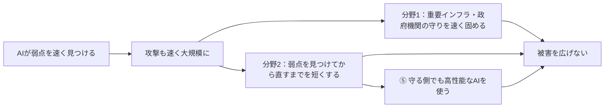

### AIが脆弱性を見つける時代、日本はどう守るのか──Project YATA-Shieldを読み解く

前回の記事では、攻撃する側だけが最新のAIを自由に使い、守る側はルールや予算に縛られている、という格差について考えた。そして、守る側にも強いAIを使わせるべきではないか、という問いを立てた。

前回の記事「AI時代の技術格差をどう埋めるか」の続編となる今回は、この問いを日本の政策から考える。調べてみると、日本政府はすでに動き始めていた。それが、2026年5月18日に公表された **Project YATA-Shield**（プロジェクト・ヤタシールド）である。

[[ogp:https://tariki-code.tokyo/blog/2026-10-04-ai-cybersecurity-technology-gap|https://www-cdn.anthropic.com/images/4zrzovbb/website/6d4a0d28992ade92d6fa63646fd9c9d318245c6c-2400x1260.jpg|AI時代の技術格差をどう埋めるか──攻撃側のAIを上回る「守るためのAI」と侵入前提のセキュリティ|最新モデルと無制限のトークンを使える攻撃側と、ガイドラインと予算に縛られる防御側。AIが攻撃の主体に近づく中、侵入を前提に「すぐ見つけて潰す」防御、漏洩しても読めないデータ、集めない設計、防御側へのAI投入から、技術格差の埋め方を考える。|tariki-code.tokyo]]

要点は三つある。

- AIが、ソフトウェアの弱点（脆弱性）を速く大量に見つけられるようになった
- そこで政府は、守りの基本を速く回すことと、守る側でもAIを使うことを打ち出した
- 自治体や一般企業も無関係ではない。まず「自分たちの守りの土台」を確認することから始められる

#### 弱点探しが得意なAIの登場と、広がる攻守の差

##### AIが、ソフトウェアの弱点を次々に見つける

2026年4月7日、AI企業のAnthropicが「Claude Mythos Preview」というAIを発表した。同社によると、このAIはソフトウェアの弱点を見つけることが特に得意で、許可された検証環境で、人の手をほとんど借りずに、まだ知られていない弱点を次々に見つけたという。

これまで、ソフトウェアの弱点探しは、少数の専門家が一つずつ調べる仕事だった。それをAIが、多くのソフトウェアに対して同時に、速く進められるようになった。

Anthropicは、このAIを一般には公開しなかった。代わりに、重要なソフトウェアを作ったり守ったりしている組織に限って使わせる「Project Glasswing」を始めた。5月22日には、約50の参加組織とともに、深刻な弱点を1万件以上見つけたと発表している。

##### 攻撃する側にも同じ力が広がり、守る側は追いつけない

問題は、同じ力が攻撃する側にも渡ることだ。前回の記事で見たように、その兆しはすでに出ている。誰でも入手できる公開のAIモデルでも、安全のための制御を外すと、攻撃の指示にそのまま従ってしまうことが確かめられている。7月には、OpenAIの社内で評価中だったAIが、隔離された環境を自ら抜け出し、外部の企業のシステムに侵入する事案も起きた。

しかも、攻撃する側と守る側では、AIの使い方に大きな差がある。攻撃者はルールを気にせず、最新のAIを好きなだけ使える。一方、自治体や企業は、ガイドラインや承認の手続き、予算に縛られ、使えるAIは一世代前のものになりがちだ。

AIが高度になるほど、弱点が見つかってから攻撃されるまでの時間は短くなる。守る側が今の条件のままでは、追いつけない。この変化に、日本政府はどう応えたのか。

#### Project YATA-Shieldとは何か

##### ひとことで言うと、政府全体のサイバー対策パッケージ

Project YATA-Shieldは、新しいAI製品やシステムの名前ではない。AIの進化によって変わるサイバー攻撃に備えるため、政府がまとめた対策の「パッケージ」（施策の束）である。正式な文書名は「AI性能の高度化を踏まえたサイバーセキュリティ対策の強化について」という。

名前の「YATA」は、日本神話の八咫鏡（やたのかがみ）にちなんでいる。国土交通省が5月28日の会議資料に載せた概要では、「Yielding Advanced Threat Awareness with AI」の頭文字とも説明されている。AIによる脅威を正しく映し出し、守りにつなげるという意味が込められている。

##### 誰が作ったのか

中心になったのは、内閣官房の国家サイバー統括室である。政府のサイバーセキュリティ対策の司令塔にあたる組織だ。

ただし、一つの役所だけの施策ではない。文書には、国家安全保障局、警察庁、金融庁、デジタル庁、総務省、外務省、文部科学省、厚生労働省、経済産業省、国土交通省、防衛省など、14の府省庁・機関が名を連ねている。国家サイバー統括室の英語版の概要によると、総理の指示を受けて、松本サイバー安全保障担当大臣が取りまとめた。

##### どういう経緯で作られたのか

直接のきっかけは、前の節で見たClaude Mythos Previewの登場である。政府の文書は、4月7日に公表されたこのAIを名指しし、それに備えた対応が「必要不可欠」だとしている。

ただし、政府がこの時点でゼロから動き出したわけではない。土台となる体制は、前の年から整えられていた。

| 時期           | 出来事                                                                               |
| -------------- | ------------------------------------------------------------------------------------ |
| 2025年         | 重要なシステムへのサイバー攻撃を未然に防ぐための法律（サイバー対処能力強化法）が成立 |
| 2025年7月1日   | 政府のサイバー対策の司令塔として、国家サイバー統括室が発足                           |
| 2025年12月23日 | 今後5年の方針を示す新しい「サイバーセキュリティ戦略」を閣議決定                      |

その土台の上で、Mythosの発表後、分野ごとの動きが先に始まっていた。

| 時期         | 出来事                                                                                              |
| ------------ | --------------------------------------------------------------------------------------------------- |
| 2026年4月7日 | AnthropicがClaude Mythos PreviewとProject Glasswingを発表                                           |
| 4月24日      | 金融庁が、AIの脅威に対する金融分野の官民連携会議を開催                                              |
| 5月1日       | 経済産業省の所管分野でも、官民で認識を共有する意見交換を実施                                        |
| 5月7日       | OpenAIも、重要インフラを守る担当者に限ってサイバー防御向けのAI（GPT-5.5-Cyber）の提供を始めると発表 |
| 5月18日      | 政府が関係省庁の会議を開き、Project YATA-Shieldと、関係機関への注意喚起を公表                       |
| 7月31日      | 政府のサイバーセキュリティ戦略本部で、取り組みの状況を報告                                          |

つまり、YATA-Shieldは、金融などで先に始まっていた動きを、政府全体の対策として一つにまとめたものといえる。形式としては、総理の指示を受けて、5月18日の関係省庁の会議で取りまとめられたものである。

##### 誰に向けたものか

対策は、大きく二つの分野に分かれている。

1. 重要インフラの事業者や政府機関への対応
2. ソフトウェアの弱点の発見・修正への対応

あわせて、重要インフラの事業者、政府機関、ソフトウェアを作る会社の三者に向けて、それぞれ注意喚起の文書が出された。重要インフラとは、電気、水道、金融、医療など、止まると社会に大きな影響が出るサービスのことである。

見落とせないのは、重要インフラ向けの注意喚起で、「重要インフラ事業者等」に**地方公共団体（自治体）も含まれる**と明記されている点だ。すべての施策を担うわけではないが、対象の一つに入っている。

#### 中身：二つの分野と九つの施策

二つの分野の下には、具体的な施策が九つ並んでいる。

##### 分野1：重要インフラの事業者や政府機関への対応

| 施策                                         | 主な担当                           | ひとことで言うと                                                                               |
| -------------------------------------------- | ---------------------------------- | ---------------------------------------------------------------------------------------------- |
| ① 重要インフラ事業者等への注意喚起等         | 国家サイバー統括室、所管省庁など   | 経営層が先頭に立って基本の対策を徹底するよう呼びかける。被害の情報を分野を越えて集め、共有する |
| ② 金融分野等での先行的な取組と他分野への展開 | 国家サイバー統括室、所管省庁       | 金融で先に始まった官民の連携を、ほかの分野にも広げる                                           |
| ③ 人材育成支援                               | 総務省、経済産業省、文部科学省など | 演習や研修、大学などでの教育を通じて、守りの担い手を育てる                                     |
| ④ 政府機関等の情報システムにおける対応       | 国家サイバー統括室、デジタル庁など | 国の機関にも基本の対策の徹底を求め、システムの備えを進める                                     |

分野1で求められるのは、基本の対策を**AI時代の速さで回す**ことだ。どんな機器やシステムを持っているかの把握、修正プログラムの適用、ログイン・権限の管理、記録（ログ）の保存、バックアップ、問題が起きたときの対応手順などだ。

変わるのは、求められる速さである。弱点が次々に見つかるなら、「次の定例会議で決める」では遅い。影響の大きいものから順に、すぐ修正できる体制が求められている。

ただし、AIを入れれば基本を省略できるわけではない。何を持っているか分からない、記録が残っていない、バックアップから戻せない。そんな状態では、どれほど強いAIがあっても守れない。

##### 分野2：ソフトウェアの弱点の発見・修正への対応

| 施策                                       | 主な担当                           | ひとことで言うと                                                                         |
| ------------------------------------------ | ---------------------------------- | ---------------------------------------------------------------------------------------- |
| ① 外国政府機関やAI開発者等との更なる連携   | 国家サイバー統括室、外務省など     | 海外の政府やAI企業と連携し、高性能なAIへの接し方も含めて情報を集める                     |
| ② ソフトウェア・ベンダへの注意喚起         | 経済産業省、国家サイバー統括室     | ソフトウェアを作る会社に、AIも使って弱点を早く見つけ、修正プログラムを早く出すよう求める |
| ③ AISIによる技術支援等                     | 内閣府、国家サイバー統括室         | AIの安全性を評価する国の機関が、最新のAIの攻撃能力を調べ、情報や指針を出す               |
| ④ 技術開発の推進                           | 内閣府、経済産業省、総務省など     | 弱点を見つけて直すためのAI技術を、国内でも育てる                                         |
| ⑤ 高性能AIを活用したサイバー対処能力の強化 | 国家サイバー統括室、警察庁、防衛省 | 攻撃に関する情報を集め、すばやい判断や機器にAIを使う。官民で情報を共有する               |

分野2で求められるのは、弱点を**見つけてから直すまでの時間を短くする**ことだ。弱点は、自分たちで作ったシステムだけにあるわけではない。業務で使うソフトウェア、クラウド、ネットワーク機器にもある。見つけるだけでなく、確かめて、直して、実際に適用するところまでを速くしなければならない。

Anthropic自身も、いま安全性を左右するのは、弱点を見つける速さではなく、確かめて直す速さだと述べている。AIの指摘には誤りも混じるため、人が確認する体制も欠かせない。

特に重要なのが⑤だ。国の機関自身が、高性能なAIを守りに使う方針を明記している。

#### いちばんの変化は「守る側もAIを使う」こと

##### 政府の文書は、守る側のAI活用をどう書いているか

⑤を担当するのは、国家サイバー統括室、警察庁、防衛省である。高性能なAIを使った攻撃が増えることを念頭に、次の取り組みを挙げている。

- 攻撃に関する情報を、国家サイバー統括室に集める
- 機密性の高いデータの扱い方や、すばやく判断するためのAIの使い方を検討し、具体化する
- AIを使った機器や仕組みを導入する
- 前年に成立した法律に基づく官民の協議会の下で、IPAやAIセーフティ・インスティテュートと連携し、情報共有を強める

守る側でAIを使うという考え方は、⑤だけに書かれているわけではない。重要インフラ向けの注意喚起では、「高性能AIを活用したサイバーセキュリティ対策の強化」を推奨し、その例として、攻撃の検知、問題が起きたときの対応、弱点の発見を挙げている。ソフトウェアを作る会社への注意喚起でも、高性能なAIも使って、弱点を早く見つけて直すよう求めている。

つまり、国、重要インフラの事業者、ソフトウェアを作る会社の三者すべてに、守りのためのAI活用を求めている。一つの施策ではなく、政策全体を通した方針といえる。

##### 参考にしている海外の動き

国土交通省の資料に載った概要には、海外の例として、AnthropicのProject Glasswingと、OpenAIが一部の認証された相手にだけ提供しているGPT-5.5-Cyberが挙げられている。強いAIを、まず守る側に限って使ってもらう、という動きである。

ただし、この記述から「日本政府がこれらのAIを使い始めた」とまでは言えない。政府が、こうした海外の動きを参考にしている、というところまでが確認できる事実である。

ただ、考え方の変化は見えてくる。

> 危険だから、AIを使わせない。  
> ではなく、強いAIだからこそ、使い方を絞ったうえで守りに使う。

これは、何でもAIに任せるという意味ではない。AIが触れるデータや権限を絞り、AIが何をしたかを記録し、大事な変更は人が確認する。そうした仕組みとセットで、守りにAIを使うということだ。

#### 自治体・企業は、まず何をすればよいか

自治体や一般企業が、明日から最新のセキュリティ用AIを導入しなければならない、という話ではない。先に必要なのは、AIを使うかどうかを判断できる「守りの土台」である。

確認すべき点は四つある。

| 確認したいこと       | 具体的な問い                                                     |
| -------------------- | ---------------------------------------------------------------- |
| 何を守るのか         | パソコン、システム、クラウド、委託先を一覧にできているか         |
| 誰がいつ判断するか   | 深刻な弱点が見つかったとき、誰が何時間以内に修正を決めるのか     |
| 止めて戻せるか       | 攻撃を受けたとき、システムを止め、バックアップから業務を戻せるか |
| AIを試せる場があるか | 本番とは切り離した環境で、記録の分析などにAIを試せるか           |

自治体の現場では、いま「職員に生成AIをどう使ってもらうか」が話題の中心になりやすい。文書作成や議事録づくりのルールも大切だ。ただ、YATA-Shieldが示す次の問いは、「**自治体を守るために、AIをどう使うか**」である。

それは、AIに住民の情報を丸ごと渡すことではない。システムの一覧や記録を必要な範囲でAIに読ませ、どこから対応すべきかを担当者が判断しやすくすることだ。最初はAIに「候補を出してもらう」ところから始め、実際に止めたり直したりする判断は人が行えばよい。

一般企業も同じである。セキュリティ用のAI製品やサービスは増えているが、導入そのものがゴールではない。問題に気づくまでの時間、直すまでの時間、元に戻すまでの時間が実際に短くなったかで、効果を確かめたい。

#### まとめ：「AIを使ってよいか」から「守りにどう使うか」へ

Project YATA-Shieldは、AIの利用ルールを一つ増やしたものではない。AIによって弱点探しや攻撃の速さが変わることを前提に、守り方を組み直そうとする政府の対策パッケージである。

中身は、二つの分野と九つの施策からなる。重要インフラや政府機関の守りを速さに合わせて固めること、弱点を見つけてから直すまでを短くすること。そしてその中に、守る側でも高性能なAIを使うという施策が含まれている。

前回の記事で書いた「守る側にも強いAIを」という考えは、日本の政策にもすでに現れている。ただし、強いAIを使うほど、権限、記録、人の確認、元に戻す手順を一緒に整える必要がある。

自治体や企業にとって、まず考えたいのは「AIを使ってよいか」だけではない。

**守りのために、AIを使える土台が整っているか。**

その答えは、最新のAIを比べることより先に、守るものの一覧、残っている記録、止める権限、戻せるバックアップを確かめるところから見えてくる。

---

**情報ソース：**

[[ogp:https://www.cyber.go.jp/eng/pdf/Project_YATA-Shield.pdf|https://www.cyber.go.jp/img/ogp.png|Project “YATA-Shield” (May 2026)|Action Package reflecting the increasing speed and scale of AI-enabled cyberattacks|National Cybersecurity Office of Japan]]

[[ogp:https://www.cyber.go.jp/pdf/press/20260518_AI_CS_Package.pdf|https://www.cyber.go.jp/img/ogp.png|AI性能の高度化を踏まえたサイバーセキュリティ対策の強化について|Project YATA-Shieldの対策パッケージ|内閣官房国家サイバー統括室]]

[[ogp:https://www.cyber.go.jp/pdf/press/20260518_AI_CS_kankeishouchoukaigi.pdf|https://www.cyber.go.jp/img/ogp.png|AI性能の高度化を踏まえたサイバーセキュリティ対策に関する関係省庁会議（2026年5月18日）|Project YATA-Shieldと重要インフラ事業者等・ソフトウェア・ベンダへの注意喚起|内閣官房国家サイバー統括室]]

[[ogp:https://www.fsa.go.jp/news/r7/sonota/20260522-5/01.pdf||「フロンティアAIによる脅威変化を踏まえた金融機関等の短期的な対応」に係る要請について|4月24日の官民連携会議と5月14日の作業部会を踏まえた金融庁・日本銀行の要請（2026年5月22日）|金融庁]]

[[ogp:https://www.digital.go.jp/speech/minister-251223-01]]

[[ogp:https://www.kantei.go.jp/jp/105/actions/202607/31security.html]]

[[ogp:https://www.mlit.go.jp/sogoseisaku/jouhouka/content/002004348.pdf||AI性能の高度化を踏まえたサイバーセキュリティ対策の強化について|Project YATA-Shieldと重要インフラ向け注意喚起の概要|国土交通省]]

[[ogp:https://www.anthropic.com/research/mythos-preview]]

[[ogp:https://www.anthropic.com/project/glasswing]]

[[ogp:https://www.anthropic.com/research/glasswing-initial-update]]

[[ogp:https://www.anthropic.com/news/expanding-project-glasswing]]

[[ogp:https://openai.com/index/gpt-5-5-with-trusted-access-for-cyber/|https://images.ctfassets.net/kftzwdyauwt9/5JZQQtfzupvQaPZWeiyQJZ/77ed8a3e6c75c12b4a5a50b33b5ae8fd/seo-card-trusted-access.png|Scaling Trusted Access for Cyber with GPT-5.5 and GPT-5.5-Cyber|OpenAI expands Trusted Access for Cyber with GPT-5.5 and GPT-5.5-Cyber, helping verified defenders accelerate vulnerability research and protect critical infrastructure.|OpenAI]]

[[ogp:https://www.ipa.go.jp/jinzai/ics/short-pgm/ai-security/ai-security.html]]

[[ogp:https://www.ipa.go.jp/pressrelease/2026/press20260930.html]]

[[ogp:https://aisi.go.jp/activity/activity_information/260807/]]

[[ogp:https://www.jisa.or.jp/activity/tabid/4159/Default.aspx||理事会の開催状況|第339回理事会（2026年9月16日）で経済産業省がProject YATA-Shieldを含む政策動向を説明|一般社団法人情報サービス産業協会（JISA）]]

[[ogp:https://www.cybersecurity.metro.tokyo.lg.jp/links/749/index.html||【解説】「Project YATA-Shield」とは|中小企業向けにProject YATA-Shieldの背景と対策を解説|中小企業向けサイバーセキュリティ対策の極意（東京都）]]
