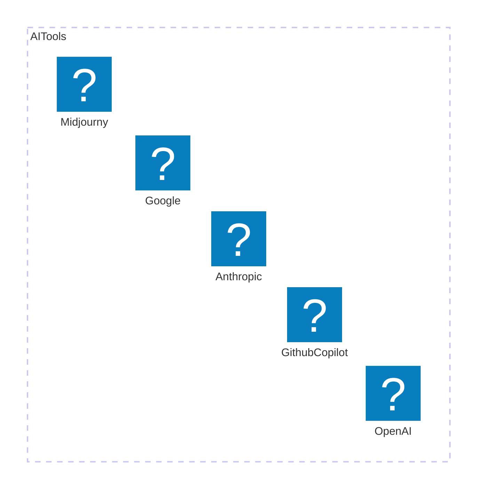

## AIの力で組織を変革する

#### 次世代のソリューション

AIは、今や未来の技術ではなく、現代のビジネスや行政にとって不可欠なツールです。AIを戦略的に活用することで、組織は新たな価値を創出し、競争力を高めることができます。この記事では、AIがどのように組織を変革し、実際にどのように活用されているのかを見ていきます。

---

### Introduction

<div class="center-container">
    
</div>

#### なぜ今AIなのか？

AIは業務効率化やデータ解析の自動化だけでなく、意思決定の最適化や顧客体験の向上にも大きな影響を与えています。特に中小企業や行政において、AIは限られたリソースを最大限に活用するための強力なツールとなります。本記事では、AIが注目される理由と、どのようにしてビジネス戦略に組み込めるかを解説します。

#### 組織と人のスキル向上

生成AIの最大のメリットは、ビジネスパーソンや組織全体のスキル向上を支援できる点です。特に、自分にはないスキルや知識を持ち合わせている点がAIの強みです。例えば、私のこのウェブサイトは、SvelteというJavaScriptフレームワークを用いて構築されましたが、構築当初、私はその知識を全く持ち合わせていませんでした。AIを活用し、トラブルシューティングやデバッグ、文章作成などを効率化し、最終的にサイトの完成に至りました。これは、生成AIの膨大な情報量と自然な対話がもたらす力です。

#### まず使ってみる

生成AIの利用にあたっては、「プロンプト」と呼ばれる質問のテンプレートを活用することが一般的です。これにより、目的に沿った回答を引き出しやすくなりますが、私はあえて定型的なプロンプトは使わず、質問を繰り返し、より深くAIとの対話を進めることをお勧めします。重要なのは、「まず使ってみる」ということです。直感的な操作が可能なAIは、すぐにでも役立つツールとなるでしょう。

---

### The Role of AI in Business and Government

<div class="center-container">
    
</div>

#### 現代ビジネスや行政におけるAIの役割

AIの活用は、業務の自動化に加え、データ分析や意思決定を強化し、クリエイティブなプロセスまで支援するツールとして広がっています。例えば、行政では市民サービスの効率化、企業ではカスタマーサポートの自動化などがその一例です。この記事では、ビジネスおよび行政におけるAIの効果的な利用方法を解説します。

#### AIの活用例

##### 自然言語を用いた文章生成や添削

生成AIは、自然言語を使って文章を生成したり、既存の文章を添削することに長けています。例えば、何を伝えたいのか、誰に向けたものかを伝えることで、AIが適切な文章を提案してくれます。また、文章の構成や表現の改善、誤字脱字のチェック、さらには補足情報の提案まで幅広くサポートします。

##### 情報の検索

従来のインターネット検索は「キーワード」を元に行われますが、肝心なキーワードがわからない場合、適切な情報を見つけることが難しくなります。AIを使った検索は、抽象的な質問にも対応でき、複数の結果を統合して、わかりやすくまとめてくれます。従来の手動検索と比較して、効率的かつ迅速に広範な情報を集約することができ、特に膨大な情報源から結論を得る際に大いに役立ちます。

##### 論文や資料の要約

AIは、インターネット上の論文や資料を要約し、概要を迅速に理解する手助けをしてくれます。文章全体を読む時間がない場合でも、AIが核心的な部分を抜き出し、どのような主張がされているか、結論が何かを要約してくれます。また、特定の資料に含まれる情報の有無を確認するための分析にも利用できます。こうした機能により、効率よく知識を吸収し、次のステップに移ることが可能になります。

##### 画像や動画のマーケティング活用

本サイトのイメージ画像のほとんどはAIによって生成されました。AIは、資料や記事に適した画像や動画を作成でき、ブランドロゴやプロダクトのアイコン作成にも対応します。AIを活用すれば、オリジナリティあふれるコンテンツを迅速に作り出すことができ、マーケティング活動をよりクリエイティブに進めることができます。

##### ペアプログラミング

AIはプログラミングにも強力なサポートを提供します。JavaScriptやPythonなどの主要言語に対応し、プログラムのデバッグや最適化、さらには新しい機能の実装において、効果的なガイドを提供します。また、AIは関連するライブラリやクラウドサービス等の知識も持っており、開発者が求める機能の実現方法を具体的に示してくれるため、作業をスムーズに進められます。

##### 抽象から具体への変換

AIは、抽象的な情報を具体的な行動や数値に変換する能力にも長けています。たとえば、文章内の感情や意図を分析し、それを定量的なスコアに変換することで、曖昧な概念をより具体的に捉えることが可能です。これにより、顧客のフィードバックやアンケート結果などを数値化し、システムに組み込んだり、戦略的な判断に役立てることができます。

##### 意思決定サポート

AIは、財務データやバランスシートを解析し、企業や行政における重要な意思決定を支援します。AIを活用すれば、データに基づいた意思決定が迅速かつ正確に行えるようになり、経営戦略の改善にもつながります。さらに、AIモデルを活用したシミュレーションを通じて、新たな視点や提案を引き出すことも可能です。これにより、組織の意思決定がより多面的で深みのあるものになります。

---

### AI Tools and My Use Cases

<div class="center-container">
    
</div>

#### AIツールと私の活用事例

ここでは、私が日常的に利用しているAIツールやプラットフォームを紹介します。Claude、Midjourney、Perplexityなどの具体的な活用事例を通じて、各ツールがどのように実際に役立つかを説明します。

#### 使用ツール

私が普段使用しているツールを以下に紹介します。



上記主たるものも含め、以下サマリーとなります。

<div class="table-wrapper">
<div class="mdc-data-table" style="max-width: 90%">
<div class="mdc-data-table__table-container">

| サービス | 説明 |
| ---- | ---- |
| [OpenAI](https://openai.com/) | 自然言語処理を得意とする生成AIプラットフォーム。文章生成、データ解析、コード補助など幅広い用途で活用されています。 |
| [Claude(Anthropic)](https://claude.ai/) | 高度な倫理的判断を組み込んだAI。会話型AIであり、データセキュリティや倫理面を強化した設計が特徴です。 |
| [Github Copilot](https://github.com/features/copilot) | GitHubのAIアシスタントで、コード補完や自動生成を行います。開発者の作業効率を向上させ、コーディングの時間を短縮します。 |
| [Gemini](https://gemini.google.com/) | Googleの最新AIプラットフォームで、検索、画像認識、文章生成など多分野で活用可能な強力なAIツールです。 |
| [Midjourny](https://www.midjourney.com/) | 高品質な画像生成に特化したAIツールで、デザインやクリエイティブなコンテンツ制作に最適です。 |
| [Perplexity](https://www.perplexity.ai/) | 高速かつ効率的な検索AI。ユーザーの質問に応じて、複数の情報源から答えを集約し提供します。 |
| [v0](https://v0.dev/chat) | Vercelが提供するAIツールで、プロンプトを入力することでUIデザインやフロントエンドのコードを自動生成するツール |
| [AI Builder(PowerAutomate)](https://learn.microsoft.com/ja-jp/ai-builder/overview) | MicrosoftのPower Platformで使えるAI。プロセスの自動化やAIモデルの簡単な構築を可能にします。 |

</div>
</div>
</div>

---

#### 文書作成と構成

生成AIを使った記事やプレゼン資料の構成および校正のプロセスを具体例で紹介します。OpenAIのChatGPTやAnthropicのClaudeを活用しています。

##### 活用事例

記事作成では、まず意図を説明し、全体構成を相談します（prompt1）。その後、具体的な中分類や例をリクエストし（prompt2, prompt3）、最終的に文章の校正や追加提案を依頼します（prompt4, prompt5）。

##### 会話例

大枠の構成提案

```Javascript
prompt1 = '今はフォロワーが1万人弱となっており、この内容を自サイトの記事にしたいと思っています。趣味でやっていることを伝えつつ、それ以上にこうした経験を通じて中小企業やNPOや非営利団体、あるいは宗教法人などのSNSマーケティングのコンサルティングの仕事などを受注できればという視点でアピールをしたいと思っています。まずは大枠の構成をどうするべきか提案をしてもらえますか？'
answer1 = `
まず、趣味とマーケティングコンサルティングをどのように結びつけるかが重要です。大枠の構成案は以下の通りです。

	1.	イントロダクション: フォロワー1万人を突破した経験を起点にマーケティングノウハウを共有。
	2.	趣味の紹介: SNSを通じた京都や奈良の写真投稿とそのマーケティング的視点。
	3.	経験の共有: フォロワーを増やした具体的な戦略（SNS運用、投稿頻度など）。
	4.	マーケティング視点: SNSマーケティングにおける応用方法。
	5.	ターゲット企業へのメッセージ: 中小企業やNPOに向けたマーケティング提案。
`
```

中分類の項目作成

```Javascript
prompt2 = '中分類の項目を作ることができますか？'
answer2 = `
    1.	SNSマーケティングの重要性
	2.	フォロワー1万人の実績
	3.	コンテンツ戦略の工夫
	4.	ターゲット層へのアプローチ方法
	5.	中小企業のSNS活用事例
	6.	コンサルティングでの支援内容
`
```

具体的な文案の提示

```Javascript
prompt3 = '最初に、50から100文字程度で、イントロダクションとなる一言を入れたいと思っています。'
answer3 = `
「1万人に迫るフォロワー数を獲得した私の経験を通して、中小企業やNPOがSNSマーケティングを効果的に活用する方法をお伝えします。」
`
```

全体の流れに対するフィードバック

```Javascript
prompt4 = '下記のように記載をしてみました。まず全体の話の内容としていかがですか？'
answer4 = `
全体の流れは良好ですが、SNSマーケティングの具体例をさらに深掘りして説明すると、説得力が増すでしょう。また、各セクションのつながりが若干希薄なので、次へのつながりを示す一文を追加すると、より自然な流れになります。
`
```

誤字脱字と文章校正

```Javascript
prompt5 = '下記のように修正しました。誤字脱字、過剰な言い回しを修正した文案をください。'
answer5 = `
「本記事では、フォロワー1万人に迫る私の経験を基に、SNSマーケティングのコンサルティングで中小企業やNPOがどのように活用できるかをお伝えします。」
`
```

##

---

#### インターネット検索

AIを活用して膨大な情報源から必要な情報を効率的に検索・整理できます。ここでは、Perplexityのサービスを活用しています。

##### 活用事例

PerplexityのProサーチを使い、行政におけるプロジェクトマネジメントの先進事例を迅速に調べることができます。このツールは、情報の要約だけでなく、その根拠となる情報ソースも同時に提供してくれるため、正確かつ信頼性の高いデータを基に分析を進めることが可能です。

##### 実際の処理（Pro Search）

<div class="center-container">
    
</div>

###

---

#### 画像生成

AIツールを使って、記事や資料に適した高品質な画像やロゴを生成する方法を解説します。

##### 活用事例

Midjourneyを利用し、`/imagine`プロンプトを使って効率的に画像を生成します。一度気に入った画像のパターンが確立されると、同じイメージの画像を量産することが可能です。

##### プロンプト例

* Japanese Anime: 日本のアニメ調
* Real: より写真に近いスタイル
* Cool and Stylish: 現代的でスタイリッシュなテイスト

など

```Javascript
/imagine: Engineers are pair programming with robot , three womens While having a fun, smiling conversation tremendously cool and stylish office Japanese very real
```

##### 生成画像

上記のプロンプトで出力された画像
その他、生成した画像を今後ギャラリーとしてご紹介します。（TBD）

<div class="center-container">
    
</div>

###

---

#### 開発とデバッグ

AIを活用して、ペアプログラミングやコード作成、デバッグを効率化します。

##### 活用事例

開発には基本的なプログラミング知識が求められます。よく使うツールとして、OpenAIの4oモデルやo1-preview、GitHub Copilotがあります。特にVS CodeなどのエディタでGitHub Copilotを利用していますが、私は頻繁に質問形式でやり取りができるOpenAIを活用しています。

ReactやSvelteなどのオープンソースプロジェクトから、kintoneのプラグイン開発、Power Automateのフロー作成まで幅広く対応可能です。デバッグ時は、エラーメッセージを提供してAIに質問するのが効果的です。また、コード修正には、現在のコードを渡して追加や変更を依頼するアプローチも有効です。

##### 会話例

1. 技術的な実装に関する質問

```javascript
prompt6= 'Svelteでフォームを実装したいのですが、入力内容に基づいてボタンを活性化/非活性にする方法を教えてください。'
answer6 = `
<script>
  let value = "";
  let isButtonDisabled = true;

  function validateForm() {
    isButtonDisabled = value === "";
  }
</script>

<input bind:value={value} on:input={validateForm} />
<button disabled={isButtonDisabled}>Submit</button>
`
```

2. コードのリファクタリングや最適化に関する質問

```javascript
prompt7 = '現在のコードを最適化したいです。特に非同期処理の部分をPromise.allを使って効率化する方法を教えてください。'
answer7 = `
async function fetchData() {
  const [data1, data2] = await Promise.all([fetch(url1), fetch(url2)]);
  return { data1, data2 };
}
`
```

3. 外部サービスとの連携に関する質問

```javascript
prompt8 `AWS SESを使ってLambdaからメールを送信したいです。具体的な実装方法を教えてください。`
answer8 = `
import AWS from 'aws-sdk';
const ses = new AWS.SES();

const sendEmail = async (subject, email, content) => {
  const params = {
    Destination: { ToAddresses: [email] },
    Message: { Body: { Text: { Data: content } }, Subject: { Data: subject } },
    Source: 'your-email@example.com',
  };
  await ses.sendEmail(params).promise();
};
`
```

4. エラー解決とデバッグに関する質問

```javascript
prompt9 = 'ReferenceError: window is not defined というエラーが出ました。解決方法を教えてください。'
answer9 =  `
このエラーは、サーバーサイドレンダリング（SSR）環境で window オブジェクトを使おうとした際に発生します。onMount フックを使って、クライアントサイドでのみ window を使用するように修正します。

import { onMount } from 'svelte';

onMount(() => {
  const width = window.innerWidth;
});
`
```

5. セキュリティやパフォーマンスの向上に関する質問

```javascript
prompt10 = 'ambdaのリクエストを特定のドメインからのみ受け付けるようにする方法を教えてください。'
answer10 = `
export const handler = async (event) => {
  const allowedDomains = ['https://yourdomain.com'];
  const origin = event.headers.origin;

  if (!allowedDomains.includes(origin)) {
    return { statusCode: 403, body: 'Forbidden' };
  }

  // 処理を続ける
};
`
```

##

---

#### スコアリングとシステムの組込

感情スコアリングや自動化システムをAIで実装し、データに基づいた意思決定を支援します。OpenAIのAPIを活用することで、これを実現できます。

##### 活用事例

入力された文章に対して感情をスコアリングし、JSON形式で結果を返すGPTsアプリを作成しました。また、OpenAI APIを使って、LINEで投稿された内容を分析し、たとえば「画像が何枚必要か」「動画が必要か」などのリクエストを判断し、JSONで返答するシステムに組み込んでいます。APIの利用時には「トークン数」に注意が必要です。

##### GPTsアプリ（EmoDetect）

このアプリは、OpenAI GPTsを活用して作成したもので、文章の感情を0から1のスコアで判定します。チャットベースの会話になります。

https://chatgpt.com/g/g-AYvtgiDTI-emodetect


* 感謝表現の頻度
* ポジティブ表現の頻度
* 感謝の対象（直接的）
* 態度・行動に対する感謝
* 感謝の強度
* 総合感謝スコア

```JSON
{
  "gratitude_expression_frequency": 0.00,
  "positive_expression_frequency": 3.00,
  "direct_gratitude_objects": 0.00,
  "gratitude_towards_attitudes_or_actions": 0.00,
  "gratitude_intensity": 0.00,
  "overall_gratitude_score": 0.50
}
```

##### OpenAI APIを活用したソースコード例

OpenAI APIを使ってシステムに組み込む例です。以下は、メッセージを解析して画像や動画リクエストを判断し、結果をJSONで返すコードです。

```JavaScript
// OpenAIによるリクエスト文章解析
const OpenAI = require('openai').OpenAI

const openai = new OpenAI({
    apiKey: process.env.OPENAI_API_KEY 
})

async function generateText(message) {

  const prompt = `メッセージを解析し、画像または動画のリクエストを判断し、以下のJSONで返してください。コードブロックは不要です。

- 画像: request 1, number=枚数 (未指定1、最大5)
- 動画: request 2, number=1
- 画像と動画: request 3, number=3
- リクエストなし: request 0, number=0, msgに50文字以内で内容に対して可愛いメッセージを返信

メッセージ:
{${message}}`

  try {
    const response = await openai.chat.completions.create({
      model: "gpt-4o-mini",
      messages: [{ "role": "user", "content": prompt }],
      temperature: 0.8,  // temperatureを指定
    });
    return response.choices[0].message.content;
  } catch (error) {
    console.error("Error generating text:", error);
    throw error; // エラーが発生した場合に呼び出し元にエラーを伝える
  }
}
```

##

---

#### 注意するべき点

AIを活用する際に注意が必要なポイントを紹介します。

##### ハルシネーション

ハルシネーションとは、AIが事実に基づかない情報を生成する現象です。AIが誤った情報を出力するため、生成された内容は事実確認を行い、慎重に活用する必要があります。特に文章生成では注意が必要ですが、プログラムのソースコードに関しては、実感として大きな問題は少ないと感じています。

##### 情報管理とプロンプトインジェクション

プロンプトインジェクションは、不正な入力を通じてAIから意図しない情報を引き出すサイバー攻撃の一種です。AIツールとの会話で提供される情報は、メモリに保存される場合があるため、機密情報や個人データは注意して扱い、マスク処理や仮名を使用することが重要です。

##### コンプライアンス

AIツールの利用規約には注意が必要です。特に画像や動画の生成に関しては、サブスクリプションによって利用範囲が異なる場合があります。また、日本の法律では学習データの著作権は保護されないことが多いため、会話中に提供するデータの著作権にも注意しましょう。

##

---

### AI Integration in Business Processes

<div class="center-container">
    
</div>

#### AI導入プロセス

AI技術を行政や中小企業の業務に効果的に導入するためには、段階的かつ現場に適したアプローチが重要です。このセクションでは、リソースが限られた環境でもAIを効果的に活用するための導入プロセスと、具体的な成功事例に基づくベストプラクティスを紹介します。

#### 戦略策定

まず、AI導入の目的を明確にすることが必要です。行政の場合は市民サービスの向上を目指し、中小企業では業務効率化やコスト削減が重要な目的となります。導入前に、AIが解決する具体的な課題や期待される効果を明確にします。

#### ツール選定

次に、AIツールの選定が重要です。既存の業務に無理なくフィットし、初期投資を抑えつつ、運用コストが低いクラウドベースのAIツールが有効です。特に、操作が簡単でスケーラブルなツールを選ぶことで、リソースの限られた組織でも効率的に導入できます。またセキュリティ面の観点で、プロンプトインジェクションやクラウド側の情報管理としてどのような対策を取ることができるのかを確認することも非常に重要です。

#### 導入計画

小規模なパイロットプロジェクトを実施し、その結果を見て拡張する方法が推奨されます。中小企業では、少人数で試験的にAIを導入し、効果を確認しながら拡大します。行政では、市民への影響を慎重に考慮しながら段階的に展開します。

#### 実行

AI導入によるメリットを最大化するためには、現場でのフィードバックを元にツールやモデルを適宜調整することが重要です。また、職員や従業員が新しいツールを使いこなせるように、十分なトレーニングを提供することも成功のカギです。

#### 評価

導入後は、定量的な評価を行い、AIの効果を測定します。効果測定の結果を基に次の改善ステップを計画し、さらなる最適化を図ります。限られたリソースの中で最大限の効果を引き出すために、フィードバックループを構築します。

#### ケーススタディ

<div class="center-container">
    
</div>

以下では、AI技術を行政機関や中小企業で効果的に導入した具体例を紹介します。それぞれの事例は、AIの導入がどのように業務効率の向上や市民サービスの改善に貢献しているかを示しています。

##### 問い合わせ対応の効率化

ある市では、市民からの問い合わせ対応にAIを活用して大幅な業務改善を実現しました。これにより、従来の電話や窓口での対応に比べ、オンラインでの自動応答システムが導入され、市民は24時間いつでもサービスを利用できるようになりました。結果として、職員の業務負担が軽減され、特に繁忙期には問い合わせ対応時間が約30%短縮されたという成果が出ています。

##### 保育所入所選考の最適化

別の自治体では、AIを活用して保育所入所の選考プロセスを最適化しました。これにより、膨大な申請データの処理が迅速かつ正確に行われ、公平性を保ちながらも選考時間が従来より50%短縮されました。これにより、保護者からの不満も減少し、職員の作業時間を大幅に削減することができました。

##### 介護サービス計画の自動化

介護サービスの分野では、AIを活用して利用者ごとのケアプラン作成を支援するシステムが導入されています。AIが膨大な介護データを分析し、各利用者に最適なケアプランを提案することで、従来の手作業に比べて時間を約40%短縮しました。さらに、このシステムはケアの質の向上にも寄与し、職員の評価も高いものとなっています。

##### 文書作成とアイデア出し

生成AIを活用した先進的な取り組みとして、文書作成やアイデア出しの支援が行われています。行政機関では、会議資料やプレスリリースの文案、メールの文章など、日常的な業務で使われる文書の自動生成が行われており、これにより作業効率が飛躍的に向上しています。また、アイデア出しでは、新しい施策やプロジェクトの企画段階で、AIが多数のアイデアを瞬時に生成し、プロジェクトチーム内での議論を活性化しています。

##### ChatGPTの導入と活用の課題

多くの自治体では、職員全員にChatGPTを導入し、業務の効率化を図っています。しかし、利用の浸透には依然として課題があり、利用者数が予想を下回っているケースも報告されています。原因としては、新しいツールの習熟に時間がかかることや、業務フローとの整合性がまだ完全ではないことが挙げられます。今後は、より直感的に利用できるインターフェースの改善や、職員教育の充実が求められます。

##### 画像検査システムの導入

中小企業では、AIを活用した画像検査システムの導入により、製品の検査時間が40%削減され、品質管理の効率化が進んでいます。従来は目視で行っていた検査をAIに置き換えたことで、人的ミスの削減も実現し、結果として製品の品質も向上しました。導入時には国の補助金制度や外部コンサルタントの支援を活用することで、コストを抑えながら高精度なシステムを実装できました。

##### 製造プロセスの最適化

ある製造業の企業では、AIを利用して製造プロセスを最適化し、精度と効率の両方を改善しました。AIを用いたリアルタイムのデータ解析により、加工精度を向上させるだけでなく、製造コストを削減し、生産性を向上させています。この取り組みを通じて、企業の取引先が大幅に増え、業績の向上にも寄与しています。

このように、AIの導入によって、行政機関では市民サービスの質向上や職員の負担軽減が実現されており、また中小企業では業務効率化とコスト削減に貢献しています。しかし、導入後の活用促進や初期投資の問題など、いくつかの課題も存在しています。これらの課題を克服し、今後さらに多くの組織でAIの効果的な活用が進むことが期待されています。

##

---

### Services Offered

<div class="center-container">
    
</div>

#### 私が提供できるAIソリューション

AI技術は、組織の成長と競争力を高めるための強力なツールです。私が提供するコンサルティングサービスでは、AIツールの選定から導入プロジェクトの管理、運用後の最適化まで、一貫したサポートを行います。組織が直面する課題に応じて、業務効率化やデータ解析の自動化を推進し、顧客サービスの向上やコスト削減を実現するための戦略を提案します。

#### AI導入戦略の策定

組織の目標に合わせたAI導入計画を策定し、成功への道筋を明確にします。最適なフェーズに分けたアプローチで、無駄のない導入を支援します。

#### AIツールの選定

現場の業務にフィットする最適なAIツールを選び、コスト面や運用の観点からも負担の少ない選定プロセスをサポートします。

#### プロジェクト立ち上げ・管理

AI導入プロジェクトをスムーズに進めるために、初期段階からの管理とサポートを提供。プロジェクトが着実に進行し、成果を得られるよう全体を調整します。

#### データ解析と業務最適化

AIを活用して、データ解析の自動化と業務プロセスの最適化を実現します。これにより、意思決定の迅速化やデータに基づく戦略立案を支援します。

#### 運用後の最適化とサポート

AIシステムが最大限の効果を発揮するように、導入後も運用状況をモニタリングし、改善提案を行います。

## 

---

### Conclusion

#### 最後に

AIの力を最大限に活用し、業務の効率化と新しい価値創出を目指すことが、今後の組織の成長には欠かせません。AI技術をどのように取り入れ、実用化するかを考える時期は今です。私が提供するコンサルティングサービスを通じて、次のステップへ進む準備を整えましょう。あなたの組織がAIを通じて次のステージへ進むために、ぜひご相談ください。
