## Project Management

あなたの組織が抱える課題を、柔軟性と再現性を両立して解決するにはどうすれば良いでしょうか？プロジェクトの成功を確実にするために必要なスキルとは？この記事では、プロジェクトマネジメントがどのように役立つかを深掘りしていきます。

---

### Introduction

    

#### プロジェクトマネジメントの重要性

プロジェクトマネジメントは、限られたリソースや時間内で目標を達成するために不可欠なプロセスです。計画の策定、進捗管理、リスク予測と対策、チーム間の円滑なコミュニケーションによって、プロジェクトの成功率が大幅に向上します。特に、複雑なタスクや複数のステークホルダーが関与するプロジェクトでは、効果的なマネジメントが遅延やコスト超過を防ぎ、品質の維持に不可欠です。

#### どんな組織においてもプロジェクトマネージャーは必要

PMIによる「PMI人材ギャップ・レポート」によれば、2030年までに世界中で2500万人の新たなプロジェクト専門家が必要になると予測されています。この差し迫った需要と企業の要望が相まって、さまざまな分野で報酬機会が増えています。

（参考）
https://www.pmi.org/learning/careers/talent-gap-2021

---

### My Experience

    

#### 私の実績

私はプライム上場企業における大規模プロジェクトから、スタートアップでのジョブ型雇用における専門プロジェクトマネージャーまで幅広く、かつ極めて重要度の高いプロジェクトマネジメントの経験があります。また、高度情報処理技術者試験である「プロジェクトマネージャー」資格も取得しています。

#### 経験した主なプロジェクト概要

- 行政プロダクトとその行政手続サービス運営における各事業のプロジェクトマネジメント
- 暗号資産の取引所・販売所サービスを行うプロダクトの機能追加や規制のための機能強化等におけるプロジェクトマネジメント
- 社内ガバナンス強化における体制構築や規定の策定、オペレーション構築など、非システム領域におけるプロジェクトマネジメント
- 新規事業における役員直下における社内横断プロジェクトマネジメント
- プライム上場企業における社内と極力会社向けシステムのメガクラウド移行と刷新におけるプロジェクトマネジメント

など

#### 共通フレームワークの構築

過去にはプロジェクト共通で使用する「フレームワーク」の構築と全社展開に携わりました。

<iframe src="https://www.slideshare.net/slideshow/embed_code/key/Da5mhgiMZPHUQN?startSlide=1" width="597" height="486" frameborder="0" marginwidth="0" marginheight="0" scrolling="no" style="border:1px solid #CCC; border-width:1px; margin-bottom:5px;max-width: 100%;" allowfullscreen></iframe>

#### ツールの活用

また、これまで業務において様々なプロジェクトマネジメントツールの使用に携わってきました。
各ツールの機能に備わっているAPIを利用した効率化の経験も豊富に持ち合わせております。

```mermaid
architecture-beta

    group pmtools[ProjectManagementTools]

    service asana(logos:asana-icon)[asana] in pmtools
    service jira(logos:jira)[Jira] in pmtools
    service notion(logos:notion-icon)[Notion] in pmtools

```

nulab社のBacklogについても利用経験があり、その活用事例について登壇をさせていただきました。

<blockquote class="twitter-tweet">
Backlogコミュニティ・JBUGは悩んでいるユーザーに優しかった ―JBUG東京＃23開催、筆者も“初参加組”として現場で考えてみましたレポート <a href="https://t.co/DK9NIaA5uQ">https://t.co/DK9NIaA5uQ</a> <a href="https://twitter.com/hashtag/JBUG?src=hash&amp;ref_src=twsrc%5Etfw">#JBUG</a>
&mdash; ASCII.jp (@asciijpeditors) <a href="https://twitter.com/asciijpeditors/status/1826173649545822636?ref_src=twsrc%5Etfw">August 21, 2024</a></blockquote> 

---

### Essential Skills for Effective Project Management

    

#### プロジェクトマネジメントに必要な資質とスキル

プロジェクトマネジメントに求められる対応領域とスキルは多岐に渡ります。
プロジェクトマネジメントは、事業や組織の特性、時期、チームメンバーに応じて「課題」と「手法」が異なることが重要な点です。

#### プロジェクトマネージャーとしてカバーするべき範囲

こちらはプロジェクトマネージャーだけでなくPMO（Project Menagement Office）として求められるカバー範囲です。

| 範囲                       | 説明                                                                   |
| -------------------------- | ---------------------------------------------------------------------- |
| 標準化                     | プロセス、手法、ツールを標準化し、組織全体で一貫性と効率性を確保する。 |
| リソース管理               | プロジェクトに必要なリソース（人材・予算・物資）の最適化を行う。       |
| ポートフォリオ管理         | 全プロジェクトを監視し、優先順位づけ、調整、意思決定を行う。           |
| ガバナンスと手続の確立     | プロジェクトの統治構造を設定し、手続きを実施する。                     |
| 品質管理と改善             | プロジェクトの品質基準を設定し、維持・向上を図る。                     |
| リスク管理                 | リスクを特定し、対応戦略（受容、低減、回避、転嫁）を策定する。         |
| トレーニングとメンタリング | プロジェクト管理スキルの向上を支援する。                               |
| ドキュメントとレポート管理 | プロジェクト文書の管理と進捗報告を行う。                               |
| ステークホルダー管理       | ステークホルダーとの効果的なコミュニケーションを維持する。             |

#### 適応性と再現性

プロジェクトマネジメントにおいて、適応性と再現性は特に重要な資質です。

##### 適応性

    

- 変化に強く状況判断や洞察に強い人。
- チームの特性に合わせて進め方を変え、効果的な対策を講じるスキル

###### 資質が求められるケースと事例

例えば私の経験において、雰囲気は良いが、議論したことややる事がどこにも残らず、毎回次やるべきことを失念してしまうことが課題のチーム。 議論で決めたことややるべき事はしっかりと残しているが、チーム内のコミュニケーションにおいて、遠慮が入り課題や改善点の指摘ができず、本質的な意見が出ていないことが課題のチーム、の２つの特徴を持つチームがありました。

前者のチームでは、会議の議事録をテンプレート化し、記録の徹底と役割分担を明確にすることで、情報の漏れを防ぎました。特に、タスク管理ツールを活用し、タスクの起票・更新を全員が簡単に行えるようにしました。この施策により、タスクの進捗が可視化され、作業の抜け漏れが減少しました。

一方、後者のチームでは、メンバーが遠慮なく意見を出せる環境を作るために、ワールドカフェ形式のディスカッションを導入。意見を述べた後には感謝を伝えるカルチャーを築くことで、ネガティブなフィードバックも含めて率直な意見が出るようになりました。その結果、チーム内のコミュニケーションが活性化し、課題の早期発見が可能になりました。

プロジェクトマネージャーは、このようにチームの特性を理解し、適応する能力が求められます。それぞれのチームに合わせて進め方を変えることで、より効果的なマネジメントが可能となり、プロジェクトの成功率が高まります。

##### 再現性

    

- 安定したパフォーマンスを維持し、どんな状況でも期待される結果を出し続ける能力。
- チームを正しい方向に導き、確実に目標を達成するための安定した行動をし続ける能力。

###### 資質が求められるケースと事例

プロジェクトマネージャーの役割は、登山で言えば、チームを目標という「山」の頂上に導くことです。地図を持ち、分かれ道では適切なルートを指示し、先導することが求められます。

プロジェクト進行時には、メンバーと同じ悩みに直面して迷わないことが重要です。外部状況に左右されず、安定したパフォーマンスを発揮することで、進行が滞らず、目標に向けて確実に進めます。

そのため、自己管理の一環として、ルーチン作業は仕組み化し、重要な判断には冷静かつ論理的な対応ができる環境を整えることが必要です。例えば、会議設定や成果物のテンプレート化によって、リスクが顕在化した際にも、冷静に対応できる体制を整えました。

チームメンバーも、安定したリーダーシップにより安心感を持ち、パフォーマンスが向上しました。プロジェクトマネージャーの安定性は、チーム全体の士気や結果に大きな影響を与える重要な要素です。

---

### Challenges Faced by Local Governments

    

#### 行政における課題や取り組み

私は、行政におけるプロジェクトマネジメントの事例調査や汎用ツールボックスの共創を行うコミュニティに参加させていただいてます。
その活動において、課題や取り組みを聞いてきました。

#### 主な課題

やはり「プロジェクトマネジメント」とその標準的なプラクティスの認知不足が大きいと感じます。

- 組織内に「プロジェクトマネジメント」という概念が浸透していない。
- ステークホルダーの明確化が不足しており、スケジュールが甘くなる。
- リスク予測と対策が不十分で、成功条件が曖昧。
- 慢性的な人材不足に対応できていない。

など

#### 取り組み

一方で、IT・非ITに関わらず「プロジェクトマネジメントドリブン」な仕事の進め方を取り入れる事を始めている例もみられます。

- 政府全体での共通ガイドラインの策定とプロジェクト運営にまつわる管理テンプレートの体系化
- ベンダとのコミュニケーションなどでの具体的な確認事項などトークスクリプトの明確化
- 専用ツールによる自動化や標準化
- フェーズゲート承認モデルなどのダイヤグラム活用によるプロセスとチェックポイントの明確化
- プレジデンスダイヤグラム活用によるプロジェクトの全体的な流れの掌握

など

---

### Services Offered

    

#### 私が提供できる価値

私のプロジェクトマネジメントの経験とスキルを活かして、以下のサービスを提供します。特に中小企業や地方自治体向けに、組織の成長とプロジェクトの成功を支援するための具体的な支援を行います。

#### プロジェクトマネジメントのコンサルティング

プロジェクト計画から実行、進捗管理、リスク対策までのサポートを提供します。AsanaやJira、Notion、Backlogなどのツールを活用した効率化の提案も行い、プロジェクトを成功に導くための具体的なアドバイスをいたします。

#### リーダーシップトレーニング

プロジェクトマネージャーやチームリーダー向けに、適応性や再現性の高いリーダーシップスキルを提供します。特にツールを活用したリソース管理やコミュニケーション改善の方法を習得するトレーニングを行います。

#### プロセス標準化とガバナンス強化

組織のプロジェクト管理プロセスを標準化し、APIを活用したツール間連携や、プロジェクトマネジメントの最適化を支援します。これにより効率的な運営が可能になり、継続的な改善を実現します。

#### ステークホルダー管理サポート

複数のステークホルダーとの効果的なコミュニケーションを実現するためのツール活用を提案し、特に複雑な環境での調整に強みを発揮します。リソースとタスクの一元管理をサポートします。

---

### Conclusion

#### 最後に

プロジェクトの成功には、適応力と再現性を兼ね備えたプロジェクトマネジメントが不可欠です。私の経験とスキルを活かし、組織の課題を解決し、持続的な成長をサポートいたします。最新のツール活用から、リーダーシップを発揮した進行管理まで、最適なソリューションを提供します。あなたのプロジェクトが次の成功事例となるよう、ぜひご相談ください。
