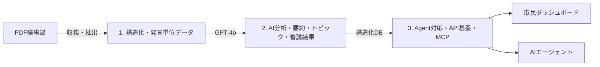

### LocalScope Agentとは？

#### 次世代Civic Intelligence Platform

#### About

地方議会は「公開」されている。しかし、それは“AI時代に見合った公開の形”であろうか。

PDFや専用UIで読む民主主義から、AIが議論構造を解析し事実と指標を提示し、人間がより本質的な議論に集中できる民主主義へ。

LocalScope Agentは、地方議会の議事録データを構造化し、**AIが思考できる公共インフラ**へと変換するプロジェクトです。
これは決して人間向けに可視化するだけのダッシュボードではない。民主主義のための**エージェントファーストな基盤設計**であると捉えています。

#### Why

なぜ今、議会を“機械可読”にする必要があるのか？
エージェントファーストであることは、人間を排除することではありません。むしろ逆です。

構造化された議会データは、市民が全議事録を読み込まなくても、議論の流れや論点の変遷を理解できる状態を生み出します。
感情や断片的な切り取りではなく、**構造に基づいて議論できる環境**をつくる。
それが、エージェントファーストが人間と社会にもたらす価値です。

AIが読み取れる民主主義は、人間にとっても理解しやすい民主主義になる。
AIはすでに政策を読み、法案を分析し、意思決定を補助する存在になりつつある。
しかし、日本の地方議会（これに限らず）未だに人間向け中心の公開形式に留まっています。

**「公開されている」と、「活用できる」は違う。**

AIが読み取れない民主主義は、このAI時代においてもはや十分に透明とは言えない。
私たちは今、**人間可読**で止まっている民主主義を、**機械可読**へ進化させなければならない。

LocalScope Agentは、その構造的断絶を埋めるための基盤であり、地方自治体の議会会議録を収集・構造化し、AIエージェントが読解・分析・評価できる形に変換する**エージェントファースト型の市政インテリジェンス基盤構築プロジェクト**です。

> 「人間にとって見やすいダッシュボード」から「議会を解析・評価・思考できるAI基盤」へ。

**民主主義をAI時代の公共インフラにする変革を、一緒に設計しませんか？**

#### Approach

##### 1. 構造化

PDFの議事録を発言単位のデータに自動変換。発言者の識別（6段階マッチング）、議題抽出、一般質問分析を行い、機械可読な形式で保存します。

##### 2. AI 分析

GPT-4o が要約・トピック・審議結果・一般質問テーマを抽出。
**評価でなく事実の記述に特化**した設計で、政治的中立性を確保します。

##### 3. Agent 対応

構造化データは人間向けダッシュボードだけでなく、**AIエージェントが直接クエリできるAPI基盤**として設計。AIで活用すべき以下の対応を実施中。

- MCP(Model Context Protocol) 化 - 外部エージェントからの呼び出し
- Agent Skill化 - 誰でも自然言語クエリから構造化APIに変換を扱えるノウハウ共有
- 市民AIコメンテーター - 感情評価でなく構造評価の自動生成
- 民主主義OS - 議会データの標準フォーマット化・共有インフラ化

#### Current Data

こちらは順不同、話題性などを加味しつつも気まぐれな優先順位で取り込み、今後も同様の方針で順次追加予定。

（2026.02現在）

| 自治体     | 都道府県 | 議事録数 | 発言者数 |
| ---------- | -------- | -------: | -------: |
| 前橋市     | 群馬県   |     52件 |    187名 |
| 安芸高田市 | 広島県   |     72件 |    151名 |

#### Roadmap

| フェーズ  | 内容                                 | 状態      |
| --------- | ------------------------------------ | --------- |
| Phase 1   | 構造化・AI要約・ダッシュボード       | ✅ 完了   |
| Phase 1.5 | 議題抽出・一般質問分析・Analytics    | ✅ 完了   |
| Phase 2A  | Agent API・MCP対応・議員スタイル分類 | 🔄 開発中 |
| Phase 2B  | 議会活動指標・AI構造評価コメント     | 📋 計画中 |
| Phase 3   | 自治体横断比較・民主主義OS           | 📋 計画中 |

#### Design Principles

- **事実の記述と価値判断の分離** — 「良い議会 / 悪い議会」の断定はしない
- **算出ロジックの透明性** — 指標の算出方法をすべて公開し再現可能に
- **Agent-first / API-first** — 人間のUIと同等にAIが利用できるデータ基盤
- **公開情報のみ利用** — すべての処理は公開された議事録データのみ対象

#### Technology Stacks

         

本構想はGPT５.2とディベートの上基本PRDを策定、その後内容引き渡しの上、実際の機能開発・コーディングは**CodexとClaude CodeからなるAIエージェントチーム**で進めています。

#### Disclaimer

本サービスが扱う議事録・発言内容・発言者氏名はすべて、各地方公共団体が公式に公開している会議録に基づいています。**会議録そのものの著作権は各地方公共団体に帰属します。**

地方公共団体または権限を有する関係者から掲載データの削除・修正のご要望があった場合は、速やかに対応いたします。

詳細はサービスサイト掲載内容をご覧ください。

[[ogp:https://localscope.tariki-code.tokyo/disclaimer]]

#### Recruiting Friends

LocalScope Agent は**Civic Tech**の理念に基づくオープンで非営利なプロジェクトです。
地方自治の透明性向上という公益的な課題に、テクノロジーで向き合うことを目指しています。

現時点は MVP すなわち「動く最初のかたち」ができた段階です。
対応自治体の拡大、AIの精度向上、MCP対応、そしてより多くの市民にとって価値のある基盤づくりへ。
解くべき課題はまだ山積みです。

##### こんな方を探しています

- 民主主義の透明性をテクノロジーで底上げする等、社会を変える気概のある方。
- シビックテック／オープンガバメントの理念に共感し、手を動かして社会実装までやりたい方。
- データ整備・構造化・分析・可視化など領域問わず、「データ」に強い方。
- PDF・自然言語・LLMを使った情報抽出/構造化に強い方。
- 自分の地域を変えたいと思っている方。

技術貢献（コード・Issue）でも、アイデア提案でも、使ってフィードバックをくれるだけでも歓迎です。

##### OSSプロジェクト

LocalScope Agent はオープンソースで開発しています。
まずは GitHub か [X（@kobatch_tk）](https://x.com/kobatch_tk) でお気軽にご連絡ください。

[[ogp:https://github.com/takafumikobayashi/localscope-agent]]
