## Svelte

このサイトもシンプル（かつ手作り感満載？）に見えて実は・・・色々難しい技術を使っています。

---

### Introduction

    

2017年よりNode.jsエンジニアとして、さまざまなプロジェクトに従事し、フロントエンドとバックエンドの両方で豊富な経験を積んできました
当時はv8とか、その辺りを使っていたかと記憶しています。
サーバーサイド側のユーザー向けAPIを開発したり、VueやReactおよびSvelteなどフロントエンドのフレームワークを活用したWebアプリケーション開発経験があります。
AWSやAzureなどクラウドベースのフルマネージドなサービスも盛り込んだ構成をデザインすることも可能です。

私はIT業界における最難関国家資格である「ITストラテジスト」の資格を有しています。
現在の本業務は開発現場から離れ、マネジメントおよび会社や事業全体のデジタル化戦略やプロダクトグロース方針などを策定する役割かもしれません。

現在でも業務に問わず長年実際に手を動かしている高い技術力と、業務上の役割から求められる広い目線と様々なコネクションから裏打ちされた情報収集能力で、幅広いレイヤーにおいて最新動向を踏まえた対応が可能となります。

---

### Key Skills & Technologies

主に業務、一部のその他場面にて活用したことのあるスタックを表示してみました。
※以下、アーキテクチャー図はmermaidのBETA機能（2024年9月現在）を使用しております、描画がに不備があると思われた際はリロードをしてみてください。

```mermaid
architecture-beta
    group nodejs(logos:nodejs-icon)[FrontEnd]
    group azure(logos:azure-icon)[ServerSide]
    group node(logos:nodejs-icon)[ServerSide]
    group aws(logos:aws)[ServerSide]
    group repos(logos:git-icon)[OtherEnviroment]

    service vue(logos:vue)[Vuejs] in nodejs
    service react(logos:react)[React] in nodejs
    service svelte(logos:svelte-icon)[Svelte] in nodejs
    service next(logos:nextjs)[Nextjs] in nodejs
    service nuxt(logos:nuxt)[Nuxtjs] in nodejs
    service express(logos:nodejs-icon-alt)[Express] in node
    service pm2(logos:pm2-icon)[pm2] in node
    service nestjs(logos:nestjs)[Nestjs] in node
    service lambda(logos:aws-lambda)[lambda] in aws
    service s3(logos:aws-s3)[s3Backet] in aws
    service fargate(logos:aws-fargate)[Fargate] in aws
    service ebt(logos:aws-elastic-beanstalk)[Ebt] in aws
    service gateway(logos:aws-api-gateway)[ApiGateway] in aws
    service cloudfront(logos:aws-cloudfront)[Cloudfront] in aws
    service k8s(logos:kubernetes)[AzureK8s] in azure
    service spring(logos:spring-icon)[Spring] in azure
    service postgres(logos:postgresql)[Database] in azure

    service github(cib:github)[Github] in repos
    service gitlab(logos:gitlab)[Gitlab] in repos
    service actions(logos:github-actions)[Actions] in repos
    service netlify(logos:netlify-icon)[CDN] in repos
    service heroku(logos:heroku-icon)[Deploy] in repos
    service firebase(logos:firebase)[NoSQLDatabase] in repos
```

---

### Portfolio & Case Studies

    

ここでは実際に行ったプロジェクトのごく一部を紹介させていただければと思います。具体的には以下となります。

* SvelteKitとLambdaを使ったLP開発
* VueおよびSpringを使った業務システム開発
* Expressおよびpm２を使ったユーザー向けAPIの開発
* LINEを活用したソリューション -1
* LINEを活用したソリューション -2

---

#### SvelteKitとLambdaを使ったLP開発

このサイトのことですが、SvelteKitを使ったLP（LandingPage）の開発を行なっています。

##### 背景や実現したいこと

個人事業用のサイトを構築し、事業や仕事の内容、およびそれに関連する技術情報、SNS等での公開情報などをまとめて発信したいと考えました。
廉価でかつ軽量なフレームワークを選定したく、フロントエンドはSvelteを採用することとしました。
一部バックエンドで必要な処理が存在するので、こちらもノーコストかつ最小限構成となるようにしたいと考えました。

##### アーキテクチャ

* SvelteKitおよび、CSSフレームワークとして[SUMI](https://sveltematerialui.com/)を採用しました。
* markdownをPushすればその内容が記事になるように設計しました。highlighter.jsおよびmermaid.jsも実装済なので、コード表記も図形描画にも対応しています。（このページがまさにその実装が反映されています。）
* 記事に「いいね」を残すことができるので、サーバーサイド側でlambdaを準備し、その履歴をS3に保管のJSONに残すようにしました。
* Svelte側はNetlifyにて、Lmabda側はGithub Actionsにてオートデプロイを実装しています。

#####　詳細内容やリンク

※このページはソースコードは非公開とさせていただいています。

---

#### VueおよびSpringを使った業務システム開発

社内業務システムにてVueおよびSpringを活用した開発を行いました。

##### アーキテクチャ

* フロントエンドはVue.js、バックエンドはJavaのSpringを使った構成でした。
* リポジトリはGitlabを使い、データベースはPostgresを使いました、OR-Mapper(MyBatis)を活用していました。
* クラウドはAzure環境を使い、AKSを活用したマイクロサービスアーキテクチャを実現していました。

```mermaid
architecture-beta

    group nodejs3(logos:nodejs-icon)[Client]
    group azure(logos:azure-icon)[Cloud]
    group repos1(logos:git-icon)[Repository]
    group repos2(logos:git-icon)[Repository]

    service vue(logos:vue)[Vuejs] in nodejs3
    service k8s(logos:kubernetes)[AzureK8s] in azure
    service spring(logos:spring-icon)[Spring] in azure
    service postgres(logos:postgresql)[Database] in azure
    service gitlab1(logos:gitlab)[VueRepository] in repos1
    service gitlab2(logos:gitlab)[SpringRepository] in repos2

    vue:R -- L:spring
    gitlab1:B -- T:vue
    spring:R -- L:gitlab2
    spring:B -- T:postgres
```

---

#### Expressおよびpm２を使ったユーザー向けAPIの開発

初めてNode.jsを始めた際に構築したユーザー向けAPIサービスになります。

##### 背景や実現したいこと

早い段階から、業務システムは必ずしもブラウザを介したUIだけでなく、蓄積された業務データをAPIで提供することで、ユーザー側の業務効率化の利活用の幅が広がると考えていました。
特に、当時の職場環境では様々なツール（Microsoft、Google、その他各種RPAなど）が揃っている状況だったので、それらと組み合わせることで、UIではどうしても画一的なならざろう得ない仕様に対して、最低点の制約は担保しつつも、利用に柔軟性を持たせることができると考えました。
こうした背景より構築したのがこちらのAPIプラットフォームになります。

##### アーキテクチャ

* 業務の中でのみ活用するものなので非常にシンプルな構成で構築を行いました。IaaSサービス上で構築したものなので、一定のスペックは持ちつつもスケーラビリティなどは考慮されていません。
* 当時主流だったExpressを使っています、但し、リバースプロキシの配下で設置をしておりました。
* pm2というNode.jsのプロセス監視ツールを使うことで、デーモンの管理を簡素化していました。

```mermaid
architecture-beta

    group nodejs4(logos:nodejs-icon)[Server]
    group client(ic:baseline-account-circle)[User]

    service express(logos:nodejs-icon-alt)[Express] in nodejs4
    service pm2(logos:pm2-icon)[pm2] in nodejs4
    service postgres(logos:postgresql)[Database] in nodejs4
    service postman(logos:postman-icon)[exPostman] in client

    postman:R -- L:express
    express:B -- T:postgres

```

---

#### LINEを活用したソリューション - 1

自身で運用しているInstagramアカウント（京都・奈良など日本美を発信するアカウント）専用の更新チャンネルで実装したソリューションです。

##### 背景や実現したいこと

専用のLINE公式アカウントに友だち登録された人に投稿がされた都度、通知が飛ぶ仕組みを実装しています。
また、写真に投稿されている京都、奈良の寺社仏閣などのキーワードを投稿すると、その内容で投稿された写真から検索を行い、人気のある上位５件の写真とリンク、またそのスポットのWikipedia情報を送リます。
これによって、ユーザーである友だちはただ受け取るためのチャンネルではなく、双方向でコミュニケーションができるツールとして活用することができます。

##### アーキテクチャ

* LINE MessagingAPIを使って実現しています。
* LINEのWebhookの受け先となるサーバーをheroku環境で構築しました。フレームワークにはTypeScriptベースで簡単にAPIサーバーを構築できる「nest.js」を採用しました。
* heroku側のGitにpushすることで、オートデプロイが実行されます。
* nest.jsからfacebookAPIを使ってInstagramの投稿やハッシュタグを検索しています。
* さらに、firebaseを使ってアクションがあったユーザーを管理しています。

```mermaid
architecture-beta

    group heroku0(logos:heroku-icon)[ServerSide]
    group cloud(ic:outline-cloud)[Cloud]
    group line(ic:baseline-account-circle)[User]

    service nestjs(logos:nestjs)[Webhook] in heroku0
    service facebook(logos:facebook)[API] in cloud
    service instagram(cib:instagram)[Contents] in cloud
    service firebase(logos:firebase)[NoSQLDatabase] in cloud
    service channel(cib:line)[OfficalChannel] in line
    service git(logos:git-icon)[Repository] in heroku0

    channel:R -- L:nestjs
    nestjs:R -- L:facebook
    nestjs:B -- T:git
    nestjs:R -- L:firebase
    facebook:R -- L:instagram
```

#####　詳細内容やリンク

| リポジトリ名 | 説明 | Github |
| ---- | ---- | ---- |
| vertrek_kyoto-linebots-webhook-on-heroku | nest.jsにて構築されたWebhook用のサーバー | https://github.com/takafumikobayashi/vertrek_kyoto-linebots-webhook-on-heroku |

---

#### LINEを活用したソリューション - 2

こちらは番外編ですが、LINEとRaspberryPi、および内蔵カメラを使って、留守の間に家のペット（ネコ）を監視することができる仕組みを作りました。

##### 背景や実現したいこと

自分だけでなく家族の誰もが、簡単に利用できるようにしたい。
決まった文言ではなく、ある程度自然な会話の中で実現できるようにしたい。
撮影した画像や動画から、実際にネコがいるのか、そして何をしているのかをある程度機械的な目線でも分析をしてもらいたい。

##### アーキテクチャ

* LINE MessagingAPIを使って実現しています。
* 投稿されたらWebhookとしてAPI GatewayおよびLambdaで受け取り、リクエストボディSQSに保存します。（そんな頻度は全くないですが無駄にスケーラビリティ対策ができてます）
* Raspbelly Pi側ではSQSをポーリングし、メッセージを受け取ったら処理を開始します。
* 投稿された内容から、動画が欲しいのか？静止画が欲しいのか？何枚欲しいのか？などを分析するためにOpenAIのAPI（GPT-4o-mini）を使って問い合わせています。
* 分析できた内容から指定の回数だけ動画、あるいは静止画を撮影します。
* 撮影されたデータはS3に保存、かつRekognitionを使って分析を行います。（画像から何が読み取れるのか？のタグ情報とその確度となる数値を受領）
* Rekognitionの内容からネコがいるのか？いないのか？いるならどういう状況なのかのコメントを作成し、リンクとともに返信します。
* これによって自然な会話の中でユーザーはリクエストでき、またその結果として自然な結果を返してくれることを実現しており、Botっぽくないより普段の会話に近い形でのコミュみケーションを実現しています。

#####　詳細内容やリンク

| リポジトリ名 | 説明 | Github |
| ---- | ---- | ---- |
| raspi-catcam | RaspberryPi側で実装してるNode.jsサーバー | https://github.com/takafumikobayashi/raspi-catcam |
| raspi-catcam-lambda | AWS側で実装しているLambdaのソースコードとGithub Acrionsの設定 | https://github.com/takafumikobayashi/raspi-catcam-lambda |

---

### Services Offered

    

Node.jsでお困りなことはありませんか？
こうした経験を踏まえ、以下のご支援・サービスが可能です。

#### コンサルティング

* フロントエンドフレームワークを使ってWebサイトやWebアプリを構築したい
* Node.jsを駆使したモダンなサイトを構築したいが何から始めればよいのかわからない
* やりたい目的に沿ったフレームワークや技術の選定
* これらを総合的に勘案し、事業フェーズやコストの観点を盛り込んだWebシステム化戦略の策定支援

#### 講師・ハンズオン

* Node.jsやJavaScriptの基礎研修
* ReactやSvelteなどのフレームワークを使ったハンズオン研修
* 本格的なSQLの研修（初級から上級者向けまで）

#### AIを活用した開発支援

* Github Copilotを活用したコーディング手法の研修・ハンズオン
* OpenAIを活用したペアプログラミング、ゼロベースのコーディング、およびデバック・トラブルシューティングの進め方とテクニック

など

---

### 最後に

今回ご紹介した技術スタックやプロジェクト事例は、私の豊富な経験とスキルを反映したものです。Node.jsやSvelteをはじめとする最新技術を活用し、クライアントのニーズに合わせた柔軟かつ効率的なソリューション提供が可能です。ぜひ、開発やコンサルティングのご依頼をご検討ください。