```mermaid
architecture-beta

    group nodejs3(logos:nodejs-icon)[Client]
    group azure(logos:azure-icon)[Cloud]
    group repos1(logos:git-icon)[Repository]
    group repos2(logos:git-icon)[Repository]

    service vue(logos:vue)[Vuejs] in nodejs3
    service k8s(logos:kubernetes)[AzureK8s] in azure
    service spring(logos:spring-icon)[Spring] in azure
    service postgres(logos:postgresql)[Database] in azure
    service gitlab1(logos:gitlab)[VueRepository] in repos1
    service gitlab2(logos:gitlab)[SpringRepository] in repos2

    vue:R -- L:spring
    gitlab1:B -- T:vue
    spring:R -- L:gitlab2
    spring:B -- T:postgres
```

```mermaid
architecture-beta

    group nodejs4(logos:nodejs-icon)[Server]
    group client(ic:baseline-account-circle)[User]

    service express(logos:nodejs-icon-alt)[Express] in nodejs4
    service pm2(logos:pm2-icon)[pm2] in nodejs4
    service postgres(logos:postgresql)[Database] in nodejs4
    service postman(logos:postman-icon)[exPostman] in client

    postman:R -- L:express
    express:B -- T:postgres

```

```mermaid
architecture-beta

    group heroku0(logos:heroku-icon)[ServerSide]
    group cloud(ic:outline-cloud)[Cloud]
    group line(ic:baseline-account-circle)[User]

    service nestjs(logos:nestjs)[Webhook] in heroku0
    service facebook(logos:facebook)[API] in cloud
    service instagram(cib:instagram)[Contents] in cloud
    service firebase(logos:firebase)[NoSQLDatabase] in cloud
    service channel(cib:line)[OfficalChannel] in line
    service git(logos:git-icon)[Repository] in heroku0

    channel:R -- L:nestjs
    nestjs:R -- L:facebook
    nestjs:B -- T:git
    nestjs:R -- L:firebase
    facebook:R -- L:instagram
```

## Svelte

このサイトもシンプル（かつ手作り感満載？）に見えて実は・・・難しい技術を使っています。

---

### Introduction

    

2017年よりNode.jsエンジニアとして、さまざまなプロジェクトに従事し、フロントエンドとバックエンドの両方で豊富な経験を積んできました。当時はv8とか、その辺りを使っていたかと記憶しています。サーバーサイド側のユーザー向けAPIを開発したり、VueやReactおよびSvelteなどフロントエンドのフレームワークを活用したWebアプリケーション開発経験があります。AWSやAzureなどクラウドベースのマネージドサービスも盛り込んだ構成をデザインすることも可能です。

私はIT業界における最難関国家資格である「ITストラテジスト」の資格を有しています。現在の本業務は開発現場から離れ、マネジメントおよび会社や事業全体のデジタル化戦略やプロダクトグロース方針などを策定する役割かもしれません。

ただ今でも業務に問わず長年実際に手を動かしている高い技術力と、業務上の役割から求められる広い目線と様々なコネクションから裏打ちされた情報収集能力で、幅広いレイヤーにおいて最新動向を踏まえた対応が可能となります。

---

### Key Skills & Technologies

主に業務、一部のその他場面にて活用したことのあるスタックを表示してみました。
※以下、アーキテクチャー図はmermaidのBETA機能（2024年9月現在）を使用しております、描画に不備があると思われた際はリロードをしてください。

---

### Portfolio & Case Studies

    

ここでは実際に行ったプロジェクトのほんの一部を紹介させていただければと思います。具体的には以下となります。

- SvelteKitとLambdaを使ったLP開発
- VueおよびSpringを使った業務システム開発
- Expressおよびpm２を使ったユーザー向けAPIの開発
- LINEを活用したソリューション -1
- LINEを活用したソリューション -2

---

#### SvelteKitとLambdaを使ったLP開発

このサイトのことですが、SvelteKitを使ったLP（LandingPage）の開発を行なっています。

##### 背景や実現したいこと

個人事業用のサイトを構築し、事業や仕事の内容、およびそれに関連する技術情報、SNS等での公開情報などをまとめて発信したいと考えました。
廉価でかつ軽量なフレームワークを選定したく、フロントエンドはSvelteを採用することとしました。
一部バックエンドで必要な処理が存在するので、こちらもノーコストかつ最小限構成となるようにしたいと考えました。

##### アーキテクチャ

- SvelteKitおよび、CSSフレームワークとしてSUMIを採用。
- markdownをPushすればその内容が記事になるように設計。highlighter.jsおよびmermaid.jsも実装済のため、コード表記も図形描画にも対応。
- 記事に「いいね」を残すことができるので、サーバーサイド側でLambdaを準備し、その履歴をS3に保管されたJSONにて管理。
- Svelte側はNetlifyにて、Lmabda側はGithub Actionsにてオートデプロイを実装。

```mermaid
architecture-beta

    group nodejs1(logos:nodejs-icon)[Client]
    group nodejs2(logos:nodejs-icon)[Client]
    group aws(logos:aws)[Cloud]
    group repos1(logos:git-icon)[Repository]
    group repos2(logos:git-icon)[Repository]

    service svelte(logos:svelte-icon)[Svelte] in nodejs1
    service lambda1(logos:aws-lambda)[Lambda] in aws
    service gateway(logos:aws-api-gateway)[ApiGateway] in aws
    service s3(logos:aws-s3)[s3Backet]  in aws
    service github2(cib:github)[SvelteRepos] in repos1
    service github3(cib:github)[LambdaRepos] in repos2
    service netlify(logos:netlify-icon)[NetlifyCDN] in repos1
    service actions(logos:github-actions)[Actions] in repos2
    service typescript(logos:typescript-icon)[Code] in nodejs2

    gateway:R -- L:lambda1
    lambda1:R -- L:s3
    github2:B -- T:svelte
    github2:R -- L:netlify
    svelte:R -- L:gateway
    actions:R -- L:github3
    lambda1:B -- T:actions
    github3:R -- L:typescript

```

#####　詳細内容やリンク

| パッケージ名       | 説明                                                     | URL                           |
| ------------------ | -------------------------------------------------------- | ----------------------------- |
| Svelte Material UI | Svelte版 Material UIフレームワークパッケージ             | https://sveltematerialui.com/ |
| highlight.js       | コードブロックのシンタックスハイライト機能               | https://highlightjs.org/      |
| mermaid.js         | markdownのコードブロック表記による図形やチャート表示機能 | https://mermaid.js.org/       |

---

#### VueおよびSpringを使った業務システム開発

社内業務システムにてVueおよびSpringを活用した開発を行いました。

##### アーキテクチャ

- フロントエンドはVue.js、バックエンドはJavaのSpringを使った構成。
- リポジトリはGitlabを使い、データベースはPostgresを使いました、OR-Mapper(MyBatis)を活用。
- クラウドはAzure環境を使い、AKSを活用したマイクロサービスアーキテクチャを実現。

---

#### Expressおよびpm２を使ったユーザー向けAPIの開発

Node.jsで初めて構築したユーザー向けAPIサービスです。

##### 背景や実現したいこと

業務データをAPIで提供することで、ブラウザUIに依存しない柔軟な業務効率化が可能だと考えていました。特に、MicrosoftやGoogle、RPAなどのツールと組み合わせることで、画一的なUIの制約を軽減し、利用者に柔軟性を持たせることを目指しました。この背景からAPIプラットフォームを構築しました。

##### アーキテクチャ

- シンプルな構成: 業務内での活用を想定し、スケーラビリティは重視せず、IaaS上で構築。一定のスペックを持つものの、複雑さを避けました。
- Expressの採用: 当時の主流であったExpressを使用し、リバースプロキシの配下で運用。
- プロセス監視: pm2を用いてNode.jsプロセスを簡単に管理し、デーモン化を実現。

---

#### LINEを活用したソリューション - 1

自身が運用しているInstagramアカウント（京都・奈良の風景を発信するアカウント）向けに実装したLINE通知ソリューションです。

##### 背景や実現したいこと

INE公式アカウントの友だちに、Instagram投稿の都度通知が送信される仕組みを構築。また、キーワードを投稿すると、その関連投稿をInstagramから検索し、上位5件のリンクやWikipedia情報を返信します。これにより、友だちとの双方向コミュニケーションが可能です。

##### アーキテクチャ

- LINE Messaging APIを活用
- heroku環境にTypeScriptベースの「nest.js」でWebhookサーバーを構築
- Gitへのpushでオートデプロイ
- facebookAPIでInstagramの投稿やハッシュタグを検索
- firebaseでユーザー管理

#####　詳細内容やリンク

| リポジトリ名                             | 説明                                     | Github                                                                        |
| ---------------------------------------- | ---------------------------------------- | ----------------------------------------------------------------------------- |
| vertrek_kyoto-linebots-webhook-on-heroku | nest.jsにて構築されたWebhook用のサーバー | https://github.com/takafumikobayashi/vertrek_kyoto-linebots-webhook-on-heroku |

---

#### LINEを活用したソリューション - 2

こちらはLINEとRaspberry Piのカメラを使い、留守中にペット（ネコ）を監視する仕組みです。

##### 背景や実現したいこと

家族の誰でもLINEで簡単に使える仕組みを目指し、より自然な会話でペットの様子を確認できるようにしたい。さらに、撮影された画像や動画を機械的に分析し、ネコがいるか、何をしているかを判断してもらいたいと考えました。

##### アーキテクチャ

- LINE MessagingAPIを使って実現。
- API GatewayとLambdaでリクエストを受け、SQSに保存。
- Raspberry PiがSQSをポーリングし、リクエストを検知したら処理を開始。
- 投稿された文章から、動画が欲しいのか？静止画が欲しいのか？何枚欲しいのか？をOpenAI（GPT-4o-mini）にて分析、その内容にて撮影を実施。
- 撮影されたデータはS3に保存、かつRekognitionを使って分析。
- Rekognitionの内容に基づき、ネコの状況を判断し、LINEに画像・動画リンクとともに返信。

これにより自然な会話の中でユーザーはリクエスト、またその結果として自然な結果を返してくれることを実現、より普段の会話に近い形でのコミュニケーションを実現しています。

```mermaid
architecture-beta

    group line21(ic:baseline-account-circle)[User]
    group line22(ic:baseline-account-circle)[User]
    group raspi(logos:raspberry-pi)[RaspberryPi]
    group aws2(logos:aws)[Cloud]
    group cloud2(ic:outline-cloud)[Cloud]


    service channel21(cib:line)[PostMessage] in line21
    service channel22(cib:line)[RecievePhotos] in line22
    service gateway2(logos:aws-api-gateway)[APIGateway] in aws2
    service lambda2(logos:aws-lambda)[Lambda] in aws2
    service sqs(logos:aws-sqs)[SQS] in aws2
    service s32(logos:aws-s3)[S3Bucket] in aws2
    service express21(logos:nodejs-icon-alt)[Express] in raspi
    service express22(logos:nodejs-icon-alt)[Express] in raspi
    service camera(ic:baseline-camera-alt)[Camera] in raspi
    service pm22(logos:pm2-icon)[pm2] in raspi
    service openai(logos:openai-icon)[OpenAI] in cloud2

    channel21:R -- L:gateway2
    gateway2:R -- L:lambda2
    lambda2:R -- L:sqs
    sqs:R -- L:express21
    express21:R -- L:openai
    express21:B -- T:camera
    camera:B -- T:express22
    s32:R -- L:camera
    s32:B -- T:channel22
    channel22:R -- L:express22
```

#####　詳細内容やリンク

| リポジトリ名        | 説明                                                          | Github                                                   |
| ------------------- | ------------------------------------------------------------- | -------------------------------------------------------- |
| raspi-catcam        | RaspberryPi側で実装してるNode.jsサーバー                      | https://github.com/takafumikobayashi/raspi-catcam        |
| raspi-catcam-lambda | AWS側で実装しているLambdaのソースコードとGithub Acrionsの設定 | https://github.com/takafumikobayashi/raspi-catcam-lambda |

---

### Services Offered

    

Node.jsでお困りなことはありませんか？
こうした経験を踏まえ、以下のご支援・サービスが可能です。

#### コンサルティング

- フロントエンドフレームワークを使ってWebサイトやWebアプリを構築したい。
- Node.jsを駆使したモダンなサイトを構築したいが何から始めればよいのかわからない。
- やりたい目的に沿ったフレームワークや技術の選定をしたい。
- これらを総合的に勘案し、事業フェーズやコストの観点を盛り込んだWebシステム化戦略策定を支援してほしい。

#### 講師・ハンズオン

- Node.jsやJavaScriptの基礎研修。
- ReactやSvelteなどのフレームワークを使ったハンズオン研修。
- 本格的なSQLの研修（初級から上級者向けまで）。

#### AIを活用した開発支援

- Github Copilotを活用したコーディング手法の研修・ハンズオン。
- OpenAIを活用したペアプログラミング、ゼロベースのコーディング、およびデバック・トラブルシューティングの進め方とテクニック。

など

---

### Conclusion

#### 最後に

今回ご紹介した技術スタックやプロジェクト事例は、私の豊富な経験とスキルを反映したものです。Node.jsやSvelteをはじめとする最新技術を活用し、クライアントのニーズに合わせた柔軟かつ効率的なソリューション提供が可能です。ぜひ開発やコンサルティングのご依頼をご検討ください。
