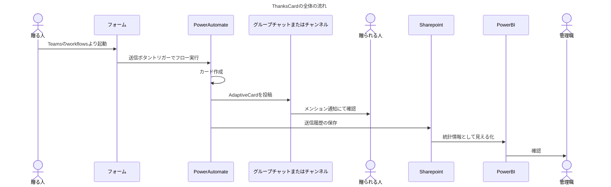

## TeamsとAdaptiveCardで実現する「感謝を伝える文化」

あなたの職場では、感謝が伝わっていますか？  
職場の一人ひとりが感謝を伝えることで、どんな変化が生まれるか想像したことはありますか？

---

### Introduction

#### 職場に新たな風を—モチベーションとエンゲージメントの向上へ

    

私は、組織におけるオープンな情報共有とコミュニケーション、および前向きで目的ドリブンな意見をより積極的になものにし、カルチャーとして醸成していきたいという課題感に対し、Microsoft TeamsとAdaptiveCardを活用した「感謝を伝える仕組み」を導入し、いわゆる「ワークエンゲージメント」の向上に取り組んでいます。これによりジョブ・クラフティングの観点からも、社員の自主性や仕事に対するやりがいをより一層高める効果が期待されています。

---

### Challenge and Hypothesis

    

導入以前、組織内では以下のような課題が見受けられました。

#### 社員の視点からの課題

- やらされ感の増大: 上司の指示通りに業務をこなすだけで、自主的な行動や意思決定の機会が限られていた。
- 情報共有の閉鎖性: 組織内の情報が十分に共有されず、社員同士のコミュニケーションや連携がスムーズに進まない状況が見られた。
- 本質的な議論の欠如: 日々の業務がタスクベースで進行し、将来的なビジョンや組織の成長に向けた本質的な議論が不足していた。

#### 管理職やマネジメント層の視点からの課題

- 働きやすさ・働きがいの議論が進まない: 社員の働きやすさや働きがいに関する議論は行われているが、具体的な解決策が見つからず、実行に至っていない。
- 社員のモチベーション向上の方法が不明確: 部下の社員が充実して働くためにはどうすればよいのか、具体的な方法が分からず、モチベーション向上の手段に迷いがあった。
- 社員の心理状態の把握が不十分: 社員がどのような心理状態で業務に取り組んでいるのか、管理職が十分に把握できておらず、適切なサポートやフィードバックが困難な状況にあった。

これらの課題を解決するため、以下の仮説が立てられました。

#### 仮説1：職場での承認と充実感が、業務の前向きな姿勢を生む

社員が日々の業務に取り組む前に、一人のメンバーとして認められ、充実した気持ちになれる環境が必要ではないかと考えました。職場で尊重され、感謝されることで、社員は自分の存在価値を感じ、心理的安全性が高まる可能性があります。この承認により、社員は心の充実感を得て、仕事に対する前向きな姿勢を持つようになるのではないかという仮説です。

#### 仮説2：承認のオープン化による効果

承認や感謝が個人に留まらず、チームや組織全体でオープンに共有されることが、社員同士の連携を強化し、コミュニケーションを活発化させるのではないかと仮定しました。承認がオープンに行われることで、社員は互いに感謝し合い、ポジティブな文化が広がり、モチベーション向上のグッドサイクルが生まれると期待されています。これにより、組織全体の連帯感や協力意識が高まり、チームとしてのパフォーマンスも向上する可能性があります。

#### 仮説3：マズローの5段階欲求による充足

アブラハム・マズローの5段階欲求説に基づく仮説です。基本的な生理的欲求や安全の欲求が満たされた後、職場での感謝や承認によって、社員の社会的欲求（愛と所属）や尊重の欲求（承認・自尊心）が満たされ、自己実現に向かう可能性があります。感謝の文化が職場に根付くことで、社員は自己実現に向けた高次の欲求を追求し、積極的な姿勢で仕事に取り組むようになるのではないかと考えました。

#### 仮説4：管理職による社員の心理状態の把握

管理職やマネジメント層が、社員の日々の業務や心理状態を数値やデータで可視化できれば、社員のモチベーションや充実度を把握し、適切なサポートやフィードバックを行うことができるのではないかと仮定しました。例えば、感謝や承認のメッセージが送られた回数や反応の内容をグラフやダッシュボードで可視化することで、社員の心理的状態を客観的に評価することが可能になります。これにより、管理職は社員の心理的な状態を定期的に評価し、働きやすい環境を提供できると考えています。

このように、感謝を伝える文化を通じて職場の課題を解決できる可能性があると仮定し、社員の心理的な充実感やオープンなコミュニケーションが組織全体のパフォーマンス向上につながると期待しています。
それらを踏まえ、解決手段としてThankCardの取り組みを実施するに至りました。

---

### Work Engagement

    

#### ワークエンゲージメントとは？

ワークエンゲージメントとは、従業員が仕事に対して感じるポジティブで充実した心理的状態を指す概念です。この状態にある従業員は、仕事に対して強い情熱とエネルギーを持ち、積極的に取り組むことが特徴です。ワークエンゲージメントの高い従業員は、職場において次のような行動を取ることが知られています。

- 活力：仕事に対する高いエネルギーレベルを持ち、持続的な力を発揮する。
- 献身：仕事に対して強い意欲を持ち、困難に立ち向かう姿勢を取る。
- 没頭：仕事に完全に集中し、時間を忘れるほど熱中する。

厚生労働省の報告書によると、ワークエンゲージメントが高い従業員は、低い従業員に比べてパフォーマンスが向上し、また離職率が低下する傾向にあります。特に「働きがい」の向上は、業務効率の改善やモチベーションの向上に寄与することが確認されています。また、従業員の自己効力感が高まることで、さらなる成果が期待されると述べられています。つまり、ワークエンゲージメントを向上させることは、組織全体の生産性を向上させ、従業員の定着率を高めるための重要な要因であることが示されています。

#### ThankCardがワークエンゲージメント向上に寄与する理由

ThankCardの仕組みを通じて、職場において日常的に感謝の気持ちを表現し合うことが、ワークエンゲージメント向上に寄与すると考えられます。以下に、ThankCardがワークエンゲージメントの主要な要素にどのように働きかけるかを説明します。

1. 感謝のやり取りによる活力の向上

ThankCardを通じて送られる感謝のメッセージは、受け取った職員にとって自分が認められているというポジティブなフィードバックになります。このフィードバックにより、従業員は自分の仕事が組織に貢献していると感じ、仕事に対するエネルギーや意欲が高まります。結果として、仕事への活力が向上し、困難な業務にも持続的な力を発揮できるようになります。

2. 承認による献身の強化

感謝の文化が根付いた職場では、従業員同士がお互いを尊重し合い、支え合う環境が形成されます。ThankCardのように具体的な形で感謝や承認を表現することで、従業員は仕事に対してより一層献身的な態度を取るようになります。認められることが従業員の意欲をさらに強化し、結果として業務に対して強い責任感や熱意を持って取り組む姿勢を生み出します。

3. 感謝の可視化による没頭感の向上

ThankCardは単なるメッセージのやり取りだけでなく、感謝が数値やグラフとして可視化されることで、従業員の貢献度が客観的に認識されます。このようにして、感謝や承認の結果が目に見える形で示されることで、従業員は自分の役割や責任をより強く実感し、仕事に対する没頭感を高めることができます。従業員は、自分の仕事が組織にとって重要であると感じることで、集中力や仕事に取り組む熱意が高まります。

4. 心理的安全性の向上

感謝の文化が根付くことで、職場における心理的安全性が向上します。従業員同士が安心してお互いを認め合い、感謝し合える環境は、個々の従業員が自由にアイデアを出し合い、自発的に行動する土壌を作ります。これにより、仕事に対する積極的な姿勢が醸成され、組織全体のエンゲージメントが高まります。

---

### Job Crafting

    

#### ジョブ・クラフティングとは？

ジョブ・クラフティングは、社員が自主的に仕事の内容や人間関係、認識を変えることで、仕事に対するやりがいや満足度を高めるプロセスです。この手法は、社員が自分の役割を再定義し、業務効率やパフォーマンスを向上させることを目指します。

ジョブ・クラフティングは以下の3つの側面で行われます。

- タスクのクラフティング: 自分の仕事のタスクを再編成し、新たなタスクを追加することで、やりがいを増やす。
- 人間関係のクラフティング: 職場での人間関係を調整し、協力しやすい環境を作る。
- 認知的クラフティング: 仕事の意味や目的に対する認識を変え、役割をポジティブに捉えるようにする。

#### ThankCardとジョブ・クラフティングの関係

ThankCardの仕組みは、ジョブ・クラフティングを促進する手段として効果的です。感謝の文化を通じて社員同士がポジティブなフィードバックを送り合うことで、以下のようにジョブ・クラフティングの各要素に働きかけます。

1. タスクのクラフティング  
ThankCardを受け取ることで、社員は自分のタスクが組織に貢献していると実感し、タスクに対するやりがいが増します。このフィードバックは、社員がより効果的な方法を見つけ、新しいタスクにも積極的に取り組む動機付けとなります。

2. 人間関係のクラフティング  
ThankCardは社員同士の信頼を深め、協力的な環境を促進します。これにより、社員は自分にとって働きやすい人間関係を築き、職場全体の連携が強化されます。

3. 認知的クラフティング  
ThankCardによって感謝の気持ちを受けることで、社員は自分の仕事が他者にとって価値があると感じ、仕事へのモチベーションが向上します。これが、仕事に対するポジティブな視点を強化し、認知的クラフティングが促進されます。

#### 調査データが示す「感謝の文化づくり」の重要性

調査によれば、43.7%の若者が「やりがいのある仕事」を重視しており、職場内での人間関係の質も非常に重要視されています 。また、57.3%の正規社員が「仕事量が多くて大変」と感じており、ポジティブなフィードバックは、業務意欲の向上に寄与します 。

ThankCardを導入することで、社員は感謝のやり取りを通じて日々の業務に対する充実感を得られ、自己効力感が高まります。これが、ジョブ・クラフティングを促進し、職場全体のパフォーマンス向上につながると期待されます。

---

### Service Introduction

    <figure>
        
        <figcaption>
カードのデザインはフローの中でランダムに設定、何が出るかはお楽しみ
</figcaption>
    </figure>

#### サービスの紹介

ThankCardは、Microsoft TeamsとAdaptiveCard、Power Automateを活用して、社員同士が簡単に感謝のメッセージを送り合える仕組みです。使う側としては、普段から使い慣れているTeams上でやりとりできるため、他のツールやウェブサイトをわざわざ見る必要がなく、普段のコミュニケーションの延長上で感謝を伝えられます。提供する側としても、Microsoftのプラットフォーム上でローコードで構築可能であり、基盤の設計や難しい構築作業は不要です。これにより、低コストで迅速に導入でき、社員のエンゲージメントを高め、組織全体のパフォーマンス向上に寄与します。

#### AdaptiveCardとPower AutomateによるThankCardの実現

ThankCardの仕組みは、Microsoft Teams上で動作するAdaptiveCardと、業務フローの自動化を行うPower Automateによって実現されます。これにより、感謝のメッセージの作成、送信、共有がスムーズに行える環境が整います。

1. AdaptiveCardを使って、社員は感謝のメッセージを作成し、送信相手を指定します。直感的な操作で、誰でも簡単にメッセージを作成でき、デザインも柔軟にカスタマイズ可能です。
2. Power Automateは、メッセージを受け取ると同時に自動でフローを起動し、Microsoft Teamsの指定されたチャネルやグループにメッセージを投稿します。これにより、感謝のメッセージが確実に相手に届きます。

ThankCardは、これらのツールを活用することで、感謝の気持ちを伝える文化が簡単に職場に根付く仕組みを提供します。

#### 特徴

ThankCardには、以下の特徴と差別化ポイントがあります。

1. 導入が簡単で低コスト  
ThankCardは、Microsoft TeamsとPower Automate環境さえあれば、追加の製品や外部ソリューションを購入することなく、すぐに導入できます。これにより、初期コストを抑えつつ、職場全体で感謝を伝える文化を確立できます。

1. 普段のコミュニケーションの中で使える  
ThankCardは、社員が日常的に使うMicrosoft Teamsを基盤として動作するため、他のツールやシステムにアクセスする必要がなく、普段のコミュニケーションの一部として使うことができます。これにより、社員にとって負担なく感謝のメッセージをやり取りできる環境が整います。

1. 不確実性があるミッションへの柔軟な対応  
ワークエンゲージメント向上は、一律のソリューションが適用できない場合も多く、その効果は組織によって異なります。ThankCardは既存環境を活用し、組織のニーズに応じて柔軟に対応できるため、低リスクで試行錯誤を繰り返しながら導入が進められます。

1. 感謝の可視化  
ThankCardは、感謝のメッセージをプライベートに送ることも、チームに公開することも可能です。また、誰が感謝を送り、誰が受け取ったか、リアクションがどうであったかをPower BIでグラフ化し、ダッシュボードで可視化できます。これにより、感謝のやり取りを定量的に分析し、組織全体でのコミュニケーションの動向を視覚的に把握できます。

1. リアルタイム通知  
Power Automateの自動化フローを使って、感謝のメッセージが送信されると即座に相手に通知が届きます。これにより、感謝のメッセージがタイムリーに共有され、職場内での迅速なコミュニケーションを実現します。

1. スケーラブルな設計  
ThankCardは、チームの規模や構成に応じて柔軟に対応可能なスケーラブルな設計です。小規模チームでの試験導入から、全社的な展開まで段階的に拡張でき、成長する組織にも対応します。

1. コミュニティとしての発展可能性  
ThankCardは、参加者全員が簡単にカードのデザインや仕組みのカスタマイズに参加できるため、コミュニティとして発展していくことが可能です。参加者が自らデザインを提案したり、仕組みの改善に関わることで、Microsoftの技術を学びながら、実務に活かすスキルを身につけることができます。これにより、感謝の文化が成長するだけでなく、社員のスキルアップや技術習得にも繋がります。

#### 実現における工夫

ThankCardを効果的に運用するために、以下の工夫が施されています。

1. 権限管理の簡略化  
Power Automateにより、感謝のメッセージを送信する権限は自動で設定されるため、特別な手間をかけずに利用者がすぐにメッセージのやり取りを開始できます。

2. エラーハンドリング  
フロー実行時にエラーが発生しても、Power Automateのエラーハンドリング機能で、他のプロセスに影響を与えることなく迅速に修正が行えます。これにより、システムの安定性が常に保たれます。

3. バリデーション機能  
送信時に誤った宛先を選択することがないように、送信前のバリデーション機能が働き、メッセージが正確に送信されることを保証します。

4. Power BIを活用した分析  
Power BIを活用して、感謝のメッセージのやり取りを詳細に分析できます。送信者や受信者、メッセージの内容、リアクションなどをグラフ化し、職場全体での感謝の文化を定量的に評価・改善するためのデータを提供します。

ThankCardは、簡単に導入でき、職場のエンゲージメント向上に貢献する柔軟なツールです。感謝の文化が定着することで、職場全体のコミュニケーションが活性化され、組織全体の生産性向上が期待されます。

<iframe class="speakerdeck-iframe" frameborder="0" src="https://speakerdeck.com/player/59662588fd324da6bceb344db49a6e50" title="2024.1.20気ままに勉強会#75" allowfullscreen="true" style="border: 0px; background: padding-box padding-box rgba(0, 0, 0, 0.1); margin: 0px; padding: 0px; border-radius: 6px; box-shadow: rgba(0, 0, 0, 0.2) 0px 5px 40px; width: 60%; height: auto; aspect-ratio: 560 / 315;" data-ratio="1.7777777777777777"></iframe>

---

### Success Stories

#### 成功事例

- 某行政機関おけるコミュニティ参加者数200名超。

#### お客様の声

> "感謝のメッセージを受け取ることで、自分の仕事が認められていると実感しました。"
>
> *— 行政機関・職員A様*

> "最初は戸惑いもありましたが、実際にもらうと嬉しい気持ちになりました、チーム内のコミュニケーションが活発になり、業務効率も向上した感触があります。"
>
> *— 行政機関・職員B様*

> "ホントに素敵な機能です。"
>
> *— 行政機関・職員C様*

---

### Steps for Service Adoption

1. ご相談・お問い合わせ：現状の課題やご要望をヒアリングいたします。
2. システム設計・カスタマイズ：組織に合わせたTeamsとAdaptiveCardの設定を行います。
3. 導入・運用サポート：導入後の運用方法や活用促進のためのサポートを提供します。
4. 効果測定・改善提案：導入効果を分析し、さらなる改善策をご提案いたします。

---

### Conclusion

#### 最後に

ThankCardを導入することで、日常的な業務の延長として簡単に感謝の気持ちを伝えることができ、職場のコミュニケーションが活性化されます。Microsoftのプラットフォーム上で構築できるため、低コストかつローコードで導入が可能であり、誰でも簡単に利用できます。さらに、コミュニティとして育成し、社員のスキルアップにも繋がる仕組みです。

あなたの職場に感謝の文化を根付かせてみませんか？  
TeamsとThankCardで、誰でも簡単に感謝を伝える職場作りを始めましょう！